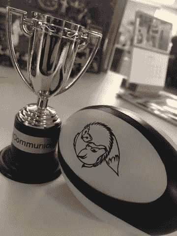

# Scrum:变化世界中的常数

> 原文：<https://dev.to/dealeron/scrum-a-constant-in-a-world-of-change-2dlh>

> 有一点是肯定的，随着时间的推移，生活中没有什么是一成不变的。

<figure></figure>

在促进 Scrum 框架进入我们的组织一年后，在我们公司的众多变化中，我有了一个*的顿悟*； [Scrum](https://www.scrumguides.org/docs/scrumguide/v2017/2017-Scrum-Guide-US.pdf#zoom=100) 在不断变化的环境中是不变的，**这就是它的美妙之处。**

有一点是肯定的，随着时间的推移，生活中没有什么是一成不变的。虽然这种情绪可以被视为对进化和新体验有好处，但变化也会带来不舒服和不确定的感觉。

> 虽然我们无法控制我们无法控制的事情，但我们可以控制自己的行为…

作为一名去年刚刚获得认证的 Scrum 大师，开始新的项目和团队是非常令人兴奋的。另一方面，取消一些项目或失去团队成员变得有些无趣。好的和坏的生活经历的平衡让人们更加欣赏它们，无论是美好的回忆还是艰难的教训。要记住的关键是*平衡*。

虽然我们无法控制我们无法控制的事情，但我们可以控制我们如何为即将到来的不可避免的变化做准备。在这些时候，一个常数是必不可少的，因为缺乏远见、范围蔓延或松散定义的需求会导致混乱，挫伤士气， [Scrum 仪式](https://www.scrumalliance.org/community/articles/2014/september/ittos-of-agile-scrum-ceremonies)的一致性可以成为所需平衡的稳定器。

<figure> 

<figcaption>我 5 岁的女儿 Tatiana 创作的艺术品。</figcaption>

</figure>

我把仪式性的做法比作父母试图灌输给孩子的平衡。拥有一个稳定的环境将培养一个支持系统，一个孩子将需要这个系统来催化未来的成功。但是如果没有一个稳定的环境，孩子可能无法获得支持来发挥他们最大的潜力。对于我们的项目来说也是一样，没有适当的支持和适应变化，它们也不会达到它们的最高价值。

相反，过多的结构也会削弱孩子自我指导的能力。这些前提也与 Scrum 仪式相关联。虽然你被分配的项目可能没有明确的方向，但是 Scrum 仪式将会给团队一个可以依赖的常量。

> *“今天一个好的 15 分钟会议将拯救明天一个糟糕的一小时会议”*

以**每日 Scrum** 站立为例，它允许团队培养意识，并在接下来的 24 小时内带来工作的透明度。在困惑的时候，简单地留出时间相互承认并讨论积极改变的想法比你想象的要重要得多。这些快速的互动有助于重要的反馈循环。

当第一次实现 Scrum 时，每天开会，哪怕只有 15 分钟，似乎都是多余的。随着时间的推移，我意识到这些是真正的协作和自我组织发挥作用的例子。有一天，我的一个同事，没有被分配到 Scrum 项目，让我意识到这些是交付真正价值的交互。他说，“今天一个好的 15 分钟会议将会拯救明天一个糟糕的一小时会议”。

<figure> 

<figcaption>A 我们团队的一部分在 2018 年度 DealerOn 假日晚会上。</figcaption>

</figure>

> …尽管我们有各种义务，但我们仍通过为这些场合奉献时间来努力改进，这一事实表明我们如何珍惜我们最好的资源；*彼此*。

回想一下我的亲子结构类比，围绕仪式或关系的过多结构可能会导致参与者不信任反馈或脱离自我组织。举例来说，如果仪式不允许开放，那么团队可能不愿意合作。相比之下，如果父母实施了太多的结构，他们的孩子可能会反抗或不忠诚。即使这与他们的孩子喜爱的事情有关，比如一项运动或才能。

无论是对父母、Scrum 大师，还是任何人来说，简单地遵循一个手册或框架，并不能轻易获得完美的平衡。我的*顿悟*要点的关键是，在我们的仪式、我们的互动、我们的日常生活中，简单地努力寻求平衡是美所在。它美丽的原因是，尽管没有什么是完美的，无论是在我们的工作中还是在我们的日常生活中，事实上，尽管我们有义务，但我们通过为这些场合奉献时间来努力改进，这表明我们如何珍惜我们最好的资源；*对方*。

<figure> 

<figcaption>狐狸和刺猬橄榄球代表平衡。</figcaption>

</figure>

最后，那天我坐在我的办公桌前，我的组织内有许多突然的变化，我盯着我的 Scrum 培训师给我的一个小装饰品，它象征着我们在倡导 Scrum 时应该追求的平衡。赠品是一个印有一只狐狸和一只刺猬的橄榄球，象征着我们在 Scrum 框架内开发时成为最全能者所需的平衡。你不可能在不制衡另一方的情况下将变化的钟摆摆得太大，这是受希腊诗人 [*阿奇洛库斯*](https://en.wikipedia.org/wiki/The_Hedgehog_and_the_Fox) *:* 的启发

> 狐狸知道许多事情，但是刺猬知道一件大事。

虽然狡猾的狐狸可能知道许多变通办法，而不笨的刺猬可能擅长做一件事，但过多的这种或那种会让你失去平衡。因此，找到最终的平衡，无论是团队成员之间的平衡还是 Scrum 框架的构建方式，都是 ***【游戏】*** 和值得为之奋斗的东西。如果我们第一次开始一项新的计划时就知道我们总是会成功，或者如果我们知道我们将不可避免地失败，我们的心将不会像他们可能的那样受到鼓舞。但是，如果我们知道有一个可变的未知结论，如果我们在这个过程中设置检查和平衡，我们的参与和认同将无处不在。**这就是它的美妙之处。**

* * *