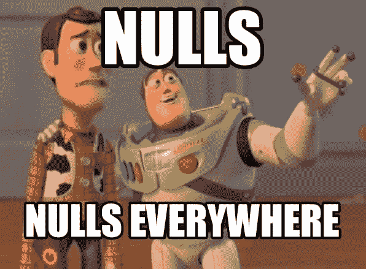

# 我们为什么需要科特林？

> 原文：<https://dev.to/jay_tillu/why-we-need-kotlin-57ao>

计算机语言的创新和发展源于两个基本原因:

1.  适应环境的变化。
2.  采纳编程艺术的改进。

在科特林的创作背后，第二个因素起着至关重要的作用。Java 是第三代语言，自 1991 年以来被广泛使用。Java 是一种功能强大、用途广泛的语言。你可以说 Java 无处不在:在服务器端(T0)Java 在那里，在移动应用开发(T2)Java 在那里，在嵌入式设备(T4)Java 在那里，在基于控制台的开发(T6)Java 在那里。

但是随着时间的推移，Java 未能采用编程的现代特征。而这种现代性特征成为柯特林创作背后的核心原因。

## 我们来看看 Java 中的一些主要问题:

### 缺乏适合 android 开发的现代特性

* * *

最新版本的 Java *(Java 11)* 推出了许多令人惊叹的功能。但是众所周知，对于 android 开发，我们仍然使用 Java 6 和 Java 7。它缺少很多现代的特性，比如 *Lambdas、方法引用、流、try-with-resources、*等等。

有一些第三方方法可以支持这些特性，比如 Retro-lambda、Streams backport 和 ThreeTenABP 等。但是通过第三方工具使用它们很痛苦。

谷歌通过支持 Android Nougat 的一些 Java 8 功能来缓解一些痛苦，但大多数功能只有在你针对 minSdk 版本 24 时才可用。但是由于 Android 碎片，你现在不应该这样做。

见[安卓分布图](https://developer.android.com/about/dashboards/)。

### 缺乏针对 NullPointerException 的安全性

* * *

> “我称之为我的十亿美元错误。这是 1965 年零引用的发明…这导致了无数的错误、漏洞和系统崩溃，在过去的四十年里，这可能造成了十亿美元的痛苦和损失。”—查尔斯·安东尼·理查德·霍尔爵士(Null 的创造者)

由于空指针异常，超过 70%的应用程序在其生命周期内崩溃。空指针异常是安卓应用崩溃的五大原因。现在你可以很容易地想象空指针异常对你的应用程序的影响。并且 Java 不提供任何防止空指针异常的方法。开发商得自己处理。这使得 java 对于应用程序开发来说不安全。

### 大量的样板代码

* * *

开发人员总是喜欢干净简洁的代码。更少的代码需要更少的时间来编写，更少的时间来阅读，也使维护它变得容易。

如果你懂 Java，你可能知道完成最简单的工作需要多少样板代码。即使是最小的任务，你也需要创建类和对象等等。但是在 Kotlin 中，与 java 相比，您只需编写相当少量代码就可以完成工作

以上是 java 的三大缺点。所以我们需要科特林。

请每天查看关于 Kotlin 和其他编程主题的新帖子。在那之前，继续编码，继续爱。

> 想和我联系吗？以下是链接。我很乐意成为你的朋友。😊
> [Twitter](https://twitter.com/jay_tillu)
> [脸书](https://www.facebook.com/jaytillu.1314/)
> [insta gram](https://www.instagram.com/jay.tillu/)
> [Medium](https://medium.com/jay-tillu)
> 或者直接发邮件给我[jayviveki13@gmail.com](mailto:jayviveki13@gmail.com)