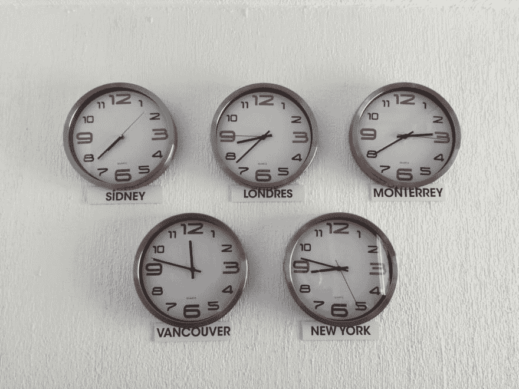

# Rails 应用程序中不同时区的 Time.use_zone

> 原文：<https://dev.to/prathamesh/time-usezone-for-different-timezones-in-rails-app-4ljh>

[](https://res.cloudinary.com/practicaldev/image/fetch/s--cENQ8_Oa--/c_limit%2Cf_auto%2Cfl_progressive%2Cq_auto%2Cw_880/https://prathamesh.tech/conteimg/2019/07/luis-cortes-QrPDA15pRkM-unsplash.jpg)

几乎所有我现在使用的网络应用都允许用户设置自己的时区。Rails 提供了所有活跃的时区支持，让这一切变得非常简单。

人们只需要在数据库中保存用户的时区，然后就可以很容易地在每个用户会话的控制器操作中更改它。

一次又一次，我遇到了这样的代码，它实际上改变了应用程序的时区，同时试图改变用户的时区。

```
before_action :set_current_user_timezone

def set_current_user_timezone
  if current_user
    Time.zone = current_user.time_zone
  end
end 
```

<svg width="20px" height="20px" viewBox="0 0 24 24" class="highlight-action crayons-icon highlight-action--fullscreen-on"><title>Enter fullscreen mode</title></svg> <svg width="20px" height="20px" viewBox="0 0 24 24" class="highlight-action crayons-icon highlight-action--fullscreen-off"><title>Exit fullscreen mode</title></svg>

我也曾在应用程序的其他部分遇到过改变时区的代码。

```
Time.zone = user.time_zone

SyncUserData.new(user).process 
```

<svg width="20px" height="20px" viewBox="0 0 24 24" class="highlight-action crayons-icon highlight-action--fullscreen-on"><title>Enter fullscreen mode</title></svg> <svg width="20px" height="20px" viewBox="0 0 24 24" class="highlight-action crayons-icon highlight-action--fullscreen-off"><title>Exit fullscreen mode</title></svg>

这甚至更危险，因为没有人知道这两行之后会有什么代码，而且因为使用用户的时区而不是应用程序的时区，可能会遇到奇怪的问题。

相反，更好的方法是使用`Time.use_zone`，它接受一个块，并在块结束后返回到原始时区。

```
def perform_in_users_timezone(user)
  Time.use_zone(user.time_zone) do
    # perform
  end
end 
```

<svg width="20px" height="20px" viewBox="0 0 24 24" class="highlight-action crayons-icon highlight-action--fullscreen-on"><title>Enter fullscreen mode</title></svg> <svg width="20px" height="20px" viewBox="0 0 24 24" class="highlight-action crayons-icon highlight-action--fullscreen-off"><title>Exit fullscreen mode</title></svg>

这是一个好得多的解决方案，因为我们百分之百确定，时区的改变只发生在代码块内部，根本不可能泄露到代码的其他部分。

我们最初的每个请求改变用户时区的例子可以在`around_action`回调和`Time.use_zone`的帮助下实现。

```
around_action :set_current_user_timezone

def set_current_user_timezone
  if current_user
    Time.use_zone(user.time_zone) { yield }
  else  
    yield
  end
end 
```

<svg width="20px" height="20px" viewBox="0 0 24 24" class="highlight-action crayons-icon highlight-action--fullscreen-on"><title>Enter fullscreen mode</title></svg> <svg width="20px" height="20px" viewBox="0 0 24 24" class="highlight-action crayons-icon highlight-action--fullscreen-off"><title>Exit fullscreen mode</title></svg>

总而言之，尽可能避免使用`Time.zone=`来设置时区。我会继续说不要这样做！始终使用 [Time.use_zone。](https://api.rubyonrails.org/classes/Time.html#method-c-use_zone)