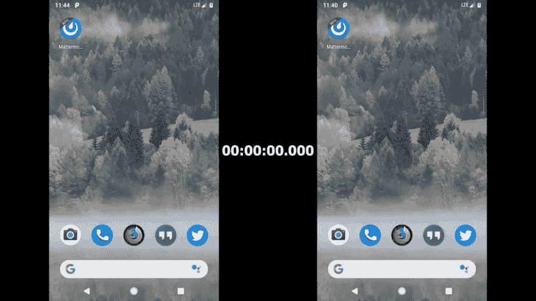

# 反应原生刚刚变得更好！新的 Javascript 引擎在这里！

> 原文：<https://dev.to/rishikc/react-native-just-got-better-the-new-javascript-engine-is-here-7nl>

[爱马仕引擎](http://hermesengine.dev) for React Native 来了！

所以从这里开始:

> React Native@ React Native如今脸书正在开源 Hermes，这是一个为在 Android 上运行 React Native 而优化的小型轻量级 JavaScript 引擎。我们目前正在为 React Native 发布一个新的补丁，其中将包含 Hermes 作为选择加入。[github.com/facebook/hermes](https://t.co/YUFCqvTrAV)2019 年 7 月 11 日下午 16:01

大约两小时前脸书正式发布了 React Native v0.60.2，这使得该引擎成为一个可选功能。这为 react native 的移动开发带来了巨大的进步，因为它将使 React Native 构建的 Android 应用程序在性能上有显著的提升，构建尺寸更小，内存使用量更少！💜❤️

> React Native@ React NativeReact Native 0 . 60 . 2 带 [@HermesEngine](https://twitter.com/HermesEngine) 作为 Android 的选入引擎现已上市！试一试，运行“react-native init”并遵循文档中的指导:[facebook.github.io/react-native/d…](https://t.co/4hXWwk4M4K)2019 年 7 月 11 日下午 16:27

集成是如此简单！只需在您的`build.gradle`文件中启用它即可。完成的🙆‍♂️字面上，只有一行代码，就是这样！✨

你可以在这里看到应用程序启动的区别！👇：

> <video loop="" controls=""><source src="https://video.twimg.com/ext_tw_video/1149350168417853440/pu/vid/640x360/DCqGL3BPEONT2wVc.mp4?tag=10" type="video/mp4"></video>基思+@ keithmanaloto _嘿，React Native 刚刚通过使用 [@HermesEngine](https://twitter.com/HermesEngine) (刚刚通过 [@facebook](https://twitter.com/facebook) 开源)

唯一的事情是，你需要将 React 原生升级到 0.60.2 版本，该版本有许多重大变化(RN v0.60 于一周前发布- [参见此处的 changelog】)但是，使用该引擎的 Android 应用程序的改进非常棒！周末一定要试试！💪](https://github.com/react-native-community/releases/blob/master/CHANGELOG.md)

哦，别忘了关注[爱马仕官方推特账号](https://twitter.com/HermesEngine)上的[这个讨论](https://twitter.com/HermesEngine/status/1149370023539961856)！

> 爱马仕引擎@ Hermes Engine现在我被释放了，如果我们要和工程师做一些视频，你喜欢回答什么类型的问题。2019 年 7 月 11 日下午 17:29

谁对此感到兴奋？我绝对是！

你也可以在 [twitter](https://twitter.com/rishiikc) 上关注我的帖子和转发！🤓