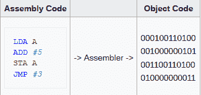
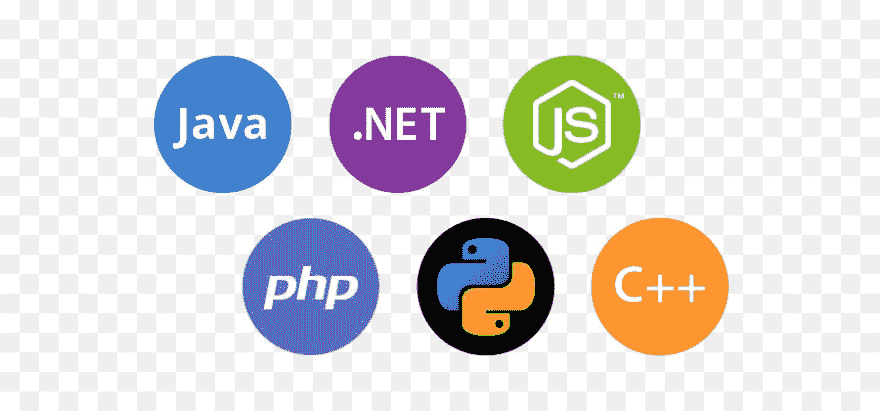
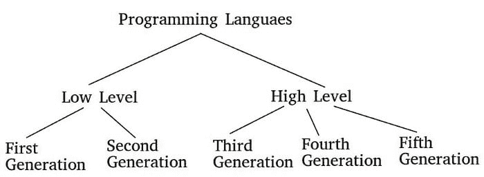

# 现代编程的诞生

> 原文：<https://dev.to/jay_tillu/the-birth-of-modern-programming-1ne8>

今天，我们的生活依赖于技术，而技术又依赖于计算机。自从我们在 20 世纪 40 年代中期创造了计算机，我们就依靠软件来控制硬件。为了创造这种软件，我们依赖编程语言。

今天有 100 多种强大的语言适用于每一个平台。让我们了解一下这段旅程是如何来到这里的。我们将看到第一种语言的诞生，然后理解它被新语言取代的原因。推动这一发展并使我们的生活变得轻松愉快的主要力量。

你听说过的每一种语言的创造背后都有两个基本原因，这两个原因也是不变的:

1.  适应编程环境的变化。
2.  采纳编程艺术的改进。

编程环境是指我们为之创建软件的环境或平台。例如，如果你是在互联网上工作，有一些不同的规则和要求，你需要照顾。如果你从事人工智能工作，会有不同的规则和要求。当您从事操作系统开发、应用程序开发或控制台基础开发时，对于每个平台，您都需要注意不同的规则和要求。因此，有时为了满足这种需求，我们需要创造新的语言来实现更好的优化和易用性。

第二个因素是编程艺术的进步。从第一代语言到现在，从概念上讲，我们在编程中开发了许多新功能。也就是减少我们的重复工作，轻松管理复杂的程序，让我们的代码更简洁，更有表现力。有时，当旧语言无法采用这些改进时，我们就需要创造一些新语言。

编程语言一共有五代。

1.  第一代语言
2.  第二代语言
3.  第三代语言
4.  第四代语言
5.  第五代语言

## 第一代语言

* * *

第一代语言是由 0 和 1 组成的低级语言，为了用这些语言编写代码，我们通常使用穿孔卡片。在这些语言中，一切都是 0 和 1。程序员必须手工设计他们的代码，然后用穿孔卡把它传送到计算机。这些语言被称为“机器语言”。这些语言可能因机器而异。在一台机器上工作的机器代码可能在另一台机器上不工作。

在程序只有 100 行之前，这种方法是可行的，但是随着程序变得越来越大，越来越复杂，我们需要一些别的东西。对其他东西的需求成为了第二代语言产生的根本原因。

#### 第一代语言的优势

1.  这个程序运行得非常快。
2.  该程序可以利用特定的处理器特性，如特殊寄存器，并对硬件提供更多的控制。

#### 第一代语言的弊端

1.  程序是不可移植的。
2.  如果出现错误，整个穿孔卡需要重写。
3.  代码难以编辑、阅读和更新。
4.  调试机器代码也不容易。

## 第二代语言

* * *

第二代语言也是低级语言，但与第一代语言不同，我们在其中使用了一些英语单词。这一步使得程序的读取、编写和调试更加容易。这些语言被称为汇编语言。

这里使用汇编程序将我们的代码转换成机器代码。与第一代语言相比，第二代语言能够处理更复杂的程序。

#### 第二代语言的优势

1.  在使用汇编器之后，代码仍然执行得非常快。
2.  该程序可以利用特定的处理器特性，如特殊寄存器，并对硬件提供更多的控制。
3.  由于它更接近纯英语，程序变得更容易阅读、编写和调试。

#### 第二代语言的弊端

1.  程序是不可移植的。
2.  调试机器代码也不容易。

## 第三代语言

* * *

汇编语言产生后，程序变得更大更复杂。尽管汇编语言使用英语单词，而且比机器语言容易。经过一个阶段后，汇编语言也无法处理复杂性。也由于缺乏编程特性，需要更强大的东西。

第三代语言催生高级编程。从这里开始，循环、条件和类等高级编程概念出现了。现在，开发人员处理更大的复杂性变得容易了。

高级编程范例也在这一阶段得到发展，如函数式、过程式、命令式和面向对象式。来处理更大更复杂的程序。

像汇编器和解释器这样的高级和强大的转换器被创造出来，以在代码编译过程中提供更多的速度和优化。

程序成为 ***平台独立的*** 和 ***程序员友好的*** 。

第三代语言的例子包括 Pascal、FORTRAN、C、C++、Java、Python、PHP 等。

#### 第三代语言的优势

1.  独立于平台
2.  使用高级编程范例
3.  使用高级转换器产生高效和优化的程序结果
4.  使用高级编程功能
5.  对程序员更友好

#### 第三代语言的弊端

1.  生成的代码可能无法充分利用处理器特有的特性，如 1 和第二代语言

## 第四代语言

* * *

第四代语言旨在减少编程工作和开发软件所需的时间。这些语言非常强大，并具有现代特征。这些语言由类似于人类语句的语句组成。这使它们成为第三代语言的升级版本。

这些语言有更简洁、更有表现力的代码。凭借相同的功能和特性，这些语言可以在多种平台上实现。使他们成为一个人的军队。

这些语言的例子有 Kotlin、Scala、Dart、SQL 等。

## 第五代语言

* * *

第五代语言是为构建特定软件而设计的。第五代语言不需要程序员，代码将由系统本身自动生成。用户只需要以特定的方式定义问题。

这样，用户只需要担心如何解决问题，而不用担心如何在系统上实现这个问题。

第五代语言主要用于人工智能和其他研究目的。OPS5，Julia，hack，Mercury 都是第五代语言的例子。

所以，伙计们，这就是现代编程的诞生。请每天访问新文章。

在那之前，继续编码，继续爱。

> 想和我联系吗？以下是链接。我很乐意成为你的朋友。😊
> 
> [脸书](https://www.facebook.com/jaytillu.1314/)
> [insta gram](https://www.instagram.com/jay.tillu/)
> [Medium](https://medium.com/jay-tillu)
> 或者直接发邮件给我[jayviveki13@gmail.com](mailto:jayviveki13@gmail.com)