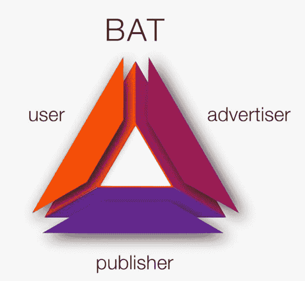

# 布伦丹·艾希的《勇敢的状态》

> 原文：<https://dev.to/thisdotmedia/state-of-brave-by-brendan-eich-4mm1>

[https://www.youtube.com/embed/h_jtopVp8dk](https://www.youtube.com/embed/h_jtopVp8dk)

网络被视为当今科技世界的主要资产，但也伴随着一些 Brave 试图解决的问题。

当前的网络可能是昂贵的、缓慢的、侵入性的、不安全的和复杂的。Chrome 或 Microsoft Edge 等浏览器中的跟踪方法和广告拦截最终会耗费用户大量的数据和加载时间。勇敢浏览器旨在提供快速安全的浏览体验。Brave 的使命是消除耗费用户时间和安全的浏览器功能。通过阻止 ad-tech 的数据消耗，Brave 在 Android 和 iOS 上的加载时间减少了 3-7 倍。这种加载时间上的差异造就了一个非常吸引人的平台，但功能并不止于此:

# 安全

通过阻止弹出广告和跟踪网站，Brave 增加了用户周围的安全性。使用 Brave 时，常见的安全风险(如域名鲨鱼和植入弹出窗口的恶意软件)会从用户体验中消除。

# 隐私

Brave 通过限制中间人广告机制对用户信息的访问，为用户设置了一个保护罩，以保护他们设备上的数据安全。

# 易于使用

与其他需要额外插件和配置的浏览器不同，Brave 将你需要的所有东西都放在一个盒子里，并进行定期测试。这导致能够解决许多广告拦截插件遇到的常见问题。

# 多点浏览

勇敢有私人标签，反指纹，和最好的安全性。它有一个内置的小额支付系统，由一个简单的用户界面组成，默认情况下是完全自动的。该系统允许自动支付给用户的顶级网站，以及使他们能够使用赞助系统。这使得用户可以补偿他们的顶级网站通过 Brave 提供给他们的安全和隐私成本。

Brave 还提供一个总部位于区块链的数字广告平台。目前，广告利益相关者做得不太好。他们有一个复杂的生态系统，存在测量误差、测量欺诈、无辜误差等问题。Brave 提供了一个更有效的平台来帮助解决这些问题。

使用 BAT——基本注意力标志，Brave 致力于帮助用户、出版商和广告商处理收入欺诈并改善他们的服务。

要了解 Brave 改变浏览方式的更多信息，请访问他们在 https://brave.com/的网站或在 Twitter @BrendanEich 上关注 Brendan Eich。

作者 Necoline Hubner & Trinh Kien

需要 JavaScript 咨询、指导或培训帮助吗？在 [This Dot Labs](//thisdot.co) 查看我们的服务列表。