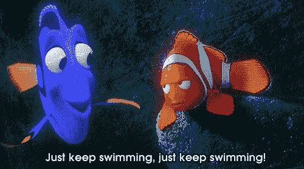

# 继续游

> 原文：<https://dev.to/tuxhedoh/just-keep-swimming-21kl>

在我致力于 100 天代码的愿望中，更多的是连续 100 天实际做一些有助于我的技能建设的事情，而 100 天代码似乎是一个崇高的目标。这不是为了建立，或者花“X”的时间去做一个特定的任务，只是为了保持一致。

我不是始终如一的，但我知道当我是，我更成功。然而，这种对承诺的渴望，更具体地说，设定 100 天代码的目标，导致我早早地拖延和拖延。我错过了一天，两天，写了一些，但没有做任何其他事情...我已经一个多星期了，没有任何进展。简直是弄巧成拙。我要纪念第一天吗...我要把整条该死的毛巾扔进去吗...我是不是就这样一直往前推，无视缺乏进步？

今天...我会继续前进。没有必要承认失败。我会取得一些进步。
[T3】](https://i.giphy.com/media/1sSWWMNnaZLlm/giphy.gif)