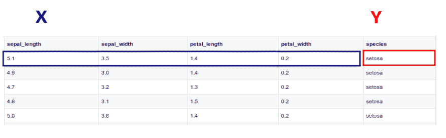
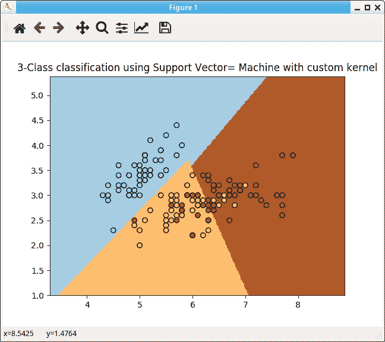

# 派对时间！用支持向量机对数据进行分类

> 原文：<https://dev.to/petercour/party-time-classify-data-with-support-vector-machine-2jmj>

准备好听音乐了吗？

对数据进行分类是机器学习中的一项常见任务。支持向量机(SVM)是可以做到这一点的模型之一。

什么是分类？

给定新数据，决定它属于哪个类。
喜欢下面的加菲猫:

[](https://res.cloudinary.com/practicaldev/image/fetch/s--8c-kzwkr--/c_limit%2Cf_auto%2Cfl_progressive%2Cq_66%2Cw_880/https://proxy.duckduckgo.com/iu/%3Fu%3Dhttp%253A%252F%252Fpleated-jeans.com%252Fwp-content%252Fuploads%252F2012%252F03%252Fwhen-youre-trying-to-decide-what-to-do-on-your-day-off.gif%26f%3D1)

这将是一个不使用数据的分类器。程序员尽量聪明，在算法中使用历史数据

### 数据？

SVM 在数据上训练(ML 算法在数据上训练)。这些数据被标记为数据，每个输入都有一个输出。

关于术语。科学家称之为“监督学习”。程序员称之为(带标签的)数据。

[](https://res.cloudinary.com/practicaldev/image/fetch/s--hb687Mi2--/c_limit%2Cf_auto%2Cfl_progressive%2Cq_66%2Cw_880/https://proxy.duckduckgo.com/iu/%3Fu%3Dhttps%253A%252F%252Fmedia.giphy.com%252Fmedia%252F10cQkpegqzzpfy%252Fgiphy.gif%26f%3D1)

### 你所有的字节都属于我们

那么如何加载这些数据呢？你能在哪里找到它？机器学习模块 sklearn 带有一些数据集，如虹膜数据集。这个数据集有几列，所以只取前两列。

```
#!/usr/bin/python3 iris = datasets.load_iris()
X = iris.data[:, :2]

# we only take the first two features. We could
# avoid this ugly slicing by using a two-dim dataset 
Y = iris.target 
```

然后应用 SVM 并绘制输出。现在，在不涉及太多细节的情况下，使用 fit()函数创建并训练 ML 算法。变量 X 和 Y 是我们之前加载的数据。

记得我们说过“每一个输入都有一个输出”。所以每个 Y 是输入向量 x 的输出。

[](https://res.cloudinary.com/practicaldev/image/fetch/s--rayJ7KtP--/c_limit%2Cf_auto%2Cfl_progressive%2Cq_auto%2Cw_880/https://thepracticaldev.s3.amazonaws.com/i/v3ghigwwr0whois8iwwy.png)

从上面加载的数据集中。

```
#!/usr/bin/python3 clf = svm.SVC(kernel=my_kernel)
clf.fit(X, Y) 
```

所以这个算法是用 X 和 y 来训练的。这个算法的唯一目标是预测:新数据属于哪个组。

```
clf.fit(X, Y) 
```

### 运行代码

仅此而已。现在剩下的就是细节了。完整代码:

```
#!/usr/bin/python3 import numpy as np
import matplotlib.pyplot as plt
from sklearn import svm, datasets

# import some data to play with iris = datasets.load_iris()
X = iris.data[:, :2]

# we only take the first two features. We could
# avoid this ugly slicing by using a two-dim dataset 
Y = iris.target

def my_kernel(X, Y):
    """
    We create a custom kernel:

                 (2  0)
    k(X, Y) = X  (    ) Y.T
                 (0  1)
    """ 
    M = np.array([[2, 0], [0, 1.0]])
    return np.dot(np.dot(X, M), Y.T)

h = .02 

# step size in the mesh 
# we create an instance of SVM and fit out data. clf = svm.SVC(kernel=my_kernel)
clf.fit(X, Y) 

# Plot the decision boundary. For that, we will assign a color to each 
# point in the mesh [x_min, x_max]x[y_min, y_max]. x_min, x_max = X[:, 0].min() - 1, X[:, 0].max() + 1
y_min, y_max = X[:, 1].min() - 1, X[:, 1].max() + 1
xx, yy = np.meshgrid(np.arange(x_min, x_max, h), np.arange(y_min, y_max, h))
Z = clf.predict(np.c_[xx.ravel(), yy.ravel()]) 
# Put the result into a color plot Z = Z.reshape(xx.shape)
plt.pcolormesh(xx, yy, Z, cmap=plt.cm.Paired) 
# Plot also the training points plt.scatter(X[:, 0], X[:, 1], c=Y, cmap=plt.cm.Paired, edgecolors='k')
plt.title('3-Class classification using Support Vector= Machine with custom' ' kernel')
plt.axis('tight')
plt.show() 
```

[](https://res.cloudinary.com/practicaldev/image/fetch/s---Lf7Lcyq--/c_limit%2Cf_auto%2Cfl_progressive%2Cq_auto%2Cw_880/https://thepracticaldev.s3.amazonaws.com/i/wh3fvk0d4n23dcid6t2z.png)

相关链接:

*   [sk learn 模块](https://scikit-learn.org/stable/index.html)
*   [机器学习初学者教程及示例](https://gumroad.com/l/MnRYU)
*   [机器学习文章](https://pythonprogramminglanguage.com/python-machine-learning/)
*   [什么是监督学习](https://pythonprogramminglanguage.com/What-is-supervised-learning/)
*   [为什么用 Python 进行机器学习](https://pythonbasics.org/why-python-for-machine-learning/)
*   [机器学习分类器](https://pythonbasics.org/machine-learning-classifier/)