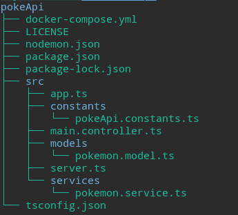
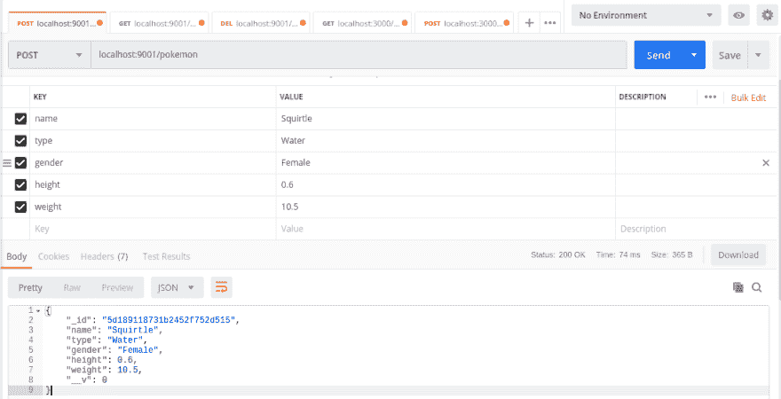
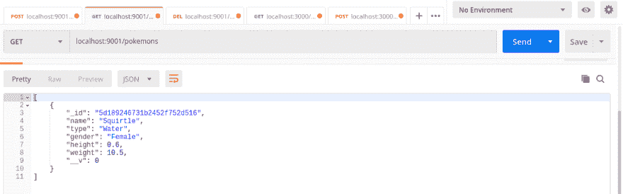
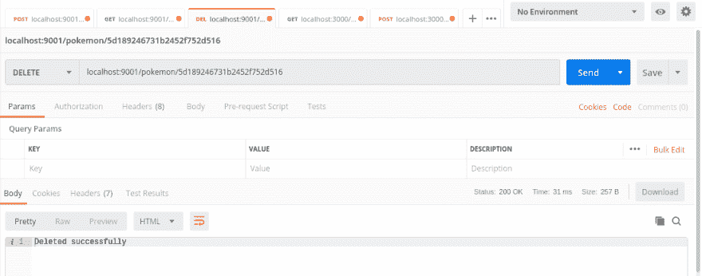
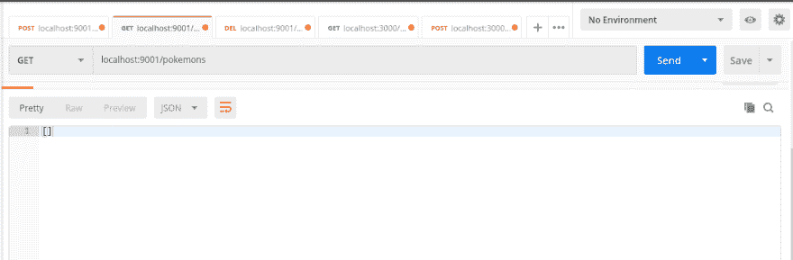
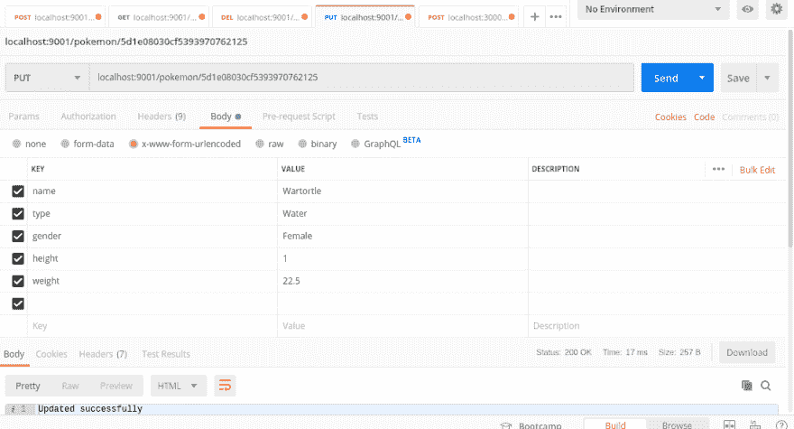
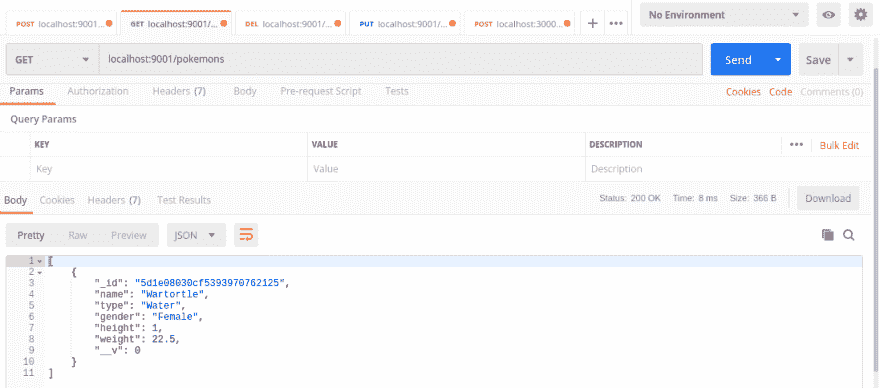

# PokeAPI REST 在 NodeJS 中包含 Express、Typescript、MongoDB 和 Docker —第 3 部分

> 原文：<https://dev.to/nyagarcia/pokeapi-rest-in-nodejs-with-express-typescript-mongodb-and-docker-part-3-494a>

[](https://res.cloudinary.com/practicaldev/image/fetch/s--yxIxPmjh--/c_limit%2Cf_auto%2Cfl_progressive%2Cq_auto%2Cw_880/https://thepracticaldev.s3.amazonaws.com/i/j0gnabvx489t3xha8hfa.png)

## 前言

这是展示如何在 NodeJS 中创建 RESTful API 的系列文章的第 3 部分。如需进一步阅读，请查看以下链接:

[PokeAPI REST 在 NodeJS 中包含 Express、TypeScript、MongoDB 和 Docker —第 1 部分](https://dev.to/nyagarcia/pokeapi-rest-in-nodejs-with-express-typescript-mongodb-and-docker-part-1-5f8g)

[PokeAPI REST 在 NodeJS 中包含 Express、TypeScript、MongoDB 和 Docker —第二部分](https://dev.to/nyagarcia/pokeapi-rest-in-nodejs-with-express-typescript-mongodb-and-docker-part-2-b56)

如果你喜欢查看完整的代码，你可以在这里找到完整的 PokeApi 项目。

## 简介

在前一篇文章中，我们用 docker-compose 部署了一个 MongoDB 实例，并将我们的应用程序连接到它。我们还创建了我们的 Mongoose 模式和数据模型。

在这篇文章中，我们将实现创建基本 CRUD 所必需的其余路径，以及它们各自的数据库查询功能。这些函数将利用我们之前创建的模型来查询我们的 MongoDB 数据库。

## 编码开始

### 预览

和往常一样，我们将在这篇文章的结尾先预览一下我们的目录:

[](https://res.cloudinary.com/practicaldev/image/fetch/s--RlBfn-Ih--/c_limit%2Cf_auto%2Cfl_progressive%2Cq_auto%2Cw_880/https://thepracticaldev.s3.amazonaws.com/i/cas94h463z0tel1vkcbi.png)

您可能会注意到，从目录角度来看，自上一篇文章以来没有任何变化。然而，在内容方面，有相当多的变化。

提醒一下，为了运行我们的项目，我们现在使用下面的命令:

```
npm run start 
```

<svg width="20px" height="20px" viewBox="0 0 24 24" class="highlight-action crayons-icon highlight-action--fullscreen-on"><title>Enter fullscreen mode</title></svg> <svg width="20px" height="20px" viewBox="0 0 24 24" class="highlight-action crayons-icon highlight-action--fullscreen-off"><title>Exit fullscreen mode</title></svg>

要启动我们的 dockerized MongoDB 实例，可以使用下面的命令:

```
docker-compose up 
```

<svg width="20px" height="20px" viewBox="0 0 24 24" class="highlight-action crayons-icon highlight-action--fullscreen-on"><title>Enter fullscreen mode</title></svg> <svg width="20px" height="20px" viewBox="0 0 24 24" class="highlight-action crayons-icon highlight-action--fullscreen-off"><title>Exit fullscreen mode</title></svg>

说完了，我们开始吧。

### PokeService:查询数据库

现在是时候创建我们的数据库查询函数了。为此，如前所述，我们将利用我们的口袋妖怪模型。因为我们的目标是实现四个基本的 CRUD 操作，所以我们要实现的第一个功能是读取 db 的内容。打开 pokemon.service.ts 文件，输入以下内容:

```
//src/services/pokemon.service.ts

import { Request, Response } from 'express';
import { MongooseDocument } from 'mongoose';
import { Pokemon } from '../models/pokemon.model';
import { WELCOME_MESSAGE } from '../constants/pokeApi.constants';

export class PokeService {
  public welcomeMessage(req: Request, res: Response) {
    res.status(200).send(WELCOME_MESSAGE);
  }

//Getting data from the db
  public getAllPokemon(req: Request, res: Response) {
    Pokemon.find({}, (error: Error, pokemon: MongooseDocument) => {
      if (error) {
        res.send(error);
      }
      res.json(pokemon);
    });
  }
 } 
```

<svg width="20px" height="20px" viewBox="0 0 24 24" class="highlight-action crayons-icon highlight-action--fullscreen-on"><title>Enter fullscreen mode</title></svg> <svg width="20px" height="20px" viewBox="0 0 24 24" class="highlight-action crayons-icon highlight-action--fullscreen-off"><title>Exit fullscreen mode</title></svg>

正如你所看到的，我们已经创建了一个新的功能，名为“getAllPokemon”。它使用 Pokemon 模型与 MongoDB 进行交互，并找到 DB 中的所有 Pokemon。

由于 mongose 的助手函数在[mongose 文档](https://mongoosejs.com/docs/queries.html)中有广泛的记载，我认为没有必要在这里对它们进行分解。然而，我将对回调中的**保护条款**进行评论:

> 注意:简而言之，Guard 子句是在出现错误或满足条件的情况下，通过返回语句或异常退出函数的检查。它们允许我们在代码中避免不必要的复杂性。

这是我们的守护条款:

```
if (error) {
   res.send(error);
  }
  res.json(pokemon); 
```

<svg width="20px" height="20px" viewBox="0 0 24 24" class="highlight-action crayons-icon highlight-action--fullscreen-on"><title>Enter fullscreen mode</title></svg> <svg width="20px" height="20px" viewBox="0 0 24 24" class="highlight-action crayons-icon highlight-action--fullscreen-off"><title>Exit fullscreen mode</title></svg>

通过颠倒逻辑，首先检查错误，我们可以避免“else”语句。如果遇到任何错误，我们通过发送错误来退出函数。如果我们没有发现错误，然后口袋妖怪结果被发送。我们将在这篇文章的其余部分使用这种技术。

### 实现获取路由

我们现在在 PokeService 中有了 getAllPokemon 功能。为了能够与这个函数交互，我们必须创建另一个 GET 路由。让我们打开控制器，添加一条新路线:

```
//src/main.controller.ts

import { PokeService } from "./services/pokemon.service";
import { Application } from "express";

export class Controller {
  private pokeService: PokeService;

  constructor(private app: Application) {
    this.pokeService = new PokeService();
    this.routes();
  }

  public routes() {
    this.app.route("/").get(this.pokeService.welcomeMessage);

    //Our new route
    this.app.route("/pokemons").get(this.pokeService.getAllPokemon);
  }
} 
```

<svg width="20px" height="20px" viewBox="0 0 24 24" class="highlight-action crayons-icon highlight-action--fullscreen-on"><title>Enter fullscreen mode</title></svg> <svg width="20px" height="20px" viewBox="0 0 24 24" class="highlight-action crayons-icon highlight-action--fullscreen-off"><title>Exit fullscreen mode</title></svg>

可以看到，访问这条新路由的端点是“/pokemons”。(原谅明显的语法错误，这是为了避免进一步的混淆。)

从现在开始，我推荐使用 Postman 来测试我们的路线。你可以在这里找到更多关于邮差[的信息，在这里](https://www.getpostman.com/)安装[。](https://www.getpostman.com/downloads/)

如果一切顺利，您应该会从 Postman 获得如下输出:

[](https://res.cloudinary.com/practicaldev/image/fetch/s--xJ5-X-7A--/c_limit%2Cf_auto%2Cfl_progressive%2Cq_auto%2Cw_880/https://thepracticaldev.s3.amazonaws.com/i/d17qwbhch9hioz00277q.png)

因为我们没有将任何数据引入到我们的数据库中，所以我们接收到一个空数组。我们现在已经成功地完成了我们的第一个数据库查询！

### 添加新的口袋妖怪

让我们实现一个函数来添加一个新的口袋妖怪到我们的数据库。回到口袋妖怪服务，输入:

```
//src/services/pokemon.service.ts

import { Request, Response } from 'express';
import { MongooseDocument } from 'mongoose';
import { Pokemon } from '../models/pokemon.model';
import { WELCOME_MESSAGE } from '../constants/pokeApi.constants';

export class PokeService {
  public welcomeMessage(req: Request, res: Response) {
    res.status(200).send(WELCOME_MESSAGE);
  }

  public getAllPokemon(req: Request, res: Response) {
    Pokemon.find({}, (error: Error, pokemon: MongooseDocument) => {
      if (error) {
        res.send(error);
      }
      res.json(pokemon);
    });
  }

  //Adding a new pokemon

  public addNewPokemon(req: Request, res: Response) {
    const newPokemon = new Pokemon(req.body);
    newPokemon.save((error: Error, pokemon: MongooseDocument) => {
      if (error) {
        res.send(error);
      }
      res.json(pokemon);
    });
  }
} 
```

<svg width="20px" height="20px" viewBox="0 0 24 24" class="highlight-action crayons-icon highlight-action--fullscreen-on"><title>Enter fullscreen mode</title></svg> <svg width="20px" height="20px" viewBox="0 0 24 24" class="highlight-action crayons-icon highlight-action--fullscreen-off"><title>Exit fullscreen mode</title></svg>

简单解释一下，我们从请求主体创建一个 Mongoose 文档(newPokemon ),并将其保存到 db 中。

> 注意:提醒一下，mongose 文档是 mongose 模型的实例

让我们创建与我们的功能交互的路线。在我们的控制器中:

```
//src/main.controller.ts

import { PokeService } from "./services/pokemon.service";
import { Application } from "express";

export class Controller {
  private pokeService: PokeService;

  constructor(private app: Application) {
    this.pokeService = new PokeService();
    this.routes();
  }

  public routes() {
    this.app.route("/").get(this.pokeService.welcomeMessage);
    this.app.route("/pokemons").get(this.pokeService.getAllPokemon);

    //Our new route
    this.app.route("/pokemon").post(this.pokeService.addNewPokemon);
  }
} 
```

<svg width="20px" height="20px" viewBox="0 0 24 24" class="highlight-action crayons-icon highlight-action--fullscreen-on"><title>Enter fullscreen mode</title></svg> <svg width="20px" height="20px" viewBox="0 0 24 24" class="highlight-action crayons-icon highlight-action--fullscreen-off"><title>Exit fullscreen mode</title></svg>

请注意，我们的新路由是通过 POST 请求访问的。前往邮差，让我们添加一个新的口袋妖怪到我们的数据库:

[](https://res.cloudinary.com/practicaldev/image/fetch/s--YarERRCI--/c_limit%2Cf_auto%2Cfl_progressive%2Cq_auto%2Cw_880/https://thepracticaldev.s3.amazonaws.com/i/pygqsfzu49c48mtlmycu.png)

如果一切顺利，你应该会收到你刚刚添加的口袋妖怪作为输出。为了仔细检查，我们可以使用 GET 路径:

[](https://res.cloudinary.com/practicaldev/image/fetch/s--r0-NUdsk--/c_limit%2Cf_auto%2Cfl_progressive%2Cq_auto%2Cw_880/https://thepracticaldev.s3.amazonaws.com/i/5hdr2y0zl6sbr71kes5t.png)

如您所见，我们的数据库中现在有了一个杰尼龟。不用担心“_id”和“_v”字段。它们是由 Mongooose 自动生成的，我们将在后面处理它们。

### 删除一个口袋妖怪

要实现删除口袋妖怪的功能，请打开口袋妖怪服务，并键入以下内容:

```
//src/services/pokemon.service.ts

import { Request, Response } from 'express';
import { MongooseDocument } from 'mongoose';
import { Pokemon } from '../models/pokemon.model';
import { WELCOME_MESSAGE } from '../constants/pokeApi.constants';

export class PokeService {
  public welcomeMessage(req: Request, res: Response) {
    res.status(200).send(WELCOME_MESSAGE);
  }

  public getAllPokemon(req: Request, res: Response) {
    Pokemon.find({}, (error: Error, pokemon: MongooseDocument) => {
      if (error) {
        res.send(error);
      }
      res.json(pokemon);
    });
  }

  public addNewPokemon(req: Request, res: Response) {
    const newPokemon = new Pokemon(req.body);
    newPokemon.save((error: Error, pokemon: MongooseDocument) => {
      if (error) {
        res.send(error);
      }
      res.json(pokemon);
    });
  }

  public deletePokemon(req: Request, res: Response) {
    const pokemonID = req.params.id;
    Pokemon.findByIdAndDelete(pokemonID, (error: Error, deleted: any) => {
      if (error) {
        res.send(error);
      }
      const message = deleted ? 'Deleted successfully' : 'Pokemon not found :(';
      res.send(message);
    });
  }
} 
```

<svg width="20px" height="20px" viewBox="0 0 24 24" class="highlight-action crayons-icon highlight-action--fullscreen-on"><title>Enter fullscreen mode</title></svg> <svg width="20px" height="20px" viewBox="0 0 24 24" class="highlight-action crayons-icon highlight-action--fullscreen-off"><title>Exit fullscreen mode</title></svg>

我们从请求参数中获取要删除的 Pokemon 的 ID，也就是说，我们向其发出 GET 请求的 URL 中的查询字符串中的参数。它看起来会像这样:

```
localhost:9001/pokemon/123pokemonId 
```

<svg width="20px" height="20px" viewBox="0 0 24 24" class="highlight-action crayons-icon highlight-action--fullscreen-on"><title>Enter fullscreen mode</title></svg> <svg width="20px" height="20px" viewBox="0 0 24 24" class="highlight-action crayons-icon highlight-action--fullscreen-off"><title>Exit fullscreen mode</title></svg>

Mongoose 有一个非常有用的 findByIdAndDelete 助手函数，它允许我们通过文档的“_id”字段删除文档(在我们的例子中，是一个 Pokemon)。这个函数是 findOneAndDelete({ _ id:pokemonId })的简写。

> 注意:如果您需要通过除 _id 以外的任何字段删除文档，您可以使用前面提到的 findOneAndDelete 函数。更多关于它的信息[这里](https://mongoosejs.com/docs/api.html#model_Model.findOneAndDelete)。

现在我想请你注意下面一行:

```
const message = deleted ? "Deleted successfully" : "Pokemon not found :("; 
```

<svg width="20px" height="20px" viewBox="0 0 24 24" class="highlight-action crayons-icon highlight-action--fullscreen-on"><title>Enter fullscreen mode</title></svg> <svg width="20px" height="20px" viewBox="0 0 24 24" class="highlight-action crayons-icon highlight-action--fullscreen-off"><title>Exit fullscreen mode</title></svg>

这里我们有一个三元表达式，它根据传递给回调的第二个参数(“deleted”)的值，为“message”变量赋予不同的值。

这是因为 Mongoose 的 *findByIdAndDelete* 函数找到一个匹配的文档，将其删除，然后将找到的文档(如果有)传递给回调。因此，如果 Mongoose 找到一个文档，它将被删除，在这种情况下，我们返回“删除成功”的消息。如果没有，我们返回“口袋妖怪没有找到”的消息。

一旦我们准备好我们的函数，让我们创建我们的路线。在我们的控制器中:

```
//src/main.controller.ts

import { PokeService } from "./services/pokemon.service";
import { Application } from "express";

export class Controller {
  private pokeService: PokeService;

  constructor(private app: Application) {
    this.pokeService = new PokeService();
    this.routes();
  }

  public routes() {
    this.app.route("/").get(this.pokeService.welcomeMessage);
    this.app.route("/pokemons").get(this.pokeService.getAllPokemon);
    this.app.route("/pokemon").post(this.pokeService.addNewPokemon);

    //Our new route
    this.app.route("/pokemon/:id").delete(this.pokeService.deletePokemon);
  }
} 
```

<svg width="20px" height="20px" viewBox="0 0 24 24" class="highlight-action crayons-icon highlight-action--fullscreen-on"><title>Enter fullscreen mode</title></svg> <svg width="20px" height="20px" viewBox="0 0 24 24" class="highlight-action crayons-icon highlight-action--fullscreen-off"><title>Exit fullscreen mode</title></svg>

在我们刚刚创建的路由中，我们表示将在 URL 中接收一个请求参数，我们将这个参数命名为“id”。这是我们之前在 Pokemon 服务中用来获取 id 的参数。

请注意，该路由是通过删除请求来访问的。

我们再次打开 Postman，通过删除我们之前添加到 db 中的杰尼龟(或您选择的任何一个口袋妖怪)来测试我们的新路线:

[](https://res.cloudinary.com/practicaldev/image/fetch/s--QlVKa0NP--/c_limit%2Cf_auto%2Cfl_progressive%2Cq_auto%2Cw_880/https://thepracticaldev.s3.amazonaws.com/i/5fwlgihbwzu2q47doyzr.png)

如您所见，我们收到了“删除成功”的消息。如果找不到我们指定 id 的口袋妖怪，我们将收到“找不到口袋妖怪”的消息。

我们可以通过从数据库中获取所有口袋妖怪来仔细检查我们的 squirtle 是否已被正确删除:

[](https://res.cloudinary.com/practicaldev/image/fetch/s--gtzw_Ec7--/c_limit%2Cf_auto%2Cfl_progressive%2Cq_auto%2Cw_880/https://thepracticaldev.s3.amazonaws.com/i/dg6rg2w0s19q38ffk3fw.png)

空数组=无口袋妖怪=杰尼龟已成功删除。

### 更新口袋妖怪

在我们的口袋妖怪服务中:

```
//src/services/pokemon.service.ts

import { Request, Response } from 'express';
import { MongooseDocument } from 'mongoose';
import { Pokemon } from '../models/pokemon.model';
import { WELCOME_MESSAGE } from '../constants/pokeApi.constants';

export class PokeService {
  public welcomeMessage(req: Request, res: Response) {
    res.status(200).send(WELCOME_MESSAGE);
  }

  public getAllPokemon(req: Request, res: Response) {
    Pokemon.find({}, (error: Error, pokemon: MongooseDocument) => {
      if (error) {
        res.send(error);
      }
      res.json(pokemon);
    });
  }

  public addNewPokemon(req: Request, res: Response) {
    const newPokemon = new Pokemon(req.body);
    newPokemon.save((error: Error, pokemon: MongooseDocument) => {
      if (error) {
        res.send(error);
      }
      res.json(pokemon);
    });
  }

  public deletePokemon(req: Request, res: Response) {
    const pokemonID = req.params.id;
    Pokemon.findByIdAndDelete(pokemonID, (error: Error, deleted: any) => {
      if (error) {
        res.send(error);
      }
      const message = deleted ? 'Deleted successfully' : 'Pokemon not found :(';
      res.send(message);
    });
  }

  //Updating a pokemon

  public updatePokemon(req: Request, res: Response) {
    const pokemonId = req.params.id;
    Pokemon.findByIdAndUpdate(
      pokemonId,
      req.body,
      (error: Error, pokemon: any) => {
        if (error) {
          res.send(error);
        }
        const message = pokemon
          ? 'Updated successfully'
          : 'Pokemon not found :(';
        res.send(message);
      }
    );
  }
} 
```

<svg width="20px" height="20px" viewBox="0 0 24 24" class="highlight-action crayons-icon highlight-action--fullscreen-on"><title>Enter fullscreen mode</title></svg> <svg width="20px" height="20px" viewBox="0 0 24 24" class="highlight-action crayons-icon highlight-action--fullscreen-off"><title>Exit fullscreen mode</title></svg>

请注意，我们使用了与 deletePokemon 函数完全相同的技术。获取 ID 作为请求参数，使用 Mongoose 的 findByIdAndUpdate helper 函数，根据第二个回调参数的值返回消息。

在我们的控制器中，让我们创建最终路线:

```
//src/main.controller.ts

import { PokeService } from "./services/pokemon.service";
import { Application } from "express";

export class Controller {
  private pokeService: PokeService;

  constructor(private app: Application) {
    this.pokeService = new PokeService();
    this.routes();
  }

  public routes() {
    this.app.route("/").get(this.pokeService.welcomeMessage);
    this.app.route("/pokemons").get(this.pokeService.getAllPokemon);
    this.app.route("/pokemon").post(this.pokeService.addNewPokemon);

    //Chaining our route

    this.app
      .route("/pokemon/:id")
      .delete(this.pokeService.deletePokemon)
      .put(this.pokeService.updatePokemon);
  }
} 
```

<svg width="20px" height="20px" viewBox="0 0 24 24" class="highlight-action crayons-icon highlight-action--fullscreen-on"><title>Enter fullscreen mode</title></svg> <svg width="20px" height="20px" viewBox="0 0 24 24" class="highlight-action crayons-icon highlight-action--fullscreen-off"><title>Exit fullscreen mode</title></svg>

考虑到 delete 和 put 路由具有完全相同的端点，我们可以如上所示将它们链接起来。这样，我们就不必两次声明同一个路由，每个动词声明一次。

让我们去邮差那里，测试一下我们的最终路线。不要忘记添加一个新的口袋妖怪，否则你将没有任何数据更新！我选择添加另一个杰尼龟，现在我将更新它:

[](https://res.cloudinary.com/practicaldev/image/fetch/s--DpFdy2_b--/c_limit%2Cf_auto%2Cfl_progressive%2Cq_auto%2Cw_880/https://thepracticaldev.s3.amazonaws.com/i/lzev91n0fpykb2r25cf4.png)

让我们获得所有的口袋妖怪来检查我们的杰尼龟:

[](https://res.cloudinary.com/practicaldev/image/fetch/s--nxgoUVkY--/c_limit%2Cf_auto%2Cfl_progressive%2Cq_auto%2Cw_880/https://thepracticaldev.s3.amazonaws.com/i/zq23mv37sspwryd6lv0j.png)

恭喜你！你的杰尼龟已经进化成了战船，你已经成功实现了所有基本的 CRUD 函数和它们各自的路线。

## 结论

在这篇文章中，我们学习了如何通过 Mongoose 模型和文档来查询 MongoDB。我们还实现了访问 CRUD 函数的路径。

如果你想看这篇文章的完整代码，你可以点击这里(pokeAPI 项目的“part3”分支)。

非常感谢你的阅读，我希望你喜欢并发现这篇文章是有用的。请随意与您的朋友和/或同事分享，如果您有任何意见，请随时联系我！这是我的推特页面的链接。