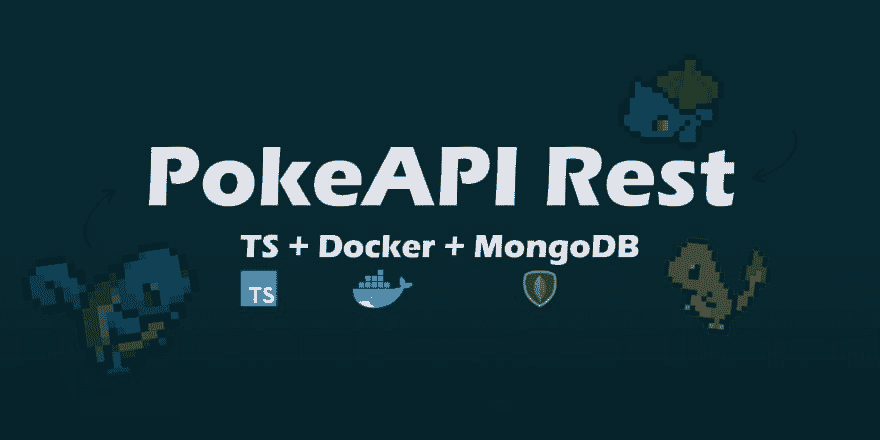

# PokeAPI REST 在 NodeJS 中包含 Express、Typescript、MongoDB 和 Docker —第 2 部分

> 原文：<https://dev.to/nyagarcia/pokeapi-rest-in-nodejs-with-express-typescript-mongodb-and-docker-part-2-b56>

[](https://res.cloudinary.com/practicaldev/image/fetch/s--yxIxPmjh--/c_limit%2Cf_auto%2Cfl_progressive%2Cq_auto%2Cw_880/https://thepracticaldev.s3.amazonaws.com/i/j0gnabvx489t3xha8hfa.png)

## 前言

这是展示如何在 NodeJS 中创建 RESTful API 的系列文章的第 2 部分。如需进一步阅读，请查看以下链接:

[PokeAPI REST 在 NodeJS 中包含 Express、TypeScript、MongoDB 和 Docker —第 1 部分](https://dev.to/nyagarcia/pokeapi-rest-in-nodejs-with-express-typescript-mongodb-and-docker-part-1-5f8g)

[PokeAPI REST 在 NodeJS 中包含 Express、TypeScript、MongoDB 和 Docker —第 3 部分](https://dev.to/nyagarcia/pokeapi-rest-in-nodejs-with-express-typescript-mongodb-and-docker-part-3-494a)

如果你喜欢查看完整的代码，你可以在这里找到完整的 PokeApi 项目。

## 简介

在前一篇文章中，我们设置了我们的服务器，并实现了我们的第一个 GET route，它返回了一个可爱的欢迎消息。因为我们的目标是对口袋妖怪数据执行基本的 CRUD 操作，所以我们需要一个数据库来存储我们的信息。

在这篇文章中，我们将为 MongoDB 数据库创建并部署一个 docker 容器。我们还将使用 Mongoose 定义我们的口袋妖怪数据模型。

## 咱们码吧

### 预览

再一次，在我们开始之前，先预览一下我们的目录树在本文结束时的样子:

[](https://res.cloudinary.com/practicaldev/image/fetch/s--TrffnUTM--/c_limit%2Cf_auto%2Cfl_progressive%2Cq_auto%2Cw_880/https://thepracticaldev.s3.amazonaws.com/i/ltafch175na4b9axgjb7.png)

提醒一下，为了运行我们的项目，我们现在使用下面的命令:

```
npm run start 
```

Enter fullscreen mode Exit fullscreen mode

说完了，我们开始吧。

### 创建我们的 docker-compose 文件

我们要做的第一件事是创建一个 docker-compose.yml 文件，在“src”目录的同一层，也就是说，在“src”目录之外。完成后，将以下代码复制并粘贴到新创建的文件中: