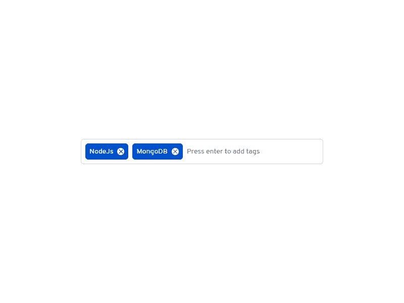

# 在 ReactJs 中创建标签输入组件

> 原文：<https://dev.to/prvnbist/create-a-tags-input-component-in-reactjs-ki>

[](https://res.cloudinary.com/practicaldev/image/fetch/s--LqFUom3H--/c_limit%2Cf_auto%2Cfl_progressive%2Cq_66%2Cw_880/https://thepracticaldev.s3.amazonaws.com/i/cltf78wmensp4vfwluvf.gif)

## 项目设置

我们将使用 ReactJs 构建组件。让我们从安装必需品开始。首先，我们将使用 react 的 [CRA](https://github.com/facebook/create-react-app) 创建一个 React 应用程序，或者你可以使用任何初学者工具包开始。让我们设置我们的`React`应用程序。

```
npx create-react-app tags-input
cd tags-input 
```

<svg width="20px" height="20px" viewBox="0 0 24 24" class="highlight-action crayons-icon highlight-action--fullscreen-on"><title>Enter fullscreen mode</title></svg> <svg width="20px" height="20px" viewBox="0 0 24 24" class="highlight-action crayons-icon highlight-action--fullscreen-off"><title>Exit fullscreen mode</title></svg>

## 我们开始吧！

在`index.js`文件中，我们将为我们的基础组件`App`编写代码，您可以随意命名。

```
// index.js
import React from "react";
import ReactDOM from "react-dom";
import "./styles.scss";

const App = () => {
    return (
        <div className="App">
            <span>Hello World!</span>
        </div>
    );
};

ReactDOM.render(<App />, document.getElementById("root")); 
```

<svg width="20px" height="20px" viewBox="0 0 24 24" class="highlight-action crayons-icon highlight-action--fullscreen-on"><title>Enter fullscreen mode</title></svg> <svg width="20px" height="20px" viewBox="0 0 24 24" class="highlight-action crayons-icon highlight-action--fullscreen-off"><title>Exit fullscreen mode</title></svg>

## 标签输入组件

我们将使用功能组件和 React 的`useState`钩子来使它有状态。

```
// TagsInput.jsx
import React from "react";
const TagsInput = () => {
    const [tags, setTags] = React.useState([]);
    return (
        <div className="tags-input">
            <ul>
                {tags.map((tag, index) => (
                    <li key={index}>
                        <span>{tag}</span>
                        <i className="material-icons">close</i>
                    </li>
                ))}
            </ul>
            <input
                type="text"
                placeholder="Press enter to add tags"
            />
        </div>
    );
};
export default TagsInput; 
```

<svg width="20px" height="20px" viewBox="0 0 24 24" class="highlight-action crayons-icon highlight-action--fullscreen-on"><title>Enter fullscreen mode</title></svg> <svg width="20px" height="20px" viewBox="0 0 24 24" class="highlight-action crayons-icon highlight-action--fullscreen-off"><title>Exit fullscreen mode</title></svg>

因为我们将在状态中存储一个标签数组，所以我们可以将其初始化为空数组。钩子返回两个值，即当前状态和一个可以用来更新状态的函数。我们使用数组析构从`useState`中获得两个值。在我们的例子中，当前状态被称为`tags`，更新它的函数被称为`setTags`。

然后，在返回函数中，我们映射`tags`数组，并显示用户将在状态中添加的所有标签。

## 添加标签功能

让我们创建添加标签的功能。我们将添加一个事件处理程序`onKeyUp`到我们的`input`标签中，返回一个名为`addTags()`的函数，并将`event`作为参数传入。

```
// TagsInput.jsx
...
<input
    type="text"
    onKeyUp={event => addTags(event)}
    placeholder="Press enter to add tags"
/>
... 
```

<svg width="20px" height="20px" viewBox="0 0 24 24" class="highlight-action crayons-icon highlight-action--fullscreen-on"><title>Enter fullscreen mode</title></svg> <svg width="20px" height="20px" viewBox="0 0 24 24" class="highlight-action crayons-icon highlight-action--fullscreen-off"><title>Exit fullscreen mode</title></svg>

接下来，我们将在组件中的`return`之上定义`addTags()`函数。

```
// TagsInput.jsx
import React from "react";
const TagsInput = () => {
    const [tags, setTags] = React.useState([]);
    const addTags = event => {
        if (event.key === "Enter" && event.target.value !== "") {
            setTags([...tags, event.target.value]);
            event.target.value = "";
        }
    };
    return (
    ...
    );
}; 
```

<svg width="20px" height="20px" viewBox="0 0 24 24" class="highlight-action crayons-icon highlight-action--fullscreen-on"><title>Enter fullscreen mode</title></svg> <svg width="20px" height="20px" viewBox="0 0 24 24" class="highlight-action crayons-icon highlight-action--fullscreen-off"><title>Exit fullscreen mode</title></svg>

我们可以使用 keycodes 来确保只有当用户按下`Enter`键时，标签才会被添加到 state 中。除此之外，我们还增加了一个条件，防止空标签被添加到状态中。

然后在我们的`if`条件下，如果为真，我们可以使用我们的`setTags()`函数添加用户输入的标签。你会注意到我在这里使用了扩展操作符(`...tags`)来首先添加我们已经有的标签，然后添加用户刚刚输入的标签。这个语法只是确保传入的标签被添加到标签数组的最后，最后我们从输入标签中清除值，这样用户就可以输入新的标签。

## 删除标签功能

要删除标签，用户可以单击所有标签都有的关闭图标。我将传递一个`onClick`事件处理程序来处理移除标签功能。

```
// TagsInput.jsx
...
{tags.map((tag, index) => (
    <li key={index}>
        <span>{tag}</span>
        <i
            className="material-icons"
            onClick={() => removeTags(index)} 
        >
            close
        </i>
    </li>
))}
... 
```

<svg width="20px" height="20px" viewBox="0 0 24 24" class="highlight-action crayons-icon highlight-action--fullscreen-on"><title>Enter fullscreen mode</title></svg> <svg width="20px" height="20px" viewBox="0 0 24 24" class="highlight-action crayons-icon highlight-action--fullscreen-off"><title>Exit fullscreen mode</title></svg>

当用户点击关闭图标时，我们返回一个`removeTags()`,并传递被点击移除的标签的`index`。现在就在我们的`addTags()`下面，我们将添加`removeTags()`。

```
// TagsInput.jsx
...
const addTags = event => {
    ...
};
const removeTags = index => {
    setTags([...tags.filter(tag => tags.indexOf(tag) !== index)]);
};
... 
```

<svg width="20px" height="20px" viewBox="0 0 24 24" class="highlight-action crayons-icon highlight-action--fullscreen-on"><title>Enter fullscreen mode</title></svg> <svg width="20px" height="20px" viewBox="0 0 24 24" class="highlight-action crayons-icon highlight-action--fullscreen-off"><title>Exit fullscreen mode</title></svg>

因为我们正在传递用户想要移除的标签的`index`，所以我们可以使用`filter()`方法基于标签的索引来移除标签。在上面代码的第 8 行，我们简单地迭代我们的标签数组，寻找一个标签，它的索引与用户想要删除的标签的索引相匹配，一旦找到，它将被过滤掉，剩下的标签将保留在结果数组中。最后，我们再次使用 spread 操作符将结果标签传入一个数组，然后使用`setTags()`来更新状态。

## 让我们将标签输入组件导入到我们的基本组件中

```
// index.js
import React from "react";
import ReactDOM from "react-dom";
import "./styles.scss";

import TagsInput from './TagsInput';

const App = () => {
    return (
        <div className="App">
            <TagsInput />
        </div>
    );
};

ReactDOM.render(<App />, document.getElementById("root")); 
```

<svg width="20px" height="20px" viewBox="0 0 24 24" class="highlight-action crayons-icon highlight-action--fullscreen-on"><title>Enter fullscreen mode</title></svg> <svg width="20px" height="20px" viewBox="0 0 24 24" class="highlight-action crayons-icon highlight-action--fullscreen-off"><title>Exit fullscreen mode</title></svg>

现在，我们如何获取用户添加到基本组件中的标签。我们将在基本组件中声明一个名为`selectedTags`的函数，并将其作为道具传递给`TagsInput`组件。

```
...
const App = () => {
    const selectedTags = tags => console.log(tags)};
    return (
        <div className="App">
            <TagsInput selectedTags={selectedTags}/>
        </div>
    );
};
... 
```

<svg width="20px" height="20px" viewBox="0 0 24 24" class="highlight-action crayons-icon highlight-action--fullscreen-on"><title>Enter fullscreen mode</title></svg> <svg width="20px" height="20px" viewBox="0 0 24 24" class="highlight-action crayons-icon highlight-action--fullscreen-off"><title>Exit fullscreen mode</title></svg>

从我们的`TagsInput`组件，我们现在可以调用`selectedTags`方法并将标签数组传递给我们的基本组件。

```
// TagsInput.jsx
...
const TagsInput = props => {
    const [tags, setTags] = React.useState([]);
    const addTags = event => {
        if (event.key === "Enter" && event.target.value !== "") {
            setTags([...tags, event.target.value]);
            props.selectedTags([...tags, event.target.value]);
            event.target.value = "";
        }
    };
    ...
}; 
```

<svg width="20px" height="20px" viewBox="0 0 24 24" class="highlight-action crayons-icon highlight-action--fullscreen-on"><title>Enter fullscreen mode</title></svg> <svg width="20px" height="20px" viewBox="0 0 24 24" class="highlight-action crayons-icon highlight-action--fullscreen-off"><title>Exit fullscreen mode</title></svg>

您会注意到我们已经将`props`作为参数传递给了我们的`TagsInput`组件。我们将使用它来访问从基础组件传递来的`selectedTags()`。在上面代码的第 9 行，我们调用了`selectedTags()`方法，并传递了与第 8 行的`setTags`相同的参数。注意，我没有传递从`useState`析构的`tags`本身，以避免传递旧的标签数组。

现在，每当用户添加一个新的标签，基本组件将可以更新标签数组。

## Codepen 演示

[https://codepen.io/prvnbist/embed/jJzROe/?height=600&default-tab=result&embed-version=2](https://codepen.io/prvnbist/embed/jJzROe/?height=600&default-tab=result&embed-version=2)
感谢阅读，这是我的第一篇博文，欢迎反馈！([https://www . prvnbist . com/blog/create-a-tags-input-component-in-react](https://www.prvnbist.com/blog/create-a-tags-input-component-in-react))！