# 自上而下游戏的组成部分🎮~塞尔达传说案例研究

> 原文：<https://dev.to/arekusunaito/components-of-a-top-down-game-a-legend-of-zelda-case-study-bfn>

原文链接:[https://arekusunaito . git book . io/knowledge/introduction/components-of-a-top-down-game-a-legend-of-zelda-case-study](https://arekusunaito.gitbook.io/knowledge/introduction/components-of-a-top-down-game-a-legend-of-zelda-case-study)

我已经考虑了很长时间，我应该创建一个游戏内组件的数据库，或者一个必须创建才能放入游戏的东西的列表。虽然它旨在帮助我想象视频游戏中需要什么，但它也应该对其他人有所帮助。为此，我将使用第一个塞尔达传说，然后(如果没有其他项目介入)使用第二个自上而下的游戏，看看有多少相似之处。Mario Maker 之所以存在，为什么你可以用不同的 Mario 风格来设计游戏，是因为这些游戏中有设计模式，自然地，自上而下的游戏也有相同的设计模式。谁知道呢，这可能会成为以后的 Youtube 视频。🎥

> 抬头！这是一篇很长的帖子，因为它以技术的方式分析了几乎所有的塞尔达传说游戏，这篇帖子的目的是让爱好者了解游戏内部是如何工作的。

## 屏幕

### 标题屏幕

你首先会注意到的是游戏中的标题屏幕(忽略在某些时候，闪屏是我们首先看到的东西)。这个屏幕的目的是在不玩的情况下显示游戏。旧的视频游戏用来介绍游戏或者展示游戏是如何玩的。这个画面是冒险前的大厅。在塞尔达传说中

[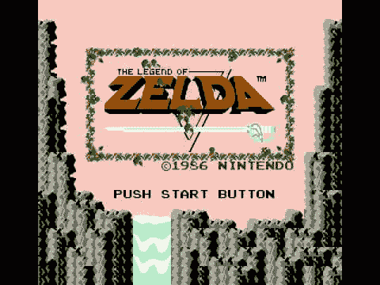](https://res.cloudinary.com/practicaldev/image/fetch/s---48cqi1J--/c_limit%2Cf_auto%2Cfl_progressive%2Cq_auto%2Cw_880/https://i.ytimg.com/vi/yjmeb7HCeyU/hqdefault.jpg)

*   你可以看到它呈现了一个游戏的动画标志。
*   它创建的年份
*   创作这个游戏的工作室/公司
*   背景
*   动画瀑布(附加在背景上)
*   “按下开始按钮”文本表明，同样的事情，你应该按下开始按钮来触发另一个动作。(这将带您进入下一个屏幕)

如前所述，标题屏幕显示游戏，但你还没有开始玩。程序员必须

*   将背景图像放在屏幕上。
*   播放标题屏幕音乐
*   动画任何需要动画的精灵。
    *   瀑布
    *   标志
*   在转换到下一个屏幕之前，动画并使精灵变暗。
    *   一旦黑暗化完成，转变就开始了。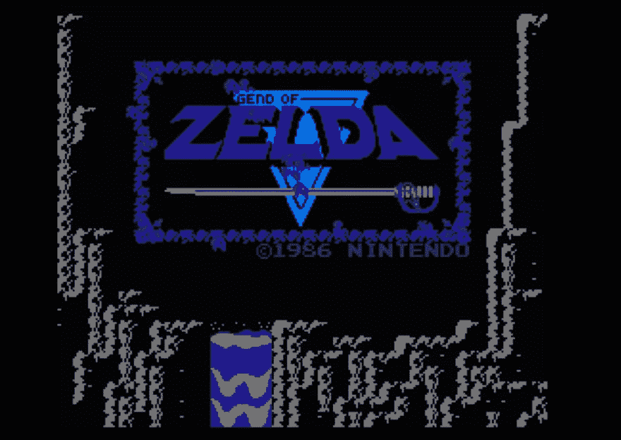
*   检测“按下开始按钮”的输入
    *   这将触发到文件选择屏幕的转换
*   创建过渡
    *   到介绍屏幕
    *   到文件选择屏幕
*   这里有一个看不见的逻辑。可能是个计时器。在一定时间后，如果玩家没有按下开始按钮。
    *   屏幕必须变暗
    *   必须过渡到`Intro Screen`

### 介绍屏幕

我们可以说这是一个独立的屏幕，即使他们共享同一首歌。这是一个滚动屏幕

*   一大段文字配上游戏的故事。还要考虑到有人必须创建介绍的框架，这是围绕游戏的标志相同的框架。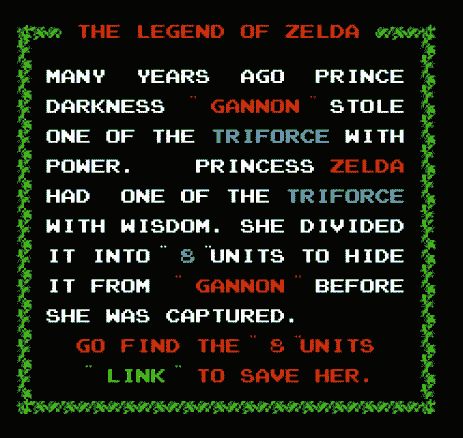
*   分两栏的宝藏清单。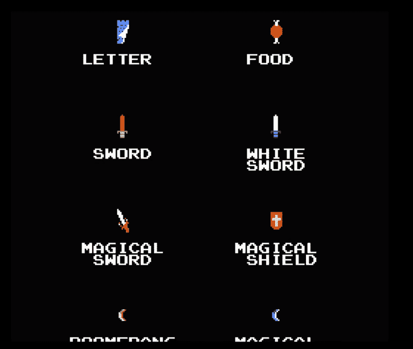

接下来，你会注意到在一点点的间隔之后，出现了“所有的宝藏”部分。

[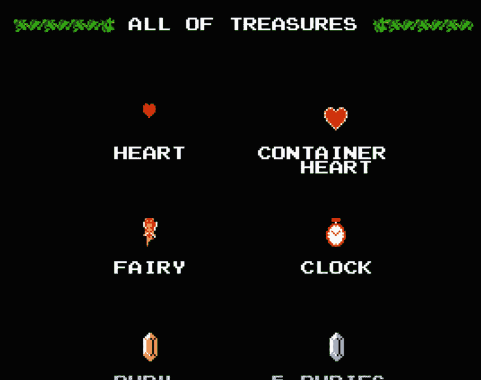](https://res.cloudinary.com/practicaldev/image/fetch/s--CEnZbSj8--/c_limit%2Cf_auto%2Cfl_progressive%2Cq_auto%2Cw_880/https://trello-attachments.s3.amazonaws.com/5b74b9cba4c5e76a79ed93c5/5cb6560482f83b45c11ed36e/b54277e12dabb33a84b0ee722e9bdfad/image.png)

您可以注意到，框架的相同精灵被用作该部分的分隔符，以及精灵字母。我认为用游戏引擎做分隔符更容易，因为你可以做一个包含框架和字母的分组对象。

接下来你会注意到，对于这里的`34 treasures`(加一，就是 triforce)，我们可以用 Treaure sprite 和宝藏的标签创建一个普通的对象。
我们会有一个这样的基础项目，想法是使用这个相同的项目 35 次，17 次在左栏，17 次在右栏，并为`Heart`、`Rupee`和`Triforce`制作一个专门的动画版本。

这是我们将需要的基本项目。正如我之前提到的，这是由宝藏雪碧和带有宝藏名称的标签所代表的。

[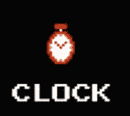](https://res.cloudinary.com/practicaldev/image/fetch/s--jyoDMi8Z--/c_limit%2Cf_auto%2Cfl_progressive%2Cq_auto%2Cw_880/https://trello-attachments.s3.amazonaws.com/5b74b9cba4c5e76a79ed93c5/5cb6560482f83b45c11ed36e/f827d28ed76c18ac1127a845f49673d6/image.png)

接下来要做的事情，要么是手动的，要么是通过代码，将宝藏放在一个列不可见的对象上，然后滚动项目。

*   在最后，游戏建议玩家看一下游戏手册。

然而，这两个精灵将停留在屏幕的中心，他们仍然停留在非常中心。这两个可以是第三个隐形的中柱，有自己的逻辑。

[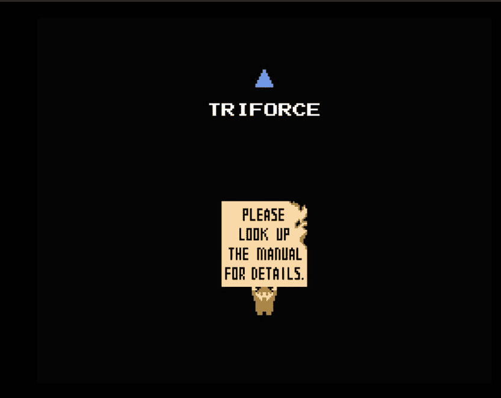](https://res.cloudinary.com/practicaldev/image/fetch/s--LE6IePUq--/c_limit%2Cf_auto%2Cfl_progressive%2Cq_auto%2Cw_880/https://trello-attachments.s3.amazonaws.com/5b74b9cba4c5e76a79ed93c5/5cb6560482f83b45c11ed36e/aaef573293d5b2d506e13b03b74c3724/image.png)

因此，在这些屏幕中，每个宝藏的精灵都被使用。它们必须在这里准备好，但是可以使用占位符。在这个屏幕里总共有 35 件宝贝。。请注意，triforce 也是动画。

将进行最后一次过渡，可能是在歌曲播放完毕后，我们将过渡到`Title Screen`。

### 文件选择屏幕

这个屏幕是选择文件的中心。文件为你的个人冒险保存数据。制作这个屏幕是为了让你可以有三个不同的冒险，或者三个不同的玩家可以通过共享弹夹在不同的时间玩游戏。
[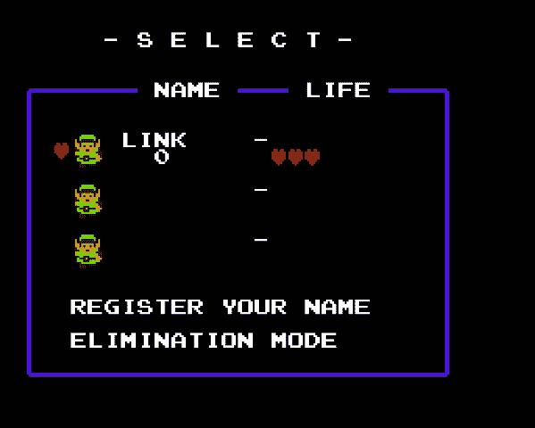T3】](https://res.cloudinary.com/practicaldev/image/fetch/s--fPEoS5qB--/c_limit%2Cf_auto%2Cfl_progressive%2Cq_auto%2Cw_880/https://trello-attachments.s3.amazonaws.com/5b74b9cba4c5e76a79ed93c5/5cb6560482f83b45c11ed36e/8906a3029a72c3589c0949f9ed873953/image.png)

这个屏幕有一个纯黑色背景。屏幕上有标示信息的标签。如果您按下“选择”按钮，您可以在文件和最后两个选项之间切换，这两个选项是“注册您的名字”和“消除模式”。

*   左边的心形是当前选择的光标。
    *   通过按选择，您移动到下一个选择。
*   有三个文件行。
*   有一个链接“图标”/“精灵”来代表游戏角色。
    *   第一列
        *   这个角色有一个名字
        *   有死亡人数统计。这是，你在冒险中死了多少次。
    *   第二列
        *   一排心形精灵显示玩家在冒险中收集了多少生命值。玩家以三张红心开始。###注册您的姓名屏幕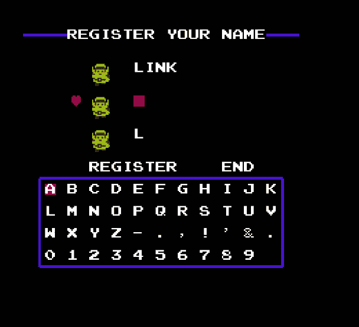

这个画面会提示玩家说出主要人物/主角的名字。虽然规范名称是`Link`，但玩家可以选择他们想要的任何名称。

在这里，玩家只能选择一个“空”文件，也就是一个没有名字的文件。值得注意的是，如果没有名字，玩家可以在同一个屏幕中给这三个文件命名。一旦选择了“注册结束”，任何包含 1 个或 1 个以上字符的文件都将被视为可播放文件。

再一次，我们可以在这里看到*我们正在重新循环链接的精灵*，心，在选择的文件上有一个红色的方块。这个红色的方块代表下一个要画的字母，这是给玩家的反馈，这样可以知道下一个字母的位置。

[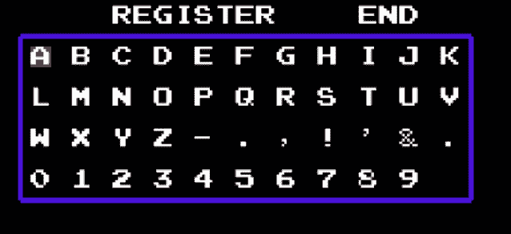](https://res.cloudinary.com/practicaldev/image/fetch/s--s81ImrDF--/c_limit%2Cf_auto%2Cfl_progressive%2Cq_auto%2Cw_880/https://trello-attachments.s3.amazonaws.com/5b74b9cba4c5e76a79ed93c5/5cb6560482f83b45c11ed36e/d1476c5b652b92fdd6881c4ac5ad21df/image.png)

在屏幕的底部，你可以看到一个有字母的方框。姑且称之为符号矩阵。这个 11x4 的矩阵是玩家选择主要角色名字的地方。游戏手柄的方向键会在字母之间移动。这里，在矩阵中，紫色框也是需要放置的资源。
如果按下 A 按钮，所选的字母将被添加到文件名中。

### 淘汰文件屏幕

这就是所谓的“淘汰模式”。如果您从“文件选择屏幕”中选择“清除模式”，您将在此处转换。
[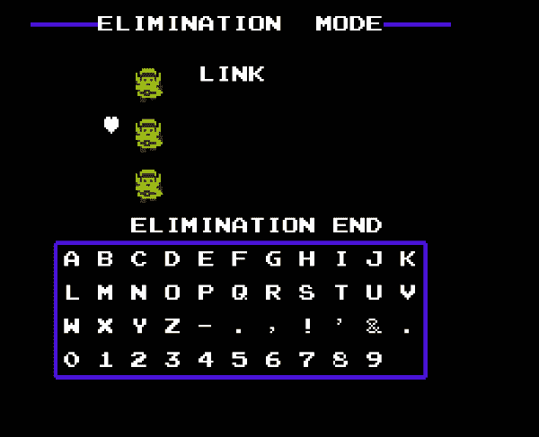T3】](https://res.cloudinary.com/practicaldev/image/fetch/s--syyXrcKS--/c_limit%2Cf_auto%2Cfl_progressive%2Cq_auto%2Cw_880/https://trello-attachments.s3.amazonaws.com/5b74b9cba4c5e76a79ed93c5/5cb6560482f83b45c11ed36e/930af2f9efc58be5c927cae863fa6dac/image.png)

类似于其他屏幕。您可以使用“选择按钮”在文件之间移动。

*   链接精灵也在这里
*   心精灵现在是白色的。
*   符号矩阵在这里不做任何事情。我会处理掉它。
*   按下开始按钮，它将删除(没有任何提示)选定的文件。从设计的角度来说，它确实需要询问玩家是否可以删除冒险中的所有内容。
    *   这也将播放链接的伤害声音效果
*   选择“淘汰结束”将过渡到“注册你的名字”屏幕

### 游戏画面

现在，玩家已经选择了他们将要播放的文件，并按下了“开始按钮”。会有一个像这样的转变。
[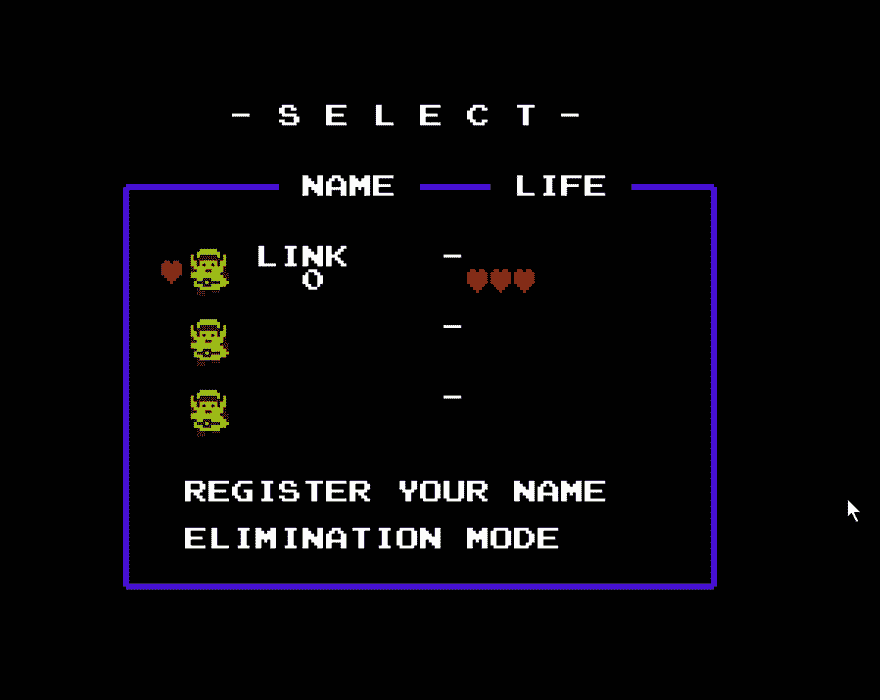T3】](https://res.cloudinary.com/practicaldev/image/fetch/s--lRMVOzd8--/c_limit%2Cf_auto%2Cfl_progressive%2Cq_66%2Cw_880/https://trello-attachments.s3.amazonaws.com/5b74b9cba4c5e76a79ed93c5/5cb6560482f83b45c11ed36e/ed4118850c02eace1b717759ce6aceba/tiWGnokSg2.gif)

#### HUD

HUD(平视显示器)显示游戏的相关信息。NES 塞尔达平视显示器呈现以下内容

*   Hyrule 的一个`Minimap`
*   玩家有多少卢比
    *   需要一个 HUD 卢比图标
*   玩家有多少把钥匙
    *   需要一个 HUD 键图标
*   玩家有多少炸弹
    *   需要一个炸弹键图标
*   哪个物品(宝物)被指定与 B 按钮一起使用
*   哪件物品(宝物)被指定与 A 一起使用
    *   如前所述，它总是一把剑
        *   木剑
        *   白衣剑卿
        *   魔法剑
*   玩家的最大寿命
*   玩家当前的生活

HUD 在游戏过程中一直存在。这是玩家必须一直知道的信息。

观察:注意项目中的紫色框架与`File Select Screen`、`The Symbol Matrix`和标签分隔符`Register your Name`和`Elimination Mode`是同一个框架

[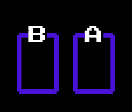](https://res.cloudinary.com/practicaldev/image/fetch/s--0ys3z2TA--/c_limit%2Cf_auto%2Cfl_progressive%2Cq_auto%2Cw_880/https://trello-attachments.s3.amazonaws.com/5b74b9cba4c5e76a79ed93c5/5cb6560482f83b45c11ed36e/8746caf12cb609a717d2ae2168442d66/image.png)
[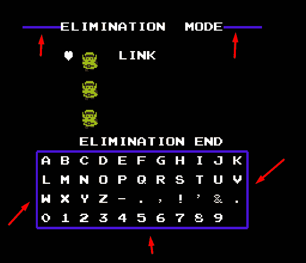T6】](https://res.cloudinary.com/practicaldev/image/fetch/s--k9cbSD2X--/c_limit%2Cf_auto%2Cfl_progressive%2Cq_auto%2Cw_880/https://trello-attachments.s3.amazonaws.com/5b74b9cba4c5e76a79ed93c5/5cb6560482f83b45c11ed36e/9e82532acabd999cd8acc07fa2a83691/image.png)

##### 地图

完整的地图是:

*   4096 x 1344 像素，16 x 8 个房间，256 x 88 个拼贴大小
    *   总共有 128 个房间
*   拼贴是 16x16 像素 2
*   每个“房间”都是 16x11 的瓷砖####小地图

从关于地图的信息来看，小地图反映了这个 16x8 的矩阵。

*   灰色矩形上的绿点代表 Hyrule 中 Link 的位置。
*   如果链接移动到另一个房间，它必须更改到新位置。

### 客房

现在我们已经更深入地讨论了 HUD，我们可以讨论 hyrule 的房间(或区域)了。每个房间都是 16x11 的瓷砖。你可能会问瓷砖是什么...平铺是放置在网格(矩阵)上的子画面。

[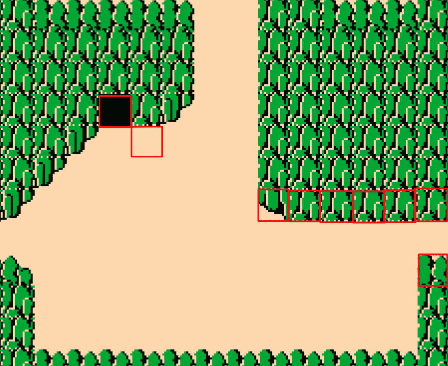](https://res.cloudinary.com/practicaldev/image/fetch/s--r9Ci93SX--/c_limit%2Cf_auto%2Cfl_progressive%2Cq_auto%2Cw_880/https://trello-attachments.s3.amazonaws.com/5b74b9cba4c5e76a79ed93c5/5cb6560482f83b45c11ed36e/5d36889f700c762ff73bf7d8d19c7567/image.png) 
正如你所看到的，这个地区的许多地方几乎都是一样的。这样做的主要目的是因为那个时期硬件的限制，然而在任何游戏中创建一个地图并不是一个坏的技术，即使在今天
观察:你可以看到奶油色可能只是背景而不是瓷砖本身，其他瓷砖使人产生错觉，纯色背景可能是 NES 塞尔达中的另一个瓷砖。

许多这样的方块只是对其他方块的重新描绘，让玩家认为这是一个完全不同的区域，看看这个。

[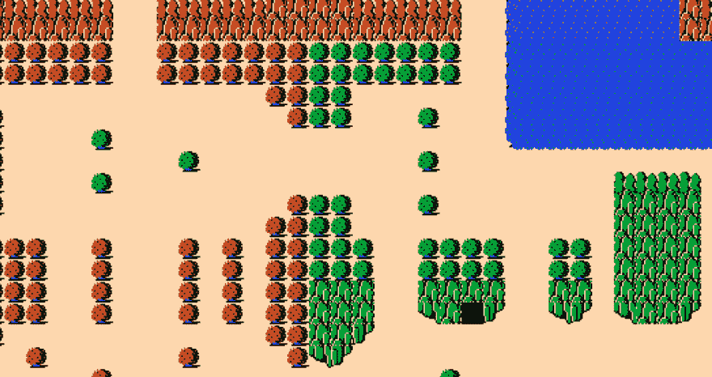](https://res.cloudinary.com/practicaldev/image/fetch/s--wnXUyH4k--/c_limit%2Cf_auto%2Cfl_progressive%2Cq_auto%2Cw_880/https://trello-attachments.s3.amazonaws.com/5b74b9cba4c5e76a79ed93c5/5cb6560482f83b45c11ed36e/d05763cd3e8ac367d6317fd1d880144e/image.png)

那些树是同样的东西，但是颜色不同，我们称之为`re-color`！

### 链接

现在该说说这个游戏中最复杂的系统了，就是 Link。先说 Link 能做的第一件事，搬家。

#### 链接的运动

Link 可以在四个基本方向上移动(北、西、南、东)，但我们通常只称它们为`Up,Left,Down,Right`。它有以下精灵。

[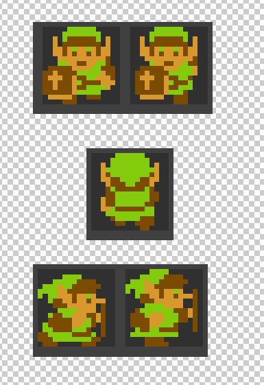](https://res.cloudinary.com/practicaldev/image/fetch/s--4YL_JnSv--/c_limit%2Cf_auto%2Cfl_progressive%2Cq_auto%2Cw_880/https://trello-attachments.s3.amazonaws.com/5b74b9cba4c5e76a79ed93c5/5cb6560482f83b45c11ed36e/e625ef0f9b4dd40a602e2f4a8d9c8087/image.png)

在前面的图片中，你可以看到 5 个不同的精灵。这 5 个精灵制造了移动的幻觉。

*   第一排是`Down`精灵
*   第二行是`Up`精灵。这个精灵被水平镜像，它制造了行走的错觉。
*   第三排是`Right`精灵，但是就像`Up`一样，如果你镜像它们，也会产生`Left`运动，不需要进一步的运动。

### 链接服用损伤

没有项目的链接非常简单。Link 在没有任何项目的情况下可以做的另一件事是....承受伤害。没有不同的精灵，在这种情况下，林克的精灵闪烁不同的颜色，通知玩家林克受到了伤害。

[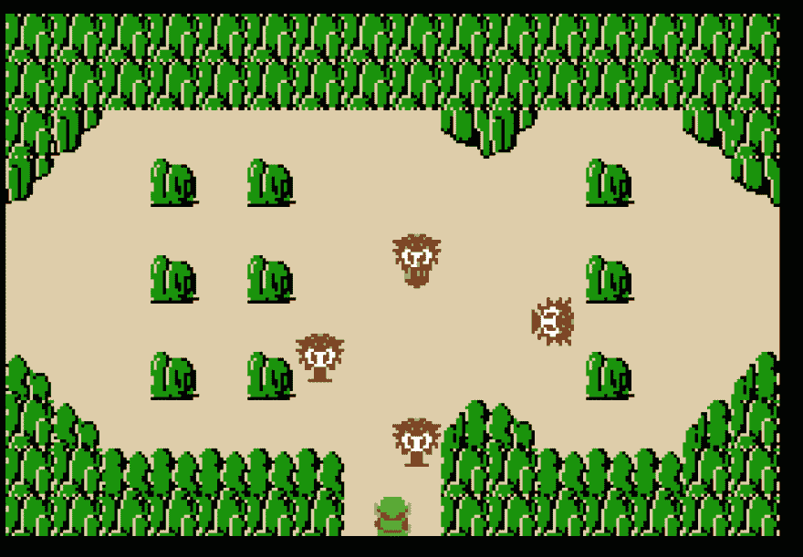](https://res.cloudinary.com/practicaldev/image/fetch/s--fjM_64xh--/c_limit%2Cf_auto%2Cfl_progressive%2Cq_66%2Cw_880/https://trello-attachments.s3.amazonaws.com/5b74b9cba4c5e76a79ed93c5/5cb6560482f83b45c11ed36e/e20ded1ae71bba4b5818f473400f87d0/VSGS5bZNPs.gif)

林克被推向他面对的相反方向。然而，情况并不总是这样，可能另一种推动他的方式是将他推向与林克相撞的敌人所面对的方向。

### 环节被击败

当林克耗尽生命，他被击败，这意味着有一个`Game Over`。
[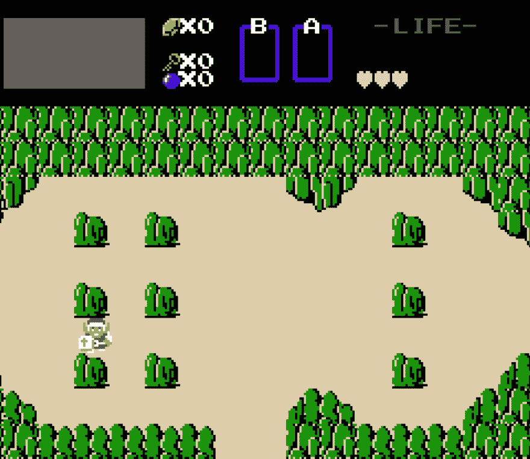](https://res.cloudinary.com/practicaldev/image/fetch/s--9OJsXR0O--/c_limit%2Cf_auto%2Cfl_progressive%2Cq_66%2Cw_880/https://trello-attachments.s3.amazonaws.com/5b74b9cba4c5e76a79ed93c5/5cb6560482f83b45c11ed36e/c4ff22276dcabfb27af363d8acef45fe/VP2oiN5MnV.gif)

*   屏幕变成红色
*   播放声音效果
*   链接面朝下，然后精灵向四个方向旋转。
*   林克面朝下
*   屏幕变暗
*   链接的精灵变成灰色
*   播放死亡动画。(像小爆炸)
*   播放另一种声音效果
*   “游戏结束”屏幕标签显示在屏幕中央。

### 游戏结束画面

### 在场景间移动

[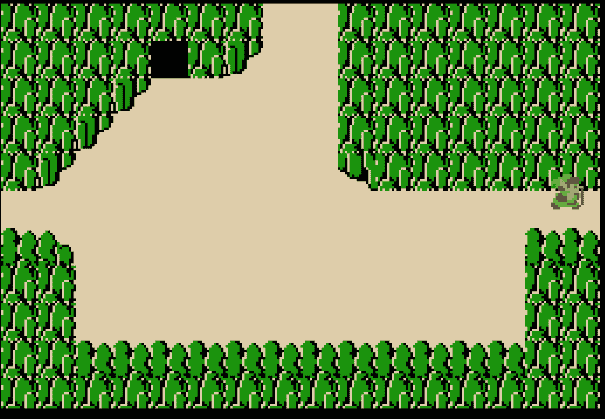](https://res.cloudinary.com/practicaldev/image/fetch/s--iTrj1dxq--/c_limit%2Cf_auto%2Cfl_progressive%2Cq_66%2Cw_880/https://trello-attachments.s3.amazonaws.com/5b74b9cba4c5e76a79ed93c5/5cb6560482f83b45c11ed36e/4e8d17aa80e698cd76eef8f90ef7beb4/n6sW6T8wpq.gif)

如果你在屏幕边缘拿着游戏手柄(在这种情况下拿着右键)，你可以去另一个房间，这就是你如何在 Hyrule 周围旅行。这里，需要一个摄像机，这个摄像机将移动到下一个房间，它将被渲染，这是一个非常简单的摄像机，因为它只是移动到下一个屏幕的中心。

*   请注意 Link 的移动动画是如何向他移动的方向播放的。
*   镜头滚动后敌人出现。

### 碰撞检测

好的，我们确实在屏幕上显示了精灵，但是必须要区分一个精灵可以走过去。请注意，Link 无法通过这个精灵。

[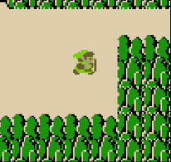](https://res.cloudinary.com/practicaldev/image/fetch/s--z6Kk2JNU--/c_limit%2Cf_auto%2Cfl_progressive%2Cq_66%2Cw_880/https://trello-attachments.s3.amazonaws.com/5b74b9cba4c5e76a79ed93c5/5cb6560482f83b45c11ed36e/665a89568b242744d719ee3eb16717d9/q1W7hahJkX.gif)

这是必须要做的，这叫做碰撞检测，一旦检测到，我们就告诉 Link 的 sprite 不要通过它们。

### 链接获取一个项目

下一个需要创建的 sprite 是当 Link 获得一个项目时。看起来是这样的。
 
这发生在你得到木剑之后。

### 链接使用某宝

当林克使用一个宝藏(或物品)时，它将使用 3 个新精灵中的一个。
[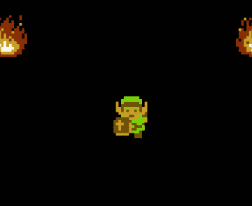T3】](https://res.cloudinary.com/practicaldev/image/fetch/s--HHaPYSjd--/c_limit%2Cf_auto%2Cfl_progressive%2Cq_66%2Cw_880/https://trello-attachments.s3.amazonaws.com/5b74b9cba4c5e76a79ed93c5/5cb6560482f83b45c11ed36e/bebe6ca25c210423f3dafa0716911fb0/Link_sword_attack.gif)

这是你会看到的最常见的东西，因为你一直都在用剑。然而，当林克使用任何宝藏时，它使用的是同样的精灵，只是它们的速度加快了。

以下是与一些宝物的区别。

下面是使用炸弹的例子

[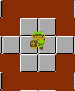](https://res.cloudinary.com/practicaldev/image/fetch/s--iKw1JRE---/c_limit%2Cf_auto%2Cfl_progressive%2Cq_66%2Cw_880/https://trello-attachments.s3.amazonaws.com/5b74b9cba4c5e76a79ed93c5/5cb6560482f83b45c11ed36e/a97adde278e69f9d819f9dbc6cead10b/LhlBNSfYkM.gif)

下面是使用回旋镖的例子

[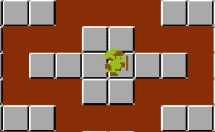](https://res.cloudinary.com/practicaldev/image/fetch/s--QzzE2fr_--/c_limit%2Cf_auto%2Cfl_progressive%2Cq_66%2Cw_880/https://trello-attachments.s3.amazonaws.com/5b74b9cba4c5e76a79ed93c5/5cb6560482f83b45c11ed36e/3968d40216b14a712239cee8589cf9df/qx3DP8aPF3.gif)

这与项目的实际功能不同。这一节讲的是 Link 在使用宝藏时会做什么，这很像`On Input`。

### 活性宝物

现在是时候谈谈和分析宝藏了。

#### 盾牌

林克的盾牌可以阻挡基本的投射物，比如箭，奥克托罗克石头，但是它不可能阻挡魔法攻击。从我收集的信息来看，Link 中可能有一个子对象有另一个碰撞器，那将是盾牌，这里的事情将是每当 Link 面对另一个地方时操纵碰撞盒。当基本射弹击中盾牌时:

*   它将播放 SFX
*   它会摧毁射弹

护盾有升级，魔法护盾。

*   它有不同的精灵
*   它有一个更大的碰撞盒(所以，应该更容易阻挡东西)

#### 回旋镖

*   它在旅行时会播放连续的声音
*   精灵无限旋转，直到被抓住
*   向链接面对的方向行进
    *   虽然这不是 100%真实的，但它实际上使用了游戏手柄的当前输入，你可以对角投掷回旋镖。
*   它将从 Link 的手的位置开始移动半个屏幕。
*   当与大多数敌人相撞时，它会打晕他们。

注意:升级到魔法回旋镖，唯一的区别就是可以在整个屏幕上穿梭。

#### 炸弹

*   它会在产卵时播放音效
*   大约[0.75 - 1]秒后，它会产生一个可以伤害敌人的爆炸，这是一个大碰撞盒。
*   它有一个使用单一云精灵的爆炸动画，该动画有 7 朵云。在动画中敌人可能会受伤的部分。
    *   还有另一种云效应表明爆炸正在减弱。
    *   从我的理解，敌人不会从这里受到伤害，这只是一个后续。
*   炸弹能打开秘密的门，在碰撞爆炸时，锁会消失。

#### 弓&箭

在这个游戏中，这被认为是两个不同的项目。即使你设法得到了箭，你也不能射它们，因为你没有弓。另一方面，如果你有弓却没有箭，那么你就不能射你没有的东西。它是如何工作的？

*   弓只是射箭的一个要求(你没看到林克用箭，只是在他面前射了一箭。)
*   在林克面对的地方前面制造一个箭头。
*   拍摄时有音效
*   箭头沿着链接面向的轨迹。
*   它被摧毁了
    *   当它出现在屏幕的末端时
    *   当它与敌人相撞时
*   可以看到一个被破坏的动画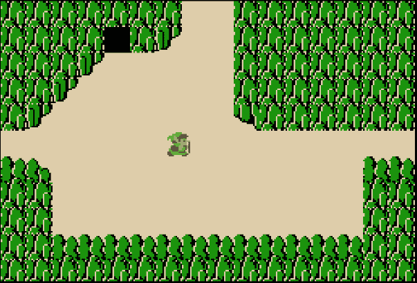

#### 蜡烛

*   它在林克面前点燃了火焰
*   一个火焰 SFX 播放
*   火焰有一个动画，让你觉得火焰在移动
*   火焰物体以较慢的速度向前移动大约 2 个单位。
*   火焰可以伤害敌人
*   火焰会伤害林克
*   几秒钟后它消失了

在黑暗的房间里，火焰照亮了道路

#### 记录仪

这是一个传送物品。它会带你去你已经完成的其他地下城。

*   它会播放声音效果
*   当 SFX 运行时，游戏中的所有其他游戏对象都被冻结。
*   如果你被击中，龙卷风就不会接收到链接
*   它在 0，Y 坐标链接上生成了一个云。
*   一场龙卷风从屏幕的 0，Y 处产生
*   龙卷风在屏幕上水平移动
*   龙卷风有一个“移动动画”
*   如果它碰到林克，林克的精灵就会消失，让玩家以为它在龙卷风里面
    *   一旦它到达屏幕的末端，游戏将会过渡到一个随机的房间，这个房间有一个地下城的入口
    *   一旦到了新房间，龙卷风会重复产卵的步骤并水平移动
    *   一旦它到达中心 X，它将使链接精灵出现。
    *   龙卷风会消失
    *   链接将面向右侧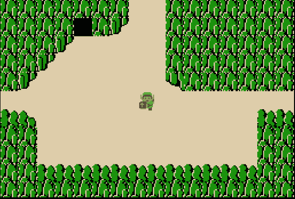

#### 食物

这个宝藏的功能是让敌人认为食物是链接，这是诱饵。这是，敌人现在(不总是)会瞄准诱饵，而不是链接。注意:在地牢里，它可以作为通过敌人的钥匙。
[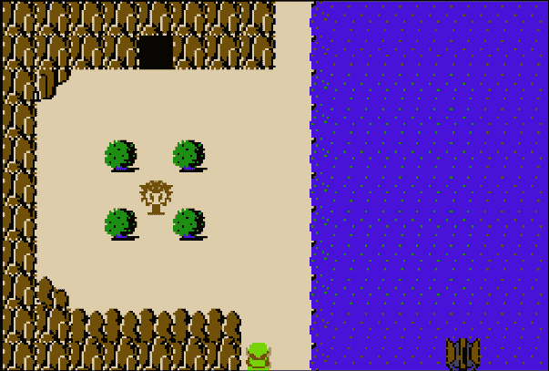](https://res.cloudinary.com/practicaldev/image/fetch/s--o9hr6mSv--/c_limit%2Cf_auto%2Cfl_progressive%2Cq_66%2Cw_880/https://trello-attachments.s3.amazonaws.com/5b74b9cba4c5e76a79ed93c5/5cb6560482f83b45c11ed36e/87810d34e6c6e2f3c58905083a9edea7/ql1qLlbNdw.gif)

#### 字母

一个本身什么也不做的宝藏。现在它被认为是一个关键物品，需要通过把信带给老太太来“打开”魔药。

#### 药剂

当你使用药剂时，每个游戏物体都会冻结，直到林克的生命值完全恢复。一旦红色药水被使用，还有第二种药水可以使用。
[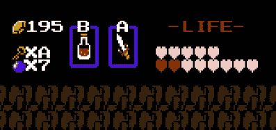T3】](https://res.cloudinary.com/practicaldev/image/fetch/s--1gslpirf--/c_limit%2Cf_auto%2Cfl_progressive%2Cq_66%2Cw_880/https://trello-attachments.s3.amazonaws.com/5b74b9cba4c5e76a79ed93c5/5cb6560482f83b45c11ed36e/14574f8c3b24ceb7a35affb9bf69f401/W1xnX3BcEI.gif)

#### 魔法棒

相当于剑的功能，但它总是射出弹丸。重要的是如何操纵和回收剑代码，为道路改变东西。

注意:为了能够射出火焰，玩家必须找到一个叫做“魔法书”的被动宝物。火和蜡烛的火有着相同的功能，所以，我们几乎只是实例化了一个火焰。
[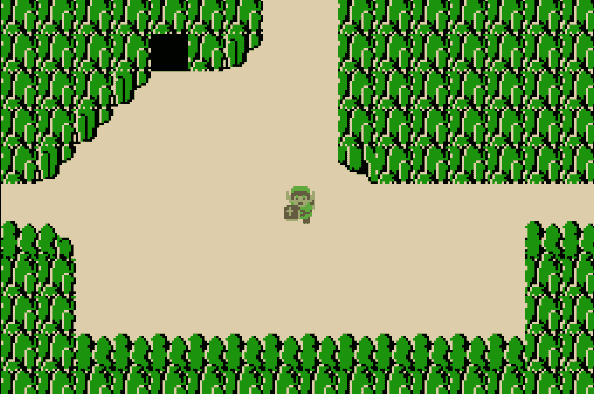T3】](https://res.cloudinary.com/practicaldev/image/fetch/s--LJvt0Vzw--/c_limit%2Cf_auto%2Cfl_progressive%2Cq_66%2Cw_880/https://trello-attachments.s3.amazonaws.com/5b74b9cba4c5e76a79ed93c5/5cb6560482f83b45c11ed36e/ff5baad31574e6bc546f1c36cb9a54c1/Cn2uZ2bIvL.gif)

### 被动宝物

所有这些宝物都不能用 B 激活，而是在不同的条件下使用它们的效果。如前所述，我们现在称这些项目为“关键项目”

#### 木筏

木筏本身就是一个关键物品，你可以用它渡海到达一个地牢和一个可选的洞穴。这就是它的作用。

[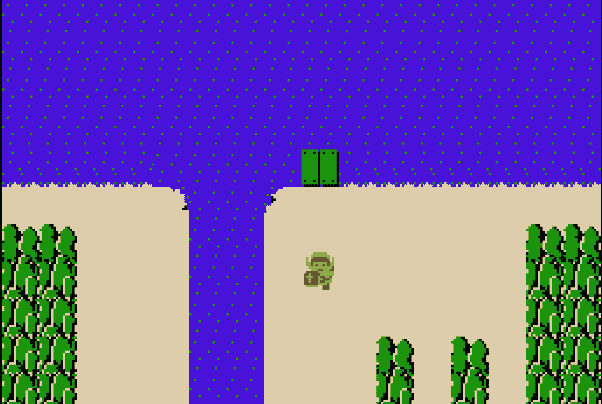](https://res.cloudinary.com/practicaldev/image/fetch/s--M8CiJC6X--/c_limit%2Cf_auto%2Cfl_progressive%2Cq_66%2Cw_880/https://trello-attachments.s3.amazonaws.com/5b74b9cba4c5e76a79ed93c5/5cb6560482f83b45c11ed36e/def742f686220ca7acbec9fbfb93d166/7YJdRr4v2t.gif)

*   继续穿过绿色的树林
*   筏子精灵将出现在链接上方
*   链接的行走动画被激活
*   更改屏幕逻辑也适用，当它到达屏幕的末尾时，我们将移动到下一个屏幕。

#### 魔法书

正如前面提到的魔法棒，如果玩家收集了它，它将允许魔法棒在与敌人碰撞或接触屏幕边缘时产生火焰。

#### 蓝色圆环

这件物品只是改变了承受伤害的逻辑，在这个功能中，它将伤害减半。

*   当它被收集时，将会把林克的精灵变成一件蓝色的外衣。

#### 红色戒指

就像蓝色的环一样，但是这个把伤害除以 4。林克受到原伤害的四分之一。

*   当它被收集时，将会把林克的精灵变成一件红色的外衣。

这些分享了几乎所有的功能，只是将 2(半损坏)改为 4(四分之一)并将精灵改为另一个。

#### 活梯

活梯是一件非常有趣的物品。这种逻辑可以用许多方法来创建。并且根据如何创建映射逻辑，这个项目可能被激活。我们先来讨论一下功能。

*   梯子让你走过不可行走的瓷砖(那不是一面墙),林克会把梯子放在他的前面，这将允许林克走过

有趣的部分来了，许多房间里有许多不可行走的瓷砖，但显然你只能在可能有用的地方使用活梯，注意这两个房间非常相似，但你只能在其中一个房间使用活梯。

*   它可以通过你可以使用它的特定房间列表来解锁。(需要手动制作该列表)
*   可以通过检查该房间上是否有特定类型的瓷砖来解锁，如果该瓷砖存在于该房间中，那么您可以使用活梯(这只是需要检查它的存在作为验证)

[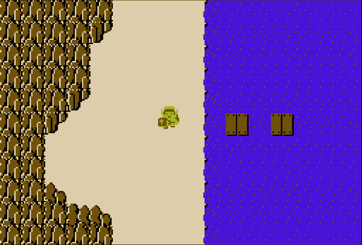](https://res.cloudinary.com/practicaldev/image/fetch/s--upqt2n-H--/c_limit%2Cf_auto%2Cfl_progressive%2Cq_66%2Cw_880/https://trello-attachments.s3.amazonaws.com/5b74b9cba4c5e76a79ed93c5/5cb6560482f83b45c11ed36e/1625f712721cdb0cf63aba2a8b2c6184/rBXgbOiTmj.gif)

#### 键

钥匙是允许你打开一扇门的物品，这将是下一个可以进入的房间。如前所述，游戏会记录玩家有多少把钥匙。

*   玩家必须走向一扇锁着的门。
*   如果玩家至少有一把钥匙，它会从计数器中减去一把。
    *   它将打开锁着的门，使门物体消失。

玩家还可以收集另一个物品，叫做魔法钥匙，这把钥匙可以让玩家打开任何锁，不再需要有钥匙。

#### 动力手镯

当林克得到动力手镯时，他就可以推动这种石头。它只需要一次碰撞，并且它需要岩石前面的瓷砖没有碰撞。

[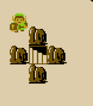](https://res.cloudinary.com/practicaldev/image/fetch/s--T15PzTYo--/c_limit%2Cf_auto%2Cfl_progressive%2Cq_66%2Cw_880/https://trello-attachments.s3.amazonaws.com/5b74b9cba4c5e76a79ed93c5/5cb6560482f83b45c11ed36e/d6fe11cb17d7627ceb7dc55c9a47f95d/IJ1ib0TIOr.gif)

#### 地牢地图

当你在地牢中收集地图时，小地图会自动填充地图的方格，这样玩家可以很容易地找到周围的路。

[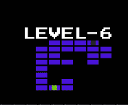](https://res.cloudinary.com/practicaldev/image/fetch/s--BakXSnxW--/c_limit%2Cf_auto%2Cfl_progressive%2Cq_auto%2Cw_880/https://trello-attachments.s3.amazonaws.com/5b74b9cba4c5e76a79ed93c5/5cb6560482f83b45c11ed36e/fc626173ab32b51fd2dd5e4a73efad2f/image.png)

当你按下开始，你可以看到当你走过房间时地图是如何完成的，可悲的是，收集`Dungeon Map`并不能完成这张地图，然而它可以用来与你去过的地方进行比较。它甚至告诉你可以去哪里，这是一个很好的奖励。(同样，绿色方块是链接。)

#### 指南针

这是每个地下城都有的物品，就像地下城地图一样。一旦你收集到它，它会被标记在三力碎片的小地图上，这样玩家就会知道老板的位置，这样他们就可以打败它并得到三力碎片。完成地下城并不需要得到这个碎片。

[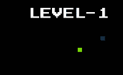](https://res.cloudinary.com/practicaldev/image/fetch/s--RdKBaf0y--/c_limit%2Cf_auto%2Cfl_progressive%2Cq_66%2Cw_880/https://trello-attachments.s3.amazonaws.com/5b74b9cba4c5e76a79ed93c5/5cb6560482f83b45c11ed36e/0ef5bf7b0adc76ef4927f0a405fe586d/fA0usOkIH8.gif)

#### 三重 Shard

收集一个三力碎片本身没有任何作用，它们只是`Key Item`，玩家需要它们才能通过 9 级死亡山的房间。如果玩家已经完成了三力，那么玩家可以继续在最终的地牢中冒险，除此之外他们是无用的。

*   这个项目只有快速改变颜色的动画，同样的精灵可以使用，只是改变它的颜色来回。

### 捡宝物

这些宝藏有一些相似之处，比如它们产生的方式，如果玩家不收集它们，它们就会消失。此外，他们中的一些人有一个闲置的动画，只是改变颜色。顺便说一下，林克可以用他的剑收集这些物品，它成为他的碰撞盒的延伸。

维基上有这方面的信息，当林克打败 10 个敌人时，他们会掉落 5 卢比。如果第 10 个敌人被炸弹打败，该敌人将投掷 4 枚炸弹。如果林克打败了 16 个敌人，他们会掉一个仙女。

#### 恢复心脏

*   当收集到它时，玩家的生命将恢复 1 颗心。
*   你想收集多少就收集多少。
*   如果你有完整的生活，什么都不会发生，你将保持完整的健康。
*   当它产生时，它会快速闪烁非常非常短的时间，然后变成空闲动画。
*   有一个动画，它改变到另一种颜色，回到原来的颜色，这个动画无限重复，总共 2 个动画。
*   如果在 X 时间内没有收集到，它就会消失。
*   敌人被击败时可以掉落此物品。

#### 心容器

*   该物品增加玩家的最大生命。玩家从 3 张红心开始。

#### 仙女

收集一个精灵可以恢复林克 3 点生命值，相当于 3 颗恢复心。

#### 时钟

*   当被收集的时候，敌人将会冻结在他们现在的位置。
*   当它产生时，它会快速闪烁一段非常非常短的时间，然后变成正常的精灵。
*   如果在 X 时间内没有收集到，它就会消失。
*   当它产卵时，它会快速闪烁非常非常短的时间，然后变成一个没有动画的精灵。
*   敌人仍然是活跃的。
*   使链接的精灵闪烁，这是提供的反馈，让玩家知道时钟正在生效。该效果持续到玩家离开房间。

[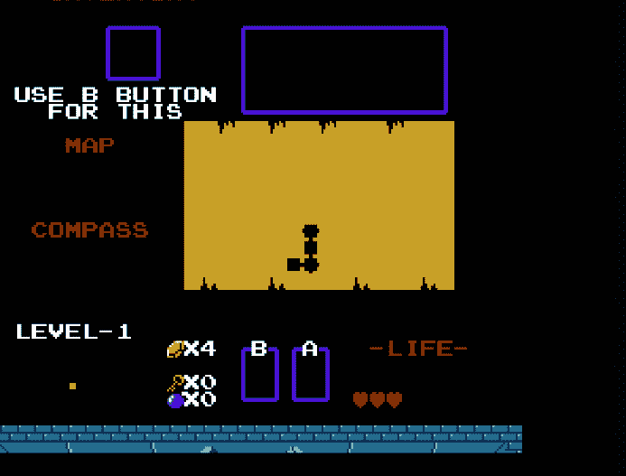](https://res.cloudinary.com/practicaldev/image/fetch/s--lza8vcdr--/c_limit%2Cf_auto%2Cfl_progressive%2Cq_66%2Cw_880/https://trello-attachments.s3.amazonaws.com/5b74b9cba4c5e76a79ed93c5/5cb6560482f83b45c11ed36e/99044faeb7f02cc95d0e124f767bb089/5ZXPoIECJ4.gif)

如你所见，时钟没有空闲动画，它只是屏幕上的精灵。

[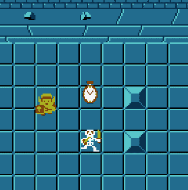](https://res.cloudinary.com/practicaldev/image/fetch/s--YoQ-bYkL--/c_limit%2Cf_auto%2Cfl_progressive%2Cq_66%2Cw_880/https://trello-attachments.s3.amazonaws.com/5b74b9cba4c5e76a79ed93c5/5cb6560482f83b45c11ed36e/60426fd0d3a6beb4f38a89ab30e52814/PLMvZuPkQX.gif)

#### 卢比

有两种类型的卢比。

*   -当它产生时，它快速闪烁非常非常短的时间，然后改变到空闲动画。
*   1 价值卢比
    *   增加玩家 1 卢比。
    *   空闲动画在蓝色和橙色之间闪烁。
*   5 价值卢比
    *   增加玩家 5 卢比。
    *   没有空闲的动画，只有蓝色的卢比精灵。
*   如果在 X 时间内没有收集到，它就会消失。

#### 差异

*   橙色卢比(价值 1 英镑)

[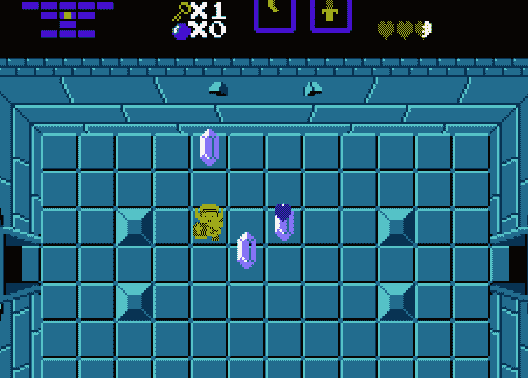](https://res.cloudinary.com/practicaldev/image/fetch/s--tRvUIQTC--/c_limit%2Cf_auto%2Cfl_progressive%2Cq_66%2Cw_880/https://trello-attachments.s3.amazonaws.com/5b74b9cba4c5e76a79ed93c5/5cb6560482f83b45c11ed36e/ca555ae23bfdd9a0ae76fbd6286c426d/opIb8tpwlj.gif)

*   蓝色卢比(价值 5 英镑)

[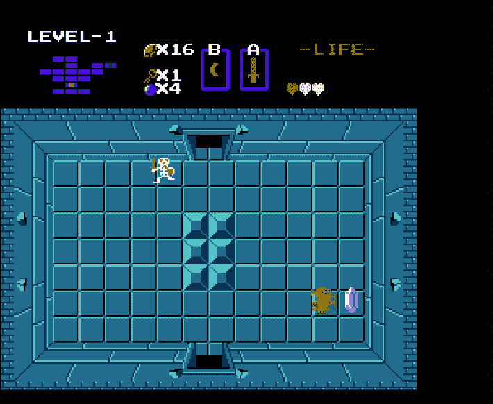](https://res.cloudinary.com/practicaldev/image/fetch/s--tlsEF4VL--/c_limit%2Cf_auto%2Cfl_progressive%2Cq_66%2Cw_880/https://trello-attachments.s3.amazonaws.com/5b74b9cba4c5e76a79ed93c5/5cb6560482f83b45c11ed36e/ce986861df7d950db3d49d061cb6c440/cf6xu75pWT.gif)

### 敌人

这一部分现在也将把敌人作为组件来分析。

*   每一个与林克相撞的敌人都会让他受到伤害。

#### 八开

这些是玩家将会遇到的第一个敌人，他们只是在房间里游荡，他们不会主动去找林克。

*   他们在发射射弹之前停止移动(但是动画没有改变)
*   即使他们看到林克，他们也会发射炮弹
*   如果投射物击中林克，他将受到伤害。
    *   如果射弹碰到墙壁，就会被摧毁。
    *   林克的护盾可以挡住这一发炮弹
*   它们与瓷砖碰撞。它们是实心的。

[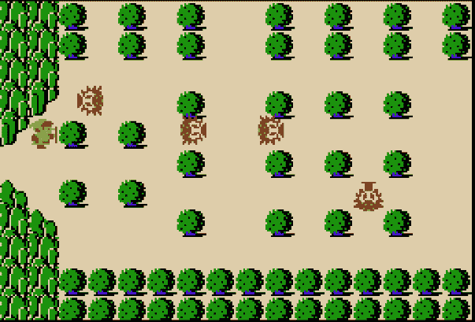](https://res.cloudinary.com/practicaldev/image/fetch/s--DfPTrMaO--/c_limit%2Cf_auto%2Cfl_progressive%2Cq_66%2Cw_880/https://trello-attachments.s3.amazonaws.com/5b74b9cba4c5e76a79ed93c5/5cb6560482f83b45c11ed36e/a82ec800f4d3fa4426ad2d203634a815/xW4Ow65BSl.gif)

还有蓝色的章鱼，比红色的更健康。

#### 玻璃陨石

这些敌人只是以一种非常怪异和不可预测的方式移动。他们做抛物线运动。他们可能会选择一个他们想要降落的点，然后创建一个抛物线模式来移动到该点。

*   完全忽略地图冲突。
*   从 GIF 上我们可以看到，他们并没有主动寻找链接
*   他们有一个空闲动画，当他们跳跃时，他们总是有一个“下落”精灵，这是空闲动画中的第二个精灵。

[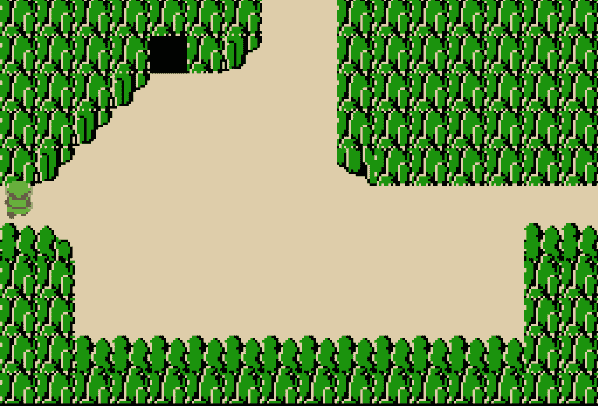](https://res.cloudinary.com/practicaldev/image/fetch/s--ZFCBhp-Z--/c_limit%2Cf_auto%2Cfl_progressive%2Cq_66%2Cw_880/https://trello-attachments.s3.amazonaws.com/5b74b9cba4c5e76a79ed93c5/5cb6560482f83b45c11ed36e/51ffc0feaa9fb096ff5525d0a7816817/71VhRDpvVO.gif)

它们也有蓝色和红色。维基声称红色的比蓝色的跳得多，而且两者的健康状况相同。他们有更多的机会掉落卢比和时钟宝藏，我想蓝色的是那些有更大的战利品变化的。

#### 李维斯

这些是从地下滋生的敌人。和前面的一样，也是两种，一种红色的，一种蓝色的

*   他们有一个产卵动画，让你觉得他们实际上来自地面。
*   一段时间后，红色和蓝色都会回到地面。
    *   它们在挖洞时是不会受伤的。
*   红蜘蛛正在积极地寻找林克，一旦它们产卵，就会瞄准林克的方向。
*   当他们点击链接，他们回到相反的方向

[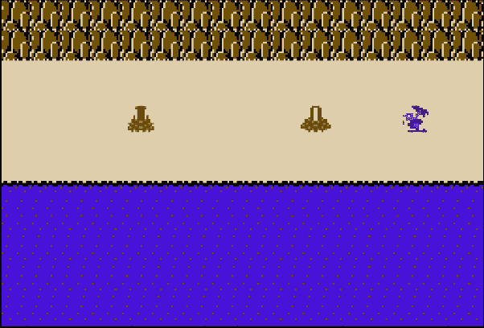](https://res.cloudinary.com/practicaldev/image/fetch/s--yMO90uxi--/c_limit%2Cf_auto%2Cfl_progressive%2Cq_66%2Cw_880/https://trello-attachments.s3.amazonaws.com/5b74b9cba4c5e76a79ed93c5/5cb6560482f83b45c11ed36e/9ff1b2e6c7d210504a567d2ac53acb29/RNWwTfVTAB.gif)

*   蓝蜗牛有一个随机的模式，他们只是简单的不介意链接。
*   蓝色的肝脏比红色的更健康。

[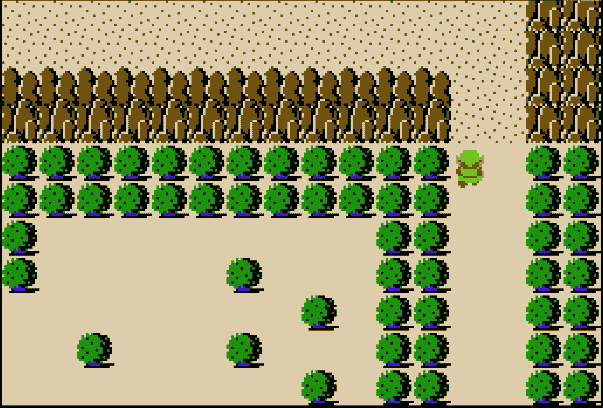](https://res.cloudinary.com/practicaldev/image/fetch/s--LqUsGzft--/c_limit%2Cf_auto%2Cfl_progressive%2Cq_66%2Cw_880/https://trello-attachments.s3.amazonaws.com/5b74b9cba4c5e76a79ed93c5/5cb6560482f83b45c11ed36e/beefdf8c2f9a62d1aaf5bea163b3a5cc/Leevers.gif)

#### 行人

*   他们也忽略碰撞
*   正在半积极地寻找联系
*   他们是不可战胜的，直到他们静止不动(他们应该是在飞)，这意味着他们在地面上。
*   他们有一个上紧的动画，这让他们觉得他们开始移动。
    *   在此期间，它们的移动速度会慢一点
*   他们准备着陆时会减速。
    *   他们的运动动画也变慢了。
*   运动动画只有 2 帧。
*   它们可以斜着移动，看起来它们试图做一个圆形图案，围绕着链环。

[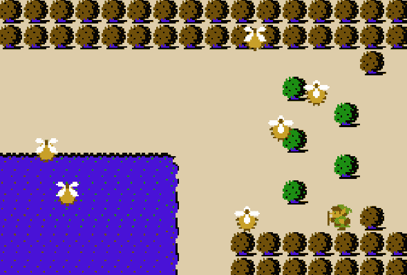](https://res.cloudinary.com/practicaldev/image/fetch/s--HSu6Rs72--/c_limit%2Cf_auto%2Cfl_progressive%2Cq_66%2Cw_880/https://trello-attachments.s3.amazonaws.com/5b74b9cba4c5e76a79ed93c5/5cb6560482f83b45c11ed36e/2236aad312d9fd12eb8684ba078d7845/vVekStVDeT.gif)

#### Moblins

*   非常类似于 Octoroks
*   它们会碰撞东西
*   他们射的是箭，而不是石头。
*   蓝色 Moblins 有更多的健康

#### Armos

*   他们开始不动了
*   与它们相撞时开始移动。
*   他们有不同的移动速度
*   它们与房间发生碰撞。
*   不主动寻找链接
*   他们总是开始向南移动。
    *   也就是说，如果他从下面撞上他们，那一环会立刻受损。
    *   如果 Armos 面向南方，Link 可以从北方碰撞而不被损坏。
*   当他们向北移动时，他们有一个精灵。

#### 吉尼斯

这些都很有意思。它们只出现在水泥厂。当你走进房间，只有一个吉妮。

*   就像阿尔莫斯一样，如果你触摸到一块石头，就会产生一个基尼。
*   像阿尔莫斯一样，产卵后，它们首先开始向南移动，然后改变方向。
*   它非常有益健康。
*   繁殖的吉尼是不可战胜的
*   你打败另一个吉尼的唯一方法是追踪“原始吉尼”并打败他。
*   “原始基尼”不会忽略碰撞
*   有趣的是，当你杀死主吉尼时，其他繁殖的吉尼会立即被击败，它们也可以掉落东西。
*   繁殖 Ghinis 忽略碰撞
*   繁殖的吉妮可以对角移动
*   吉妮斯可以继续产卵，即使你已经杀死了“主”吉妮斯。
*   如果你设法得到一个时钟，你可以看到你他们可以产卵，他们不会移动，如前所述，你不能杀死他们，因为你打败了主吉尼。
*   下面的图片让我怀疑一个房间的敌人上限是 11 个。

[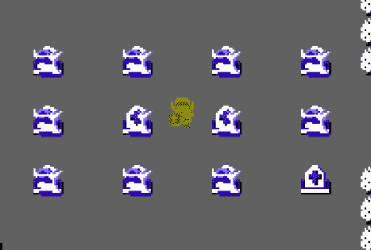](https://res.cloudinary.com/practicaldev/image/fetch/s--Ng39BkQs--/c_limit%2Cf_auto%2Cfl_progressive%2Cq_auto%2Cw_880/https://trello-attachments.s3.amazonaws.com/5b74b9cba4c5e76a79ed93c5/5cb6560482f83b45c11ed36e/5b1f37004f59ee9b6091eb0fc3454659/image.png)

#### 猞猁

如果你玩过《塞尔达荒野之息》,你可能会记得那个巨大的马狮敌人，嗯，这是他们第一次出现的真实游戏。

*   他们似乎是同样的敌人行为，就像八爪怪和莫伯林一样。
*   他们更健康。
*   当它停止移动时攻击的几率很高
*   只有魔法盾才能阻挡剑的投射
*   他们的炮弹命中更多。
*   很难找到链接

#### 左拉或仿植物怪兽佐拉

*   从一个(显然)随机的水瓷砖中产生。
*   它直接向林克发射炮弹。仿植物怪兽佐拉位置和林克位置之间的简单角度。
*   投射物有动画
*   会不会是它错过的那些投射物，是对他要去哪里的预测？

[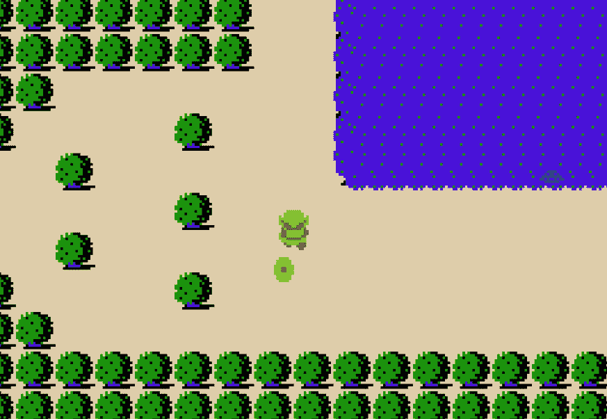](https://res.cloudinary.com/practicaldev/image/fetch/s--VuH40mHp--/c_limit%2Cf_auto%2Cfl_progressive%2Cq_66%2Cw_880/https://trello-attachments.s3.amazonaws.com/5b74b9cba4c5e76a79ed93c5/5cb6560482f83b45c11ed36e/64972623ec4f5e2d3808501b9f07db8b/FpdNHXiUTY.gif)

#### 岩石

虽然他们不是敌人，因为他们不能被打败，但我们会把他们放在超负荷敌人的最末端，因为他们是需要被编程的实体。

*   他们似乎出现在 X =随机，Y=0。
*   他们做对角线运动。
*   总是在寻找联系
*   他们似乎每次行动都会改变方向。(1 次对角移动)

### 地牢/地下敌人

这些敌人只出现在特定的地下城中，而不会出现在过界世界中。

#### Zol 和凝胶

*   他们的工作方式似乎与许多具有“漫游”行为的敌人相似。
    *   就像奥克托洛克斯，莫伯林斯，Lynels
*   当你杀死一只 Zol 的时候，会产生 2 只凝胶。
    *   用“强力武器”杀死一只 Zol 不会产生任何东西。
*   凝胶不能掉任何东西，杀死它们是没用的。

#### 绳索

*   他们慢慢地漫游
*   如果把它链接在他们的 X 或 Y 坐标上，他们就会向他收费。
    *   直到它们撞到墙上

#### [基西](#keese)

*   非常类似于皮帽子的行为
*   他们加速并转圈
*   过了一会儿，他们停下来
*   随时都可能被击中
*   加速的 2 帧动画

#### 转

*   似乎有之前描述过的流浪行为。
*   它们只有在水平移动时才会跳跃
*   如果你用弱武器打败他们，他们会繁殖基佬
*   他们不能跨越障碍

#### 斯塔尔福斯

*   简单的游荡行为。如前所述
*   镜像行走动画
*   仅损坏有碰撞的链接

#### 壁主

*   这些敌人似乎只出现在地图的边缘。顾名思义，它们来自墙壁。
*   当它们产卵并移动到当前位置时，它们似乎会存储当前链接的位置。他们不是一直在追他。他们有一个编程的路径
    *   需要对该运动进行编程
*   当与林克相撞时，他将受到伤害，然后它将被运送到地牢的入口。

#### 戈里亚

*   类似于许多其他的，有一个简单的漫游模式。
*   他们发射的不是箭或其他已知的射弹，而是`Boomerang`
    *   像其他敌人一样，他们在发射炮弹前停下来

#### 巫师

##### 橘黄色长袍

*   一段时间后，这些将出现在相同的 X 或 Y 坐标比链接。
    *   如果有两个橙色，很有可能一个在 X 处，另一个在 y 处。
    *   有可能都在 X 轴上，或者都在 y 轴上。
*   他们有一个小无敌的时间差距。
    *   之后你可以伤害他们
*   出现后，他们会射出一发炮弹

##### 蓝色巫师袍

*   这些都是像其他敌人一样漫游，不是很积极地寻找链接。
    *   但后来他们决定“扭曲”到另一个地方。
        *   在此期间，他们是不可战胜的。
        *   这种扭曲可以帮助他们忽略障碍，因为他们可以直接通过它们。
*   如果他们匹配链接的 X 或 Y 坐标，他们将发射射弹。

#### 乌梅

*   类似于前面提到的漫游行为。
*   蓝色黑坚果更有益健康。
*   你只能用你的剑击中黑暗坚果，如果你击中他们的侧面或背面，而不是前面。盾牌阻挡你的攻击。
*   炸弹非常有用，不管从哪边都可以击中。
*   他们就像敌人，想要让你觉得他们是不可阻挡的。
*   他们似乎没有击倒对手。真的可以用我的游戏来证实，因为我已经得到了最强的剑。
*   只是提醒一下，大多数敌人只有 2 帧动画。

#### Pols Voice

*   带有额外行为的漫游。
    *   他们可以水平跳跃
    *   他们可以垂直跳跃
    *   这些跳跃可以跳过障碍。他们一找到就会跳起来。
    *   他们跳过两块瓷砖。
    *   如果它们跳到另一个障碍物上，它们会再跳一次，如此类推。
*   需要大量的打击才能打败。
*   对炸弹免疫
*   箭矢可以一举击败他们
*   他们打得很重。

[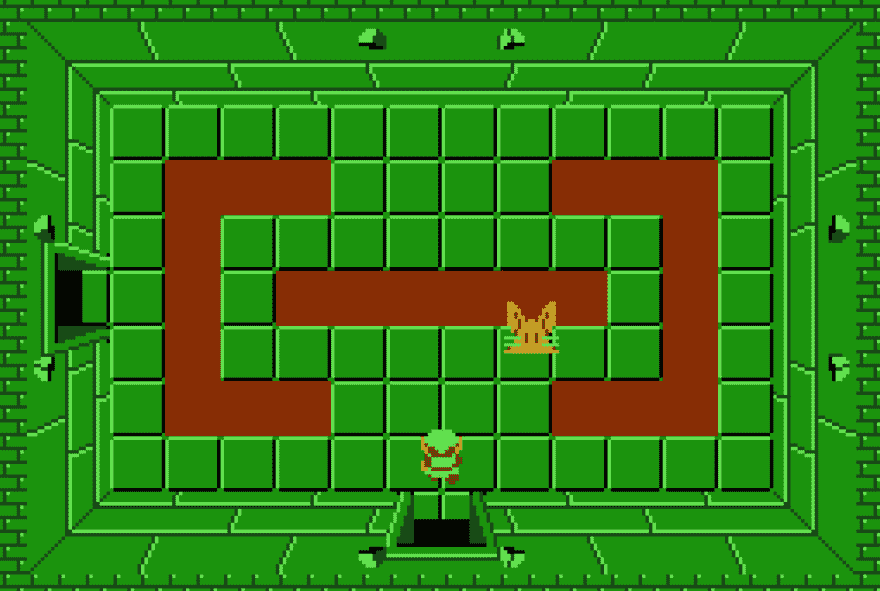](https://res.cloudinary.com/practicaldev/image/fetch/s--dKZ0SeFq--/c_limit%2Cf_auto%2Cfl_progressive%2Cq_66%2Cw_880/https://trello-attachments.s3.amazonaws.com/5b74b9cba4c5e76a79ed93c5/5cb6560482f83b45c11ed36e/8d831ff410875ab3b6aab2904c0f0a82/VY740XHXTQ.gif)

#### 兰莫拉

*   蠕虫似乎遵循前面提到的漫游算法
*   蓝色的非常非常快
*   当它们移动时，它们附着的身体部分会跟着头部移动。显然他们有 4 个部分和头部。
    *   这给人一种复杂运动的错觉。
*   当你打它们的时候，它们的身体部分被破坏了。
    *   一旦他们都被摧毁，头部将继续移动，所以你只需击败头部，以彻底击败他们。
*   他们似乎没有任何类型的击倒或摇晃。即使你打中了，它们也会继续移动。

#### 喜欢喜欢

*   简单的漫游行为。
*   当他们与林克相撞时，他们会吃掉他。
    *   当林克在里面时，林克不能移动。
    *   你可以在他们体内使用你的剑，你可以用这种方式打败他们。
    *   如果林克有魔法护盾(护盾吕。2)这个敌人会把它吃掉，你得去弄个新的。
        *   这不是立竿见影的，但需要一点时间让他们吃下去。
    *   据我所知，林克在这个敌人体内对其他伤害免疫。
    *   你可以打其他敌人，即使你在里面，剑碰撞继续工作，你也可以使用你的宝藏。

#### 吉布多

*   他们似乎是一个复制粘贴的斯塔尔福斯。
*   比斯塔尔福斯更健康，所以你可以说这些是“蓝色斯塔尔福斯”。

#### 弹簧

*   一个蠕虫敌人，非常非常类似兰莫拉。
*   这个敌人可以对角移动。最大的区别
    *   而且没那么快，更容易躲避。
*   它不会错开或有反冲。
*   部分跟随头部，你只能通过跟随它们的运动来知道哪个部分是头部。带头的那个。

#### 气泡

*   我认为这些敌人更像是障碍。
*   你无法打败他们。
*   如果你和他们发生冲突，他们会“诅咒”你。
    *   这是，林克不能用他的剑。
*   中速漫游行为。
    *   似乎喜欢和什么东西碰撞来改变方向。
    *   不需要碰撞来改变方向。
*   它们不会造成任何伤害。
    *   林克有一个热门动画，你可以利用这段时间让自己在动画持续期间战无不胜。

#### 陷阱

*   等待链接的障碍
*   他们成双成对来。
*   3 个州
    *   空闲状态。完全不动。
        *   当他们匹配链接的 X 或 Y 坐标时，他们将向那个位置冲锋，进入攻击状态。
    *   攻击状态。
        *   当它们与另一个陷阱发生碰撞时，它们会进入“返回状态”。
    *   返回状态
        *   慢慢回到原来的位置。
        *   在此期间，他们不会在 Link 收费。
        *   当回到原始位置时，它们将进入空闲状态。

#### Patra

*   被认为是迷你 boss。
*   一个有 8 只小帕特拉围着他旋转的敌人。
*   这段时间是无敌的。
*   蓝色帕特拉移动非常缓慢。
*   它会飞，所以它忽略碰撞。
*   你必须击败 8 个部分才能攻击蓝色帕特拉。
*   他们有一个圆形的行为。
    *   它可以改变绕着蓝色 patra 旋转的半径。
*   它不会摇晃/向后倒。

[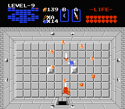](https://res.cloudinary.com/practicaldev/image/fetch/s--9ldgeqfl--/c_limit%2Cf_auto%2Cfl_progressive%2Cq_auto%2Cw_880/https://trello-attachments.s3.amazonaws.com/5b74b9cba4c5e76a79ed93c5/5cb6560482f83b45c11ed36e/58606e8d3f6c219f05e1d3d0ae0385bf/image.png)

* * *

## 大佬

*   当在房间的特定位置被击败时，老板会掉落一个心形容器。
*   老板也可以扔掉卢比和其他物品。

#### Aquamentus

*   移动非常缓慢。
*   仅水平移动
    *   仅在 3 个区域内移动
        *   这是，从中间往右。
        *   从右到左或中间。诸如此类。
*   只能打头部。
*   当被击中时，它会闪烁成橙色。
*   在我看来，身体和头部是分开的动画。
*   发射 3 发炮弹的时间间隔。
    *   这些似乎存储了 Link 的当前位置。
    *   在它们被发射到一个可预测位置后，林克可以避开它们。
    *   这些抛射体在一定距离后改变动画。

[https://www.youtube.com/embed/EQGtv4DcrV4](https://www.youtube.com/embed/EQGtv4DcrV4)

#### Dodongo

*   这个老板似乎有一个简单的敌人移动行为。
*   简单的漫游。
*   只有让它吃炸弹才能打败它。
*   吃了炸弹后，它会有一个“受伤”的动画。精灵变成了从内部爆炸的身体。
*   需要两颗炸弹才能打败它。
    *   它在第一次撞击后继续行走。
    *   失败时闪烁。
*   免疫所有伤害，除了炸弹。

#### 男子手办

*   大敌。
*   由 5 部分组成。
    *   中心和 4 个基本方向。基本方向是钳子。
    *   钳子有自己的闲置动画。
*   只能打钳子。
*   当你摧毁了 4 个钳子，你就打败了它。
*   每次你摧毁一个钳子，它就会移动得更快。
*   每只钳子都能射出一发炮弹。它的速度很快，它拍摄到链接的当前位置。
    *   没有反馈知道什么时候拍。
*   我很想把它描述成乒乓球运动。但并不总是这样，看起来像是乒乓球/弹跳和其他敌人漫游行为的结合。
    *   事实上，这个敌人非常大，由各种零件组成，而且每次你摧毁一个钳子，它都移动得很快，这让你认为它可能有一个非常不同的移动算法。
    *   我看到的最大区别是，当它碰撞墙壁时会“反弹”。

[https://www.youtube.com/embed/PXsIK2G5e9g](https://www.youtube.com/embed/PXsIK2G5e9g)

#### [T1】glee ok](#gleeok)

*   就像 Aquamentus 是“水平”战斗一样，Gleeok 的战斗是垂直战斗，它在垂直方向上具有优势。
*   由 2 或 3 个头和它的身体组成。
    *   身体不动。
    *   只有头/脖子会动。
*   要打败他，你必须打败他们的头。
    *   当你击败一个头，它会分离出来，并拥有自己的红色精灵。
    *   分离的头部看起来像是被粗暴地移动过。
    *   分离的头部可以发射射弹
    *   超脱的头颅所向披靡。你必须打败每一个附属的头。
*   附加/未被击败的头部沿对角线移动(几乎是脖子在移动)。然而，它们似乎也是由颈部的小部分组成的，颈部似乎跟随着头部。
    *   这些头也发射射弹。

[https://www.youtube.com/embed/PIY1KTHvvq4](https://www.youtube.com/embed/PIY1KTHvvq4)

#### 迪戈格尔

*   不可战胜的敌人。
    *   除非你演奏录音机
    *   当录音机播放时，大 Digdogger 将被销毁。
        *   然后，它将产生多达 3 个迷你 Digdoggers。
        *   迷你挖掘机稍微快一点。
        *   它们似乎有着和大家伙一样的运动行为。
        *   显然，当你击中它们时，它们会加快速度。
        *   不能东倒西歪或有任何击倒。
*   这只大 Digdogger 移动得非常慢。
*   似乎有简单的对角线移动的漫游行为。
*   它在飞，所以忽略了碰撞。

#### [戈马](#gohma)

*   水平和垂直移动。
*   似乎在躲避碰撞，它尽量不去碰碰撞，甚至在撞上什么东西之前就改变方向。
*   不能斜着走。
*   无敌于一切。
*   它闭着眼睛，但过一会儿，它会睁开眼睛。
*   当眼睛睁开时，你可以射出一箭来伤害它，并能够击败它。
*   发射射弹。
    *   从两个地方，他们的腿。左右腿。
    *   不是从眼睛射出的。

[https://www.youtube.com/embed/ToPv5nE-p1s](https://www.youtube.com/embed/ToPv5nE-p1s)

#### 加农

*   非常骗子。感觉很廉价，也因为这样，很辛苦。
*   加农由四块瓷砖组成。
*   一直看不见。
*   它有 V 型或 U 型。
*   它在地图上有一定的“出现”点。但它仍然是不可战胜的。
*   玩家必须“猜测”加农会出现在哪里。
*   加农打得疯狂。如果玩家在它“出现”的地方与加农相撞，它就会击中玩家。这是，不仅仅是加农的射弹可以伤害林克。
*   当被击中时，它的伤害精灵会出现，反馈给玩家，然后它又消失了。
*   据我所知，它从最后一次出现的位置射出一枚炮弹。
*   喝了很多次后，加农会换成橙色/棕色的雪碧。
    *   这意味着当这个橙色/棕色的加农出现时，你终于可以打败他了。
    *   你只用一支银箭就打败了他。
    *   如果你不用箭射它，它会回到它通常的行为。玩家必须再次击中它，使橙色/棕色精灵出现，并尝试射箭。
    *   一旦被打败...
        *   会触发死亡动画。
        *   它将产生一个三力碎片，大概是力量的三力。
        *   它会产生他的残余，一种红色的粉末/灰烬。
        *   当抓取 triforce 时，它会播放一段 flash 动画，反馈你拿到了，你终于可以进行下一个房间了。

[https://www.youtube.com/embed/O33Xybjegtc](https://www.youtube.com/embed/O33Xybjegtc)

* * *

## 结束

目前这就是我要掩盖的。总而言之，我们看到了。

*   游戏屏幕
    *   菜单
*   碰撞
    *   玩家使用，宝物和敌人。
*   运动员的运动
*   物品/珍宝
*   敌人

我们分析了他们如何在内部工作。我只想提醒你这里有多少东西被回收了。

*   许多敌人的行为是相似的。
    *   一些在不同的移动速度上不同
    *   不同的健康
    *   它们造成不同的伤害
    *   他们都有相同的死亡动画
    *   有些可以对角移动
    *   有些可以忽略碰撞(飞行)
*   每个实体都使用基本的碰撞检测。
*   许多项目，如弹丸，使用回收代码。
    *   玩家和敌人都可以使用投射物。

我希望这不只是对我有用，因为这份文件是为我正在做的 R&D 工作制作的。但也可能对其他人有用。

~非常感谢，这是我，亚历克斯，带着另一份游戏设计的文件/文章。😊