# 如何使用云构建将 webapp 部署到 Google Cloud Run

> 原文：<https://dev.to/carlosazaustre/how-to-deploy-a-webapp-to-google-cloud-run-with-cloud-build-4eel>

这篇文章最初是在我的博客上用[西班牙语发表的。](https://carlosazaustre.es/google-cloud-run/)

在刚刚过去的 Cloud Next 事件中，Google 公布了其服务的新产品: [Cloud Run](https://cloud.google.com/run/) 。这是 App Engine 的一个发展，它让我们可以在 Docker 容器上运行任何后端语言。

在本文中，我将描述如何从这个服务开始，并使用它运行您的第一个 Node.js 应用程序。我们走吧！

## 在 Google Cloud 上创建项目。

进入[谷歌云控制台](https://console.cloud.google.com/)，创建一个新项目。我被命名为`hello-cloud-run`但是你可以随意命名。请记住我们稍后将使用的`ProjectID`。

[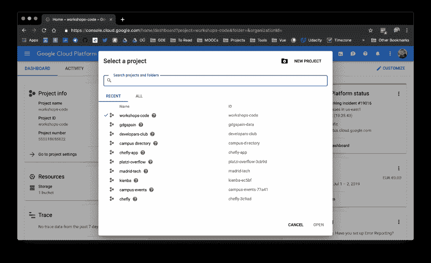](https://res.cloudinary.com/practicaldev/image/fetch/s--crojx7ft--/c_limit%2Cf_auto%2Cfl_progressive%2Cq_auto%2Cw_880/https://carlosazaustre.es/conteimg/2019/07/Screenshot-2019-07-02-at-21.02.43.png)

[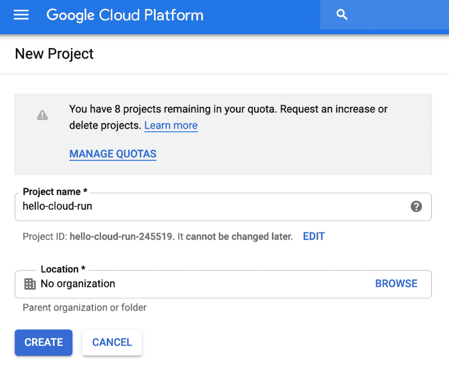](https://res.cloudinary.com/practicaldev/image/fetch/s--v_iXxy-W--/c_limit%2Cf_auto%2Cfl_progressive%2Cq_auto%2Cw_880/https://carlosazaustre.es/conteimg/2019/07/Screenshot-2019-07-02-at-21.03.12.png)

[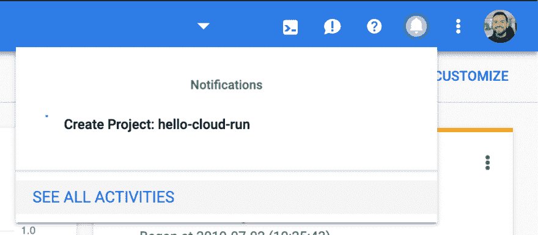](https://res.cloudinary.com/practicaldev/image/fetch/s--kJsOuNUp--/c_limit%2Cf_auto%2Cfl_progressive%2Cq_auto%2Cw_880/https://carlosazaustre.es/conteimg/2019/07/Screenshot-2019-07-02-at-21.03.25.png)

[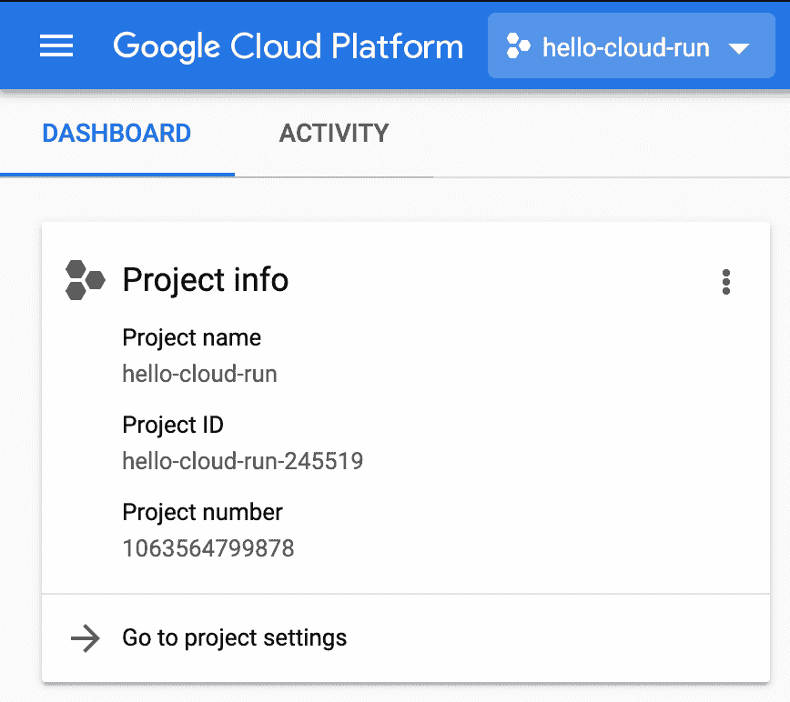](https://res.cloudinary.com/practicaldev/image/fetch/s--T3p9BoRL--/c_limit%2Cf_auto%2Cfl_progressive%2Cq_auto%2Cw_880/https://carlosazaustre.es/conteimg/2019/07/Screenshot-2019-07-02-at-21.03.51.png)

> 要使用谷歌云平台，您需要一个 Gmail/GSuite 帐户，并激活计费。如果这是你第一次注册，你有 300 美元的免费信用点数可以使用一年。

## API 激活

我们需要激活一些 API 来解决问题。一个是云运行 API，另一个是云构建 API，我们稍后会用到。

[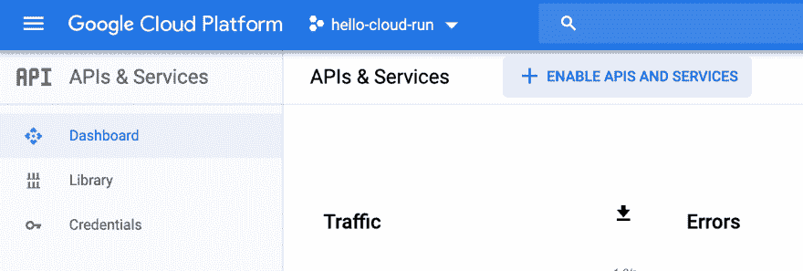](https://res.cloudinary.com/practicaldev/image/fetch/s--3SZ4XbbN--/c_limit%2Cf_auto%2Cfl_progressive%2Cq_auto%2Cw_880/https://carlosazaustre.es/conteimg/2019/07/Screenshot-2019-07-02-at-21.05.19.png)

点击启用 API 和服务，并查找云运行
[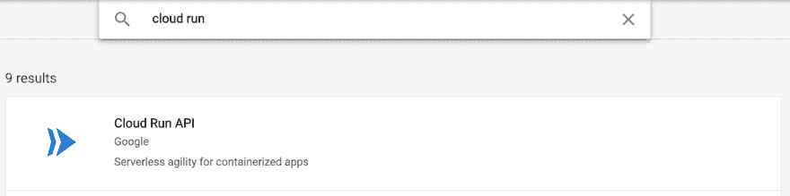](https://res.cloudinary.com/practicaldev/image/fetch/s--l4CBmED2--/c_limit%2Cf_auto%2Cfl_progressive%2Cq_auto%2Cw_880/https://carlosazaustre.es/conteimg/2019/07/Screenshot-2019-07-02-at-21.05.50.png)

激活云运行 API，对云构建 API
[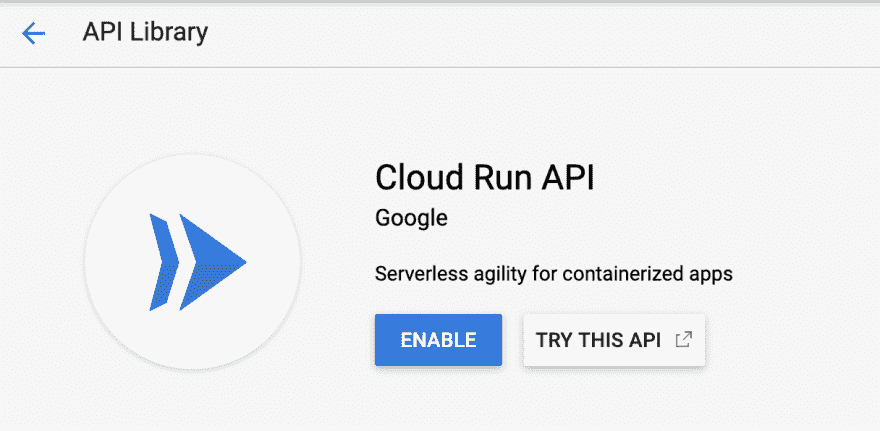](https://res.cloudinary.com/practicaldev/image/fetch/s--I_NcM1Sc--/c_limit%2Cf_auto%2Cfl_progressive%2Cq_auto%2Cw_880/https://carlosazaustre.es/conteimg/2019/07/Screenshot-2019-07-02-at-21.05.58.png) 进行同样的操作

[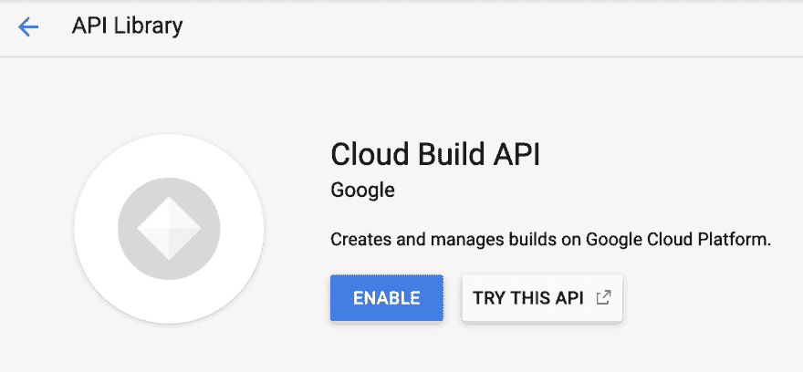](https://res.cloudinary.com/practicaldev/image/fetch/s---4-vk94X--/c_limit%2Cf_auto%2Cfl_progressive%2Cq_auto%2Cw_880/https://carlosazaustre.es/conteimg/2019/07/Screenshot-2019-07-02-at-21.34.05.png)

## 我们的 App 代码

我创建了这个示例代码。这是一个 Node.js 应用程序，它在根路径中返回一个带有两个属性的 JSON 对象:今天的日期和应用程序运行的时间。

用下面的命令创建一个节点项目(记得安装 Node.js】

```
$ npm init -y 
```

<svg width="20px" height="20px" viewBox="0 0 24 24" class="highlight-action crayons-icon highlight-action--fullscreen-on"><title>Enter fullscreen mode</title></svg> <svg width="20px" height="20px" viewBox="0 0 24 24" class="highlight-action crayons-icon highlight-action--fullscreen-off"><title>Exit fullscreen mode</title></svg>

然后，安装`express`作为依赖:

```
$ npm i express 
```

<svg width="20px" height="20px" viewBox="0 0 24 24" class="highlight-action crayons-icon highlight-action--fullscreen-on"><title>Enter fullscreen mode</title></svg> <svg width="20px" height="20px" viewBox="0 0 24 24" class="highlight-action crayons-icon highlight-action--fullscreen-off"><title>Exit fullscreen mode</title></svg>

用以下内容创建一个`index.js`文件:

```
const express = require('express');
const app = express();
const port = process.env.PORT || 3000;

const dateStart = Date.now();

app.get('/', (req, res) => {
  const today = new Date();

  res.json({
    date: today,
    up: `${(Date.now() - dateStart) / 1000} seg.` 
  });
});

app.listen(port, () => {
  console.log(`Server running on port: ${port}`);
  console.log('Press CTRL + C to quit');
}) 
```

<svg width="20px" height="20px" viewBox="0 0 24 24" class="highlight-action crayons-icon highlight-action--fullscreen-on"><title>Enter fullscreen mode</title></svg> <svg width="20px" height="20px" viewBox="0 0 24 24" class="highlight-action crayons-icon highlight-action--fullscreen-off"><title>Exit fullscreen mode</title></svg>

让我们更新`package.json`文件来添加`start`脚本:

```
...
"scripts": {
   "start": "NODE_ENV=production node index.js"
  },
... 
```

<svg width="20px" height="20px" viewBox="0 0 24 24" class="highlight-action crayons-icon highlight-action--fullscreen-on"><title>Enter fullscreen mode</title></svg> <svg width="20px" height="20px" viewBox="0 0 24 24" class="highlight-action crayons-icon highlight-action--fullscreen-off"><title>Exit fullscreen mode</title></svg>

这样，当我们执行`npm start`命令时，应用程序就会运行。我们可以在本地测试。

下一步是创建`Dockerfile`，用它我们定义包含应用程序代码的容器。这里有内容:

```
FROM node:10

WORKDIR /usr/src/app

ENV PORT 8080
ENV HOST 0.0.0.0

COPY package*.json ./

RUN npm install --only=production

# Copy the local code to the container
COPY . .

# Start the service
CMD npm start 
```

<svg width="20px" height="20px" viewBox="0 0 24 24" class="highlight-action crayons-icon highlight-action--fullscreen-on"><title>Enter fullscreen mode</title></svg> <svg width="20px" height="20px" viewBox="0 0 24 24" class="highlight-action crayons-icon highlight-action--fullscreen-off"><title>Exit fullscreen mode</title></svg>

使用这个文件，我们将配置一个以`Node v10`为基础的环境，工作目录将是`/usr/src/app`。我们将`PORT: 8080`和`HOST: 0.0.0.0`定义为环境变量。我们正在将`package.json`和`package-lock.json`复制到工作目录，并安装与`RUN npm install --only=production`的依赖关系。
最后，我们使用`COPY . .`将应用程序代码移动到容器工作目录，最后一个`CMD npm start`将运行应用程序。

如果到目前为止一切正常，我们可以尝试生成图像并启动 docker 容器。在您的终端上写下以下命令:

```
$ docker build --tag hello-cloud-run:01 .
$ docker run -p 8080:8080 hello-cloud-run:01 
```

<svg width="20px" height="20px" viewBox="0 0 24 24" class="highlight-action crayons-icon highlight-action--fullscreen-on"><title>Enter fullscreen mode</title></svg> <svg width="20px" height="20px" viewBox="0 0 24 24" class="highlight-action crayons-icon highlight-action--fullscreen-off"><title>Exit fullscreen mode</title></svg>

> 请记住，您需要在系统上安装 Docker。

`build`命令你已经按照`Dockerfile`步骤创建了一个名为`hello-cloud-run:01`的图像。`run`命令让你在`http://localhost:8080`上运行应用程序

如果一切正常，您应该会在浏览器上看到以下内容:
[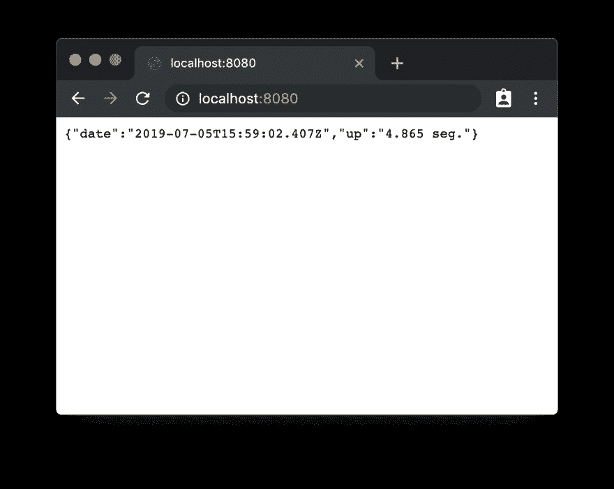](https://res.cloudinary.com/practicaldev/image/fetch/s--r2z7iBIq--/c_limit%2Cf_auto%2Cfl_progressive%2Cq_auto%2Cw_880/https://carlosazaustre.es/conteimg/2019/07/Screenshot-2019-07-05-at-17.59.45.png)

## 自动化容器部署

一旦我们的项目在 Google Cloud 上配置完成，应用程序代码编写完成并被容器化，接下来的步骤就是将它上传到 Google 容器注册中心。

我们将创建一个 YAML 文件，其中包含使用 Google Cloud Build 构建和部署代码的步骤。这项服务类似于 TravisCI，但针对谷歌云进行了定制。

这样，每次我们把代码推送到 Github(比如)Cloud Build 就会构建 Docker 镜像，把新代码上传到 Cloud Container Registry，部署到 Cloud Run。太牛逼了！

首先，我们需要创建一个云构建触发器:

[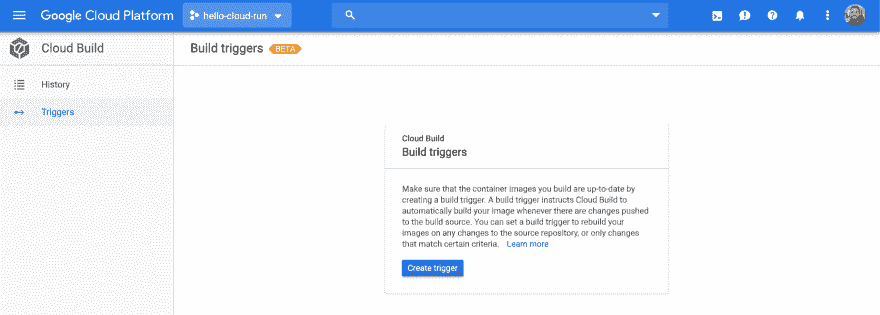](https://res.cloudinary.com/practicaldev/image/fetch/s--SFZb1kU_--/c_limit%2Cf_auto%2Cfl_progressive%2Cq_auto%2Cw_880/https://carlosazaustre.es/conteimg/2019/07/Screenshot-2019-07-02-at-22.57.51.png)

创建完成后，我们选择 Github 作为源代码库选项

[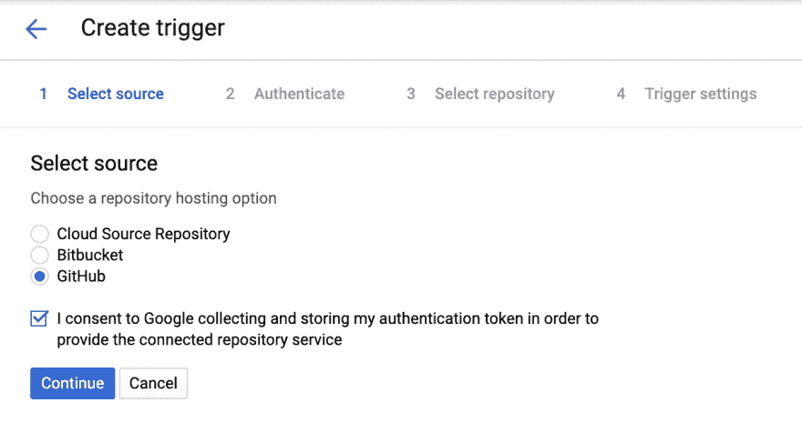](https://res.cloudinary.com/practicaldev/image/fetch/s--MaXCXcer--/c_limit%2Cf_auto%2Cfl_progressive%2Cq_auto%2Cw_880/https://carlosazaustre.es/conteimg/2019/07/Screenshot-2019-07-02-at-22.58.02.png)

我们需要对选择的服务(在本例中是 Github)进行认证，并选择存储库。

> 您需要在上面存储应用程序代码。如果你更喜欢其他选项，如 Bitbucket 或 Cloud Source，请继续。
> 
> 您可以使用[这个库](https://dev.tocreating%20a%20fork%20on%20your%20account)作为基础项目。

[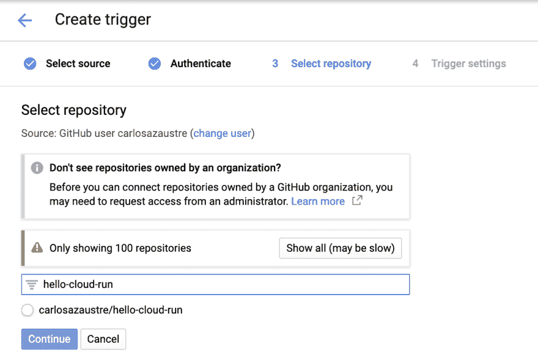](https://res.cloudinary.com/practicaldev/image/fetch/s--sAjwqQZc--/c_limit%2Cf_auto%2Cfl_progressive%2Cq_auto%2Cw_880/https://carlosazaustre.es/conteimg/2019/07/Screenshot-2019-07-02-at-22.58.40.png)

在 settings 上，选择云构建配置文件(yaml 或 json)作为构建配置，放置我们稍后编写的名称`cloudbuild.yaml`。

[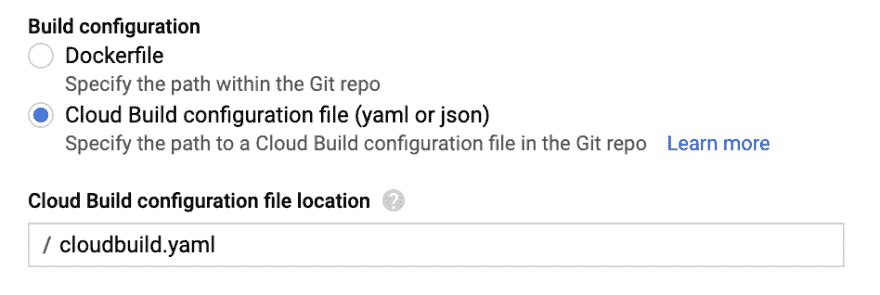](https://res.cloudinary.com/practicaldev/image/fetch/s--vwBxW-3n--/c_limit%2Cf_auto%2Cfl_progressive%2Cq_auto%2Cw_880/https://carlosazaustre.es/conteimg/2019/07/Screenshot-2019-07-02-at-23.30.39.png)

好吧！在选项上，您可以选择是否要在每次推送至特定分支回购或带有标签时调度触发器。

[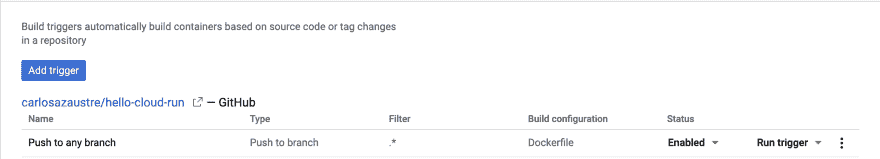](https://res.cloudinary.com/practicaldev/image/fetch/s--oXDj9eBX--/c_limit%2Cf_auto%2Cfl_progressive%2Cq_auto%2Cw_880/https://carlosazaustre.es/conteimg/2019/07/Screenshot-2019-07-02-at-22.59.41.png)

## 添加角色和权限

一旦您激活了[云运行 API](https://console.cloud.google.com/apis/library/run.googleapis.com?_ga=2.191926124.-772456817.1555320972) ，我们需要按照下面的步骤从外部访问我们的应用程序。

1.  向云构建服务帐户授予*云运行管理员*角色

    1.  从云控制台，访问 [IAM 菜单](https://console.cloud.google.com/iam-admin/iam/project?_ga=2.217088720.-772456817.1555320972)
    2.  在成员列表中，找到并选择`[PROJECT_NUMBER]@cloudbuild.gserviceaccount.com`
    3.  点击*编辑*按钮(铅笔图标)批准新角色。
    4.  点击*添加另一个角色*
    5.  选择*云运行*，然后选择*云运行管理*
    6.  点击*保存*
2.  授予 *IAM 服务帐户用户*从[云运行时服务帐户](https://cloud.google.com/run/docs/securing/service-identity#runtime_service_account)到云构建服务帐户的权限

    1.  从谷歌云控制台，访问[服务账户](https://cloud.google.com/run/docs/securing/service-identity#runtime_service_account)
    2.  在成员列表中，找到并选择`[PROJECT_NUMBER]-compute@developer.gserviceaccount.com`
    3.  点击右上角的*显示信息面板*。
    4.  在*权限*面板上，点击*添加成员*按钮。
    5.  在*新成员*新领域介绍云构建服务账号`[PROJECT_NUMBER]@cloudbuild.gserviceaccount.com`。
    6.  在*角色*下拉菜单中，选择*服务账户*，然后选择*服务账户用户*。
    7.  点击*保存*。

现在，在我们的代码中，我们将创建`cloudbuild.yaml`文件，该文件执行必要的命令来构建 docker 映像，将其上传到容器注册表并部署到云运行:

```
steps:
  # build the container image
- name: 'gcr.io/cloud-builders/docker'
  args: ['build', '-t', 'gcr.io/$PROJECT_ID/hello-cloud-run:${SHORT_SHA}', '.']
  # push the container image to Container Registry
- name: 'gcr.io/cloud-builders/docker'
  args: ['push', 'gcr.io/$PROJECT_ID/hello-cloud-run']
  # deploy container image to Cloud Run
- name: 'gcr.io/cloud-builders/gcloud'
  args: ['beta', 'run', 'deploy', 'hello-cloud-run', '--image', 'gcr.io/$PROJECT_ID/hello-cloud-run:${SHORT_SHA}', '--region', 'us-central1', '--allow-unauthenticated']
  env:
  - 'PORT=8080'
images:
- gcr.io/$PROJECT_ID/hello-cloud-run 
```

<svg width="20px" height="20px" viewBox="0 0 24 24" class="highlight-action crayons-icon highlight-action--fullscreen-on"><title>Enter fullscreen mode</title></svg> <svg width="20px" height="20px" viewBox="0 0 24 24" class="highlight-action crayons-icon highlight-action--fullscreen-off"><title>Exit fullscreen mode</title></svg>

请记住,`<PROJECT_ID>`是您的项目标识符。

## 检查所有正在工作的

所以现在，我们将把我们的应用程序代码部署到一个存储库中，在我的例子中，我选择了 Github。(在这个例子中，这是我的[回购](https://github.com/carlosazaustre/hello-cloud-run))。当我们做出更改并将它推送到`master`分支时，将触发构建配置，它将按照所有步骤将其上传到容器注册表，然后部署到云运行！

当你对你的回购进行`push`时，在谷歌云控制台内部检查云构建是否触发了一个事件

[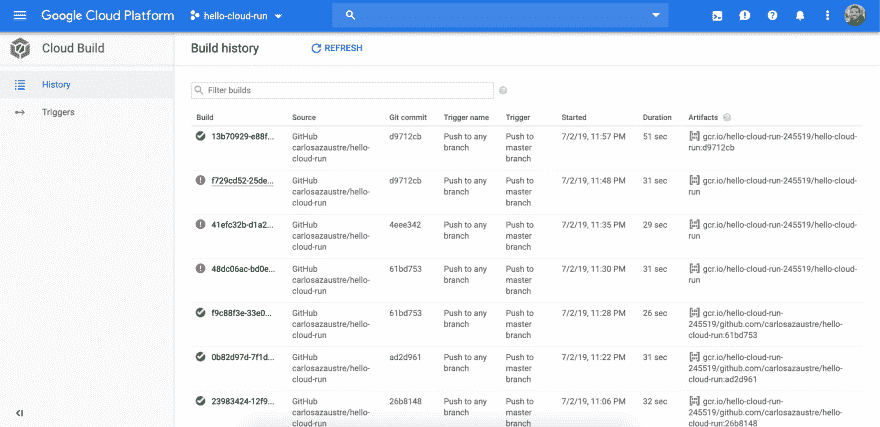](https://res.cloudinary.com/practicaldev/image/fetch/s--1dL1KGUA--/c_limit%2Cf_auto%2Cfl_progressive%2Cq_auto%2Cw_880/https://carlosazaustre.es/conteimg/2019/07/Screenshot-2019-07-05-at-18.17.00.png)

如果没问题，您可以转到容器注册表部分，检查 Docker 映像是否已经创建:

[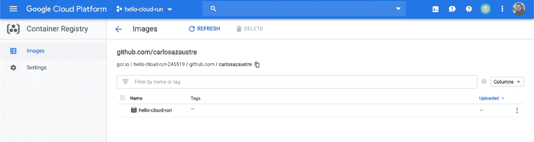](https://res.cloudinary.com/practicaldev/image/fetch/s--ebpfOha9--/c_limit%2Cf_auto%2Cfl_progressive%2Cq_auto%2Cw_880/https://carlosazaustre.es/conteimg/2019/07/Screenshot-2019-07-02-at-23.07.23.png)

最后，在“云运行”部分检查您是否有应用程序正在运行:

[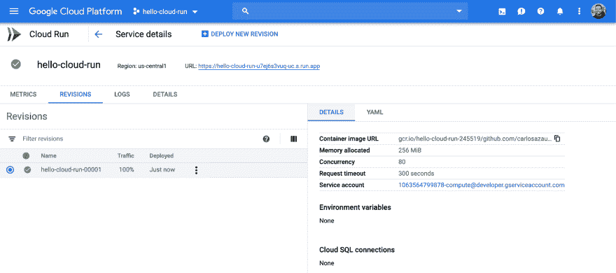](https://res.cloudinary.com/practicaldev/image/fetch/s--VXAIMwzI--/c_limit%2Cf_auto%2Cfl_progressive%2Cq_auto%2Cw_880/https://carlosazaustre.es/conteimg/2019/07/Screenshot-2019-07-02-at-23.18.36.png)

最后一件事是让外部调用服务，因为默认情况下是私有的。

将`allUsers`添加到新成员和`Cloud Run > Cloud Run Invoker`角色中。

[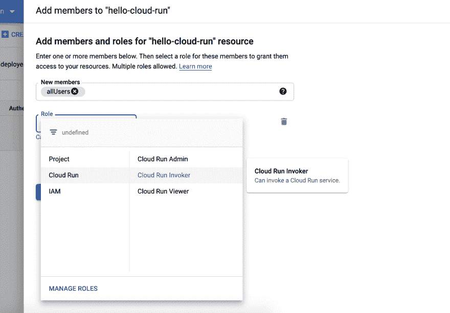](https://res.cloudinary.com/practicaldev/image/fetch/s--p5M_EGER--/c_limit%2Cf_auto%2Cfl_progressive%2Cq_auto%2Cw_880/https://carlosazaustre.es/conteimg/2019/07/Screenshot-2019-07-05-at-18.45.44.png)

你可以在的开发者中看到[这篇文章更详细的解释](https://dev.to/googlecloud/help-i-forgot-to-click-allow-unauthenticated-invocations-on-google-cloud-run-2hoj)

是的。你完成！单击与您的云运行部署相关联的 URL，如果一切正常，您可以在浏览器上看到与此类似的内容

[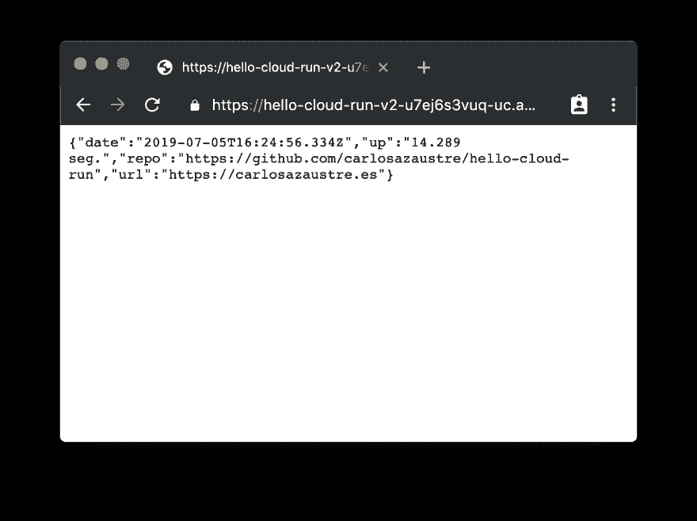](https://res.cloudinary.com/practicaldev/image/fetch/s--_uYsnAPF--/c_limit%2Cf_auto%2Cfl_progressive%2Cq_auto%2Cw_880/https://carlosazaustre.es/conteimg/2019/07/Screenshot-2019-07-05-at-18.25.03.png)

## 参考文献

*   [云运行文档](https://cloud.google.com/run/docs/)
*   [云构建文档](https://cloud.google.com/cloud-build/docs/configuring-builds/build-test-deploy-artifacts)