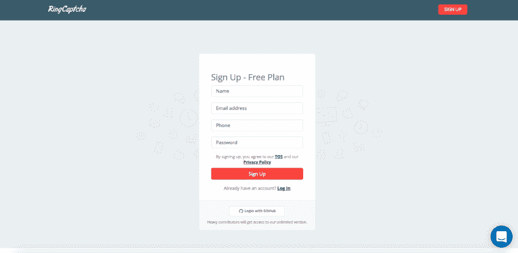
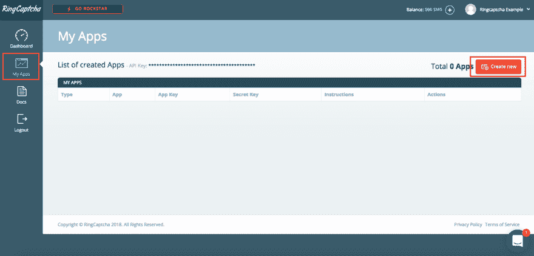
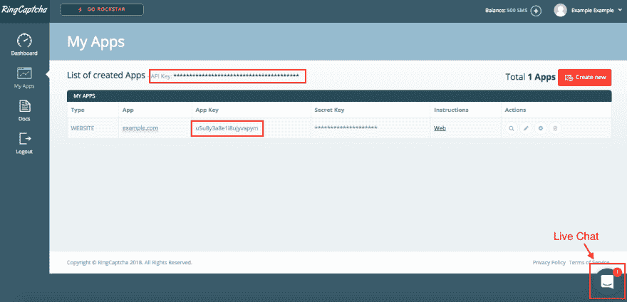
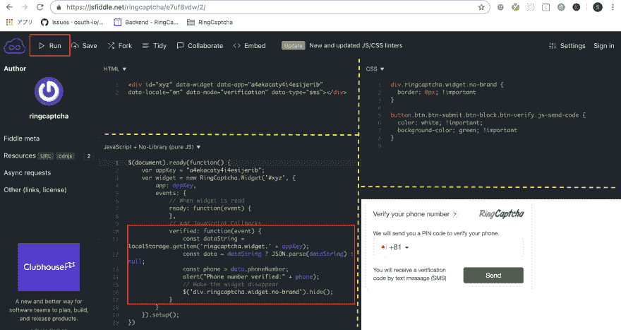

# 10 分钟内在您的网站上免费电话短信验证

> 原文：<https://dev.to/neth_6/free-phone-sms-verification-on-your-website-in-10-minutes-1558>

# 手机短信验证概述

电话短信验证有两个用途:

*   它通过验证用户的电话号码来减少虚假注册，而不仅仅是电子邮件，电子邮件在注册时很容易被复制
*   它确保注册的用户可以通过语音或短信及时地进行交流

这两个特征对于建立基于值得信赖的用户基础和及时沟通的业务至关重要，特别是电子商务、在线预订、fintech(小额融资、加密货币)和共享经济。

# 电话短信验证是如何进行的？

我们向手机发送一次性密码(OTP ),以便只有能够访问手机的用户才能调用 OTP 并在网站上输入它，以证明她拥有该手机。

# 如何免费发送短信 OTP？

短信必须通过电话基础设施传输，因此会产生费用，但一些公司 Ringcaptcha 和 Firebase 免费提供，但有一些小的限制。如果你不介意立即付款，你也可以看看 Twilio、MessageBird、Cequens、Infobip 和 Nexmo。

在免费选项中，Firebase 只有在它的 SDK 与 Firebase 编程框架紧密集成的情况下才能工作，而 Ringcaptcha 提供了一个 API，因此它可以与您正在使用的任何编程语言和框架一起工作。

Ringcaptcha 也是独一无二的，因为它是一个短信市场，所以他们可以通过 Twilio、MessageBird 等其他提供商发送短信。，使其可用性和可靠性更高，因为它在发送短信时有许多路由可供选择。

Ringcaptcha，会的。

# 短信验证实施概述

要在您的网站上获得短信验证:

1.  拨号音
2.  创建 Ringcaptcha 应用程序
3.  获取 Ringcaptcha 应用程序和 API 密钥
4.  测试 Ringcaptcha 应用程序和 API 密钥
5.  将代码复制并粘贴到您的网站上

## 注册 Ringcaptcha

前往[https://my.ringcaptcha.com/register](https://my.ringcaptcha.com/register?utm_source=dev-to&utm_medium=article&utm_campaign=sms-verification-in-10-mins)创建一个用户账户。不需要信用卡。

## 创建 Ringcaptcha 应用程序

登录后，点击左侧菜单中的“我的应用”,然后点击“我的应用”页面右上角的“新建”按钮。

在应用程序配置窗口中:

*   在“应用程序类型”下，选择“网络”
*   在“域”下，输入您稍后将粘贴 Ringcaptcha Javascript 小部件代码的域
*   仍然在“域”下，输入“fiddle.jshell.net”，这是一个现场编码网站，您将在这里测试您的 API 和应用程序密钥。测试后删除此内容。
*   点击窗口右下角的“创建应用程序”。

## 获取 Ringcaptcha 应用程序和 API 密钥

您将看到您新创建的应用程序。

获取应用列表顶部的 API 密钥。所有应用程序的 API 密钥都是相同的。

获取应用密钥，它位于每个应用的右侧。您可以创建不同的 Ringcaptcha 应用程序来代表每个需要短信验证的网站。

## 测试 Ringcaptcha 应用程序和 API 密钥

浏览一下现场代码网站，在那里你可以进行调整，并测试没有任何代码的手机短信验证:([https://jsfiddle.net/ringcaptcha/e7uf8vdw/2/](https://jsfiddle.net/ringcaptcha/e7uf8vdw/2/))

这包括 4 个部分:

左上:HTML
右上:CSS
左下:Javascript
右下:结果

在“结果”上，您应该会看到 Ringcaptcha 小部件

您可以修改任何 HTML、CSS、Javascript 部分，然后单击左上角的“运行”使您的修改生效。

**在你做任何事情**之前，在小工具上测试你的电话号码，以验证它可以工作。

尝试通过修改 CSS 部分来改变外观。将按钮的背景色改为“蓝色”,然后点击“运行”

类似地，尝试将 HTML 数据区域设置更改为“de”并点击“Run ”,以查看小部件语言更改为德语。

最后，在 Javascript 部分，您可以修改它来执行基于小部件生命周期“事件”的不同事情，例如“就绪”、“已验证”等。有关小部件生命周期“事件”的完整列表，请参见[本](https://my.ringcaptcha.com/docs/web#!#customizing-the-html-and-js-widget?utm_source=dev-to&utm_medium=article&utm_campaign=sms-verification-in-10-mins)。

现在，用您自己的 App Key 替换 Javascript 部分的“appKey ”,并测试小部件以确认它正在工作。

## 将代码复制并粘贴到你的网站上

剩下要做的就是将 HTML、CSS 和 Javascript 中的代码片段复制到您的网页上，这样您就实现了电话验证。

如果这对你不起作用，请留下评论，或者你也可以前往 Ringcaptcha 并在右下角的实时聊天中询问他们。