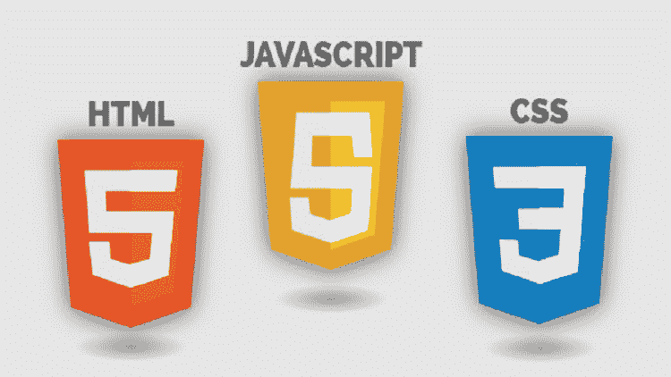
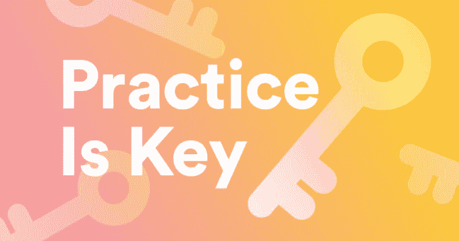

# 我的新职业之旅:学习和实践

> 原文：<https://dev.to/theryanfurrer/journey-to-my-new-career-learning-practicing-29dp>

在今天的日志中，我想分享我是如何学习和实践这些东西的，所以我可以说我真的学到了一些东西。

这是不是意味着我什么都不会忘记？当然不是！然而，我觉得这些技能并没有经常被教授或谈论。

## 我是如何学习的

*   [树屋](https://teamtreehouse.com/)
*   谷歌
*   实践
*   多练习
*   更多的练习

作为一名音乐家，我学到了大量的练习技巧。我们稍后会谈到一些，但是正如你在上面看到的，我喜欢做大量的练习。

树屋是我学习新事物的第一站，甚至在谷歌之前。我知道有一些免费的选择，比如免费代码营或 T2 代码学院，但我喜欢树屋提供的结构。我过去也尝试过使用 Codeacademy，但并不满意——即使是付费会员。

Treehouse 为我提供了一个地方，可以轻松地获得一些新的视频和工作空间。无论我花 30 分钟还是 6 个小时，我都能在树屋上有所成就。那么为什么结构对我如此重要呢？

因为我从来都不是一个好学生。我的意思是，我总是想从 A 跳到 Z，而不必学习字母表中的其他 24 个字母。跟随前端 Web 开发的轨迹让我保持在正确的轨道上，并且经历了整个字母表。

当我决定投入 110%的精力学习 Web 开发时，我告诉自己，在添加任何东西之前，我希望有尽可能坚实的基础。这意味着在添加 CSS 之前要先学好 HTML，然后在添加 JavaScript 之前要先学好 CSS。在添加一个库之前，我目前正在(努力)很好地学习 Vanilla JS——我将首先学习 React。

在过去的两个月里，我已经走过了上述轨道的一半以上。虽然赛道总共只有 56 个小时，但我已经花了很多时间在项目上，并实践了我所学到的东西。除了全职工作，维持关系，重新装修我的公寓等等。我的故事不是唯一的，我知道现在在这个领域工作的人比我有更少的时间去学习。这是我的旅程。

当我在工作的时候，我每次花在编码上的时间通常不会超过 10 分钟，尽管我很想把一整天都花在这上面。当我开始使用 flexbox 时，我会从头开始用 VS 代码创建一个新项目，不仅练习 HTML 方面的东西，还学习如何正确使用 flexbox。旁注——我仍然不是大师，但我比以前好多了。

* * *

### 谷歌

*“好的谷歌……”*
谷歌也是一个学习的好地方，然而，你需要对你所听的信息保持警惕。互联网是一个广阔的空间，在一个事物总是在变化的领域工作，确保你在查找和学习最新的和可信的资源变得格外重要。

我最喜欢寻找答案的地方有[堆栈溢出](https://stackoverflow.com/#)、 [CSS-Tricks](https://css-tricks.com/) ，当然还有 [DEV 社区](https://dev.to/)。

我还想对克里斯·肖恩的不和谐频道、 [#devslife](https://discord.gg/HctAeFh) 喊一声。那里的每个人都非常友好，很乐意帮忙。

虽然上述网站很棒，但你必须精通谷歌搜索，因为任何有经验的开发者都会告诉你他们经常谷歌 T2。

* * *

这让我开始练习。一位中提琴教练曾对我说:“熟能生巧。熟能生巧……”

这是莎拉·凯的 [*中的一段话，不管残骸是什么*](https://shopsarahkay.com/product/no-matter-the-wreckage-signed-book/) ，它在我生活的许多方面都是真实的。对我来说，演奏中提琴和编码有很多相似之处。不多说了，这里有 3 个我最喜欢的练习技巧，你可以自己尝试一下:

1.  **隔离困难的部分**

2.  **放慢速度**

*trust the system*

4.  **休息一下**

*just*

* * *

### 那都是乡亲们！

不完全是。我写了很多，但我决定把它分成几篇文章，这样就不会让你在这里停留太久。

接下来是我的网站的第一次迭代，以及我最近刚刚完成的重新设计...暂时如此。正如我所了解的，我的投资组合网站是一个不断发展的工作。

非常感谢你的阅读，如果这对你有所帮助，请在下面的评论中告诉我，或者与你认为可以从中受益的人分享！