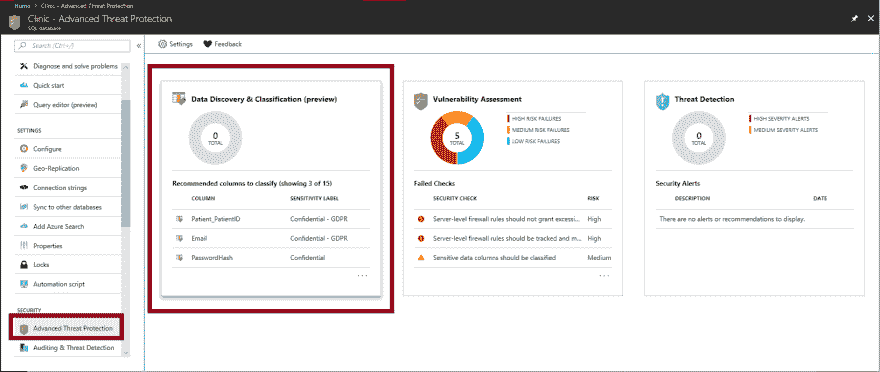
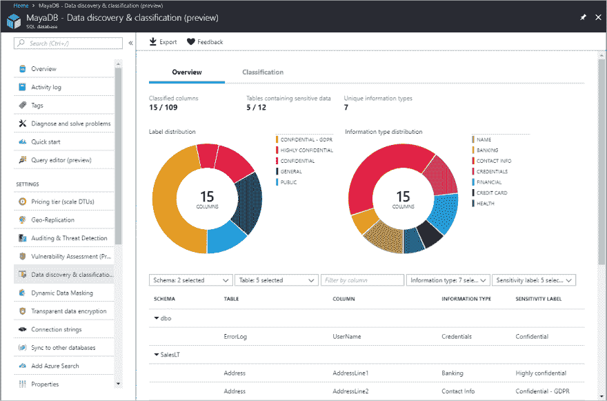
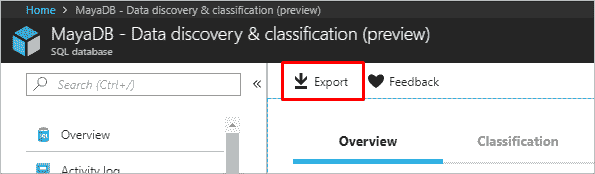
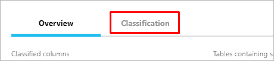
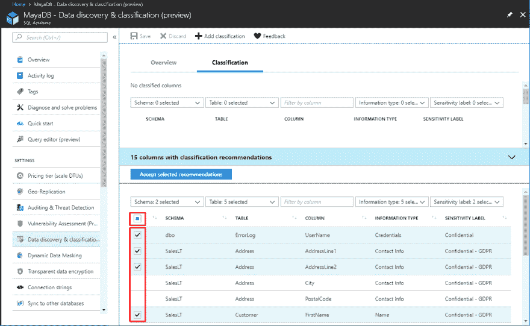
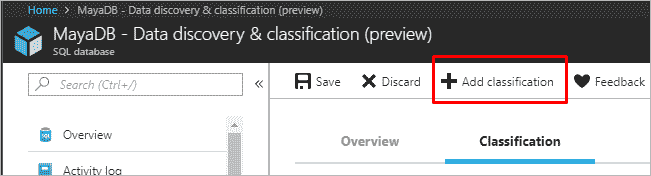
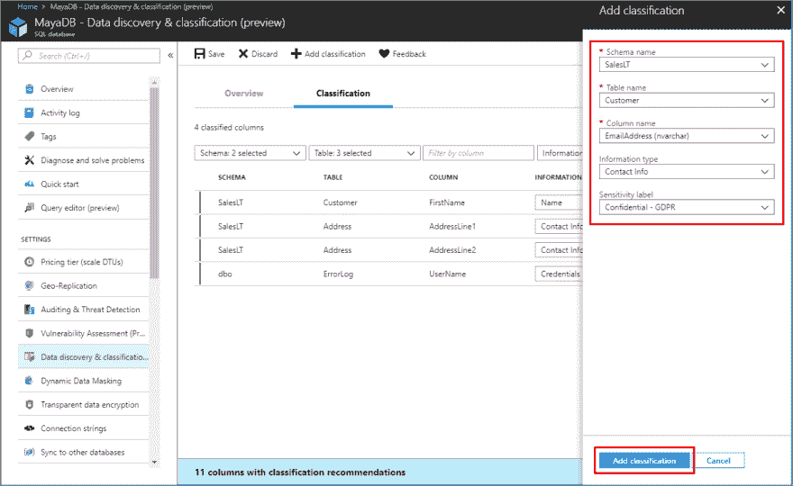
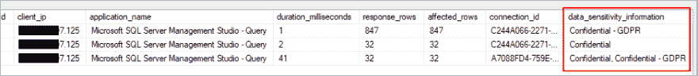

# 对 SQL 数据库进行分类

> 原文：<https://dev.to/cheahengsoon/classify-your-sql-database-2g4j>

*   登录 Azure 门户。
*   在 Azure SQL 数据库窗格的安全标题下，导航到高级数据安全，并选择启用高级数据安全。
*   选择数据发现和分类(预览)卡。

注意:根据您处理本练习的时间，预览状态可能会被移除。
[T3】](https://res.cloudinary.com/practicaldev/image/fetch/s---u0Gsn2W--/c_limit%2Cf_auto%2Cfl_progressive%2Cq_auto%2Cw_880/https://thepracticaldev.s3.amazonaws.com/i/3si78o51jk1n0zqywneu.png)

*   查看概述选项卡。请注意，它包括数据库当前分类状态的摘要，包括所有分类列的详细列表。您还可以过滤该视图，只查看特定的模式部分、信息类型和标签。
     
    注意:接下来的两个步骤假设您已经将分类数据导出。如果没有，就复习一下步骤。

*   要下载 Excel 格式的报告，请在窗口顶部菜单中选择导出。
    [T3】](https://res.cloudinary.com/practicaldev/image/fetch/s--aLpA75BY--/c_limit%2Cf_auto%2Cfl_progressive%2Cq_auto%2Cw_880/https://thepracticaldev.s3.amazonaws.com/i/ow5gvb4fk5a417zi0glc.png)

*   要开始对数据进行分类，请选择窗口顶部的分类选项卡。
     
    分类引擎扫描数据库中包含潜在敏感数据的列，并提供推荐的列分类列表。

*   要查看和应用分类建议:

*   查看列表。要查看建议的列分类列表，请选择窗口底部的“建议”面板。

*   接受建议。要接受特定列的建议，请选中相关行左列中的复选框。您也可以通过选中建议表格标题中的复选框，将所有建议标记为已接受。
    [T3】](https://res.cloudinary.com/practicaldev/image/fetch/s--55dA5jMF--/c_limit%2Cf_auto%2Cfl_progressive%2Cq_auto%2Cw_880/https://thepracticaldev.s3.amazonaws.com/i/8i7s2ef9q9nvjwhuj6uv.png)

*   要应用选定的建议，请选择蓝色的接受选定的建议按钮。
    a)要手动对列进行分类，作为基于建议的分类的替代或补充，在窗口的顶部菜单中，选择添加分类。
    T5】b)在添加分类刀片中，配置显示的五个字段，然后选择添加分类:

*   架构名称

*   表名

*   列名

*   信息类型

*   敏感性标签。
    [T3】](https://res.cloudinary.com/practicaldev/image/fetch/s---EZeF5g5--/c_limit%2Cf_auto%2Cfl_progressive%2Cq_auto%2Cw_880/https://thepracticaldev.s3.amazonaws.com/i/r4fvlgob8rjfg0sbuqy3.png)

*   要完成分类并用新的分类元数据永久标记数据库列，请在窗口顶部的菜单中选择 Save。

**监控对敏感数据的访问**
IP 模式的一个重要方面是监控对敏感数据的访问的能力。Azure SQL 数据库审计得到了增强，在审计日志中包含了一个新字段。data_sensitivity_information 字段记录查询返回的实际数据的敏感度分类(标签)。
[T6】](https://res.cloudinary.com/practicaldev/image/fetch/s--57yrXW3N--/c_limit%2Cf_auto%2Cfl_progressive%2Cq_auto%2Cw_880/https://thepracticaldev.s3.amazonaws.com/i/kjnixx14bu8ww04i3gne.png)