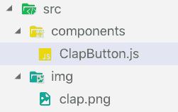

# 用 React Native 构建一个中等风格的拍手动画

> 原文：<https://dev.to/kris/build-a-medium-style-clap-animation-with-react-native-236k>

### 分分钟做一个功能齐全的房产 app

通过在几分钟内发布 iOS 和 Android 的房地产应用程序，成为下一个 Trulia、Zillow 或 Airbnb。下载我们的功能性 [React Native Real Estate](https://www.instamobile.io/app-templates/real-estate-app-template-react-native/) 应用程序模板，与 Firebase 后端集成，立即启动您自己的应用程序。这个用 React Native 编写的漂亮的应用程序模板非常注重细节，代表了启动新移动应用程序开发的最佳方式。

在本文中，我们将学习如何使用 React Native 构建一个中等风格的 clap 动画，包括从初始化 React Native 项目到使动画正常工作的所有内容。

本教程将详细介绍每个步骤，并包括每个步骤的代码片段。我们将通过创建一个新的 react-native 项目来完成本教程，从 Medium 下载拍手图像，并以最终动画结束，该动画将包括拍手、计数拍手、隐藏拍手等。

让我们开始吧。

### 自举我们的 app

首先，我们需要创建一个新的 React 原生项目。为此，我们将使用以下命令:

react-本机初始化

然后，我们需要抓取中拍手图像。您可以从下图中提供的链接下载该图像:

<figure> 

<figcaption>[来源此处](https://github.com/phuongtailtranminh/React-Native-Medium-Clap-Animation/blob/mastimg/clap.png)</figcaption>

</figure>

接下来，我们需要创建一个文件夹结构，如下图所示:

正如我们在上面的图像中看到的，clap.png 图像文件在“img”目录中，组件目录包含 JS 文件。

我们需要清理 App.js 文件，如下所示: