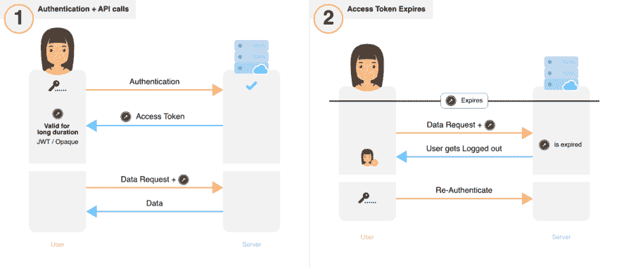
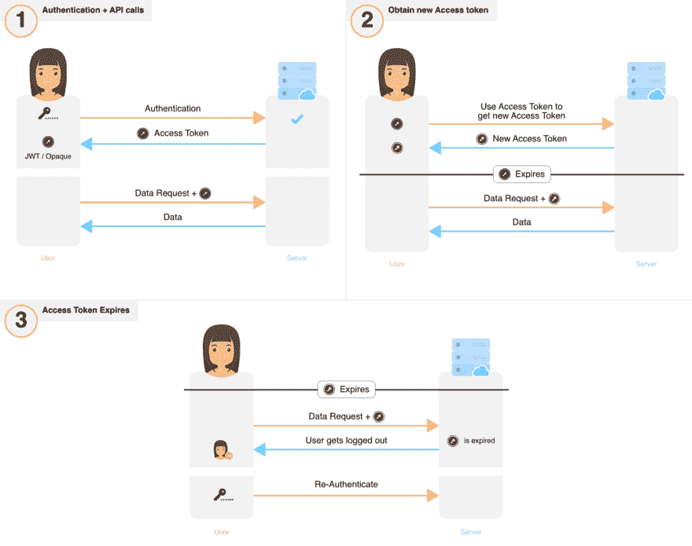
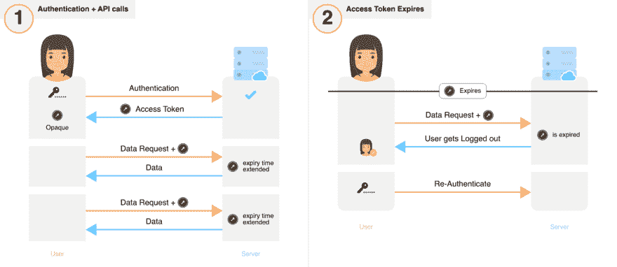
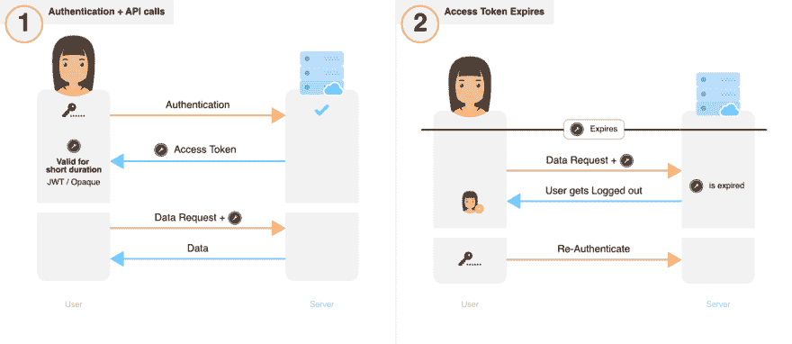
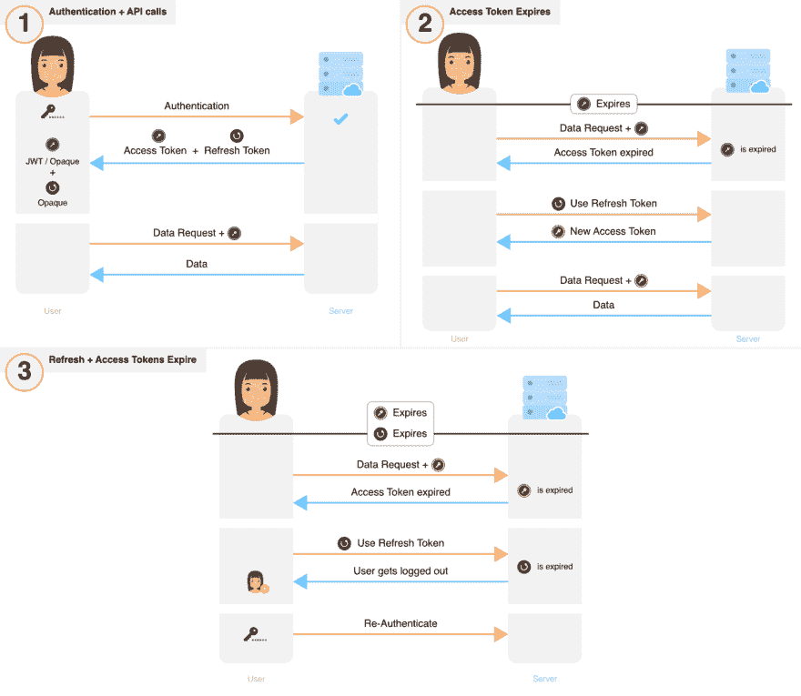
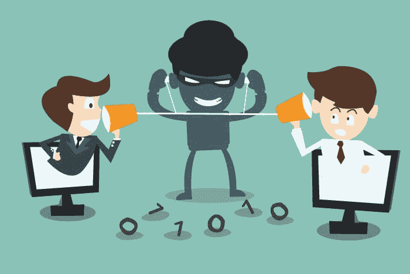
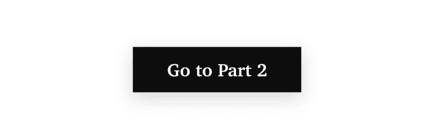

# 关于用户会话安全性，您需要知道的是

> 原文：<https://dev.to/supertokens/all-you-need-to-know-about-user-session-security-51jp>

接下来是关于会话管理的 2 部分系列——灵感来自与 70 多名开发人员的广泛对话和我们自己的深入研究。我们将探索不同的会话管理实践，确定问题并找到这些问题的解决方案。通过这一切，我希望让您清楚地决定如何为您的应用程序管理用户会话(和 auth 令牌)。在 20 分钟内，我们总结了我们花了数百个小时获得和记录的所有重要信息。

这是关于会话管理的两部分系列文章的第 1 部分。

*第 1 部分:会话管理介绍、最常用会话流分析和最佳实践*

[*第 2 部分:分析一种新的、开源的会话流，这种会话流既安全又易于集成到现有系统中*](https://dev.to/supertokens/the-best-way-to-securely-manage-user-sessions-2ja6)

具体来说，在第 1 部分中，我们将介绍

*   [为什么会话安全很重要？](#why-is-session-security-important)
*   [JWT vs 不透明访问令牌](#jwts-and-opaque%C2%A0tokens)
*   [对会话的常见攻击](#common-attacks-on%C2%A0sessions)
*   [检测和防止被盗授权令牌](#detection-vs-prevention-of-stolen-auth%C2%A0tokens)
*   [实现会话管理流程的常用方式](#common-ways-of-implementing-session-management-flows)
*   [缓解攻击的最佳实践](#best-practices-for-attack-mitigation)

*注意:* *不要将会话管理与 OAuth 混淆，因为后者是一种仅为授权目的而设计的协议。就本文而言，会话管理是关于在活动会话期间如何处理、存储和更改 auth 令牌——无论是对于 OAuth 流，还是对于服务器-客户端会话流。*

### 为什么会话安全很重要？

在设计任何需要在服务器和客户端之间进行通信的系统时，会话安全性都是一个重要的考虑因素。不适当的安全性会导致用户帐户容易受到未经授权的访问。OWASP(开放网络应用安全项目——安全领域的权威机构)认为授权/认证的不当实施是应用安全的第二大风险。几个著名的黑客说明了这一点:

*   今年早些时候的 Docker hub 数据库黑客攻击导致 Github 访问令牌被盗。[来源](https://www.theinquirer.net/inquirer/news/3074793/docker-hub-breach)
*   Gitlab 有一个漏洞，其用户的所有授权令牌都暴露在 URL 中，没有到期时间，并且由于长度较短，容易受到暴力攻击。[来源](https://threatpost.com/session-hijacking-bug-exposed-gitlab-users-private-tokens/127747/)
*   一个软件漏洞使得窃取访问令牌成为可能——影响了 9000 万个脸书账户。[来源](https://newsroom.fb.com/news/2018/09/security-update/)

正确实现用户会话管理是棘手的、耗时的和昂贵的。根据一位 [a16z](https://a16z.com/about/) 运营合作伙伴(顶级 VC)和前 Box CSO(首席安全官)的说法，**认证和授权是组织在安全预算方面的头号支出**。[来源](https://youtu.be/FdIW7BiCBtI?t=524)

这只是冰山一角，但我们希望这足以让任何人认识到，如果他们不纠正自己的航向，他们可能会成为下一个泰坦尼克号。

* * *

### jwt 和不透明令牌

我们将简要探讨会话管理中使用的两种主要类型的令牌。我们讨论的几个流需要理解这些令牌。

#### JSON Web 令牌( [JWT](https://jwt.io/)

*   每个 JWT 都包含特定信息，拥有该令牌的任何一方都可以解读这些信息。例如，该信息可以包含为其颁发证书的用户的用户 ID。
*   使用 JWTs 的一个优点是可伸缩性，因为后端不需要为每个 API 调用进行数据库查找。
*   缺点是，如果不使用像[将](https://auth0.com/blog/blacklist-json-web-token-api-keys/)列入黑名单这样的方法(这会影响解决方案的可伸缩性)，那么按需撤销单个令牌(在其过期之前)可能会很困难。但是，可以通过更改签名密钥来撤销所有令牌。

#### 不透明令牌

*   这些是随机的字符串，它们作为指针指向只由发布它们的系统持有的信息。
*   每次使用它们时，都需要查找数据库/缓存。
*   单个令牌可以很容易地按需撤销。

虽然这两种令牌类型具有不同的属性，但任何一种类型的盗窃都会导致对用户帐户的未授权访问。

* * *

### 对会话的常见攻击

身份验证令牌存储在前端和后端，并经常通过网络发送(取决于会话流)。因此，它们容易受到几种类型的攻击。

*   中间人攻击
*   OAuth 令牌盗窃
*   XSS
*   CSRF
*   数据库/文件系统访问
*   会话固定
*   暴力攻击
*   社会工程/物理访问

虽然这些攻击看起来不太可能发生，但认真对待会话安全并部署适当的措施是很重要的。系统的漏洞基于所有类型攻击的累积概率。

接下来，我们将讨论每种攻击是如何导致令牌被盗的，并探索防范这些类型攻击的最佳实践。

为了保证令牌的安全，系统架构师不仅应该防止令牌被盗，而且作为自动防故障装置，还应该确保万一令牌被盗，系统能够尽快检测到。检测是一个需要考虑的重要概念，将在下一节中探讨。

* * *

### 检测和防止被盗授权令牌

预防是第一道防线，应该尽一切努力减少盗窃。然而，身份验证令牌很容易被窃取，因为它们被传输到不可信的一方(应用程序的前端)。因此，令牌盗窃的检测在系统的安全性中起着重要的作用。现有的检测方法在很大程度上依赖于启发式算法，如跟踪 IP 地址和浏览器(或手机)指纹的突然变化，并标记“不寻常的用户行为”。不幸的是，这些方法本身可能是不准确的，容易被欺骗并且难以实现。然而，有一种可靠的方法可以将盗窃检测集成到会话管理流程中，在[第 2 部分](https://dev.to/supertokens/the-best-way-to-securely-manage-user-sessions-2ja6)中，我们提出了一种流程来实现这一点。

与此相关的是，在公开暴露会话漏洞的情况下，公司可能会发布声明，声明没有迹象表明该漏洞被利用。然而，他们没有提到的是，他们的系统能够在多大程度上首先检测到令牌盗窃！

* * *

### 实现会话管理流程的常用方式

我们已经确定了最常用的会话管理流程，并将它们分为 5 组。

1.  长期访问令牌
2.  短期—用于获取新访问令牌的中期访问令牌
3.  短期—中期访问令牌，其使用会延长其到期时间
4.  短期访问令牌
5.  具有长期刷新令牌的短期访问令牌

#### 1。长期访问令牌

 流量 1(点击可缩放)

*   如果用户自愿退出，访问令牌将被撤销并从前端清除。

**损害分析**关键身份验证令牌永久暴露在三个攻击面上——前端、传输期间和后端。

*身份验证令牌被盗的影响:*在令牌到期之前，攻击者会未经授权访问受害者的帐户——这可能是几周或几个月！

*盗窃检测:*令牌盗窃只能通过使用启发式算法或用户通知服务提供商/开发商来检测。

*一旦检测到:*如果流是使用 JWTs 实现的，可能很难撤销令牌。然而，被盗的不透明访问令牌可以很容易地被撤销。

#### 2。用于获取新访问令牌的短期-中期访问令牌

 流量 2(点击可缩放)

*   即使先前的令牌没有过期，前端也可以使用新的接入令牌。
*   如果用户自愿注销，访问令牌在后端被撤销，并从前端被清除。
*   如果访问令牌是短期的，用户很可能会被注销。

**损害分析**关键身份验证令牌永久暴露在三个攻击面上——前端、传输期间和后端。

*被盗授权令牌的影响:*攻击者必须不断更新他们的令牌以维持未授权的访问。

*检测失窃:*为了保持登录，攻击者和受害者都需要在当前(失窃)令牌过期之前向服务器请求新的访问令牌。两者都将使用相同的访问令牌来做到这一点。如果同一个令牌在请求中使用了两次，那么系统可以推断出发生了盗窃——这取决于前端是如何实现的。寿命较短的访问令牌可以更快地检测到盗窃，但也可能导致用户体验不佳，因为在没有盗窃的情况下会重复注销。

*一旦检测到:*需要撤销与该会话相关联的访问令牌。如果访问令牌是 JWT，则阻止攻击可能很复杂。

#### 3。短期-中期有效访问令牌，其使用会延长其到期时间

 流量 3(点击可缩放)

*   如果用户自愿退出，访问令牌将被撤销并从前端清除。

**损害分析**关键身份验证令牌永久暴露在三个攻击面上——前端、传输期间和后端。

*被盗授权令牌的影响:*只要受害者或攻击者是活动的，攻击者就能够保持未授权的访问。

*盗窃检测:*令牌盗窃只能通过使用启发式算法或用户通知服务提供商/开发商来检测。

*一旦检测到:*需要撤销与该会话相关联的访问令牌。如果访问令牌是 JWT，则阻止攻击可能很复杂。

#### 4。短期访问令牌

 流量 4(点击可缩放)

*   如果用户自愿退出，访问令牌将被撤销并从前端清除。

**损坏分析**在这种情况下，没有关键的身份验证令牌。但是，这种方法经常在传输过程中暴露用户的凭据，使其容易受到攻击。

被盗认证令牌的效果:如果令牌被盗，攻击者只能造成短时间的伤害。

*盗窃检测:*令牌盗窃只能通过使用启发式算法或用户通知服务提供商/开发商来检测。

*一旦检测到:*访问令牌不需要被撤销，因为它们是短期的。但是，如果需要，可以通过从数据库中删除不透明的访问令牌来撤销它们。

#### 5。具有长期刷新令牌的短期访问令牌

 流量 4(点击可缩放)

*   如果用户自愿注销，访问和刷新令牌将被撤销并从前端清除。

**损害分析**关键认证令牌(刷新令牌)永久暴露在前端和后端两个攻击面上，偶尔会在传输中暴露。

*授权令牌被盗的影响:*访问令牌被盗:攻击者将在短时间内进行未经授权的访问(直到令牌到期)。

刷新令牌被盗:攻击者可以使用被盗的刷新令牌获得新的访问令牌，并在很长一段时间内未经授权访问受害者的帐户。在极少数情况下(如下所述),这种盗窃行为可以被发现，损失可以降到最低。

*盗窃检测:*访问令牌被盗:这种盗窃只能通过使用启发式算法或用户通知服务提供商/开发商来检测。

刷新令牌失窃:在某些场景和实施中，可以检测到失窃。例如:

*   一种实现方式可以导致在生成新的访问令牌时立即撤销先前的访问令牌。这使得系统能够在攻击者和受害者同时在线的情况下识别盗窃。例如:如果攻击者使用刷新令牌，受害者的访问令牌将被撤销，从而导致受害者请求新的访问令牌。这将导致来自攻击者的另一个请求，等等。如果后端可以检测到对新访问令牌的短时间间隔请求，那么就有可能推断出发生了盗窃。

*一旦检测到:*访问令牌不需要被撤销，因为它们是短期的。但是，如果需要，不透明的访问令牌可以通过从数据库中删除它们来轻松撤销。

通过从数据库中删除刷新令牌，可以很容易地撤销它们。

这些流在设计时没有将令牌盗窃检测作为一项要求。在[第 2 部分](https://dev.to/supertokens/the-best-way-to-securely-manage-user-sessions-2ja6)中，我们提出了一个替代的会话流，我们相信它会安全得多。现在，我们将重新审视会话容易受到的攻击类型，以及减轻风险的一些步骤。

* * *

### 攻击缓解的最佳实践

#### 男人在中间攻击

中间人(MITM)攻击可能出现在以下场景中。

1.  当使用 HTTP 或不正确地实现 HTTPS 时:如果应用程序不使用 https 和安全 cookies，攻击者可能会与受害者连接到同一个网络，监视网络数据包，并在传输过程中以纯文本形式查看 auth 令牌。通常，即使应用程序有 SSL 证书，不正确的实现也会导致 MITM 攻击。例如，ESPN.com 通过不安全的 HTTP 发送授权 cookies(截至 2019 年 5 月 10 日),这篇 [Netcraft](https://news.netcraft.com/archives/2016/03/17/95-of-https-servers-vulnerable-to-trivial-mitm-attacks.html) 文章阐述了错误实现 https 的流行。
2.  当使用代理时:我工作的最后三个组织中的两个，监控他们网络上的所有流量。在工作场所，设备可能会使用企业 wifi 网络。公司可以使连接的设备信任其网络代理作为 SSL 证书授权，作为连接到 wifi 的先决条件。这将使他们(或恶意参与者)在传输过程中看到身份验证令牌信息。

**预防方法:**防止这种攻击的最简单方法是在整个应用程序中使用 https 和安全 cookies。然而，这并不能防止因使用代理而导致的攻击。可以通过使用每个设备固定的公钥/私钥来采取额外的预防措施。前端和后端将在初始化时(在用户登录之前)交换这些公钥。对于随后的通信，可以使用公钥对令牌数据进行加密。这将传输攻击仅限于初始公钥交换。有一个修改可以防止重放攻击，但没有在这篇博文中讨论。(如果您想了解更多信息，请随时与[联系](//mailto:%20team@supertokens.io)。无论如何，一些描述的流程(流程 5 和在[第 2 部分](https://dev.to/supertokens/the-best-way-to-securely-manage-user-sessions-2ja6)中提出的流程)旨在通过减少关键令牌的传输频率来最小化关键令牌的暴露。

#### OAuth 令牌失窃

如果一个应用程序通过 OAuth 向其他应用程序提供访问/刷新令牌，那么如果其他应用程序的服务器遭到破坏，则存在主应用程序的 Auth 令牌被盗的风险。作为参考，请参阅开头提到的最近的 docker hub 案例研究。

对此的解决方案是采取适当的措施来检测被盗的刷新令牌，并仅使用短期访问令牌。

#### XSS 进攻

在 XSS，攻击者可以将 Javascript 代码恶意注入受害者浏览器上运行的应用程序。注入的代码读取身份验证令牌并将其传输给攻击者(在这里阅读更多关于 XSS 攻击的信息)。

通过使用 HttpOnly 或安全 cookies 来存储 auth 令牌，可以很容易地防止这种情况。[不要使用 localStorage](https://dev.to/rdegges/please-stop-using-local-storage-1i04) 来存储 auth 令牌，因为 javascript 可以访问它们。遵循此建议，可以保护所有描述的会话流免受这种攻击。

#### CSRF

这种攻击并不用于窃取身份验证令牌，而是允许攻击者利用现有的活动会话(阅读更多信息[此处](https://www.owasp.org/index.php/Cross-Site_Request_Forgery_%28CSRF%29))。

防止 CSRF 攻击通常需要使用反 CSRF 令牌或相同站点的 cookies。但是，您也可以通过将访问令牌分成两部分来防止这种攻击——一部分存储在安全的 HttpOnly cookies 中，另一部分存储在 localstorage 中。对于每个 API 请求，您可以发送两个部分(cookies 会自动发送)，然后后端可以组装这些部分以获得整个访问令牌。这将阻止 CSRF。如果你想知道这里的 XSS 攻击，这只会导致得到一半的认证令牌，这是没有用的。

#### 数据库/文件系统访问

如果攻击者设法访问数据库/文件系统(通过数据库注入攻击或实际的服务器访问)，他们可能会获得当前活动的身份验证令牌或 JWT / SSL 私钥(*窃取这些密钥可能比窃取密码更糟糕*)。这将使他们能够轻易地劫持会话，从而导致严重的安全后果。请注意，攻击者可能是您组织内的一名员工(尤其是对于高增长的初创公司，是否为员工数据库/服务器访问设置了适当的访问控制？).

要控制对数据库或文件系统的未授权访问所造成的损害，您可以执行以下操作:

*   在数据库中只存储刷新和访问令牌的散列版本，以防止攻击者劫持任何实时会话。该建议适用于上述所有实施。
*   使用 JWTs 需要将私钥存储在服务器上——这很容易被窃取。如果攻击者获得私钥，他们将能够劫持当前和未来的会话。为了限制损害，用于签署 jwt 的私有密钥将需要被改变——立即使所有当前的 jwt 无效。在使用刷新令牌的方法中(流程 5，第 1 部分和在[第 2 部分](https://dev.to/supertokens/the-best-way-to-securely-manage-user-sessions-2ja6)中提出的流程)，更改私钥不会影响用户体验，因为刷新令牌将用于生成用新私钥签名的 JWT。

#### 会话注视

如果您的 web 应用程序有匿名会话，这是可能的(在这里阅读更多

解决这个问题的最佳方法是在用户每次登录时生成一组新的身份验证令牌，并使旧的令牌(如果有的话)失效。这是按设备而不是按用户完成的。这样做将保护所有描述的会话流免受这种攻击。

#### 蛮力攻击

拥有足够资源的攻击者可以不停地“猜测”身份验证令牌，直到其中一次尝试成功。这将为他们提供被盗令牌授予的所有访问权限。

防止这种情况的最好方法是使用高熵的长 auth 令牌。

#### 社会工程/物理访问

能够物理访问受害者设备的攻击者可以通过多种方式窃取身份验证令牌。

*   如果可以通过浏览器访问服务，攻击者可以通过检查应用程序页面来读取 cookies(即使它们是安全的或 HttpOnly)。在移动应用程序上，这更难，但仍然是可能的。
*   根据应用程序会话流的实现方式，攻击者甚至可以在受害者注销应用程序后窃取用户的身份验证令牌。[这段来自 2013 年的](https://www.youtube.com/watch?v=RO-K7oIkjFQ)视频展示了 Twitter 如何在用户注销后仍未使会话 cookie 失效。正如一位评论者指出的那样，即使在 2016 年，这种情况仍在发生！

如果在公共电脑上使用应用程序，上述两个问题都更有可能出现，这是必须考虑的因素。

真正解决这个问题的唯一方法是实施令牌盗窃检测，并允许用户注销所有设备。这意味着能够撤销该用户的所有刷新和访问令牌。一些长期存在于 JWT 访问令牌的方法可能会发现很难做到这一点。

这总结了防止常见类型攻击的最佳实践和文章的这一部分。我们希望它有所帮助，并提供您正在寻找的答案。请留下你的任何意见。

* * *

#### 第二部分

研究所有这些会话流使我们能够概念化一个流(受 [IETF RFC 6819](https://tools.ietf.org/html/rfc6819) 的启发),它支持更高的安全性和对盗窃的检测。随后，我们为自己的服务(【Qually.com】T2)构建了流程，并应开发人员社区的要求，决定开源我们的代码。如果您感兴趣，请点击下面的按钮浏览讨论这一流程的帖子，并链接到 GitHub repo。一定要看看，并让我们知道你的想法！

