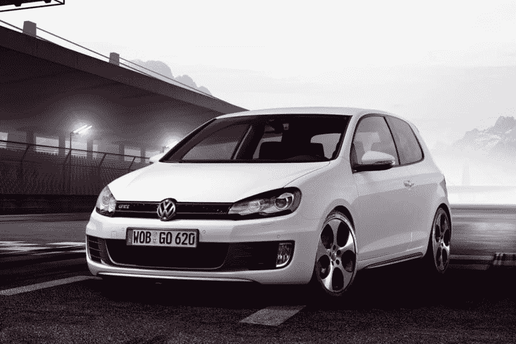

# 用 Python 实现汽车牌照检测

> 原文：<https://dev.to/petercour/car-number-plate-detection-with-python-4n7g>

可以用 Python 和 OpenCV2 检测汽车号牌。因为车牌的可见可能性数量相当有限，所以很容易做到。

和任何机器学习程序一样，数据为王。首先加载数据

```
watch_cascade = cv2.CascadeClassifier('cascade.xml')
image = cv2.imread("car.jpg") 
```

加载层叠文件和输入图像。任何汽车图片都可以:

[](https://res.cloudinary.com/practicaldev/image/fetch/s--7YqYJnry--/c_limit%2Cf_auto%2Cfl_progressive%2Cq_auto%2Cw_880/https://thepracticaldev.s3.amazonaws.com/i/s0cyjx6pkx7c43atcj2e.jpg)

从这里复制级联文件:[下载级联文件](https://raw.githubusercontent.com/zeusees/HyperLPR/master/model/cascade.xml)

然后将层叠文件应用到图像中，找到车牌。运行程序找到车牌

[](https://res.cloudinary.com/practicaldev/image/fetch/s--casJC65Z--/c_limit%2Cf_auto%2Cfl_progressive%2Cq_auto%2Cw_880/https://thepracticaldev.s3.amazonaws.com/i/7aspr5uucso3m43epj8m.png)

简单吧？

这个程序有更多的代码行。但是总的想法是应用级联来找到板对象

```
#!/usr/bin/python3
#coding=utf-8

import cv2

watch_cascade = cv2.CascadeClassifier('cascade.xml')
image = cv2.imread("car.jpg")

def detectPlateRough(image_gray,resize_h = 720,en_scale =1.08 ,top_bottom_padding_rate = 0.05):
        if top_bottom_padding_rate>0.2:
            print("error:top_bottom_padding_rate > 0.2:",top_bottom_padding_rate)
            exit(1)
        height = image_gray.shape[0]
        padding = int(height*top_bottom_padding_rate)
        scale = image_gray.shape[1]/float(image_gray.shape[0])
        image = cv2.resize(image_gray, (int(scale*resize_h), resize_h))
        image_color_cropped = image[padding:resize_h-padding,0:image_gray.shape[1]]
        image_gray = cv2.cvtColor(image_color_cropped,cv2.COLOR_RGB2GRAY)
        watches = watch_cascade.detectMultiScale(image_gray, en_scale, 2, minSize=(36, 9),maxSize=(36*40, 9*40))
        cropped_images = []
        for (x, y, w, h) in watches:

            #cv2.rectangle(image_color_cropped, (x, y), (x + w, y + h), (0, 0, 255), 1)

            x -= w * 0.14
            w += w * 0.28
            y -= h * 0.15
            h += h * 0.3

            #cv2.rectangle(image_color_cropped, (int(x), int(y)), (int(x + w), int(y + h)), (0, 0, 255), 1)

            cropped = cropImage(image_color_cropped, (int(x), int(y), int(w), int(h)))
            cropped_images.append([cropped,[x, y+padding, w, h]])
            #cv2.imshow("imageShow", cropped)
            #cv2.waitKey(0)
        return cropped_images

def cropImage(image,rect):
        cv2.imshow("imageShow", image)
        cv2.waitKey(0)
        x, y, w, h = computeSafeRegion(image.shape,rect)
        cv2.imshow("imageShow", image[y:y+h,x:x+w])
        cv2.waitKey(0)
        return image[y:y+h,x:x+w]

def computeSafeRegion(shape,bounding_rect):
        top = bounding_rect[1] # y
        bottom  = bounding_rect[1] + bounding_rect[3] # y +  h
        left = bounding_rect[0] # x
        right =   bounding_rect[0] + bounding_rect[2] # x +  w
        min_top = 0
        max_bottom = shape[0]
        min_left = 0
        max_right = shape[1]

        #print(left,top,right,bottom)
        #print(max_bottom,max_right)

        if top < min_top:
            top = min_top
        if left < min_left:
            left = min_left
        if bottom > max_bottom:
            bottom = max_bottom
        if right > max_right:
            right = max_right
        return [left,top,right-left,bottom-top]   

images = detectPlateRough(image,image.shape[0],top_bottom_padding_rate=0.1) 
```

相关链接:

*   [OpenCv 模块](https://opencv.org/)
*   [计算机视觉课程](https://gumroad.com/l/GQWGG)
*   [学习 Python，教程](https://pythonbasics.org/)