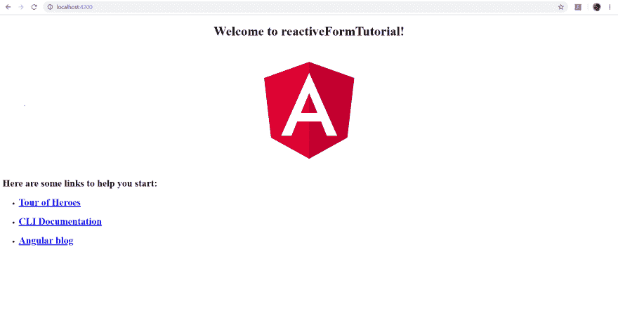
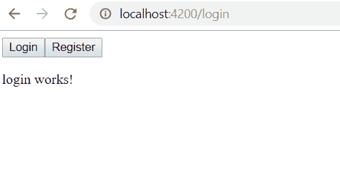
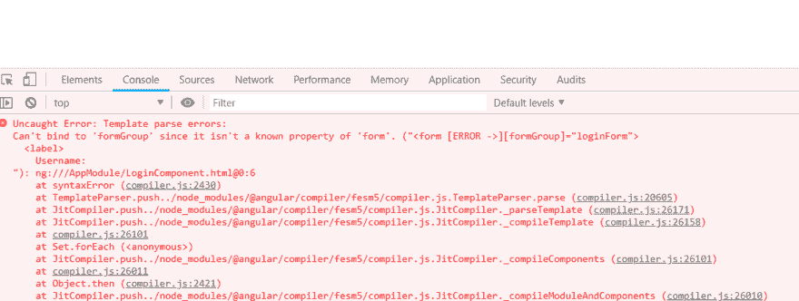
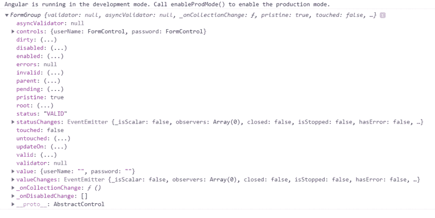

# 如何在 Angular 中创建反应式表单

> 原文：<https://dev.to/enniob/how-to-create-a-reactive-form-in-angular-2c1d>

在这篇文章中，我将介绍如何创建一个角度反应形式。我们将制作一个登录表单。我还将演示如何轻松地在表单中添加验证。

**让我们建立我们的项目**

如果您的电脑上没有安装 Angular，请转到 [Angular.io](https://angular.io/) 并按照说明在您的电脑上安装 Angular。你还需要一个编辑。我更喜欢的编辑器是 Visual Studio 代码。

我们来做一个新的角度项目。打开命令提示符并运行以下命令:

```
ng new <name> 
```

按照提示上的步骤，一旦完成，你应该有一个新的角度应用。

要测试您的新应用程序，请打开命令提示符并键入`ng serve`；等待几秒钟，然后将网络浏览器指向 [](https://res.cloudinary.com/practicaldev/image/fetch/s--n20CdBGg--/c_limit%2Cf_auto%2Cfl_progressive%2Cq_auto%2Cw_880/http://localhost:4200/)

[](https://res.cloudinary.com/practicaldev/image/fetch/s--r-KxLzu---/c_limit%2Cf_auto%2Cfl_progressive%2Cq_auto%2Cw_880/https://thepracticaldev.s3.amazonaws.com/i/260kvhpmz6qog8oqv588.PNG)

**让我们做一些编码**

在您的代码编辑器中，打开`app.component.html`并用以下代码替换所有代码:

```
<div>
    <button [routerLink]="['/']">Home</button>
    <button [routerLink]="['login']">Login</button>
</div> 
```

上面的源代码会添加登录按钮。如果您点击登录按钮，您将得到以下错误:`Error: Cannot match any routes. URL Segment: 'login' Error: Cannot match any routes. URL Segment: 'login'`

要修复这个错误，我们需要制作一个新组件并创建一条新路线。打开命令提示符并输入以下命令:`ng g component /login`以生成登录组件代码。接下来，打开`app-routing.modules.ts`文件，创建一个名为 login 的新路由。你的路线应该是这样的

```
import { NgModule } from '@angular/core';
import { Routes, RouterModule } from '@angular/router';

import { AppComponent } from './app.component';
import { LoginComponent } from './login/login.component';

const routes: Routes = [
  {path: 'login', component: LoginComponent}
];

@NgModule({
  imports: [RouterModule.forRoot(routes)],
  exports: [RouterModule]
})
export class AppRoutingModule { } 
```

键入`ng serve`并打开浏览器。如果您现在单击 login 按钮，您将不会收到错误消息，您应该会在页面上看到一条消息说 login works！

[](https://res.cloudinary.com/practicaldev/image/fetch/s--QWvrIS93--/c_limit%2Cf_auto%2Cfl_progressive%2Cq_auto%2Cw_880/https://thepracticaldev.s3.amazonaws.com/i/jj268cfm1tt2oo1gg0i4.PNG)

现在我们有了路线，让我们做一个角度反应形式。打开 login.component.ts 文件，键入以下代码:

```
import { Component, OnInit } from '@angular/core';

import { FormGroup, FormControl, Validator, Validators } from '@angular/forms';

@Component({
  selector: 'app-login',
  templateUrl: './login.component.html',
  styleUrls: ['./login.component.scss']
})
export class LoginComponent implements OnInit {

  loginForm = new FormGroup({
    userName: new FormControl('', Validators.compose([Validators.required])),
    password: new FormControl('', Validators.compose([Validators.required]))
  });

  constructor() { }

  ngOnInit() {
  }
} 
```

我们现在有一个 FormGroup，它包含两个 FormControls，一个用于用户名输入，另一个用于密码输入。在我们的 login.component.html 中，我们可以使用下面的 HTML 代码在浏览器上显示表单。

```
<form [formGroup]="loginForm" class="myForm">
  Username:
  <input type="text" formControlName="userName">
  Password:
  <input type="password" formControlName="password">
  <button type="submit">Login</button>
</form> 
```

打开浏览器，您应该会在开发人员控制台中看到一条错误消息，指出它无法绑定到“formGroup ”,因为它不是“form”的已知属性。

[](https://res.cloudinary.com/practicaldev/image/fetch/s--m4J5z6LQ--/c_limit%2Cf_auto%2Cfl_progressive%2Cq_auto%2Cw_880/https://thepracticaldev.s3.amazonaws.com/i/ih6m9000e3uw4j1le67u.PNG)

这是因为我们没有将 ReactiveFormModules 包含到我们的 app.module.ts 中，所以将以下代码添加到您的 app.module.ts 文件中。

```
import { BrowserModule } from '@angular/platform-browser';
import { NgModule } from '@angular/core';
import { ReactiveFormsModule } from '@angular/forms';

import { AppRoutingModule } from './app-routing.module';
import { AppComponent } from './app.component';
import { LoginComponent } from './login/login.component';
import { BrowserAnimationsModule } from '@angular/platform-browser/animations';

@NgModule({
  declarations: [
    AppComponent,
    LoginComponent
  ],
  imports: [
    BrowserModule,
    AppRoutingModule,
    ReactiveFormsModule,
    BrowserAnimationsModule
  ],
  providers: [],
  bootstrap: [AppComponent]
})
export class AppModule { } 
```

如果您返回到浏览器，您应该注意到开发人员控制台中不再有错误。

如果你点击登录按钮，什么都不会发生。我们将需要创建一个函数，并在提交表单时调用它。打开 login.component.ts 并将以下内容添加到 login.component.ts 中的表单标签`(ngSubmit)=”doLogin(loginForm)”`中我们有一个名为 doLogin 的函数，它接受 formGroup 类型的参数。下面是该函数的代码:

**login.component.html**T2】

```
<form [formGroup]="loginForm" (ngSubmit)="doLogin(loginForm)" class="myForm">
  Username:
  <input type="text" formControlName="userName">
  Password:
  <input type="password" formControlName="password">
  <button type="submit">Login</button>
</form> 
```

**login.component.ts**

```
import { Component, OnInit } from '@angular/core';

import { FormGroup, FormControl } from '@angular/forms';

@Component({
  selector: 'app-login',
  templateUrl: './login.component.html',
  styleUrls: ['./login.component.scss']
})
export class LoginComponent implements OnInit {

  loginForm = new FormGroup({
    userName: new FormControl(''),
    password: new FormControl('')
  });

  constructor() { }

  ngOnInit() {
  }

  doLogin(formData: FormGroup) {
    console.log(formData);
  }
} 
```

确保在浏览器中打开了开发人员控制台，并单击表单上的登录按钮。控制台显示表单组输出。单击左边的箭头展开表单组属性。

[](https://res.cloudinary.com/practicaldev/image/fetch/s--9cP8ux9F--/c_limit%2Cf_auto%2Cfl_progressive%2Cq_auto%2Cw_880/https://thepracticaldev.s3.amazonaws.com/i/8wgytm27q21ser5zf806.PNG)

现在我们已经有了登录表单，让我们把它变得更漂亮。我们将使用有棱角的材料，所以我们必须先安装它。欲了解更多关于角状材料的信息，请访问他们的网站 https://material.angular.io 。在命令行中键入以下命令。

```
ng add @angular/material 
```

一旦安装完成，我们可以导入我们想要使用的主题。将下面一行添加到您的 styles.scss.

```
@import "~@angular/material/prebuilt-themes/indigo-pink.css"; 
```

**让我们替换以下文件中的代码:**

Login.component.html

```
<mat-card class="loginCard">
  <mat-card-content>
    <form [formGroup]="loginForm" (ngSubmit)="doLogin(loginForm)" class="myForm">
      <mat-form-field class="fullWidth">
        <mat-label>
          Username:
        </mat-label>
        <input matInput type="text" formControlName="userName">
      </mat-form-field>
      <mat-form-field class="fullWidth">
        <mat-label>
          Password:
        </mat-label>
        <input matInput type="password" formControlName="password">
      </mat-form-field>
      <button mat-button type="submit">Login</button>
    </form>
  </mat-card-content>
</mat-card> 
```

Login.component.scss

```
.loginCard {
  width: 400px;
  margin-left: auto;
  margin-right: auto;
}

.myForm{
  min-width: 150px;
  max-width: 500px;
  width: 100%;
}

.fullWidth {
  width: 100%;
} 
```

App.component.html

```
<mat-toolbar color="primary">
  <mat-toolbar-row>
    <button mat-button [routerLink]="['/']">Home</button>
    <button mat-button [routerLink]="['login']">Login</button>
  </mat-toolbar-row>
</mat-toolbar>

<router-outlet></router-outlet> 
```

App.module.ts

```
import { BrowserModule } from '@angular/platform-browser';
import { NgModule } from '@angular/core';
import { ReactiveFormsModule } from '@angular/forms';

import { AppRoutingModule } from './app-routing.module';
import { AppComponent } from './app.component';
import { LoginComponent } from './login/login.component';
import { BrowserAnimationsModule } from '@angular/platform-browser/animations';

// MATERIAL
import { MatCardModule } from '@angular/material/card';
import { MatFormFieldModule } from '@angular/material/form-field';
import { MatInputModule } from '@angular/material/input';
import { MatButtonModule } from '@angular/material/button';
import { MatToolbarModule } from '@angular/material/toolbar';

@NgModule({
  declarations: [
    AppComponent,
    LoginComponent
  ],
  imports: [
    BrowserModule,
    AppRoutingModule,
    ReactiveFormsModule,
    BrowserAnimationsModule,
    MatCardModule,
    MatFormFieldModule,
    MatInputModule,
    MatButtonModule,
    MatToolbarModule
  ],
  providers: [],
  bootstrap: [AppComponent]
})
export class AppModule { } 
```

使用`ng serve`构建应用程序，您将看到一个导航标题，登录表单位于页面中央。

现在我们的登录表单看起来更好了，我们可以添加一些表单验证来确保用户输入有效的数据。

将以下代码添加到 login.component.ts.

```
import { Component, OnInit } from '@angular/core';

import { FormGroup, FormControl, Validator, Validators } from '@angular/forms';

@Component({
  selector: 'app-login',
  templateUrl: './login.component.html',
  styleUrls: ['./login.component.scss']
})
export class LoginComponent implements OnInit {

  loginForm = new FormGroup({
    userName: new FormControl('', Validators.compose([Validators.required])),
    password: new FormControl('', Validators.compose([Validators.required]))
  });

  constructor() { }

  ngOnInit() {
  }

  doLogin(formData: FormGroup) {
    console.log(formData);
  }
} 
```

当您返回到登录页面并单击 login 按钮时，您会注意到输入将变成红色，如果您在浏览器中打开控制台窗口，您会发现 FormGroup valid 属性被设置为 invalid。这是因为用户名和密码输入在表单组中被设置为必需的。
返回表单，输入用户名和密码，然后点击登录。您将看到 Formgroup valid 属性现在在控制台中被设置为 true。

结论
你现在知道如何创建反应式表单。如果您愿意，您可以轻松地添加多个验证器，甚至创建您自己的定制验证器。在我的下一篇文章中，我将向您展示如何创建一个使用 Firebase 身份验证的登录表单，我们还将创建一个连接到 Firebase 的注册表单。