# 将多选下拉列表添加到 JavaScript 应用程序中

> 原文：<https://dev.to/syncfusion/add-a-multiselect-dropdown-into-your-javascript-application-31ei>

Syncfusion Essential JS 2 提供了一个支持所有开箱即用功能的多选组件，以创建一个类似脸书的多选组件。这个 UI 增强了用户以交互方式查找、选择和删除项目的体验，这种方式是当今几乎所有应用程序的首选方式。基本的 JS 2 multiselect 组件是 HTML select 的扩展版本，具有选择模式、复选框、排序、分组、模板、自定义值等。

在这篇博客中，您将学习如何开始使用多选组件，并探索其最重要的特性。

## 多选组件入门

可以按照 TypeScript 中的以下步骤配置多选组件:

1.克隆基本的 JS 2 [quickstart](https://github.com/syncfusion/ej2-quickstart) 种子库，并在 system.config.js 文件中配置下拉包。

```
"@syncfusion/ej2-dropdowns": "syncfusion:ej2-dropdowns/dist/ej2-dropdowns.umd.min.js" 
```

2.使用以下命令安装 NPM 软件包。

```
$ npm install 
```

3.在 index.html 文件中添加需要初始化为组件的 HTML 输入元素。

```
<body>
   <div id='container' style="margin:0 auto; width:250px;">
      <input type="text" id='multi-select' />
   </div>
</body> 
```

4.初始化 app.ts 文件中的组件，如下所示。

```
import { MultiSelect } from '@syncfusion/ej2-dropdowns';

// initialize MultiSelect component
let msObject: MultiSelect = new MultiSelect();

// render initialized MultiSelect
msObject.appendTo('#multi-select'); 
```

## 填充数据

Multiselect 是一个数据绑定组件，可以绑定到来自原始数据数组、JSON 数据集或远程数据源(如 o data、OData V4、URL 和 Web API)的数据以显示数据。您可以直接以 DataManager 或集合类型的形式映射数据源。

要绑定远程服务，创建带有服务 URL 的 DataManager，并将其绑定到组件，如下所示。

```
import { MultiSelect } from '@syncfusion/ej2-dropdowns';
import { Query, DataManager, ODataAdaptor } from '@syncfusion/ej2-data';

let listObj: MultiSelect = new MultiSelect({
    dataSource: new DataManager({
        url: 'https://js.syncfusion.com/demos/ejServices/Wcf/Northwind.svc/Customers',
        adaptor: new ODataAdaptor,
        crossDomain: true
    }),
    query: new Query().select(['ContactName', 'CustomerID']).take(25),
    fields: { text: 'ContactName', value: 'CustomerID' }
});
listObj.appendTo('#multi-select'); 
```

[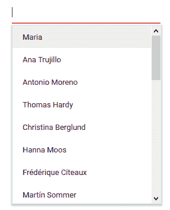](https://res.cloudinary.com/practicaldev/image/fetch/s--WC-VotWN--/c_limit%2Cf_auto%2Cfl_progressive%2Cq_auto%2Cw_880/https://blog.syncfusion.com/wp-content/uploads/2018/08/image-310.png) 

<figure>

<figcaption>多选带数据</figcaption>

</figure>

## 配置选择模式

所选项目可以在文本框中以不同模式显示:

*   默认
*   盒子(芯片)
*   定界符
*   检验盒

### 盒子(芯片)

所选项目用方框(芯片)显示，并与关闭图标相关联。用户可以使用关闭按钮移除每个盒子(芯片)，并可以使用箭头键浏览盒子(芯片)。要启用这种多选[模式](https://ej2.syncfusion.com/documentation/api/multi-select/#mode)，请将 mode 属性设置为 Box。如何定制一个盒子的外观在这个[文档](https://ej2.syncfusion.com/documentation/multi-select/chip-customization/)部分描述。

```
let msObj: MultiSelect = new MultiSelect({

    // --- Initialize component with data source, query, and fields

    mode:"Box"
}); 
```

[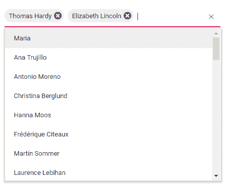](https://res.cloudinary.com/practicaldev/image/fetch/s--mxNAP9ZL--/c_limit%2Cf_auto%2Cfl_progressive%2Cq_auto%2Cw_880/https://blog.syncfusion.com/wp-content/uploads/2018/08/image-311.png) 

<figure>

<figcaption>多选框模式</figcaption>

</figure>

### 分隔符

选择多个项目时，可以用所需的字符作为分隔符来分隔所选项目。默认情况下，分隔符设置为逗号。使用 [delimiterChar](https://ej2.syncfusion.com/documentation/api/multi-select/#delimiterchar) 属性可以定制分隔符。要启用这种多选[模式](https://ej2.syncfusion.com/documentation/api/multi-select/#mode)，请将 mode 属性设置为 Delimiter。

```
let msObj: MultiSelect = new MultiSelect({

    // --- Initialize component with data source, query, and fields

    mode:" Delimiter"
}); 
```

[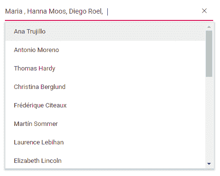](https://res.cloudinary.com/practicaldev/image/fetch/s--IDmK2Hd9--/c_limit%2Cf_auto%2Cfl_progressive%2Cq_auto%2Cw_880/https://blog.syncfusion.com/wp-content/uploads/2018/08/image-312.png) 

<figure>

<figcaption>在分隔符模式下多选</figcaption>

</figure>

### 默认

当组件获得焦点时，选定的项目以框(片)模式显示。一旦组件获得焦点，选定的项目将随分隔符一起更改。

组件获得焦点:

[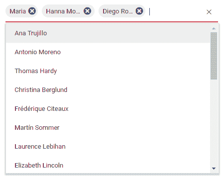](https://res.cloudinary.com/practicaldev/image/fetch/s--CPL-iZXu--/c_limit%2Cf_auto%2Cfl_progressive%2Cq_auto%2Cw_880/https://blog.syncfusion.com/wp-content/uploads/2018/08/image-313.png) 

<figure>

<figcaption>分量得到聚焦</figcaption>

</figure>

组件获得焦点:

[](https://res.cloudinary.com/practicaldev/image/fetch/s--PTvAbL6o--/c_limit%2Cf_auto%2Cfl_progressive%2Cq_auto%2Cw_880/https://blog.syncfusion.com/wp-content/uploads/2018/08/image-314.png) 

<figure>

<figcaption>分量变焦</figcaption>

</figure>

### 复选框

multiselect 组件允许您使用复选框选择多个项目。启用此模式时，项目列表中会填充复选框。要启用这种多选模式，请将[模式](https://ej2.syncfusion.com/documentation/api/multi-select/#mode)属性设置为 CheckBox。

注意:从 ej2-buttons 包中导入 CheckBox 模块，从 ej2-dropdowns 包中导入 CheckBoxSelection，以便在 multiselect 组件中启用此选项。

```
import { MultiSelect,CheckBoxSelection } from '@syncfusion/ej2-dropdowns';
import { CheckBox, ChangeEventArgs } from '@syncfusion/ej2-buttons';
import { Query, DataManager, ODataAdaptor } from '@syncfusion/ej2-data';

MultiSelect.Inject(CheckBoxSelection);

let listObj: MultiSelect = new MultiSelect({
    dataSource: new DataManager({
        url: 'https://js.syncfusion.com/demos/ejServices/Wcf/Northwind.svc/Customers',
        adaptor: new ODataAdaptor,
        crossDomain: true
    }),
    query: new Query().select(['ContactName', 'CustomerID']).take(25),
    fields: { text: 'ContactName', value: 'CustomerID' },
    mode:"CheckBox"
});
listObj.appendTo('#multi-select'); 
```

[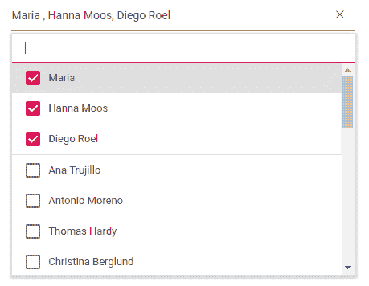](https://res.cloudinary.com/practicaldev/image/fetch/s--KwybyOcj--/c_limit%2Cf_auto%2Cfl_progressive%2Cq_auto%2Cw_880/https://blog.syncfusion.com/wp-content/uploads/2018/08/image-315.png) 

<figure>

<figcaption>多选带复选框模式</figcaption>

</figure>

## 添加自定义值(标记)

用户可以使用现有数据源动态添加新项目。这些项目不必与现有的弹出列表项目完全匹配。添加的新项目附加在列表的末尾。要将自定义值添加到现有的数据集合中，请输入自定义值并按 enter 键。

```
let msObj: MultiSelect = new MultiSelect({

    // --- Initialize component with data source, query, and fields

    allowCustomValue: true
}); 
```

[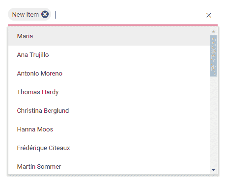](https://res.cloudinary.com/practicaldev/image/fetch/s--ODElZ5rk--/c_limit%2Cf_auto%2Cfl_progressive%2Cq_auto%2Cw_880/https://blog.syncfusion.com/wp-content/uploads/2018/08/image-316.png) 

<figure>

<figcaption>带自定义值的多选</figcaption>

</figure>

## 分组集合

我们可以在弹出列表中将逻辑上相关的项目按组排列。组标题以内嵌和静态方式显示在项目组上方。要启用分组功能，请在数据绑定上映射 [groupBy](https://ej2.syncfusion.com/documentation/api/multi-select/fieldSettingsModel/#groupby) 字段。

```
import { MultiSelect } from '@syncfusion/ej2-dropdowns';
import { Query, DataManager, ODataAdaptor } from '@syncfusion/ej2-data';

let listObj: MultiSelect = new MultiSelect({
    dataSource: new DataManager({
        url: 'https://js.syncfusion.com/demos/ejServices/Wcf/Northwind.svc/Customers',
        adaptor: new ODataAdaptor,
        crossDomain: true
    }),
    query: new Query().select(['ContactName', 'CustomerID', 'Coun-try']).take(50),
    fields: { text: 'ContactName', value: 'CustomerID', groupBy: 'Country' },
    mode:"Box"
});
listObj.appendTo('#multi-select'); 
```

[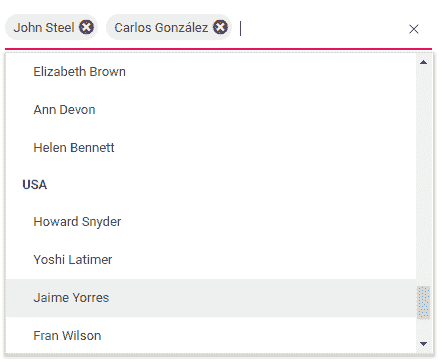](https://res.cloudinary.com/practicaldev/image/fetch/s--2BEw_BFx--/c_limit%2Cf_auto%2Cfl_progressive%2Cq_auto%2Cw_880/https://blog.syncfusion.com/wp-content/uploads/2018/08/image-317.png) 

<figure>

<figcaption>多选带分组</figcaption>

</figure>

## 过滤器配置

数据项可以被过滤并反弹到多选组件。组件提供了实现这一点的方法:

1.  默认情况下不启用过滤，因此通过将 [allowFiltering](https://ej2.syncfusion.com/documentation/api/multi-select/#allowfiltering) 设置为 true 来启用过滤。
2.  定义[过滤](https://ej2.syncfusion.com/documentation/api/multi-select/#filtering)事件，根据参数过滤数据。

```
import { MultiSelect, FilteringEventArgs  } from '@syncfusion/ej2-dropdowns';
import { Query, DataManager, ODataAdaptor } from '@syncfusion/ej2-data';

let listObj: MultiSelect = new MultiSelect({
    dataSource: new DataManager({
        url: 'https://js.syncfusion.com/demos/ejServices/Wcf/Northwind.svc/Customers',
        adaptor: new ODataAdaptor,
        crossDomain: true
    }),
    query: new Query().select(['ContactName', 'CustomerID', 'Coun-try']).take(50),
    fields: { text: 'ContactName', value: 'CustomerID', groupBy: 'Country' },
    mode:"Box",
    allowFiltering: true,
    filtering: function (e: FilteringEventArgs) {

    }

});
listObj.appendTo('#multi-select'); 
```

[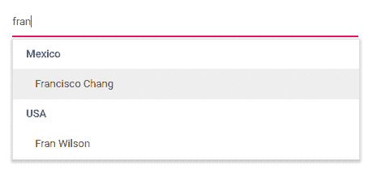](https://res.cloudinary.com/practicaldev/image/fetch/s--rUhG4ts---/c_limit%2Cf_auto%2Cfl_progressive%2Cq_auto%2Cw_880/https://blog.syncfusion.com/wp-content/uploads/2018/08/image-318.png) 

<figure>

<figcaption>带过滤数据的多选</figcaption>

</figure>

## 使用模板定制

本节说明如何自定义数据项、选定值、组标题、页眉和页脚的默认外观。

### 值模板

multiselect 组件提供了使用值模板自定义每个选定项的可视化的灵活性。值模板适用于自定义框外观。

```
let msObj: MultiSelect = new MultiSelect({

    // --- Initialize component with data source, query, and fields

    valueTemplate:"${ ContactName} - ${ Country}"
}); 
```

[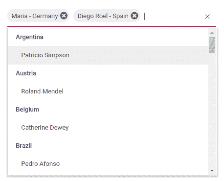](https://res.cloudinary.com/practicaldev/image/fetch/s--jLkYbP15--/c_limit%2Cf_auto%2Cfl_progressive%2Cq_auto%2Cw_880/https://blog.syncfusion.com/wp-content/uploads/2018/08/image-319.png) 

<figure>

<figcaption>用模板选中项</figcaption>

</figure>

### 项目模板

您可以指定每个项目在弹出窗口中的显示方式。

```
let msObj: MultiSelect = new MultiSelect({

    // --- Initialize component with data source, query, and fields

itemTemplate: "${ ContactName} — ${ Country}", }); 
```

[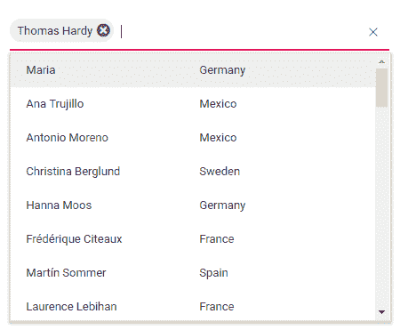](https://res.cloudinary.com/practicaldev/image/fetch/s--AJ2fCFT_--/c_limit%2Cf_auto%2Cfl_progressive%2Cq_auto%2Cw_880/https://blog.syncfusion.com/wp-content/uploads/2018/08/image-320.png) 

<figure>

<figcaption>列表与项目模板</figcaption>

</figure>

### 表头模板

您可以为多选弹出窗口启用标题部分，它显示在弹出窗口的顶部。 [headerTemplate](https://ej2.syncfusion.com/documentation/api/multi-select/#headertemplate) 属性用于提供接受字符串和 HTML 内容的标题内容。

```
let msObj: MultiSelect = new MultiSelect({

    // --- Initialize component with data source, query, and fields

    headerTemplate:"<span class="head"><span class="name">Name</span><span class="city">City</span></span>"

}); 
```

[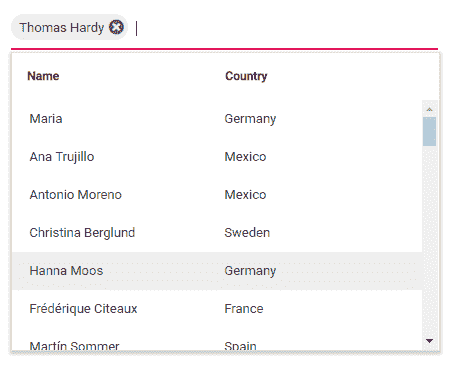](https://res.cloudinary.com/practicaldev/image/fetch/s--w_40bImU--/c_limit%2Cf_auto%2Cfl_progressive%2Cq_auto%2Cw_880/https://blog.syncfusion.com/wp-content/uploads/2018/08/image-321.png) 

<figure>

<figcaption>列表带表头</figcaption>

</figure>

### 页脚模板

您可以包含页脚部分，该部分显示在多选弹出窗口的底部。 [footerTemplate](https://ej2.syncfusion.com/documentation/api/multi-select/#footertemplate) 属性用于提供接受字符串和 HTML 内容的页脚内容。

```
let msObj: MultiSelect = new MultiSelect({

    // --- Initialize component with data source, query, and fields

    footerTemplate:"<span class="foot"> Total list items: 50 </span>"

}); 
```

[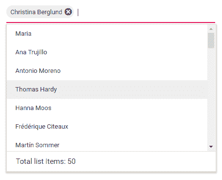](https://res.cloudinary.com/practicaldev/image/fetch/s--x6e848GD--/c_limit%2Cf_auto%2Cfl_progressive%2Cq_auto%2Cw_880/https://blog.syncfusion.com/wp-content/uploads/2018/08/image-322.png) 

<figure>

<figcaption>列表带页脚</figcaption>

</figure>

### 无记录模板

当绑定到多选组件的数据源包含空记录或在筛选结果中找不到匹配项时，多选组件中将显示“无记录”模板。使用 [noRecordsTemplate](https://ej2.syncfusion.com/documentation/api/multi-select/#norecordstemplate) 属性来定义无记录弹出窗口的自定义外观。

```
let msObj: MultiSelect = new MultiSelect({

    // --- Initialize component with data source, query, and fields

    noRecordsTemplate: "<span class="norecord"> NO DATA AVAILABLE </span>"

}); 
```

[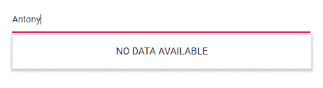](https://res.cloudinary.com/practicaldev/image/fetch/s--npaZJDrY--/c_limit%2Cf_auto%2Cfl_progressive%2Cq_auto%2Cw_880/https://blog.syncfusion.com/wp-content/uploads/2018/08/image-323.png) 

<figure>

<figcaption>弹出无记录模板</figcaption>

</figure>

### 动作失败模板

当您将多重选择组件与远程数据绑定并且数据提取操作失败时，操作失败模板将显示在弹出窗口中。

```
let msObj: MultiSelect = new MultiSelect({

    // --- Initialize component with data source, query, and fields

    actionFailureTemplate:" <span class="action-failure">Data fetch get fails </span>"

}); 
```

[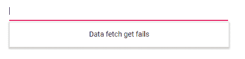](https://res.cloudinary.com/practicaldev/image/fetch/s--ecBdHmOq--/c_limit%2Cf_auto%2Cfl_progressive%2Cq_auto%2Cw_880/https://blog.syncfusion.com/wp-content/uploads/2018/08/image-324.png) 

<figure>

<figcaption>取数据请求失败</figcaption>

</figure>

### 组模板

当列表项按逻辑顺序分组时，组标题会显示在每个组的上方。可以使用 [groupTemplate](https://ej2.syncfusion.com/documentation/api/multi-select/#grouptemplate) 属性定制组的标题内容。

```
let msObj: MultiSelect = new MultiSelect({

    // --- Initialize component with data source, query, and fields

    groupTemplate:"${City}"

}); 
```

[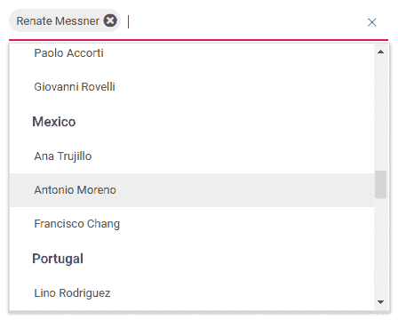](https://res.cloudinary.com/practicaldev/image/fetch/s--ZjeAKUy---/c_limit%2Cf_auto%2Cfl_progressive%2Cq_auto%2Cw_880/https://blog.syncfusion.com/wp-content/uploads/2018/08/image-325.png) 

<figure>

<figcaption>列表带自定义组头</figcaption>

</figure>

## 自定义盒子(芯片)外观

默认情况下，芯片具有基于当前应用主题的样式。但是您可以通过使用 multiselect 组件的标记事件添加自己的 CSS 类来自定义芯片外观。从 ej2-dropdowns 包中导入 [TaggingEventArgs](https://ej2.syncfusion.com/documentation/api/multi-select/taggingEventArgs/) 来配置[标记](https://ej2.syncfusion.com/documentation/api/multi-select/#tagging)事件。

```
let msObj: MultiSelect = new MultiSelect({

    // --- Initialize component with data source, query, and fields

    tagging: (e: TaggingEventArgs) => {

        // Customize code here

    }

}); 
```

结论
在这篇博客中，你已经学会了如何开始使用多选组件和其他重要特性。您可以在以下资源中进一步了解该控件。请[亲自尝试多选](https://www.syncfusion.com/downloads/essential-js2/verify)，如果您对使用该组件有任何疑问，或者您想提供反馈，请在评论区提出。

GitHub 来源:[https://GitHub . com/sync fusion/ej2-JavaScript-ui-controls/tree/master/controls/dropdowns](https://github.com/syncfusion/ej2-javascript-ui-controls/tree/master/controls/dropdowns)

演示:[https://ej2 . sync fusion . com/demos/#/material/multiselect/default . html](https://ej2.syncfusion.com/demos/?_ga=2.161859708.1708073739.1562561788-1065100418.1555049162#/material/grid/grid-overview.html)

用户指南文档:[https://ej2.syncfusion.com/documentation/multi-select/?lang=typescript](https://ej2.syncfusion.com/documentation/multi-select/?lang=typescript&_ga=2.161859708.1708073739.1562561788-1065100418.1555049162)

帖子[在你的 JavaScript 应用程序中添加多选下拉菜单](https://blog.syncfusion.com/post/add-multiselect-dropdown-into-your-javascript-application.aspx)最先出现在[的 Syncfusion 博客](https://blog.syncfusion.com)上。