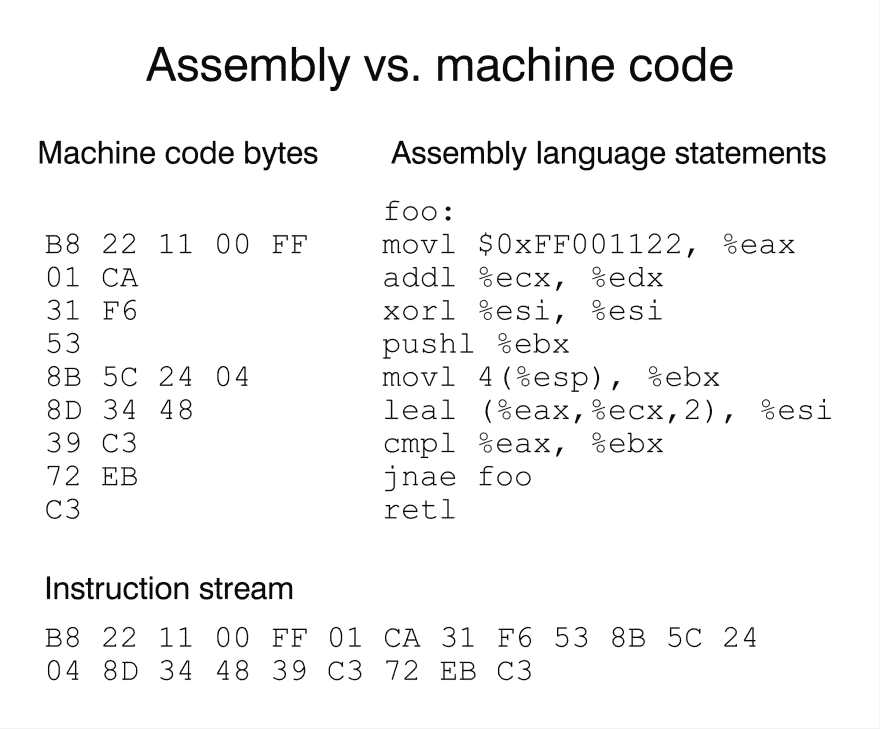

# 由内而外的 JavaScript！

> 原文：<https://dev.to/areknawo/javascript-from-the-inside-out-353k>

**这篇文章摘自[我的博客](https://areknawo.com)，所以请务必查看更多最新内容。**

我在这个博客上写的大部分内容都是所谓的*【初学者友好】*类型。我总是努力保持这句话的真实性。那是因为正是这些*【初学者】*最渴望学习和尝试新事物。他们刚刚开始他们的旅程，想尽可能多的了解一些事情。当然，这样的过程需要时间，而且通常非常困难，因为 web 开发和一般编程环境的变化非常快。

但是，在这篇文章中，我们将讨论一些真正适合初学者的内容。相当稳定并且不会经常改变的东西！我说的是 JavaScript！但不是特性、语法或任何类似的东西——不。我说的是 JS 如何在幕后工作以及一些相关的基本术语。我们开始吧！

# 所有的术语...

如果你曾经在类似于 [Wikipedia](https://en.wikipedia.org/wiki/JavaScript) 的页面上读到过 JS，那么从一开始，你就会被大量的术语轰炸，比如*高级*、*解释的*、 *JIT 编译的*、*动态类型化的*、*基于原型的*等等。虽然其中一些是不言自明的，并且对于有经验的程序员来说肯定是众所周知的，但是其他的就不那么清楚了。而且，即使你不需要了解所有的知识就能知道如何写好代码，这些知识肯定能帮助你更好地理解语言和编程。这就是为什么从内向外了解 JS 基本上意味着学习这些**术语**的**含义**...

# 来自更高一级

初学 JS 的开发人员并不真正关心他们的代码实际上是如何工作的...或者至少他们不需要！那是因为 JS 是一种 [**高级语言**](https://en.wikipedia.org/wiki/High-level_programming_language) 。这意味着所有的细节，比如你的数据是如何存储在内存(RAM)中的，或者提供的指令是如何被 CPU 执行的，对最终的程序员来说都是隐藏的。这样，*【高】*就表明了语言所提供的 [**抽象**](https://en.wikipedia.org/wiki/Abstraction_(computer_science)) 或者简化的程度。

## 机器代码

从最底层开始，我们有了 [**机器码**](https://en.wikipedia.org/wiki/Machine_code) 。正如大多数人所知，它只是一组以特定方式排列的 0 和 1，以便它们不同的组对机器有意义。有些可能表示特定的指令，有些则表示数据，等等...

[](https://res.cloudinary.com/practicaldev/image/fetch/s--QbHJNR5H--/c_limit%2Cf_auto%2Cfl_progressive%2Cq_auto%2Cw_880/https://areknawo.com/conteimg/2019/07/ezgif.com-gif-maker.png) 
*(摘自[na yuki . io](https://www.nayuki.io/page/a-fundamental-introduction-to-x86-assembly-programming)-x86 汇编大入门)*

## 组装

再上一层我们有 [**汇编**](https://en.wikipedia.org/wiki/Assembly_language)——最底层的编程语言，仅次于机器码。与机器代码相比，汇编代码具有人类可读的形式。这样，汇编是你能做的最低级的事情(同时保持理智，不用一直看机器代码参考)。尽管如此，即使有了它的*【可读性】*，用像 [*ADD* 或 *MOV*](https://en.wikipedia.org/wiki/X86_instruction_listings) 这样的指令编写实际的汇编代码，也是一项非常艰巨的任务。这还不算为您想要运行的每种不同处理器架构编写不同汇编代码的需求(比如台式机上的 [**x86-64**](https://en.wikipedia.org/wiki/X86-64) 和移动设备上的 [**ARM**](https://en.wikipedia.org/wiki/ARM_architecture) )！甚至没有提到不同的操作系统！肯定是与我们在 JS 中习惯的东西相差甚远，不是吗？无论如何，汇编仍然只是一个抽象，为了运行，它需要被编译，或者我应该说*汇编*，以机器码的形式用一个叫做 [**汇编**](https://en.wikipedia.org/wiki/Assembly_language#Assembler) 的实用程序。有趣的事实是，许多汇编器甚至不是用纯汇编语言编写的——很有趣，对吧？

## 高等级

在汇编之上，我们终于看到了我们很多人都相当熟悉的语言——最著名的是 **C** 和 **C++** 。在这里，我们可以编写与 JS 中更相似的代码。然而，我们仍然可以使用各种各样的*【低级】*(与 JS 相比)工具——我们仍然必须自己管理(分配/释放)内存。代码随后由一个名为 [**编译器**](https://en.wikipedia.org/wiki/Compiler) 的程序转换(又名*编译*)为机器代码(间接，中间有汇编步骤)。注意汇编程序和编译器之间的区别——因为编译器位于更高层次的抽象和机器代码之间，所以它能做更多的事情！这就是为什么 C 代码是*【可移植】*的原因，因为它只需编写一次，就可以编译到许多平台和架构上！

## 级别很高

由于 C++已经被认为是高级语言，你知道更高级的是什么吗？没错——**JavaScript**。JS 是一种在其引擎内部运行的语言，最流行的例子是用 C++编写的[**【V8】**](https://v8.dev/)！这就是为什么 JS 通常被认为是一种**解释的**语言(不是 100%正确，但是稍后会有更多的介绍)。这意味着你写的 JS 代码不是编译然后运行(像 C++)，而是由一个叫做 [**解释器**](https://en.wikipedia.org/wiki/Interpreter_(computing)) 的程序运行。

如你所见，JS 确实是一门非常高级的语言。这有很多好处，最主要的一点是程序员不必考虑一旦我们*【下降】*就变得可见的细节。如此高的抽象级别的唯一缺点是**性能损失**。虽然 JS 非常快，而且只会越来越好，但每个人都知道一段 C++代码(如果写得好的话)很容易胜过它的 JS 等价物。尽管如此，更高层次的抽象提高了开发人员的生产力和总体生活舒适度。这是一种妥协，也是为什么不同的编程语言最适合不同任务的众多原因之一。

当然，这只是对幕后情况的一个过于简单的观察，所以请不要全信。为了让您预览这种过度简化有多严重，我们将继续只探索最高级别的抽象——以 JS 为中心！

# 按设计

[](https://res.cloudinary.com/practicaldev/image/fetch/s--egDJwL2U--/c_limit%2Cf_auto%2Cfl_progressive%2Cq_auto%2Cw_880/https://images.unsplash.com/photo-1535598745644-bc7913bb1a2a%3Fixlib%3Drb-1.2.1%26q%3D80%26fm%3Djpg%26crop%3Dentropy%26cs%3Dtinysrgb%26w%3D1080%26fit%3Dmax%26ixid%3DeyJhcHBfaWQiOjExNzczfQ) 
*照片由[何塞·亚历杭德罗·库菲亚](https://unsplash.com/@alecuffia?utm_source=ghost&utm_medium=referral&utm_campaign=api-credit) / [Unsplash](https://unsplash.com/?utm_source=ghost&utm_medium=referral&utm_campaign=api-credit)* 拍摄

正如我在之前的一些帖子中提到的，所有的 JS 实现(基本上只是不同的引擎，比如 T2 的 V8 和 T4 的 T5，蜘蛛猴的 T6 和 T7)，都必须遵循单一的 T8 ECMAScript 规范 T9，以保持语言的完整性。许多与 JS 相关的概念都源于该规范...

## 动态弱类型

在本规范中，许多不同的术语都与 JS 的设计和工作方式有关。正是在这里我们才知道 JS 是动态的*-*和弱类型的语言。这意味着 JS 变量的类型是隐式解析的，可以在**运行时**改变(动态部分)，并且它们没有被严格区分(弱部分)。因此存在更高级的抽象，如 TypeScript，我们有两个等式操作符——普通的(`==`)和严格的(`===`)。动态类型在解释型语言中非常流行，而它的对立面——静态类型——在编译型语言中非常流行。

## 多范式

另一个与 JS 相关的术语是，它是一种多范例语言。这是因为 JS 的特性允许你以自己喜欢的方式编写代码。这意味着你的代码可以从*声明性的*和*功能性的*到*命令性的*和*面向对象的*...或者甚至混合两种范式！无论如何，[编程范例](https://en.wikipedia.org/wiki/Programming_paradigm)是如此的不同和复杂，以至于它们值得有一篇属于它们自己的文章。

## 原型遗传

那么，JS 是如何成就其*“多范式”*徽章的呢？嗯，有助于它的一个事实肯定与对 JS 至关重要的另一个概念相关- *[原型继承](https://en.wikipedia.org/wiki/Prototype-based_programming)* 。到目前为止，您很可能已经知道 JS 中的所有东西都是对象。你可能也知道*面向对象编程*和*基于类的继承*术语的意思。你必须知道，虽然原型继承看起来和它的基于类的对应物相似，但实际上是非常不同的。在基于原型的语言中，对象的行为通过一个对象作为另一个对象的原型而被重用。在这样的**原型链**中，当给定的对象没有指定的属性时，在它的原型中寻找它，并且该过程继续，直到在任何底层原型中找到或找不到它。

```
const arr = [];
const arrPrototype = Object.getPrototypeOf(arr);

arr.push(1) // .push() originates in arrPrototype 
```

Enter fullscreen mode Exit fullscreen mode

如果您想知道在 ES6 中基于原型的继承是否已经被基于类的继承所取代(引入了类)，那么- no. [ES6 类](https://developer.mozilla.org/en-US/docs/Web/JavaScript/Reference/Classes)只是基于原型继承概念的一个很好的语法糖。

# 实现细节

我们已经讨论了很多有趣的东西，但我们仍然只是触及了表面！我刚才提到的所有东西都是在 ECMAScript 规范中定义的。但是，有趣的事实是——许多事情，像*事件循环*或者甚至*垃圾收集器*都不是！。ECMAScript 只关注 JS 本身，而把它的实现细节留给其他人去思考(大多数是浏览器厂商)！这就是为什么所有 JS 引擎——即使它们遵循相同的规范——可以不同地管理内存，不管是否 JIT 编译等等。那么，这一切意味着什么呢？

## JIT 编译

先说一下 [**JIT**](https://en.wikipedia.org/wiki/Just-in-time_compilation) 。就像我说的，认为 JS 是一种解释语言是不正确的。虽然多年来一直如此，但最近发生了变化，使得这种假设过时了。许多流行的 JS 引擎，为了让 JS 执行得更快，引入了一个叫做实时编译的特性。它是如何工作的？简单地说，JS 代码在执行过程中不是被解释，而是被直接编译成机器代码(至少在 V8 的情况下)。这个过程花费的时间稍微多一点，但是会产生更快的**输出**。为了在适当的时间框架内实现这样的目的，V8 实际上有两个编译器**(不包括 [WebAssembly 相关的东西](https://v8.dev/blog/liftoff) ) -一个是通用的，能够非常快地编译任何 JS，但只能得到适当的结果，而另一个稍慢一些，它是针对经常使用并且需要非常非常快的代码的。自然，JS 的动态类型特性并没有让这些编译器的日子好过。这就是为什么第二种方法在类型不变时效果最好，让你的代码运行得更快。**

 **但是，如果 JIT 真的这么快，为什么它最初没有被用于 JS 呢？嗯，我们不知道确切的数字，但我认为正确的猜测是 JS 不需要太多的性能提升，标准解释器更容易实现。尽管如此，在过去，JS 代码通常只限于几行，由于 JIT 编译开销，这甚至会降低速度！现在，浏览器(以及其他许多地方)中使用的 JS 代码数量显著增长，JIT 编译无疑是朝着正确的方向前进！

## 事件循环

[](https://res.cloudinary.com/practicaldev/image/fetch/s--EtK4hQb4--/c_limit%2Cf_auto%2Cfl_progressive%2Cq_auto%2Cw_880/https://images.unsplash.com/photo-1527266237111-a4989d028b4b%3Fixlib%3Drb-1.2.1%26q%3D80%26fm%3Djpg%26crop%3Dentropy%26cs%3Dtinysrgb%26w%3D1080%26fit%3Dmax%26ixid%3DeyJhcHBfaWQiOjExNzczfQ) 
*照片由[Tine ivaniì](https://unsplash.com/@tine999?utm_source=ghost&utm_medium=referral&utm_campaign=api-credit)/[Unsplash](https://unsplash.com/?utm_source=ghost&utm_medium=referral&utm_campaign=api-credit)*

你可能在某处听说或读到过 JS 在这个神秘的*事件循环*中运行，你还没有真正有时间去关心它。所以，终于到了学习新知识的时候了！但是首先，我们需要设置一些背景...

### 谓栈&谓堆

在 JS 代码的执行过程中，分配了两个内存区域——调用栈**和堆**。第一个是非常高性能的，因此用于连续执行所提供的功能。每个函数调用都会在调用栈中创建一个所谓的*“frame”*，其中包含其局部变量和`this`的副本。你可以通过 [Chrome 调试器](https://developers.google.com/web/tools/chrome-devtools/)看到它的运行，就像我们在[上一篇文章](https://areknawo.com/javascript-debugging-done-right/)中所做的那样。就像在任何类似堆栈的数据结构中一样，调用堆栈的帧被推入或弹出堆栈，这取决于正在执行或终止的新函数。不管你喜不喜欢，如果你曾经编写过抛出*最大调用堆栈大小超过*错误的代码，通常是某种形式的无限循环的结果，你可能已经开始了解调用堆栈了。****

 ****堆呢？就像现实生活中的真正堆一样，JS 堆是一个存储本地范围之外的对象的地方。它也比调用堆栈慢得多。这就是为什么当你访问一个局部变量时，你可能会看到一个性能差异。堆也是不被访问或使用的对象的地方，也称为*垃圾*。这就是 *[垃圾收集器](https://developer.mozilla.org/en-US/docs/Web/JavaScript/Memory_Management)* 发挥作用的地方。JS 运行时的这一部分将在它认为有必要时激活，并清理您的堆和释放内存。

### 单线程

现在我们知道了什么是调用栈和堆，是时候讨论事件循环本身了！你大概知道 JS 是一种**单线程语言**。同样，这是实际规范中没有定义的东西，而不仅仅是实现细节。历史上，所有的 JS 实现都是单线程的，事实就是如此。如果你知道浏览器的 [**Web Workers**](https://developer.mozilla.org/en-US/docs/Web/API/Web_Workers_API) 或者 Node.js [**子进程**](https://nodejs.org/api/child_process.html) 之类的东西——它们并没有真正让 js 本身多线程化！这两个特性确实都提供了多线程功能，但它们都不是 JS 本身的一部分，而是分别属于 Web APIs 和 Node.js 运行时。

这样一来， [*事件循环*](https://developer.mozilla.org/en-US/docs/Web/JavaScript/EventLoop#Event_loop) 是如何工作的？事实上非常简单！JS 从来没有真正等待函数的返回值，而是监听传入的事件。这样，一旦 JS 检测到新发出的事件，比如用户的点击，它就调用指定的回调。然后，JS 只等待同步代码完成执行，所有这一切在永无止境、无阻塞的 loop - event 循环中重复！是的-这太简单了，但这是最基本的！

### 同步先行

关于事件循环需要注意的一点是，同步和异步代码并不是同等对待的。相反，JS 首先执行*同步代码*，然后检查 [**任务队列**](https://areknawo.com/javascript-from-the-inside-out/E) 是否有任何需要完成的异步操作。例如，查看下面的代码:

```
setTimeout(() => console.log("Second"), 0);
console.log("First");
/* Console:
    > "First"
    > "Second" 
*/ 
```

Enter fullscreen mode Exit fullscreen mode

如果您执行上面的代码片段，您应该注意到即使`setTimeout`是第一个，并且它的超时时间是`0`，它仍然会在同步代码之后执行。

如果你使用异步代码，你很可能知道什么是 [**承诺**](https://developer.mozilla.org/pl/docs/Web/JavaScript/Referencje/Obiekty/Promise) 。这里要注意的一个小细节是，承诺是他们自己的事情，因此，他们有自己的特殊队列——微任务队列**。这里要记住的唯一重要的事实是，这个微任务队列比通常的任务队列有优先权。因此，如果队列中有任何承诺等待，它将在任何其他异步操作之前运行，例如`setTimeout` :** 

```
setTimeout(() => console.log("Third"), 0);
Promise.resolve().then(() => console.log("Second"));
console.log("First");
/* Console:
    > "First"
    > "Second" 
    > "Third"
*/ 
```

Enter fullscreen mode Exit fullscreen mode

# 很多知识！

你可以清楚地看到，即使是最基本的...没那么基础。不过，理解这一切应该不会有太大的问题！即使你不需要知道所有的内容就能写出优秀的 JS 代码！我认为只有事件循环是必须的。但是，你知道，越多越好！

那么，你觉得这个帖子怎么样？你想看一些更深入的话题吗？请在下面的**评论**和**反应**部分告诉我。如果你喜欢，可以考虑**分享它**并在 Twitter 上关注我 [**，在我的脸书页面**](http://twitter.com/areknawo) 上关注我 [**，或者直接查看我的个人博客**](http://facebook.com/areknawoblog) 。一如既往，祝你有美好的一天！******