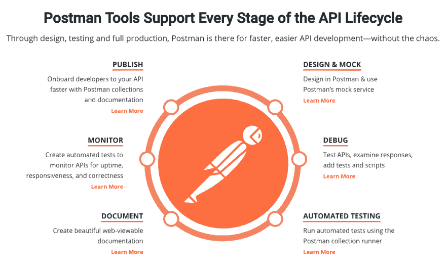
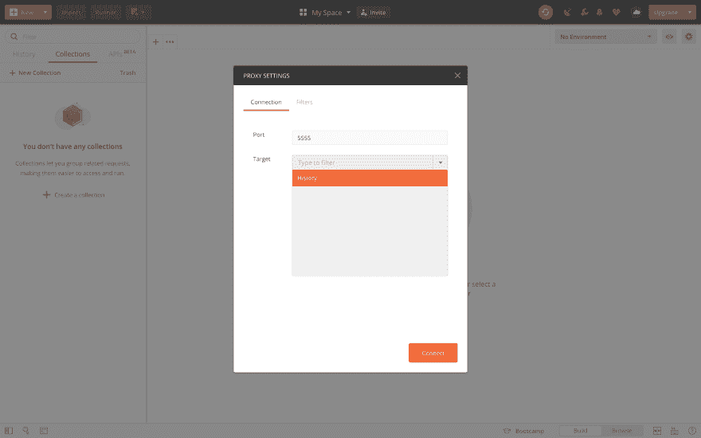
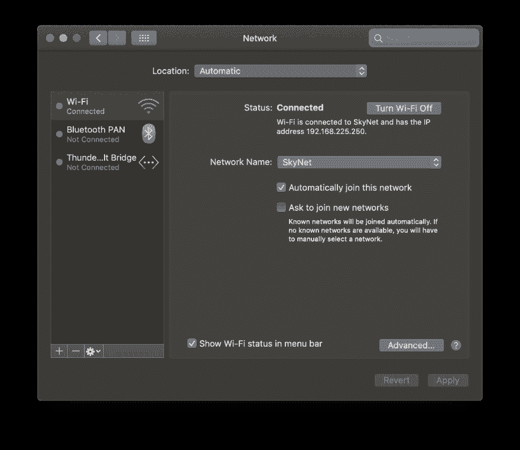
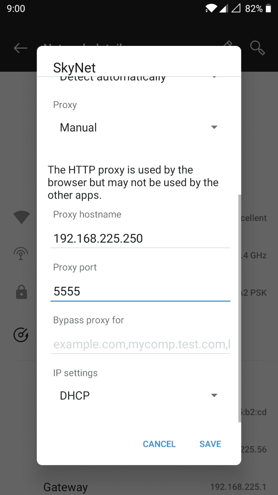
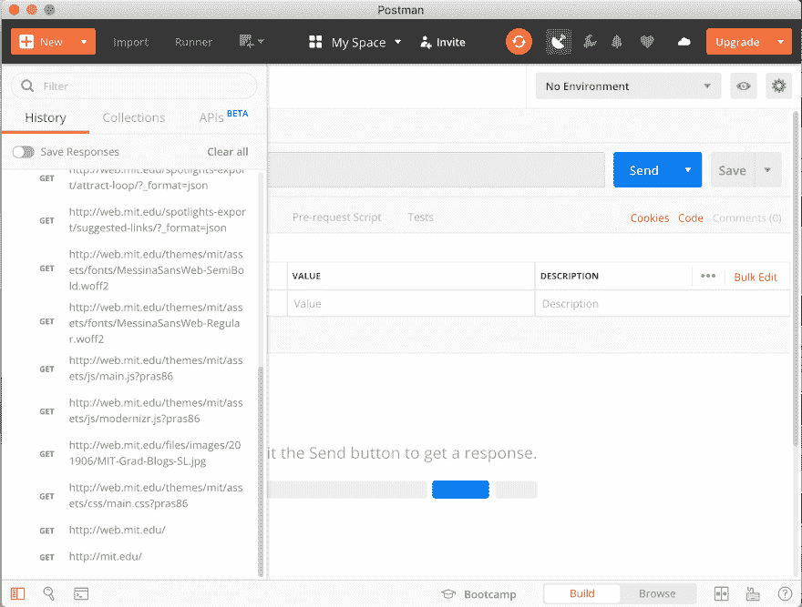

# 如何拦截来自移动设备的 API 调用

> 原文：<https://dev.to/jonathan366/how-to-intercept-api-calls-from-mobile-devices-52pd>

有没有想过，当你的移动应用或移动浏览器从互联网获取数据时，如何在后台捕捉 API 调用？这个快速指南会给你一些答案。

我将使用代理服务器来检查来自移动设备的网络流量。为此，我使用了 Postman 客户端和我的 Android 智能手机。

## 什么是代理服务器？

 
简单来说，代理服务器是客户端和服务器之间的网关。在我们的例子中，我们将使用移动设备作为客户机，让计算机充当客户机和服务器之间的代理。该流的设置方式是，internet 流量在试图到达您请求的 web 地址时通过代理服务器。

## 邮递员是什么？

 
[Postman](https://www.getpostman.com) 是一个迎合 API 生命周期每个阶段的 API 开发环境。它被全球超过 700 万开发者使用。Postman 代理是 Postman 客户端上现成可用的特性之一。

## 使用 Postman 捕获 API 调用

1.  首先，我们需要将计算机和移动设备连接到同一个无线网络。我将使用 Mac 笔记本电脑和 Android 智能手机。

2.  单击顶部菜单栏中的代理设置按钮。
    [T3】](https://res.cloudinary.com/practicaldev/image/fetch/s--LbXpIu3N--/c_limit%2Cf_auto%2Cfl_progressive%2Cq_auto%2Cw_880/https://thepracticaldev.s3.amazonaws.com/i/gpsa4ef95t67xd5lyq08.png)

3.  代理设置模式应该显示。记下提到的端口。我就用默认的帖子“5555”。选择要捕获请求的目标。我将使用“历史”侧边栏面板。点击连接。
    [T3】](https://res.cloudinary.com/practicaldev/image/fetch/s--EyqFAUck--/c_limit%2Cf_auto%2Cfl_progressive%2Cq_auto%2Cw_880/https://thepracticaldev.s3.amazonaws.com/i/sk4gp0cimttnj52lh4ml.png)

4.  找到你的电脑的 IP 地址。您应该在网络设置中看到这一点。
    [T3】](https://res.cloudinary.com/practicaldev/image/fetch/s--NYHoslMi--/c_limit%2Cf_auto%2Cfl_progressive%2Cq_auto%2Cw_880/https://thepracticaldev.s3.amazonaws.com/i/pietuybxrooma9wl99l8.png)

5.  在移动设备上配置 HTTP 代理。你可以通过设置-> Wi-Fi 并选择修改网络选项来实现。输入计算机的 IP 地址作为您的代理主机。将代理端口设置为与邮差 app 中的端口相同，即 5555。
    [T3】](https://res.cloudinary.com/practicaldev/image/fetch/s--I5ZKdsQx--/c_limit%2Cf_auto%2Cfl_progressive%2Cq_auto%2Cw_880/https://thepracticaldev.s3.amazonaws.com/i/qbqinv95qz1xcgdtsdo6.jpg)

你应该让一切正常运转！

在移动设备或任何应用程序上打开浏览器，并关注邮递员应用程序。我在我的安卓 Chrome 浏览器中输入了 www.mit.edu。当浏览器开始联系服务器时，所有的呼叫开始出现在 Postman 侧边栏中。
T3T5】

## 你能在哪里使用这个？

*   帮助您理解客户端和服务器之间的通信。从安全角度来看，这对于突出恶意请求可能是有用的。
*   通过查明应用程序崩溃或抛出错误的位置，使调试变得更加容易。
*   识别移动设备之间的行为差异(基于硬件和分辨率)，这有助于隔离在某些设备上看到的错误。

**注:**

*   Postman 目前在代理功能中仅支持 HTTP 流量。预计不久将增加对 HTTPS 的支持。