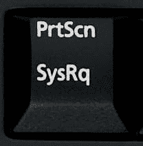

# 有用的 linux 守护进程，带来更好的 PC 体验

> 原文：<https://dev.to/bemyak/useful-linux-daemons-for-better-pc-experience-560>

你好，戴夫·托！

Linux 是很棒的操作系统，但是它的默认行为通常是为服务器优化的。由于越来越多的开发人员使用它作为他们的主要操作系统，我认为分享几个有用的守护进程会让这种体验更流畅一点。

我故意不包括任何安装说明，以保持发行版无关性。如果您对其中的一个感兴趣，并想在您的系统中安装它，请仔细阅读安装和配置说明。我不想破坏你的系统:)

## Irqbalance

## [IRQ balance](https://github.com/Irqbalance)/[IRQ balance](https://github.com/Irqbalance/irqbalance)

### irqbalance 源码树——IRQ balance 的新官方网站

<article class="markdown-body entry-content container-lg" itemprop="text">

# 什么是 Irqbalance

Irqbalance 是一个守护进程，帮助平衡所有系统 cpu 中由中断产生的 CPU 负载。Irqbalance 识别最大容量的中断源，并将每个中断源隔离到一个唯一的 cpu 上，以便负载尽可能分散到整个处理器集，同时最大限度地降低 irq 处理程序的缓存未命中率。

## 建筑安装 [](https://travis-ci.org/Irqbalance/irqbalance)

```
./autogen.sh
./configure [options]
make
make install
```

Enter fullscreen mode Exit fullscreen mode

## 发展 Irqbalance

Irqbalance 目前托管在 github 上，因此欢迎开发人员使用那里的发布/拉取请求/etc 基础设施。

## 错误报告

当出现问题时，请随时通过上述方式之一向我们发送错误报告。您的报告应包括:

*   您一直使用的 Irqbalance 版本(或提交哈希)
*   `/proc/interrupts`输出
*   `irqbalance --debug`输出
*   smp_affinity 文件的内容-可以通过`$ for i in $(seq 0 300); do grep . /proc/irq/$i/smp_affinity /dev/null 2>/dev/null;`等方式获得

</article>

[View on GitHub](https://github.com/Irqbalance/irqbalance)

上面的描述在实践中意味着什么？假设我们正在运行 Intellij Idea，它决定现在是更新索引的好时机——就在我们正在观看一部好电影或 peertube 视频的编译过程中。

这个守护进程会尽量让这个“繁重”的进程远离我们的视频线程。这意味着尽管 cpu 过载，系统也不会“挂起”:光标会响应，视频会继续播放。

很好的东西，对吧？

## 已经过了

## [jirka-h](https://github.com/jirka-h)/[haged](https://github.com/jirka-h/haveged)

### 熵守护进程！【持续集成】(https://github . com/jirka-h/have ged/workflows/Continuous % 20 Integration/badge . SVG)

<article class="markdown-body entry-content container-lg" itemprop="text">

[](https://github.com/jirka-h/haveged/workflows/Continuous%20Integration/badge.svg)

一个熵源

重要更新

从 Linux 内核 v5.6 开始，已经过时的**服务**已经过时。用户空间应用程序和 haveged 库不受影响。这有两个主要原因:

1.  主线 Linux 内核现在已经有了内置的算法，见 [LKML 的文章。](https://lore.kernel.org/lkml/alpine.DEB.2.21.1909290010500.2636@nanos.tec.linutronix.de/T/)

2.  此外，一旦 CRNG(Linux 加密强度随机数生成器)准备就绪，`/dev/random`就不再阻塞读取。参见[内核提交。](https://github.com/torvalds/linux/commit/30c08efec8884fb106b8e57094baa51bb4c44e32)

我很高兴这些改变进入了主线内核。很高兴看到 HAVEGED 背后的主要思想经受住了时间的考验——它已经于 2003 年在这里发表了。

我也很高兴 HAVEGE 算法正在被进一步探索和检验——参见 [CPU 抖动随机数生成器。](https://www.chronox.de/jent.html)

我会继续保持 haged——有几个原因:

*   大多数 Linux 安装仍然运行在…

</article>

[View on GitHub](https://github.com/jirka-h/haveged)
In linux we have two random generators:`/dev/randon` and `/dev/urandom`. The first one is really fast, but it is predictable: one should not use it for any security-related things. The second one is more reliable, but can be very slow sometimes.

原因是内核必须从外部来源(如 CPU 温度、风扇转速等)收集足够多的熵来给你一个真正的随机数。即使在启动后很长一段时间，系统可能会耗尽熵，进程将不得不等待，直到有足够的熵。

我多次遇到这种情况，例如当我试图在系统启动后通过`ssh`连接时。该进程刚刚“挂起”。

为了避免这种问题，你可以安装`haveged`守护进程。它使用额外的算法来更快地填充熵设备，并确保总是有足够的熵设备。

## fstrim

由于固态硬盘的架构，它们的内存块在被访问时会“磨损”。因此，在所有块之间均匀地重新分配负载是一个好主意。要做到这一点，我们必须定期对驱动器上的数据进行洗牌。

这种操作被称为修剪，它可以大大延长您的驱动器的寿命。更多细节和说明可在[这里](https://www.digitalocean.com/community/tutorials/how-to-configure-periodic-trim-for-ssd-storage-on-linux-servers)找到

## 凌晨

##  [雅各布](https://github.com/rfjakob) / [凌晨](https://github.com/rfjakob/earlyoom)

### Linux 的早期 oom 守护进程

<article class="markdown-body entry-content container-lg" itemprop="text">

# 早期的 oom 守护进程

[](https://github.com/rfjakob/earlyoom/actions/workflows/ci.yml)[](https://github.com/rfjakob/earlyoomLICENSE)[](https://github.com/rfjakob/earlyoom/releases)[](https://lgtm.com/projects/g/rfjakob/earlyoom/alerts/)[](https://lgtm.com/projects/g/rfjakob/earlyoom/context:cpp)

oom 杀手通常在 Linux 用户中名声不佳。这可能是 Linux 只有在别无选择时才调用它的部分原因，它将交换出桌面环境，丢弃整个页面缓存并清空每个缓冲区，直到最终杀死一个进程。至少我认为它会这样做。我还没有足够的耐心去等待它，坐在一个没有反应的系统前。

这让我和其他人想知道这个 oom 杀手是否可以被配置为更早介入: [reddit r/linux](https://www.reddit.com/r/linux/comments/56r4xj/why_are_low_memory_conditions_handled_so_badly/) 、superuser.com、unix.stackexchange.com。

事实证明，不，不能。然而，至少在用户空间使用内核中的 oom-killer，我们可以做任何我们想做的事情。

## 它是做什么的

earlyoom 检查可用内存和自由交换空间的大小，最多可达 10…

</article>

[View on GitHub](https://github.com/rfjakob/earlyoom)
Remember when we decided to launch Intellij Idea while watching a video? Let's imagine that we have only 8Gb of RAM - the amount that is totally insufficient for this (ARGH!).

这个想法的 JVM 将首先吃掉所有的`Xms`然后是所有的`Xmx` RAM，然后我们将把`Xmx`扩展到 6Gb，但是还有一个`PermGen`存储空间和一部电影，你可能还想运行浏览器。结果很简单——我们的内存严重不足。

在这种情况下，linux 有一种叫做 OOM-killer 的特殊机制。当事情变得像上面的例子一样糟糕时，linux 只是找到最“贪婪”的进程并杀死它，这样其他进程就能保持安全和存活。如果不这样做，那么计算机将一直运行它无法满足的“繁重”请求，并且没有资源做其他事情:系统将会挂起。

所以，OOM-killer 是你的朋友。它的问题是:它通常来得太晚了。linux 将首先尝试把你所有内存块移动到磁盘驱动器上的交换分区，从那时起，你的桌面环境将冻结，整个系统将变得没有反应。很久以后，当 linux 确保只剩下一条路的时候，他会召唤杀手。不幸的是，这种行为是不可配置的(但是您可以手动调用它，请参考下一节)。

在这种情况下可以帮助你。来自文档:

> earlyoom 每秒钟最多检查 10 次可用内存和可用交换空间的数量(如果有大量可用内存，则检查次数会更少)。默认情况下，如果两者都低于 10%，它将终止最大的进程。

## [SysRq](https://en.wikipedia.org/wiki/Magic_SysRq_key)

###### 嗯，从技术上来说，它根本不是一个守护进程，但它仍然符合“防止您的系统变得无响应”的技巧列表。

Windows 中缺少`Ctrl` + `Alt` + `Del`？当事情变得糟糕，我们想以某种方式恢复系统时，它是生命的救星。在 linux 中，我们有一个更好的解决方案，但是您必须首先启用它。

[](https://res.cloudinary.com/practicaldev/image/fetch/s--dc8mCCd5--/c_limit%2Cf_auto%2Cfl_progressive%2Cq_auto%2Cw_880/https://upload.wikimedia.org/wikipedia/commons/e/ec/Printscreen1.jpg)

还记得你键盘上奇怪的`SysRq`键吗？太神奇了！不，真的，我们把涉及它的快捷方式叫做[神奇的 SysRq 键](https://en.wikipedia.org/wiki/Magic_SysRq_key):)。您有两种方法来启用它:

*   将`sysrq_always_enabled=1`添加到内核引导参数中
*   将`kernel.sysrq=1`添加到`sysctl`配置中(通常是`/etc/sysctl.conf`或`/etc/sysctl.d/99-sysctl.conf`

之后，标题链接中的整个命令列表变得可用。最有用的:

*   `SysRq` + `F`:呼唤 OOM 杀手
*   `SysRq` + `R`、`E`、`I`、`S`、`U`、`B`:安全地将缓存转储到驱动器并执行重新启动。

这些组合键由内核直接处理，如果没有其他帮助，它们将帮助您恢复(或安全重启)。

## 失败 2 班

## [fail2 ban](https://github.com/fail2ban)/[fail2 ban](https://github.com/fail2ban/fail2ban)

### 守护进程禁止导致多个身份验证错误的主机

<article class="markdown-body entry-content container-lg" itemprop="text">

```
 __      _ _ ___ _               
                    / _|__ _(_) |_  ) |__  __ _ _ _  
                   |  _/ _` | | |/ /| '_ \/ _` | ' \ 
                   |_| \__,_|_|_/___|_.__/\__,_|_||_|
                   v1.0.1.dev1            20??/??/?? 
```

## Fail2Ban:禁止导致多个身份验证错误的主机

Fail2Ban 扫描类似`/var/log/auth.log`的日志文件，并禁止 IP 地址进行太多失败的登录尝试。它通过更新系统防火墙规则来拒绝来自这些 IP 地址的新连接，并持续一段可配置的时间。Fail2Ban 是现成的，可以读取许多标准日志文件，比如 sshd 和 Apache 的日志文件，并且可以很容易地配置为读取您选择的任何日志文件，针对您希望的任何错误。

虽然 Fail2Ban 能够降低不正确身份验证尝试的比率，但它无法消除弱身份验证带来的风险。设置服务时只使用两个因素，或者如果您真的想使用公共/私有身份验证机制…

</article>

[View on GitHub](https://github.com/fail2ban/fail2ban)
Once I developed a web application at work and had a web server running in developer mode with logging all request. I forgot to turn it off before heading home and when I came back to an office in the morning - I was surprised! The log file was filled with tons of strange requests like:

```
404 GET /phpmyadmin/index.php
404 GET /ldap-accont-manager/index.php
404 GET /nextcloud/index.php 
```

Enter fullscreen mode Exit fullscreen mode

此外，ssh 日志中充满了无效的身份验证尝试。我通知了我们的安全专家，他承认是他扫描了网络以找到弱点:)

不管怎样，我认为这种情况很危险——你可以坐在 Moonbucks 喝咖啡，同时有人强迫你输入 ssh 密码。为防止这种攻击，请参见`fail2ban`。

这个守护进程监视各种应用程序(apache、ssh 等等)的日志，以发现无效的身份验证尝试。如果来自一个特定 ip 的计数超过阈值，该 ip 将使用`iptables`规则被阻止一段时间。保持安全:)

## 结论

希望你喜欢这个(我的第一个)帖子。如果你会发现任何错别字或错误-请 PM 我。如果你有什么建议或要补充的，请留下你的评论。祝您愉快！