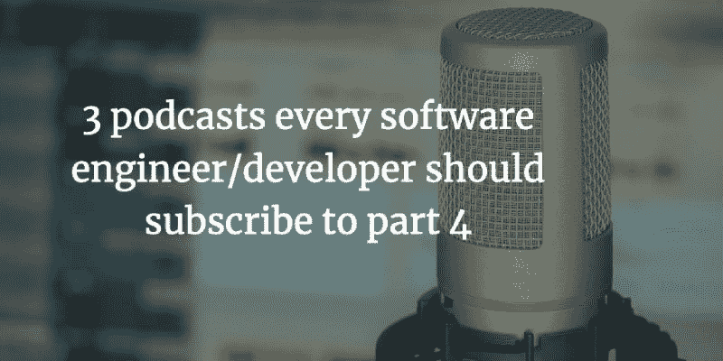
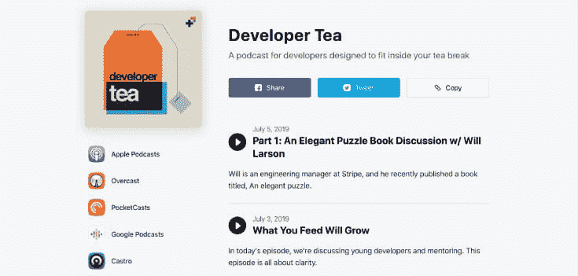
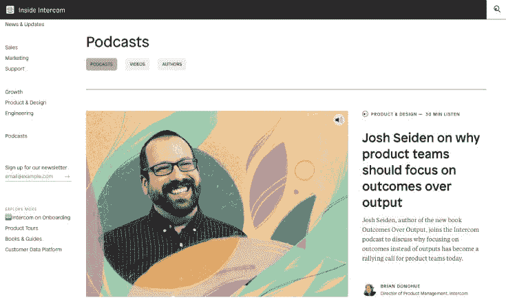

# 每个软件工程师/开发人员都应该订阅的播客——第 4 部分

> 原文：<https://dev.to/geshan/podcasts-every-software-engineer-developer-should-subscribe-to-part-4-mhg>

播客是学习新事物的好方法，即使对于懒惰的读者来说。如果你阅读速度不快或者不太喜欢，播客可以让你不费吹灰之力获得信息。这比读书容易。这是播客系列的第 4 部分(请务必查看第 1 部分和第 2 部分和第 3 部分),作为一名软件工程师，你必须订阅和收听播客。和前三次一样，下面列出的三个播客内容很棒，音质也相当好。以下是列表:

### [开发商茶由乔纳森](https://spec.fm/podcasts/developer-tea)

Developer Tea 是一个非常值得一听的播客。Jonathan 有时会接受采访，大多数时候是关于软件工程相关话题的演讲。最近关于年中决心的一集强烈提醒我们，一年的一半已经过去，不到六个月，我们将到达 2020 年。

### [敏捷的思想靠敏捷的黑色](http://agilenoir.biz/agilethoughts/)

简单地说，敏捷思想是非传统的播客。不要被播客不寻常的封面吓到，内容很好。主要是一些人物的对话，集很短，解决日常问题。我记得第 29 集[TDD 赋予领导力的价值](https://agilenoir.biz/podcast/029-the-value-tdd-gives-to-leadership/)是一个有趣的问题。

### [内线对讲机](https://www.intercom.com/blog/podcasts/)

Inside intercom 是一个出色的播客，专注于产品方面，而不仅仅是技术方面。最近一集关于[为什么产品团队应该关注结果而不是产出](https://www.intercom.com/blog/podcasts/josh-seiden-on-why-product-teams-should-focus-on-outcome-vs-output/)令人大开眼界。

## 结论

> 希望你通过以上有趣的播客继续你的学习之旅。继续学习！

* * *

*原载于 2019 年 7 月 8 日[https://geshan.com.np](https://geshan.com.np/blog/2019/07/podcasts-every-software-engineer-slash-developer-should-subscribe-to-part-4/)。*