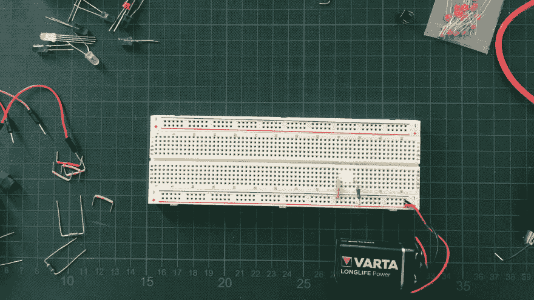
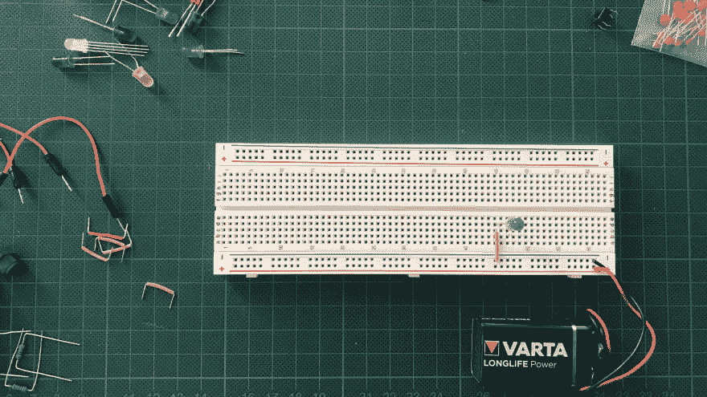
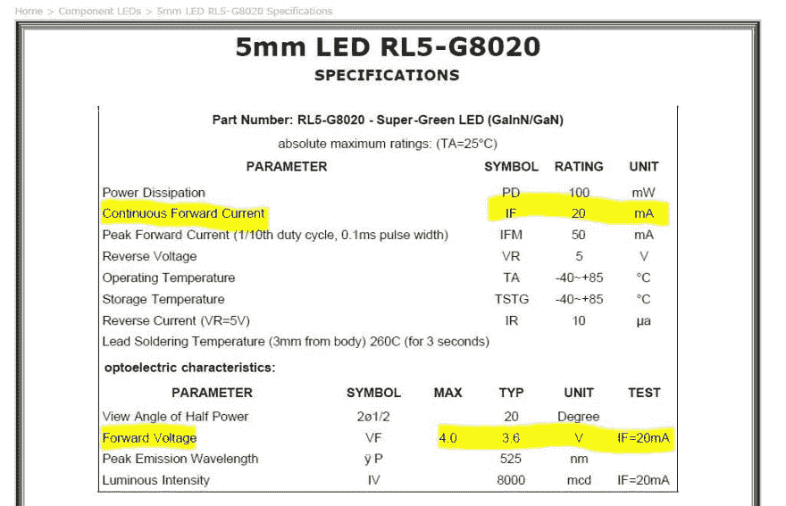

# “你好世界”电路

> 原文：<https://dev.to/hinsencamp/the-hello-world-circuit-1ggf>

[](https://res.cloudinary.com/practicaldev/image/fetch/s--QPrpVPlk--/c_limit%2Cf_auto%2Cfl_progressive%2Cq_auto%2Cw_880/https://dev-to-uploads.s3.amazonaws.com/i/xv6ahp9auepw6g4wx4lc.jpg)

本指南展示了如何建立一个简单的电路，相当于一个“hello world”程序。这是#100DaysofHardware - A challenge 的一部分，我率先帮助像我一样的其他人了解电子、微控制器以及最终的物联网。

欢迎大家加入挑战！我在 twitter 上，如果你需要任何帮助，请联系我，或者在#100daysOfHardware 下分享你自己的进展。

规划我对电子产品的深入研究，确实让我感到力不从心，直到我找到了一条穿越复杂性的途径。结果是这个指南让我从很浅的水开始。

### LED、电池、电阻——仅此而已！

这第一个电路的美妙之处在于，每个人都可以完成它，而无需对电子学有更深的理解。这也很容易推理。它仅由三个部分组成:

*   电源(电池或电源适配器)
*   发光二极管
*   电阻器

如何连接组件是我们今天唯一需要弄清楚的事情。

为了顺利开始，我建议买一个电子初学者工具包。外面有很多品牌，任何一个都可以。最重要的是，你要有一块面包板、一个电源和一些基本的电子元件和跳线。

虽然我在电子学理论的科学深度中迷失了几次，但对今天的项目来说真正重要的部分来了:

### 电子在电路中从电源的一端流向另一端

为了正确插入 LED，重要的是要理解电基本上只是电子通过电路从电源的一端流到另一端。

这两个终端可以通过它们的电荷来区分。一个总是比另一个更积极。因此，端子通常标有红色加号和黑色减号。

许多电子元件只有当电流以正确的方向流过时才能工作。这位领导，就是其中之一。

LED 有两条腿，一条比另一条长。这是 LED 的正极，称为“阳极”，而较短的一条是负极，称为“阴极”。

如果你想更详细地了解 led，我可以推荐一篇很棒的文章。您可以在下面的参考资料中找到它！

有了这第一个关于电子学的基础知识，我已经能够设置第一个电路的 75%。

当你面前有你的面包板时，看起来应该和这里的图相似。

确保您将 LED 的阴极(长腿侧)与面包板的正极轨相连。如果您想更好地了解试验板的工作原理，可以在下面的参考资料中找到另一个链接。

如图所示，我使用标准 9V 电池作为电源。一些 start 套件还配有电源适配器。这些都有各种各样的特性，你们现在都应该忽略，它只与它提供多少电压有关。我见过一些 3.3V 和 5V 的。原因在于，它与您使用的电源无关，这是因为第三个元件——电阻。

[](https://res.cloudinary.com/practicaldev/image/fetch/s--JR7nz-_B--/c_limit%2Cf_auto%2Cfl_progressive%2Cq_auto%2Cw_880/https://dev-to-uploads.s3.amazonaws.com/i/etip294otx3moka8k0ol.jpg)

我的第一反应是用一根普通的电线简单地闭合电路，让电流流动——完成。

嗯，就这么简单。如果你只是用一根电线闭合电路，LED 很可能会立即爆炸，这取决于你的电源电压。

这是因为 LED 无法承受直接来自电源的电压。这就是为什么需要增加电阻的原因。

现在，我们需要找出保护 LED 所需的电阻。

因此，我们使用一个简单的数学公式，这是理解所有这些电子学基础的关键-它被称为“欧姆定律”。

```
R-resistor = (V-powerSource - V-led )/ I-led 
```

<svg width="20px" height="20px" viewBox="0 0 24 24" class="highlight-action crayons-icon highlight-action--fullscreen-on"><title>Enter fullscreen mode</title></svg> <svg width="20px" height="20px" viewBox="0 0 24 24" class="highlight-action crayons-icon highlight-action--fullscreen-off"><title>Exit fullscreen mode</title></svg>

为了了解 LED 的电压和电流，我不得不查看 starter kit 品牌提供的 pdf 格式的数据手册。

[](https://res.cloudinary.com/practicaldev/image/fetch/s--rDUiIcJZ--/c_limit%2Cf_auto%2Cfl_progressive%2Cq_auto%2Cw_880/https://dev-to-uploads.s3.amazonaws.com/i/sagxmpzooh90n4vflysf.jpg)

根据您的电源和 LED，您最终会得到不同的值。我们要找的电阻是以欧姆为单位测量的。

```
R = (9V - 4V) / 0.02A
R = 250 Ohm 
```

<svg width="20px" height="20px" viewBox="0 0 24 24" class="highlight-action crayons-icon highlight-action--fullscreen-on"><title>Enter fullscreen mode</title></svg> <svg width="20px" height="20px" viewBox="0 0 24 24" class="highlight-action crayons-icon highlight-action--fullscreen-off"><title>Exit fullscreen mode</title></svg>

### 电阻有多大？

对我来说，每一次学习都会引出更多的问题，现在都是关于如何找出电阻的阻值？

有两种方法可以找到它。你可以测量它，如果你有一个万用表或者你可以阅读色带-它们告诉有经验的制造商电阻。由于我既没有经验，也没有万用表，我只是尝试了不同的电阻。

这是我可以推荐的东西。只要你在玩简单的电路，就要尝试一些东西。没有你能弄坏的昂贵设备。测试你读过的理论，验证你的心智模型，打破常规，这样你就知道细节在电子学中很重要。

你猜怎么着，led 对电压有容忍度。如果你选择一个电阻很小或很大的电阻，它不会立刻消失。万一你不小心选择了一个电阻接近于零的电阻，你的 LED 可能会化为乌有。不过，这是一次很好的体验，可以让你开始了解如何选择合适的电阻。

用发光的 LED 完成今天的项目！

总结一下，我们已经成功建立了我们的“hello world”电路。因此，我们已经了解了电流，如何连接 LED，以及电路中电阻利用电流的能力。

### 脑筋急转弯

尝试在 LED 前后插入电阻器。两个都行！这很令人困惑，不是吗？你能找出为什么会这样吗？

### 需要帮助？

这本指南对你有帮助吗？你有问题吗？在 [twitter](https://twitter.com/hinsencamp) 上与我交谈，继续了解电子、微控制器和物联网。

如果你觉得支持我，一定要在 Twitter 上关注和支持我！谢谢大家！🙏

### 进一步写着

*   [如何使用试验板](https://www.instructables.com/id/How-to-use-a-breadboard/)
*   [初学者用发光二极管](https://www.instructables.com/id/LEDs-for-Beginners/)