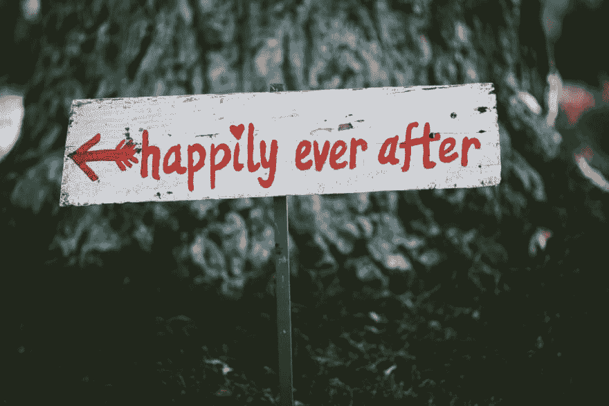
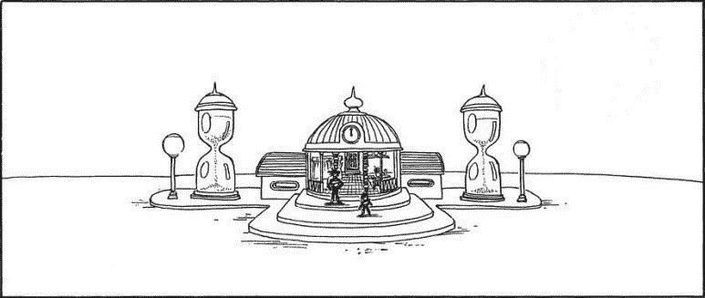

# 从化学家到程序员——我的故事

> 原文：<https://dev.to/seanjun21/from-a-chemist-to-a-programmer-my-story-3oal>

## 2015 年 10 月

那段时间对我来说真的很艰难。我有两个学位——生物化学学士学位和生物材料科学硕士学位——但作为一名化学家，我并不出色。我的工资只有每小时 15 英镑。由于公司的财务危机，我被降职为兼职。后来发现我赚了大约 16K。在此之前，我的大部分工作也是志愿工作(没有报酬的学校研究)。我想那时我想，“好吧，就是这样。我不干了。”

一天晚上下班后，我开始在白板上写下一些随意的想法:

> “我真正爱的是什么？”“有哪些事情我可以花上几个小时而不会感到无聊？”

起初，我在妥协我的答案——和化学有关的东西。由于我的生活充满了妥协，我不得不尽可能得到最俗气的答案。基本上，它归结为两个选择-足球和电子游戏。我怎样才能成为这些领域的专业人士？

嗯，我当时 29 岁，所以成为这两个领域的职业选手几乎是不可能的。

> “专业游戏开发者呢？”

* * *

## 2015 年 11 月

事情就是这样开始的。我从 Udemy 购买了我的第一个编程课程“通过制作游戏学习编码——完整的 C# Unity Developer ”,作者是 Ben Tristem。我开发的第一个程序(或游戏)是一个文本冒险游戏。在大约一个月的游戏开发之后，我承认这——编程——比我的实际工作更有趣。

## 2015 年 12 月-2016 年 2 月

我决定更认真地对待它。在完成 Codecademy 的 JavaScript 堆栈后，我开始寻找更难的学校或课程。接下来是 Udacity 对编程和前端纳米学位的介绍。我想那是我第一次听说“编码训练营”这个概念的时候也是在这个时候，我想到了辞职，开始全职学习编程。

* * *

## 2016 年 3 月

讽刺的是，我就在这个时候结婚了。我记得在婚礼的前一天，我告诉(几乎是坦白)我的妻子，我要辞职，去追求新的事业。她还是嫁给了我(！)而简单地说，

> “做你该做的事。我相信你能做到。”

结婚仪式后，我妻子留在了韩国。她必须等待她的配偶签证处理，这通常需要大约 8 个月。所以，我想 4-5 个月的训练营+ 3 个月的找工作=会让我在最佳时机找到一份工作。

## 2016 年 4 月-6 月

当我连续两次未能进入 Hack Reactor(科幻小说中流行的训练营)时，我在 8 个月内完成过渡的计划被破坏了。在这一点上，我对自己做出的决定感到非常沮丧——辞去化学家的工作，支付 700 英镑参加训练营预备课程，等等。事实证明，我做的最好的事情是参加黑客反应堆准备课程，因为我交了一些朋友，他们最终向我介绍了另一个训练营。他们接受学生的方式要宽松得多，其他一切——价格、在线设置、时间安排——都满足了我的需求。我马上注册了。

* * *

## 2016 年 6 月-10 月

在这段时间里，我感觉自己就像双曲室里的悟空。课程表从早上 7 点到下午 3 点。然后，在一个私人导师会议后，又回到学习，直到凌晨 2 点。周末是我补上一周错过的事情的时间。我的父母在经济上和情感上都非常支持我。我把整整 4 个月的时间都花在了编程上——没有朋友，没有足球，没有阳光(好吧，也许不是那样)。2016 年 10 月 7 日毕业。就在第二天，(兴奋地)我去了附近的一个招聘会，这时我听到了:

> “你简直一文不值。”

我想他(我朋友的老板)是对的。我的意思是，他们在寻找一个 C#开发人员，而我是这个没有 ASP.NET 背景的 JavaScript 家伙。但是，仍然…那伤害了我。

## 2016 年 10 月-11 月

我取消了所有短期旅行计划，开始购买大量编程书籍。

> “如果你认为我一文不值，我要证明你错了。”

我记得我遵循了一个比训练营更严格的学习计划。在最初的 95 份工作中，我申请了 19 份。在 19 份回复中，我接受了 9 次采访。很快，我的妻子来到了美国，但我确信我能在一个月内得到这份工作。然后，感恩节来了。

* * *

## 2016 年 11 月-12 月(完)

HR 也是人。他们吃火鸡，然后忘了你。至少我想相信是这样。正在进行的 9 次面试中，所有的事情都被搁置了。没有人回复我的后续邮件。我有一个技术家庭挑战，要求我建立一个堆栈。我花了一天时间完成，但没有回应。我开始为我的妻子感到难过。她离开家人朋友去异乡生活(在那里她连话都说不流利)而我失败了。

然后，12 月初左右有一个电话。一名招聘人员打电话来说附近有家公司提供合同面试机会。这是一家非常大的公司，我都懒得去申请了。我想:

> "好吧，我就当它是(一次练习)."

我的态度(进入面试)非常平静，因为没有什么比这更糟糕的了。我已经和我能找到的当地最便宜的公寓签订了租赁协议(400 平方英尺，外面有洗衣机/烘干机)。我的计划是熬过接下来的 4 个月，以防面试变糟。他们在寻找一个有棱角的开发者，而我是一个有反应的人。我尽力说服他们，如果有机会，我可以学习 Angular。但是，我错过了很多被问到的问题，我想我这次肯定不及格。

第二天早上，我正在收拾东西准备搬进新公寓，这时我听到一个电话。招聘人员打电话给我，

> “你得到了这份工作！我真为你高兴！”

老实说，我花了好几个小时才发现这不像是国税局的诈骗电话。他们出价 7.5 万，我协商到 8.5 万。我立即取消了公寓合同，搬到了我能找到的离工作地点最近的最好的公寓。

* * *

## 2016 年 12 月-现在(尾声)

由于我的表现，我与公司的合同被延长到了最长期限。我最终在一个美丽的小镇买了一栋 2000 平方英尺的房子。我转到了一家不同的公司(小得多，但稳定)，现在我已经做了两年多的软件工程师。

如果我说这是我自己做的，那我就是在撒谎。在这条路上，我有家人、朋友、导师、招聘人员和一些好心人帮助我。我希望这篇文章能激励很多人相信这是可能的——并提醒他们没有人是真的一无是处。

谢谢你听我的故事。