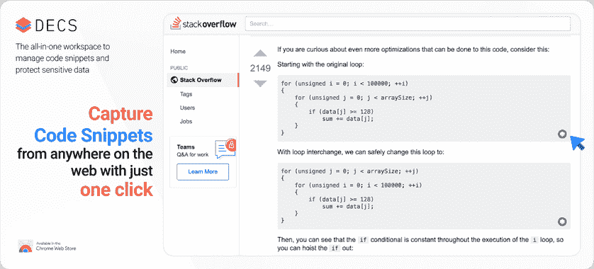
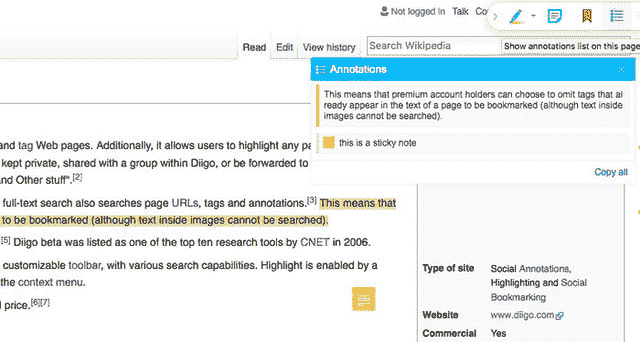

# 必须为数据科学家提供 Chrome 扩展

> 原文：<https://dev.to/tsantosh7/must-have-chrome-extensions-for-data-scientists-249d>

浏览器扩展是一种软件程序，使您能够在不改变任何本机代码的情况下，为您的 web 浏览器定制/添加更多功能。Google Chrome 的成功(拥有约 62.7%的浏览器市场份额)在于它的可扩展性。你可以有一个插件或扩展来实现你可能想要的任何东西。

以下是数据科学家在日常工作中使用的必备 chrome 扩展。

## [网络刮刀](https://chrome.google.com/webstore/detail/web-scraper/jnhgnonknehpejjnehehllkliplmbmhn?hl=en)

数据是数据科学家构建模型所依赖的。状态和数据量通常是决定预测准确性的关键因素。缺乏足够的数据(稀疏)或从劣质数据源中学习会导致过于简单的预测/解决方案。有了正确的工具来获取和分析，数据科学家可以利用网络上数 Pb 的数据。然而，在现实中，从这些来源提取数据通常需要脚本来完成。

[Web Scraper](https://chrome.google.com/webstore/detail/web-scraper/jnhgnonknehpejjnehehllkliplmbmhn?hl=en) 是一个可以从网页中提取文本、数字、内容的工具。他们的 Chrome 浏览器扩展已经建立，特别是在几分钟内免费从网页中提取数据。使用这个扩展，您可以创建一个计划(sitemap ),告诉我们如何遍历一个网站以及要提取什么。使用这些网站地图，[网页抓取器](https://chrome.google.com/webstore/detail/web-scraper/jnhgnonknehpejjnehehllkliplmbmhn?hl=en)然后相应地导航网站并提取相关数据。稍后抓取的数据可以导出为 CSV 格式。将该扩展放入必备列表的 [Web Scraper](https://chrome.google.com/webstore/detail/web-scraper/jnhgnonknehpejjnehehllkliplmbmhn?hl=en) 的核心特性是抓取多个页面的能力、各种数据选择类型、从动态页面提取数据(JavaScript+AJAX)及其导出功能。

## [DECS](https://chrome.google.com/webstore/detail/decs-code-snippets-manage/mkclebnkdjjpamialfgieminnkdepbcl?hl=en)

我们都在网上搜索代码。数据科学家通常依靠脚本来执行和自动化重复性任务。有多少次，我们痛苦地重复步骤，再次回到同一段代码上？这些通常用于预处理或机器学习(分类或回归或聚类)管道的脚本/代码片段通常保持不变。因此，与其记住特定管道的完整细节并在几个实验/应用中重写相同的代码，不如重用、重构、重新调整用途并审查代码片段。

DECS 是一个去中心化的端到端加密工具，用于管理代码片段。有一些代码片段管理器可用，但数据端到端加密和一键式代码复制功能使其与众不同。代码片段是知识产权，现代工具必须更加重视隐私和用户数据所有权(如果可以选择，我不会选择将我的代码存储在别人的云/服务器上，他们可以在那里查看数据)。有了 [DECS](https://chrome.google.com/webstore/detail/decs-code-snippets-manage/mkclebnkdjjpamialfgieminnkdepbcl?hl=en) -代码片段管理器，你可以保存完全加密的代码片段(在他们的服务器上或任何你想要的地方)，并在几个项目中使用它。

由于数据是加密的，您可以存储您的配置，包括 API 密钥，并且总是只需搜索，从而节省大量时间、精力和金钱。要在顶部添加奶油，使用 [DECS](https://chrome.google.com/webstore/detail/decs-code-snippets-manage/mkclebnkdjjpamialfgieminnkdepbcl?hl=en) 浏览器扩展，只需点击一下，您就可以捕捉到吸引您眼球的片段(网页上的任何地方，包括堆栈溢出)，并永久存储它们以供将来使用。

## [Diigo 网页收集器](https://chrome.google.com/webstore/detail/diigo-web-collector-captu/pnhplgjpclknigjpccbcnmicgcieojbh?hl=en)

Diigo 是一个用于注释、存档和书签网页的有用扩展。使用这个易于使用的工具，您可以将链接添加到书签中，以存档网页或稍后阅读。Arxiv、Medium blogs 上几篇与数据科学相关的新论文可以加入书签，也可以用重点内容&便笺进行注释。

注释也可以通过社交媒体共享，例如通过 Twitter 和 Linkedin。此外，它可以在任何地方访问，通过 iPhone，iPad ( [Appstore](https://apps.apple.com/gb/app/diigo-your-learning-simplified/id933773981) )，Android ( [Playstore](https://play.google.com/store/apps/details?id=com.diigo.android) )。

总而言之，这个 chrome 扩展可以用来创建书签，分组来汇集发现，共享资源，最后用于管理内容，特别是建立你的训练数据。

这是数据科学家在日常工作中使用的三个必备的 chrome 扩展。你觉得这份名单怎么样？如果你有其他对数据科学家来说超级有用的 chrome 扩展，请告诉我。