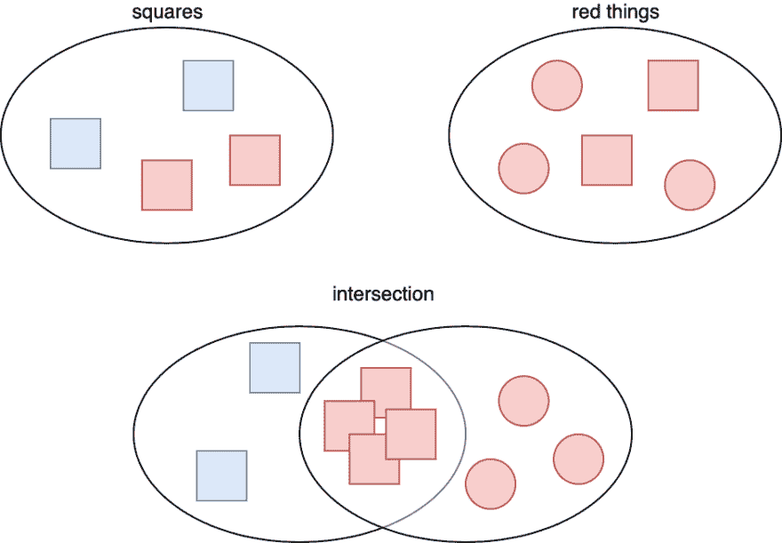

# 并集和交集类型的含义

> 原文：<https://dev.to/miloszpp/the-meaning-of-union-and-intersection-types-hk1>

联合类型在 TypeScript 中相当流行。你可能已经多次使用它们了。交叉点类型稍微不太常见。它们似乎会引起更多的困惑。

你有没有想过这些名字是从哪里来的？虽然您可能对什么是两种类型的并集有一些直觉，但是交集通常不是很好理解。

阅读完本文后，您将对这些类型有更好的理解，这将使您在代码库中使用它们时更加自信。

## 简单联合类型

联合类型通常与`null`或`undefined`一起使用。

```
const sayHello = (name: string | undefined) => { /* ... */ }; 
```

Enter fullscreen mode Exit fullscreen mode

例如，这里的`name`的类型是`string | undefined`，这意味着可以将`string`或`undefined`值传递给`sayHello`。

```
sayHello("milosz");
sayHello(undefined); 
```

Enter fullscreen mode Exit fullscreen mode

看一下这个例子，你可以直觉地知道类型`A`和`B`的并集是一个同时接受`A`和`B`值的类型。

## 对象类型的并集和交集

这种直觉也适用于复杂类型。

```
interface Foo {
    foo: string;
    xyz: string;
}

interface Bar {
    bar: string;
    xyz: string;
}

const sayHello = (obj: Foo | Bar) => { /* ... */ };

sayHello({ foo: "foo", xyz: "xyz" });
sayHello({ bar: "bar", xyz: "xyz" }); 
```

Enter fullscreen mode Exit fullscreen mode

`Foo | Bar`是具有`Foo`的所有必需属性或`Bar`的所有必需属性的类型。在`sayHello`里面，只能进入`obj.xyz`，因为这是唯一包含在两种类型中的酒店。

那么`Foo`和`Bar`的交集是什么呢？

```
const sayHello = (obj: Foo & Bar) => { /* ... */ };

sayHello({ foo: "foo", bar: "bar", xyz: "xyz" }); 
```

Enter fullscreen mode Exit fullscreen mode

现在`sayHello`要求参数同时具有`foo`和`bar`属性。在`sayHello`内，可以访问`obj.foo`、`obj.bar`和`obj.xyz`。

嗯，但这跟*路口*有什么关系？有人可能会说，既然`obj`同时具有`Foo`和`Bar`的属性，它听起来更像是属性的联合，而不是交集。类似地，两个对象类型的联合给你一个只有组成类型的属性交集的类型。

听起来很困惑。我甚至在 TypeScript 存储库中偶然发现了一个关于这些类型命名的 GitHub 问题。为了更好地理解命名，我们需要从不同的角度来看类型。

## 集合论

你还记得数学课上一个叫做*集合*的概念吗？在数学中，集合是对象的集合(例如数字)。例如，`{1, 2, 7}`是一个集合。所有的正数也可以构成一个集合(一个无限的集合)。

器械包可以加在一起(一个**联合**)。`{1, 2}`和`{4, 5}`的并集是`{1, 2, 4, 5}`。

集合也可以相交。两个集合的交集是只包含两个集合中都存在的那些数的集合。所以，`{1, 2, 3}`和`{3, 4, 5}`的交集就是`{3}`。

我们来想象两组:`Squares`和`RedThings`。

`Squares`和`RedThings`的并集是既包含正方形又包含红色事物的集合。

然而，`Squares`和`RedThings`的交集是一个只包含**红色方块**的集合。

[](https://res.cloudinary.com/practicaldev/image/fetch/s--L8aGCZiU--/c_limit%2Cf_auto%2Cfl_progressive%2Cq_auto%2Cw_880/https://thepracticaldev.s3.amazonaws.com/i/tpbziuorp9smrysig3kw.png)

## 类型与集合的关系

计算机科学和数学在许多地方有重叠。其中一个地方就是类型系统。

从数学的角度来看，一个类型是该类型所有可能值的**集合**。例如，`string`类型是一组所有可能的字符串:`{'a', 'b', 'ab', ...}`。当然是无限集。

同样，`number` type 是所有可能数字的集合:`{1, 2, 3, 4, ...}`。

类型`undefined`是只包含一个值的集合:`{ undefined }`。

对象类型呢(比如接口)？类型`Foo`是包含`foo`和`xyz`属性的所有对象的集合**。**

## 了解并集和交集类型

有了这些知识，您现在就可以理解并集和交集类型的含义了。

联合类型`A | B`表示一个集合，该集合是与类型`A`相关联的值集合和与类型`B`相关联的值集合的联合。

交集类型`A & B`表示与类型`A`相关联的值集和与类型`B`相关联的值集的交集。

因此，`Foo | Bar`表示**具有`foo`和`xyz`属性的对象集合和具有`bar`和`xyz`属性的对象集合的并集**。属于该集合的对象都具有`xyz`属性。其中一些具有`foo`属性，另一些具有`bar`属性。

`Foo & Bar`表示**具有`foo`和`xyz`属性的对象集合与具有`bar`和`xyz`属性的对象集合的交集**。换句话说，集合包含属于由`Foo`和`Bar`表示的集合的对象。只有具备所有三个属性(`foo`、`bar`和`xyz`)的对象才属于交集。

## 现实世界中交集类型的例子

联合类型非常普遍，所以让我们关注一个交集类型的例子。

在 React 中，当你声明一个类组件时，你可以用它的属性类型来参数化它:

```
class Counter extends Component<CounterProps> { /* ... */ } 
```

Enter fullscreen mode Exit fullscreen mode

在类内部，您可以通过`this.props`访问属性。但是，`this.props`的类型不是简单的`CounterProps`，而是:

```
Readonly<CounterProps> & Readonly<{ children?: ReactNode; }> 
```

Enter fullscreen mode Exit fullscreen mode

原因是 React 组件可以接受子元素:

```
<Counter><span>Hello</span></Counter> 
```

Enter fullscreen mode Exit fullscreen mode

组件可以通过`children`属性访问子元素树。`this.props`的类型反映了这一点。它是一个(只读)`CounterProps`和一个带有可选`children`属性的(只读)对象类型的交集。

就集合而言，它是具有在`CounterProps`中定义的属性的对象集合和具有可选`children`属性的对象集合的交集。结果是一组对象既有`CounterProps`的所有属性，又有可选的`children`属性。

## 总结

就是这样！我希望这篇文章能帮助您理解联合和交集类型。正如计算机科学中经常出现的情况，理解基础知识会让你更好地掌握编程概念。

## 想了解更多？

你喜欢这篇打字稿吗？我打赌你也会喜欢我的课程！

## 想了解更多？

你喜欢这篇打字稿吗？我打赌你也会喜欢我的书！

[高级类型脚本](https://typescriptmasterclass.com)