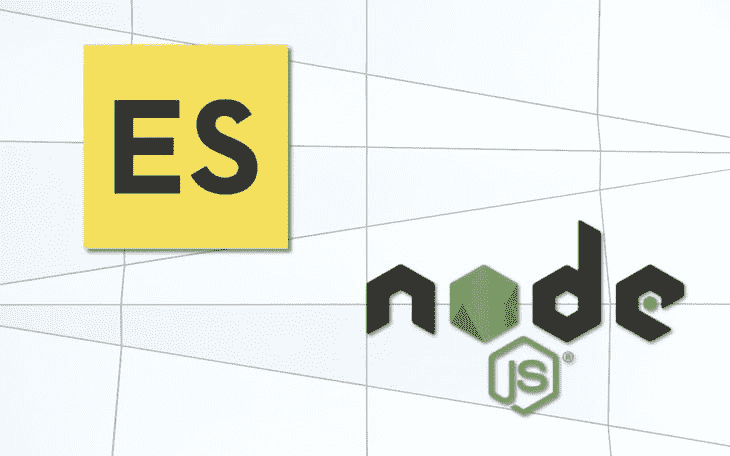
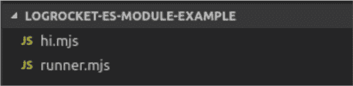
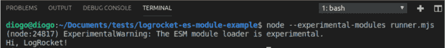
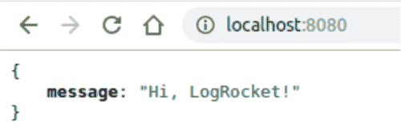

# 如何在 Node.js 中使用 ECMAScript 模块

> 原文：<https://dev.to/bnevilleoneill/how-to-use-ecmascript-modules-with-node-js-5585>

[](https://res.cloudinary.com/practicaldev/image/fetch/s--1fUib7u9--/c_limit%2Cf_auto%2Cfl_progressive%2Cq_auto%2Cw_880/https://thepracticaldev.s3.amazonaws.com/i/5d7kmm87u07l1r4y50th.jpg)

自 2009 年以来，就在 Kevin Dangoor 启动了 CommonJS 项目之后，一场新的讨论开始了，关于 JavaScript 如何更好地适应构建应用程序的过程，不仅要在 web 浏览器中运行，还要将其能力扩大到越来越广泛的可能性。当然，这些必须包括后端世界。

它成功的关键实际上是由于它的 API，它带来了一个丰富的标准库，类似于我们为 Python、Java 等其他语言提供的标准库。今天，多亏了 CommonJS，我们在服务器端应用程序、命令行工具、基于 GUI 的桌面和混合应用程序(Titanium、Adobe AIR 等)中有了 JavaScript。)，还有更多。

无论如何，每次你使用一个`require()`，你实际上是在使用 CommonJS ES 模块的实现——或者只是 ESM，默认情况下它在 Node.js 中。

这是将 ES 模块与 Node 一起使用的第一个问题:CommonJS 已经是一个模块，ESM 必须找到与之共存的最佳方式。这应该不是问题，除了 ESM 是异步加载的，而 CommonJS 是同步加载的。

当谈到像 [Babel](https://babeljs.io/) 和 [webpack](https://webpack.js.org/) 这样的工具时，负载也由同步进程承担，因此考虑到它们允许浏览器和服务器端的应用程序在没有本机支持的情况下运行的同构特性，我们会有一些问题。

在本文中，我们将探索在 Node.js 宇宙中支持这两个世界的旅程已经走了多远。我们将创建几个示例，让您更深入地了解如何迁移您的代码库，以利用 ESM 的强大功能。

[](https://logrocket.com/signup/)

## 简要介绍

如果您是 ES 模块的初学者，让我们仔细看看如何使用它们。如果你曾经使用过 React 或者 Vue.js，你可能会看到这样的东西:

```
import React, {Fragment} from 'react';
// or
import Vue from './vue.mjs'; 
```

<svg width="20px" height="20px" viewBox="0 0 24 24" class="highlight-action crayons-icon highlight-action--fullscreen-on"><title>Enter fullscreen mode</title></svg> <svg width="20px" height="20px" viewBox="0 0 24 24" class="highlight-action crayons-icon highlight-action--fullscreen-off"><title>Exit fullscreen mode</title></svg>

特别是第一个例子，它是一个很好的例子，因为它表达了 es 模块的本质，即什么是默认模块，什么不是。考虑下面的代码片段:

```
export default React; 
```

<svg width="20px" height="20px" viewBox="0 0 24 24" class="highlight-action crayons-icon highlight-action--fullscreen-on"><title>Enter fullscreen mode</title></svg> <svg width="20px" height="20px" viewBox="0 0 24 24" class="highlight-action crayons-icon highlight-action--fullscreen-off"><title>Exit fullscreen mode</title></svg>

我们只能通过文件导出一个默认模块。这就是为什么`Fragment`一旦没有被默认包含，就必须导入到`{ }` s 中。它的出口看起来像:

```
export const Fragment = … ; 
```

<svg width="20px" height="20px" viewBox="0 0 24 24" class="highlight-action crayons-icon highlight-action--fullscreen-on"><title>Enter fullscreen mode</title></svg> <svg width="20px" height="20px" viewBox="0 0 24 24" class="highlight-action crayons-icon highlight-action--fullscreen-off"><title>Exit fullscreen mode</title></svg>

很明显，你可以创建你自己的，就像这样:

```
export const itsMine = 'It is my module'; 
```

<svg width="20px" height="20px" viewBox="0 0 24 24" class="highlight-action crayons-icon highlight-action--fullscreen-on"><title>Enter fullscreen mode</title></svg> <svg width="20px" height="20px" viewBox="0 0 24 24" class="highlight-action crayons-icon highlight-action--fullscreen-off"><title>Exit fullscreen mode</title></svg>

将这段代码保存到一个`mjs`扩展文件中，正如我们在 React 示例中看到的，您可以将它导入到另一个文件:

```
import { itsMine } from './myESTest.mjs'

alert(itsMine); // it'll alert 'It is my module' text 
```

<svg width="20px" height="20px" viewBox="0 0 24 24" class="highlight-action crayons-icon highlight-action--fullscreen-on"><title>Enter fullscreen mode</title></svg> <svg width="20px" height="20px" viewBox="0 0 24 24" class="highlight-action crayons-icon highlight-action--fullscreen-off"><title>Exit fullscreen mode</title></svg>

当我们将扩展名`mjs`与`js`文件进行比较时，它可能会导致一些混淆。对于 JavaScript 规范来说，两者是有区别的。例如，按照定义，模块是严格的(就像在`'use strict'`中一样)，所以这意味着在实现你的 JavaScript 模块时，要进行大量的检查，并且禁止“不安全”的动作。

`js`与`mjs`之争延伸到这样一个事实，即 JavaScript 需要知道它是在处理一个模块还是一个脚本，但是规范到目前为止还没有提供。例如，如果您得到一个 CommonJS 脚本，您不允许在其中使用`'import from'`(只有`require`)，因此他们可以强制每个扩展导入适当的、相应的一个:

*   `mjs import from mjs`
*   `js require js`

那么，下面的场景会发生什么呢？

*   `mjs import from js`
*   `js require mjs`

说到 es 模块，众所周知它们是静态的——也就是说，你只能在编译时“访问”它们，而不能在运行时访问。这就是为什么我们必须把它们放在文件的开头。

### mjs 从 js 导入

这里要注意的第一件事是你不能在一个`mjs`文件中使用`require`。相反，我们必须使用我们之前见过的导入语法:

```
import itsMine from './myESTest.js' 
```

<svg width="20px" height="20px" viewBox="0 0 24 24" class="highlight-action crayons-icon highlight-action--fullscreen-on"><title>Enter fullscreen mode</title></svg> <svg width="20px" height="20px" viewBox="0 0 24 24" class="highlight-action crayons-icon highlight-action--fullscreen-off"><title>Exit fullscreen mode</title></svg>

但前提是默认导入(`module.exports`)已经导出到 CommonJS 文件(`myESTest.js`)。很简单，不是吗？

### js 需要 mjs

但是，当相反的情况发生时，我们不能简单地使用:

```
const itsMine require('./myESTest.mjs') 
```

<svg width="20px" height="20px" viewBox="0 0 24 24" class="highlight-action crayons-icon highlight-action--fullscreen-on"><title>Enter fullscreen mode</title></svg> <svg width="20px" height="20px" viewBox="0 0 24 24" class="highlight-action crayons-icon highlight-action--fullscreen-off"><title>Exit fullscreen mode</title></svg>

记住，ESM 不能通过`require`功能导入。另一方面，如果您尝试使用`import from`语法，我们会得到一个错误，因为 CommonJS 文件不允许使用它:

```
import { itsMine } from './myESTest.mjs' // will err 
```

<svg width="20px" height="20px" viewBox="0 0 24 24" class="highlight-action crayons-icon highlight-action--fullscreen-on"><title>Enter fullscreen mode</title></svg> <svg width="20px" height="20px" viewBox="0 0 24 24" class="highlight-action crayons-icon highlight-action--fullscreen-off"><title>Exit fullscreen mode</title></svg>

多米尼奇·德尼科拉提出了一个通过`import()`函数以多种方式动态导入 ES 模块的过程。请参考链接，了解更多信息。有了它，我们的代码将如下所示:

```
async function myFunc() {
const { itsMine } = await import('./myESTest.mjs')
}
myFunc() 
```

<svg width="20px" height="20px" viewBox="0 0 24 24" class="highlight-action crayons-icon highlight-action--fullscreen-on"><title>Enter fullscreen mode</title></svg> <svg width="20px" height="20px" viewBox="0 0 24 24" class="highlight-action crayons-icon highlight-action--fullscreen-off"><title>Exit fullscreen mode</title></svg>

但是，请注意，这种方法将引导我们使用异步函数。您也可以通过回调、承诺和其他技术来实现这一点，在这里会有更详细的描述[。](http://2ality.com/2017/01/import-operator.html)

*注意:这种类型的导入只能从节点 10+开始使用。*

## 用 ES 模块运行 Node.js

运行 Node.js 和 ES 模块有两种主要方式:

1.  通过标志`--experimental-modules`，其存储平均使用的 MVP
2.  通过一个库，在本例中是 [esm](https://github.com/standard-things/esm) ，它将实现的所有主要部分捆绑在一个地方，简化了整个过程

在 Node GitHub repo 中，您可以找到一个名为“[新模块实现](https://github.com/nodejs/modules/blob/master/doc/plan-for-new-modules-implementation.md)计划”的页面，在这里您可以按照官方计划在 Node.js 中支持 ECMAScript 模块。这项工作分为四个阶段，在撰写本文时，它现在处于最后一个阶段，希望它足够成熟，不再需要使用`--experimental-modules`。

### 使用标志-实验-模块

让我们从 Node.js 提供的第一种(也是官方的)方式开始，在您的节点环境中使用 ES 模块。

首先，如前所述，确保您的机器上的 Node 版本高于 10。您可以使用 [NVM](https://github.com/nvm-sh/nvm) 的能力来管理和升级您当前的版本。

然后，我们将创建一个单独的例子，只是为了让您体验一下模块是如何工作的。创建以下结构:

<figure>[](https://res.cloudinary.com/practicaldev/image/fetch/s--93U6SqL6--/c_limit%2Cf_auto%2Cfl_progressive%2Cq_auto%2Cw_880/https://i0.wp.com/blog.logrocket.com/wp-content/uploads/2019/07/project-structure.png%3Fresize%3D500%252C122%26ssl%3D1) 

<figcaption>我们的项目结构。</figcaption>

</figure>

第一个文件`hi.mjs`将存放一个函数的代码，该函数将连接一个字符串参数并返回一条 hello 消息:

```
// Code of hi.mjs
export function sayHi(name) {
    return "Hi, " + name + "!"
} 
```

<svg width="20px" height="20px" viewBox="0 0 24 24" class="highlight-action crayons-icon highlight-action--fullscreen-on"><title>Enter fullscreen mode</title></svg> <svg width="20px" height="20px" viewBox="0 0 24 24" class="highlight-action crayons-icon highlight-action--fullscreen-off"><title>Exit fullscreen mode</title></svg>

注意，我们正在利用`export`特性。第二个文件`runner.mjs`，将负责导入我们的函数并将消息打印到控制台:

```
// Code of runner.mjs
import { sayHi } from './hi.mjs'

console.log(sayHi('LogRocket')) 
```

<svg width="20px" height="20px" viewBox="0 0 24 24" class="highlight-action crayons-icon highlight-action--fullscreen-on"><title>Enter fullscreen mode</title></svg> <svg width="20px" height="20px" viewBox="0 0 24 24" class="highlight-action crayons-icon highlight-action--fullscreen-off"><title>Exit fullscreen mode</title></svg>

要运行我们的代码，只需发出以下命令:

```
node --experimental-modules runner.mjs 
```

<svg width="20px" height="20px" viewBox="0 0 24 24" class="highlight-action crayons-icon highlight-action--fullscreen-on"><title>Enter fullscreen mode</title></svg> <svg width="20px" height="20px" viewBox="0 0 24 24" class="highlight-action crayons-icon highlight-action--fullscreen-off"><title>Exit fullscreen mode</title></svg>

这将是输出:

<figure>[](https://res.cloudinary.com/practicaldev/image/fetch/s--obSdI42P--/c_limit%2Cf_auto%2Cfl_progressive%2Cq_auto%2Cw_880/https://i0.wp.com/blog.logrocket.com/wp-content/uploads/2019/07/test-output.png%3Fresize%3D730%252C80%26ssl%3D1) 

<figcaption>输出我们的测试。</figcaption>

</figure>

请注意，Node 将告知您此功能的 ESM 实验性质。

### 使用 esm 库

当谈到使用 Babel、webpack 或任何其他可以帮助我们在任何地方使用 es 模块的工具时，我们有另一个更简洁的 Node.js 解决方案:它是 [@std/esm](https://github.com/standard-things/esm) 包。

它基本上由一个模块加载器组成，可以分发 Babel 或其他类似捆绑包的工具。不需要依赖关系；它允许您超级快速地使用 Node.js v4+中的 ES 模块。当然，它完全符合[节点 ESM 规范](https://github.com/nodejs/node-eps/blob/master/002-es-modules.md)。

现在让我们考虑一个不同的`hello world`，这次是在网络上，用 [Express.js](https://expressjs.com/) 。我们将创建一个 CJS 文件来与 ESM 文件对话。

但是首先，在我们项目的根文件夹中，运行以下命令:

```
npm init -y
npm install --save @std/esm npm install --save express 
```

<svg width="20px" height="20px" viewBox="0 0 24 24" class="highlight-action crayons-icon highlight-action--fullscreen-on"><title>Enter fullscreen mode</title></svg> <svg width="20px" height="20px" viewBox="0 0 24 24" class="highlight-action crayons-icon highlight-action--fullscreen-off"><title>Exit fullscreen mode</title></svg>

直观地按照步骤来建立你的`package.json`结构。完成后，创建两个新文件:

*   `Runner.js`将是执行的起点，但是现在作为一个单独的 JavaScript 文件
*   `hi-web.mjs`将存储快速访问 hello 功能的代码

让我们从`hi-web.mjs`源代码开始:

```
import express from "express";
import { sayHi } from "./hi.mjs";

const app = express();

app.get("/", (req, res) => res.json({ "message": sayHi("LogRocket") }));

app.listen(8080, () => console.log("Hello ESM with @std/esm !!")); 
```

<svg width="20px" height="20px" viewBox="0 0 24 24" class="highlight-action crayons-icon highlight-action--fullscreen-on"><title>Enter fullscreen mode</title></svg> <svg width="20px" height="20px" viewBox="0 0 24 24" class="highlight-action crayons-icon highlight-action--fullscreen-off"><title>Exit fullscreen mode</title></svg>

注意，在这里，我们使用的是托管`sayHi()`函数的前一个`mjs`文件。一旦我们看到我们可以完美地从另一个文件导入`mjs`文件，这就不是什么大新闻了。看看我们如何将这个文件导入到我们的启动脚本:

```
// runner.js code
require = require("@std/esm")(module);
module.exports = require("./hi-web.mjs").default; 
```

<svg width="20px" height="20px" viewBox="0 0 24 24" class="highlight-action crayons-icon highlight-action--fullscreen-on"><title>Enter fullscreen mode</title></svg> <svg width="20px" height="20px" viewBox="0 0 24 24" class="highlight-action crayons-icon highlight-action--fullscreen-off"><title>Exit fullscreen mode</title></svg>

一旦我们不使用动态导入，就必须使用`default`。@std/esm 重写了`require`,还向正在使用的节点版本模块添加了功能。它进行一些内联和按需转换，实时处理和缓存执行。

在运行这个例子之前，请确保修改您的`package.json`以理解哪个文件将是起点:

```
...

"scripts": {
    "start": "node runner.js"
}, 
```

<svg width="20px" height="20px" viewBox="0 0 24 24" class="highlight-action crayons-icon highlight-action--fullscreen-on"><title>Enter fullscreen mode</title></svg> <svg width="20px" height="20px" viewBox="0 0 24 24" class="highlight-action crayons-icon highlight-action--fullscreen-off"><title>Exit fullscreen mode</title></svg>

在运行了`npm start`命令之后，这将是浏览器的输出:

<figure>[](https://res.cloudinary.com/practicaldev/image/fetch/s--UgtA3vSz--/c_limit%2Cf_auto%2Cfl_progressive%2Cq_auto%2Cw_880/https://i0.wp.com/blog.logrocket.com/wp-content/uploads/2019/07/browser-output-example.png%3Fresize%3D500%252C163%26ssl%3D1) 

<figcaption>浏览器输出。</figcaption>

</figure>

## 结论

有关 ES 模块如何与 Node 一起工作的更多详细信息，请访问他们的[官方文档](https://nodejs.org/api/esm.html)。

在处理基本代码转换时，请记住以下要点:

*   将您的`js`文件迁移到`mjs`时，将基本导出(`module.exports`)更改为新的 ESM `export`语句
*   所有的`require`必须更改为各自的导入语句
*   如果你正在动态地使用`require`，记住也要通过`await import`(或者我们已经看到的动态`import()`函数)进行导入
*   还要更改其他文件中引用您要迁移的内容的其他`require`
*   `mjs`文件在浏览器中使用时，必须使用正确的媒体类型，即`text/javascript`或`application/javascript`。由于浏览器不关心扩展，Node.js 是唯一需要扩展存在的东西。这是检测文件是 CJS 模块还是 ES 模块的方法

好好学习！

* * *

## Plug: [LogRocket](https://logrocket.com/signup/) ，一款适用于网络应用的 DVR

[](https://logrocket.com/signup/)

LogRocket 是一个前端日志工具，可以让你回放问题，就像它们发生在你自己的浏览器中一样。LogRocket 不需要猜测错误发生的原因，也不需要向用户询问截图和日志转储，而是让您重放会话以快速了解哪里出错了。它可以与任何应用程序完美配合，不管是什么框架，并且有插件可以记录来自 Redux、Vuex 和@ngrx/store 的额外上下文。

除了记录 Redux 操作和状态，LogRocket 还记录控制台日志、JavaScript 错误、堆栈跟踪、带有头+正文的网络请求/响应、浏览器元数据和自定义日志。它还使用 DOM 来记录页面上的 HTML 和 CSS，甚至为最复杂的单页面应用程序重新创建像素级完美视频。

[免费试用](https://logrocket.com/signup/)。

* * *

帖子[如何在 Node.js 中使用 ECMAScript 模块](https://blog.logrocket.com/how-to-use-ecmascript-modules-with-node-js/)最先出现在[博客](https://blog.logrocket.com)上。