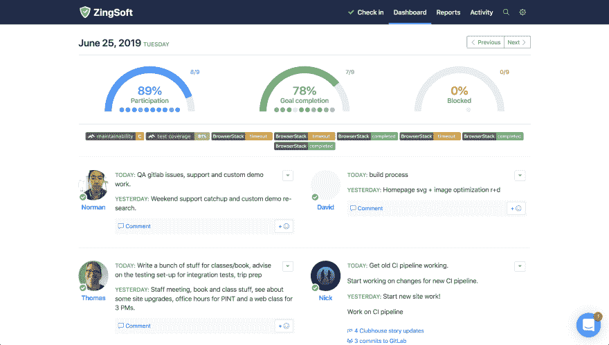
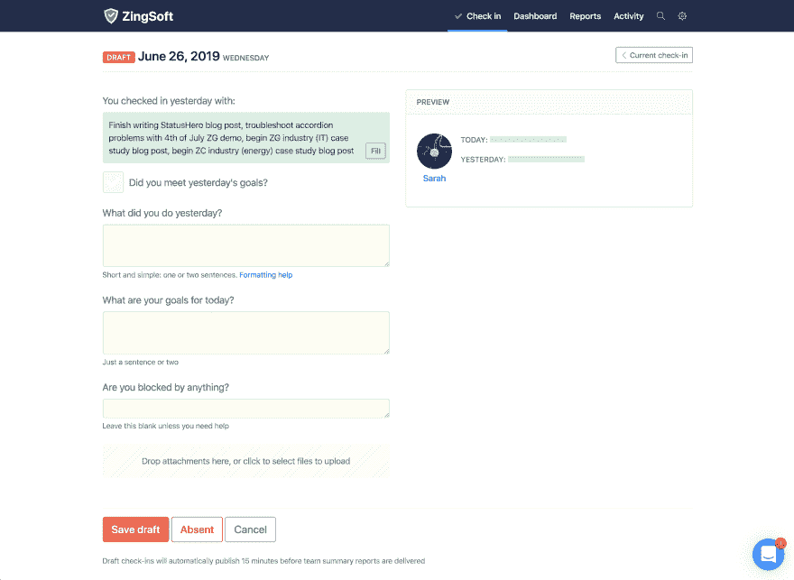
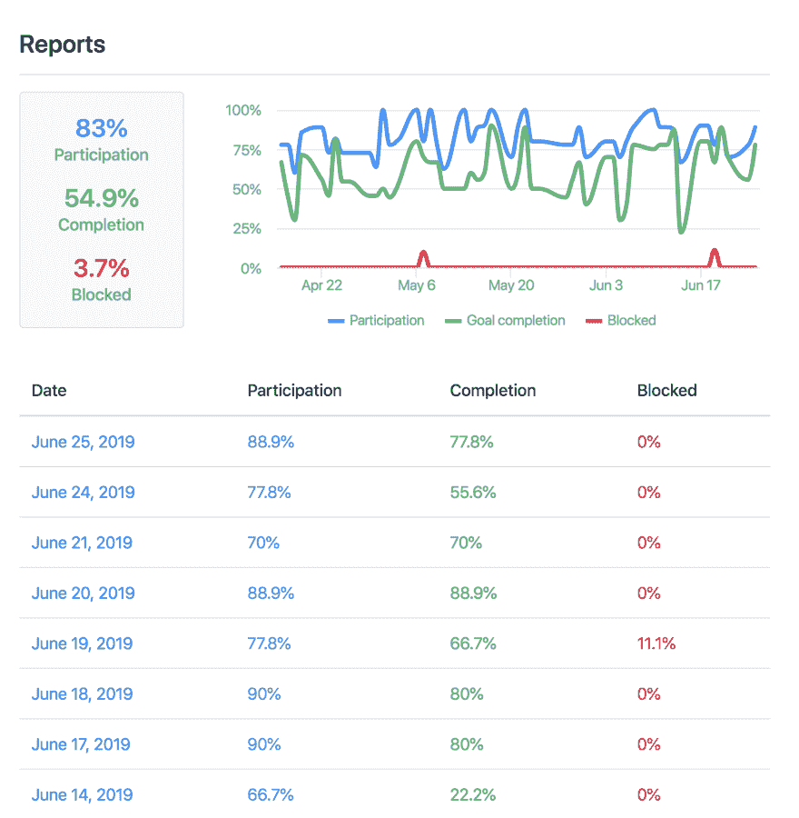

# ZingSoft 团队如何使用 StatusHero 来改善团队内部的沟通

> 原文：<https://dev.to/zinggrid/how-the-zingsoft-team-uses-statushero-to-improve-intra-team-communication-45if>

无论你是在一个小的开发团队中，还是在一个更大的开发组织中，团队内部的交流是至关重要的，不管你的团队有多大。然而，鉴于现代工作场所中数字通信工具和环境的日益扩散，这说起来容易做起来难——尤其是在繁忙的工作日的潮起潮落期间。

在 ZingSoft，我们多年来一直使用一套流行的工具进行主动沟通，并取得了良好的效果，但最近我们意识到我们还存在被动沟通的问题。团队中主动和被动沟通模式的区别很重要，原因有几个。主动沟通更直接、更直接(如聊天或电子邮件)，而被动沟通更持久、更间接(如状态更新或共享日历)。

当使用主动通信格式时，信息很容易很快被埋没。总的来说，这些对话形式的交流对于获取和重温状态更新或日程安排之类的信息并不理想。例如，仅仅依靠聊天或面对面的交谈可能会使每个人都很难跟踪团队中的其他人在给定时间段内都在做什么。

这就是为什么 [StatusHero](https://statushero.com/) 已经成为我们团队日常工作流程中不可或缺的一部分。这是一个跟踪每日状态更新和我们团队每日目标的简单指标的工具，它与我们已经使用的工具集成得很好，如 Gitlab 和 Clubhouse。多年来，Slack、Gmail 和 Zoom 等久经考验的服务一直是我们数字交互的主力，但它们面向的是积极的对话式交流格式。

在像我们这样的工作场所，有些同事 100%的时间都在远程工作，而其他人则在办公室和远程工作之间分配时间，因此对 StatusHero 这样的被动通信解决方案的需求变得更大了。当你团队的创始人兼首席执行官同时也是计算机科学教授和即将成为数据可视化教授时，对这些解决方案的需求就变得势在必行。

那么状态更新是什么样子的呢？每天早上，ZingSoft 团队的每个人都会通过 Slack 收到一个提醒，让他们花几分钟时间填写当天的状态更新。每日更新包括简洁地回答四个简单的问题:

1.  你达到昨天的目标了吗？
2.  你昨天做了什么？
3.  你今天的目标是什么？
4.  你被什么挡住了吗？

然后，每个队友的回答都会显示在每日仪表板上，记录一些关于团队参与和目标的简单指标，以及每个人当天的状态更新。这使得检查您的团队作为一个整体在任何给定的一天都在做什么变得容易，并且如果您想要查看某人在给定的一天都在做什么，也给了您根据需要回溯的灵活性。随着时间的推移，您可以开始使用 StatusHero 的报告功能来形成团队健康和生产力的高层次画面。有了报告，您可以根据比较(如每日目标完成的比例与被阻止的天数)来评估团队的健康状况。

除了明显的好处，StatusHero 还以意想不到的方式帮助提高了我们团队的生产力。当需要创建演示文稿来总结一周或一个月的团队活动时(例如，在回顾会或全体会议期间)，StatusHero 使得回顾和总结每个人的工作变得更加容易。如果我因为长时间的中断而忘记了我正在做什么，StatusHero 可以让我更快地重新定位我的工作周。

如果你发现你的开发团队可以使用一些被动的交流，那么每天的状态更新绝对是一个很好的开始。无论您使用 StatusHero 还是其他类型的解决方案，我都强烈建议您探索如何在团队的日常工作流程中整合更被动的沟通方式，从而提高工作效率，同时帮助您的团队成员获得更多信息。