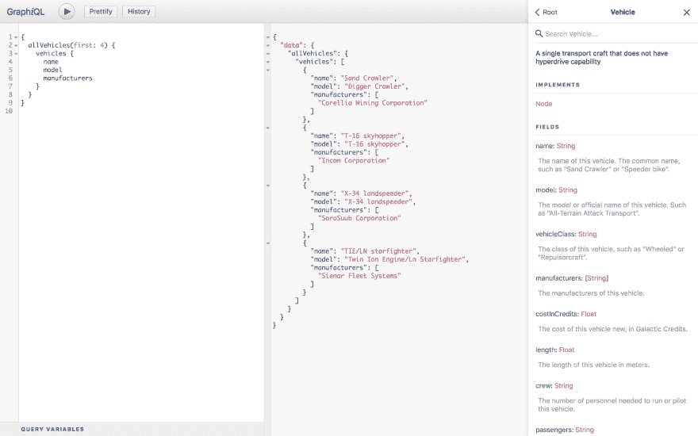

# GraphQL 如何支持数据通信

> 原文：<https://dev.to/faisalhasnain/how-graphql-empowers-data-communication-pfo>

> “网络最初的想法是，它应该是一个协作空间，在这里你可以通过分享信息来交流”
> 
> - <cite>蒂姆·伯纳斯·李(万维网的发明者)</cite>

所有软件开发人员都必须处理数据通信的基本要求— **如何从远程数据源访问数据？**通常在客户端，应用程序希望从后端服务访问数据。但是在服务器端，一个服务可能想要访问来自其他服务的数据——想想系统内的微服务通信或与外部服务的通信(例如 AWS 或其他托管服务)。那么我们该如何应对呢？嗯，我们通常使用一种叫做 HTTP 的基本网络应用协议。它允许我们以请求/响应的方式进行交流。如果我们想要实时访问数据，该怎么办？然后，我们可以使用 Web Sockets，它允许客户端和服务器在任何时候互相发送数据消息，因此我们可以模拟发布/订阅通信来获得实时更新和通知。

## 数据通信的挑战

HTTP 和 Web 套接字都是我们的应用和服务中最常用的数据通信协议。它们是不同的协议，但它们有一个共同点——我们可以发送/接收任何类型的数据。**不保证我们发送或接收的数据符合特定的结构**。我们可能会发送部分数据或格式错误的数据，从而导致错误。那么我们如何知道发送/接收数据的可能方式/路线是什么呢？每个的结构/规格是什么？对于特定的路由，什么数据以什么格式被期望，以及如何确保被发送的数据符合该结构并且确实没有错误？**我们通常使用文档来描述所有这些结构细节，并在实际处理之前手动验证我们代码中数据的结构正确性**。因为客户端和服务器都必须在*接口*级别(信息交换的共享边界)就*契约*达成一致。**拥有隐含的&松散契约会导致不确定性和错误，从而使系统更难进行可靠的通信**。

## graph QL 如何解决挑战？

***GraphQL 用声明性语言具体定义了服务与其消费者之间的数据接口契约。*T3】**

基本上，GraphQL 以*模式*的形式提供了服务中可用的数据及其相关操作的完整且可理解的描述，包括以下内容:

*   *具有属性的实体*及其与其他实体的关系。

*   *查询*获取数据

*   *突变*创建，更新&删除数据

*   *订阅*获取实时更新

 

<figure>

<figcaption>样本 GraphQL 查询</figcaption>

</figure>

GraphQL 利用*类型系统*来描述服务的整个数据模型以及服务消费者可以执行的所有操作。我们可以将 **GraphQL 视为后端服务公开的 Web API**的*查询语言*。

这种全面的模式定义使 GraphQL 在我们的应用和服务中的数据通信方面有了一些真正的好处。T3】

## 1。单个请求中的所有数据

我们可以指定确切的数据需求，GraphQL 可以满足所有的需求。消费者完全控制着服务器应该发回什么。不需要额外的往返服务，仍然留下比我们需要的少或多的数据。这意味着**有效利用宝贵的网络资源**。

## 2。文档&数据验证

不再阅读/编写关于 Web APIs 的可能模糊和不完整的文档。GraphQL 模式为服务消费者提供了具体且最新的文档形式。强类型 API 模式意味着我们可以在输入时验证 API 调用。此外，它还消除了数据验证代码中的大量样板文件。**我们可以确信每个数据字段都是某种类型的，并且它是否可以为空**。这使得客户端和服务器端的开发体验更有效率&，更少出错。

## 3。实时更新

GraphQL 内置了对实时更新的支持。**我们可以用一种统一的语言以请求/响应和发布/订阅的方式访问数据**。不再需要切换到不同类型的协议来访问静态数据或动态数据。GraphQL 抽象出底层的低层应用协议(HTTP & Web Sockets)。

## 4。存储&语言不可知

我们可以在 GraphQL 中使用任何存储机制，因为它将模式放在数据接口(API 层)的前面。所以 GraphQL API 并不真正关心数据的来源。我们可以使用文件、数据库、外部 API 甚至现有的后端。GraphQL 在将不同的数据源组合成一个简洁的 API 方面大放异彩。此外，我们可以在后端使用[任何语言](https://graphql.org/code/#server-libraries)创建 GraphQL 服务器，并与[任何客户端](https://graphql.org/code/#graphql-clients)(手机，网络&桌面)应用程序集成。这意味着**任何人都可以很容易地采用 GraphQL，而不管技术堆栈和架构如何。**

## 5。强大的&开放的生态系统

GraphQL 是一个[开放规范](https://facebook.github.io/graphql/)，不同公司有[多个开源客户端/服务器实现](https://graphql.org/code/)。凭借[开源工具](https://github.com/topics/graphql?o=desc&s=stars)和[成长社区](https://graphql.org/community/)，T4 生态系统正在蓬勃发展。值得一提的工具和服务有:

*   [Apollo 客户端](https://www.apollographql.com/client)是**最好的 GraphQL 客户端**毫无疑问装载了令人敬畏的功能，与主要的 Javascript 框架(React，React-Native，Angular & Vue)集成，并支持主要的移动平台(iOS & Android)。

*   [AppSync](https://aws.amazon.com/appsync/) 是来自亚马逊的无服务器& **高度可扩展的基于 GraphQL 的托管服务**。

*   Prisma 是基于 GraphQL 的数据库 ORM。

[了解更多信息，开始使用 GraphQL 构建强大的 Web API](https://graphql.org)