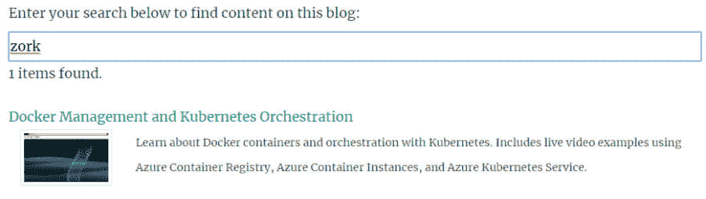

# 静态 Hugo 网站中的动态搜索

> 原文：<https://dev.to/jeremylikness/dynamic-search-in-a-static-hugo-website-5dil>

[](https://res.cloudinary.com/practicaldev/image/fetch/s--tLMtpWX9--/c_limit%2Cf_auto%2Cfl_progressive%2Cq_auto%2Cw_880/https://blog.jeremylikness.com/blog/dynamic-search-in-a-static-hugo-websiimg/zorksearch.jpg)

当我最初将我的博客从 Medium 迁移到 Hugo 时，我使用了“简单按钮”来实现搜索，使用的是谷歌的动态脚本。这是一个权宜之计，但有几个原因困扰着我。搜索脚本需要动态生成内容，这迫使我在内容安全策略(CSP——如果您不熟悉这个术语，我将在以后的博客文章中解释)中允许 JavaScript 的`eval`,从而在安全性方面做了一点妥协。它还取决于谷歌的网站快照，该快照可能是几天前的，并忽略了当前的结果。最后，对于 Progressive Web 应用程序，它在离线模式下根本不起作用。

这让我非常苦恼，我开始寻找另一种解决方案。事实证明，这是 Hugo 网站的一个普遍问题，并且有几种不同的解决方法。

<figure>[](https://res.cloudinary.com/practicaldev/image/fetch/s--tLMtpWX9--/c_limit%2Cf_auto%2Cfl_progressive%2Cq_auto%2Cw_880/https://blog.jeremylikness.com/blog/dynamic-search-in-a-static-hugo-websiimg/zorksearch.jpg) 

<figcaption>佐克搜索</figcaption>

</figure>

这篇文章描述了我的解决方案。

## 创建搜索数据库

动态搜索静态站点的第一步是想出一种解析搜索数据的方法。这在雨果中并不难做到。在我的`config.toml`中，我添加了`home`行来允许主页的附加格式(*JSON*):

```
[outputs]
home = ["HTML", "RSS", "JSON"]
page = ["HTML", "RSS"] 
```

在`layouts/_default`下面我添加了一个`index.json`模板。该模板生成一个包含所有站点内容的 JSON 文件。它使用一个动态变量(通过`Scratch`关键字)来构建表示页面的对象，然后在 JSON 中输出结果。

```
{{- $.Scratch.Add "index" slice -}}
{{- range .Site.RegularPages -}}
   {{- $.Scratch.Add "index" (dict "title" .Title "subtitle" .Params.subtitle "description" .Params.description "tags" .Params.tags "image" .Params.image "content" .Plain "permalink" .Permalink) -}}
{{- end -}}
{{- $.Scratch.Get "index" | jsonify -}} 
```

这将生成一个数组，其条目如下:

```
{  "content":  "A ton of blah blah here...\n",  "description":  "Learn about Jeremy Likness and his 'Developer for Life' blog.",  "image": img/jeremymicrosoft.jpg",  "permalink":  "http://blog.jeremylikness.com/static/about/",  "subtitle":  "Empowering developers to be their best.",  "tags":  [  "About"  ],  "title":  "About Jeremy Likness and Developer for Life"  } 
```

虽然它很“大”(几兆字节)，但对于通过慢速网络下载或在内存中存储和处理来说，这个大小并不是不合理的。如果你有兴趣，可以在这里查看搜索 JSON [。](https://blog.jeremylikness.com/index.json)

## 新的短代码

我用短代码实现了最初的搜索，以便与 Google 集成，所以我决定坚持这种方法，为静态搜索创建另一个短代码，并替换掉旧代码。在`shortcodes/staticsearch.html` :
中，模板看起来像这样

```
{{ partial "_shared/banner.html" . }}
<p id="loading">Loading search data...</p>
<label for="searchBox">Enter your search below to find content on this blog:</label>
<input disabled placeholder="Enter search text" type="text" name="searchBox" id="searchBox" class="w-100" />
<div id="results"></div>
<script src="{{"/js/search.js" | urlize | relURL }}"></script> 
```

在`static/js`下，我创建了一个`search.js`脚本。这个脚本完成了大部分工作。

> 使用单独的页面布局而不是短代码进行搜索可能是更好的做法，因为它只在一个地方使用。这是我在偷懒。

## 准备索引

我做的第一件事是加载索引。为了一致性，我通过去除非字母数字字符并将所有内容转换为小写来规范化内容。规格化器完成大部分工作:

```
var normalizer = document.createElement("textarea");
var normalize = function (input) {
  normalizer.innerHTML = input;
  var inputDecoded = normalizer.value;
  return "  " + inputDecoded.trim().toLowerCase()
    .replace(/[^0-9a-z]/gi, "  ").replace(/\s+/g, "  ") + "  ";
} 
```

等等，什么？为什么我要创建一个`textarea`元素？既然你问了，答案就在这里:`index.json`数据库包含 HTML 实体代码。像`&laquo`这样的引语和`textarea`的 `for a space. The easiest way to decode these is to stuff them into the `innerHTML`然后读它的`value`。你自己试试:它非常有效。之后，任何非字母数字字符都被替换为空格，以创建一个可以解析的“单词云”。(顺便说一下，这种方法的一个很好的副作用是，您也可以搜索代码片段…尝试在[搜索框](https://blog.jeremylikness.com/search)中输入“showDescription”)。` 

```
$("#searchBox").hide();
var searchHost = {};
$.getJSON("/index.json", function (results) {
  searchHost.index = [];
  var dup = {};
  results.forEach(function (result) {
    if (result.tags && !dup[result.permalink]) {
      var res = {};
      res.showTitle = result.title;
      res.showDescription = result.description;
      res.title = normalize(result.title);
      res.subtitle = normalize(result.subtitle);
      res.description = normalize(result.description);
      res.content = normalize(result.content);
      var newTags_1 = [];
      result.tags.forEach(function (tag) {
        return newTags_1.push(normalize(tag));
      });
      res.tags = newTags_1;
      res.permalink = result.permalink;
      res.image = result.image;
      searchHost.index.push(res);
      dup[result.permalink] = true;
    }
  });
  $("#loading").hide();
  $("#searchBox").show()
    .removeAttr("disabled")
    .focus();
  initSearch();
}); 
```

`dup`对象保存链接以避免意外处理重复。我还检查了`tags`的存在，以确保这是一个我想作为搜索索引一部分的页面。我所有有效的博客文章和网站页面都有相关的标签。

出于展示的目的，我保留了原来的标题和描述。所有东西的前后都用空格填充，这样我可以用空格填充搜索词，从而找到整个单词和短语，而不是片段。

## 响应搜索文本

在索引被加载和规范化之后，我连接搜索输入来响应按键事件。

```
var initSearch = function () {
   $("#searchBox").keyup(function () {
      runSearch();
   });
}; 
```

`runSearch`方法将搜索输入标准化，然后创建一组加权的术语。

```
var runSearch = function () {
  if (searching) {
    return;
  }
  var term = normalize($("#searchBox").val()).trim();
  if (term.length < minChars) {
    $("#results").html('<p>No items found.</p>');
    return;
  }
  searching = true;
  $("#results").html('<p>Processing search...</p>');
  var terms = term.split("  ");
  var termsTree = [];
  for (var i = 0; i < terms.length; i += 1) {
    for (var j = i; j < terms.length; j += 1) {
      var weight = Math.pow(2, j - i);
      var str = "";
      for (var k = i; k <= j; k += 1) {
        str += (terms[k] + "  ");
      }
      var newTerm = str.trim();
      if (newTerm.length >= minChars && stopwords.indexOf(newTerm) < 0) {
        termsTree.push({
          weight: weight,
          term: "  " + str.trim() + "  "
        });
      }
    }
  }
  search(termsTree);
  searching = false;
}; 
```

我没有“反跳”输入，而是设置了一个标志，以确保在之前的搜索运行时不会重新输入搜索。在测试中，搜索速度比我打字的速度还快，但在较慢的设备上可能就不一样了。如果我得到反馈，它在某些平台上是关闭的，我会重新访问。

算法很简单。如果你输入*我是博格*，就会生成一组加权短语:

```
1: i
1: am
1: borg
2: i am
2: am borg
4: i am borg 
```

我扔掉短词和我的“停用词”列表上的任何东西(像*和*这样的词出现得太频繁，在搜索中没有意义)。我不介意停止单词作为短语一部分。最终的数组看起来像这样:

```
1: borg
2: i am
2: am borg
4: i am borg 
```

每个术语都用空格填充，以便*太*匹配*太*但不匹配*工具*。然后使用生成的术语来搜索索引。

## 搜索算法

搜索算法根据搜索项的位置分配相对权重。

```
var search = function (terms) {
  var results = [];
  searchHost.index.forEach(function (item) {
    if (item.tags) {
      var weight_1 = 0;
      terms.forEach(function (term) {
        if (item.title.startsWith(term.term)) {
          weight_1 += term.weight * 32;
        }
      });
      weight_1 += checkTerms(terms, 1, item.content);
      weight_1 += checkTerms(terms, 2, item.description);
      weight_1 += checkTerms(terms, 2, item.subtitle);
      item.tags.forEach(function (tag) {
        weight_1 += checkTerms(terms, 4, tag);
      });
      weight_1 += checkTerms(terms, 16, item.title);
      if (weight_1) {
        results.push({
          weight: weight_1,
          item: item
        });
      }
    }
  });
} 
```

在高层次上，每个“命中”大约是:

```
1: content
2: description or subtitle
4: tag
16: title
32: title starts with 
```

每个命中权重乘以短语权重。该算法严重倾向于标题中的命中，因为如果一个短语匹配，片段的分数(例如:“我是博格”=“我是”和“我也是博格”)也会被添加。一种更复杂的算法可以将术语存储为一棵树，并在顶点停止匹配，但这种方法似乎在我的测试中给了我预期的结果，所以我认为没有必要进一步复杂化或调整它。

下面是计算目标命中次数的逻辑:

```
var checkTerms = function (terms, weight, target) {
  var weightResult = 0;
  terms.forEach(function (term) {
    if (~target.indexOf(term.term)) {
      var idx = target.indexOf(term.term);
      while (~idx) {
        weightResult += term.weight * weight;
        idx = target.indexOf(term.term, idx + 1);
      }
    }
  });
  return weightResult;
}; 
```

> 使用`~`是一个简单的方法。`indexOf`返回`-1`表示“未找到”，如果找到，则返回从零开始的索引。`-1`的补码是`0`或`falsy`，任何大于等于`0`的都变成负数或`truthy`。

通过剥离符号，我失去了搜索 *C#* 的能力，但是对于其他情况，它工作得很好(即 *node.js* 变成短语 *node js* )。如果有返回无效结果的测试用例，我将重新访问该算法，但它目前似乎是有效的。如果您遇到问题，请使用本文末尾的评论表格提供反馈。

## 返回结果

困难的部分(搜索)已经完成。现在，我简单地按照权重降序对数组进行排序，并呈现各个部分。我将图像存储在每个页面的前端元数据中，因此很容易提取 URL 以在结果中显示缩略图。

```
var render = function (results) {
  results.sort(function (a, b) { return b.weight - a.weight; });
  for (var i = 0; i < results.length && i < limit; i += 1) {
    var result = results[i].item;
    var resultPane = "<div class=\"container\">" +
      ("<div class=\"row\"><a href=\"" + result.permalink + "\"  ") +
      ("alt=\"" + result.showTitle + "\">" + result.showTitle + "</a>" +
        "</div>") +
      "<div class=\"row\"><div class=\"float-left col-2\">" +
      ("") +
      "</div>" +
      ("<div class=\"col-10\"><small>" + result.showDescription + "</small></div>") +
      "</div></div>";
    $("#results").append(resultPane);
  }
}; 
```

## 总结

搜索完全包含在几个文件中，特别是`/static/search` URL、`/index.json`数据库和`/js/search.js`逻辑。这些文件都可以被缓存，所以搜索完全可以在离线模式下使用(我将很快在博客中介绍创建渐进式 Web 应用程序的步骤)。你可以在这里查看最新消息[。](https://blog.jeremylikness.com/js/search.js)

每次网站重新发布时，数据库都会更新，因此它总是最新的(根据网站自己的缓存，会有轻微的延迟)。

你对算法和/或代码有反馈或改进吗？你用不同的方法解决问题了吗？在下面的评论中分享你的想法吧！

问候，

[](https://res.cloudinary.com/practicaldev/image/fetch/s--S1KFS2BY--/c_limit%2Cf_auto%2Cfl_progressive%2Cq_66%2Cw_880/https://blog.jeremylikness.cimg/jeremylikness.gif)`