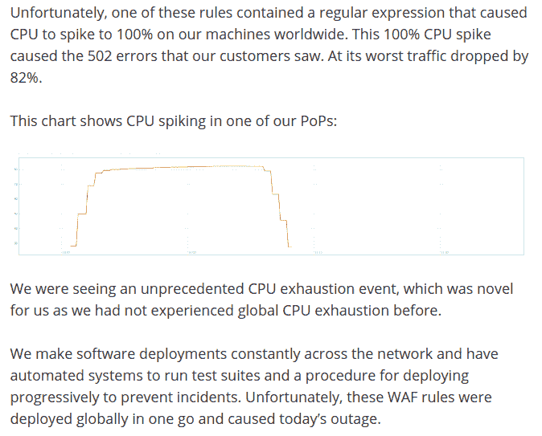

# 用正则表达式提高你的生产力(一点点)

> 原文：<https://dev.to/stealthmusic/boost-your-productiveness-with-regex-a-little-2384>

我喜欢 RegEx，我每天都在使用它，我将向你展示如何使用它来轻松完成一些或大或小的任务。

但是...

# 不要在生产中使用

好的，首先要做的是:如果你不能完全确定正则表达式是否真的有必要，那么在产品代码中使用正则表达式时要非常小心。

> mjos \ dwez@ mjos _ crypto以至于 cloudflare 宕机是由一个单一的 regex 规则一次性全局部署造成的🤦‍♂️21:26pm-02 2019 年 7 月[](https://twitter.com/intent/tweet?in_reply_to=1146168236393807872)[](https://twitter.com/intent/retweet?tweet_id=1146168236393807872)1035[](https://twitter.com/intent/like?tweet_id=1146168236393807872)2208

[这是一个可能发生的例子](https://blog.cloudflare.com/cloudflare-outage/)。在 95%的情况下，使用简单的循环来检查数据，使用类似于`String.contains()`或`String.split(delimiter)`的东西以简单可读的方式来搜索和分解字符串，这要安全得多，也更容易理解。

【编辑】说得很清楚:我是指我上面说的。不要在生产中使用我给你看的任何东西。我个人只在日志文件、测试数据和手动数据创建中使用它。

# 工具

实际上我没有使用特殊的工具。每一个或多或少复杂的文本编辑器或 IDE 都支持 RegEx 搜索和替换。我个人在[崇高文本](https://www.sublimetext.com/3)中完成的大部分工作，有时在 [IntelliJ](https://www.jetbrains.com/idea/) 中完成。

# 有用的正则表达式

这是我在日常生活中最常使用的正则表达式。

## 替换行的起始端

考虑你有下面的文本

```
Flour
Eggs
Milk
Salt
Maple sirup 
```

你想做一个项目列表。很明显，您可以在每一行前面手动输入一个`*`。但是，你当然可以使用正则表达式。

| 搜索 | 被取代 |
| --- | --- |
| `^` | `*` |

这将导致:

```
* Flour
* Eggs
* Milk
* Salt
* Maple sirup 
```

`^`是匹配行首的特殊字符。用一个或多个字符替换它将为每一行添加前缀。

这同样适用于行尾。假设你需要在每一行的末尾加一个逗号。

```
"Foo"
"Bar"
"Baz" 
```

| 搜索 | 被取代 |
| --- | --- |
| `$` | `,` |

```
"Foo",
"Bar",
"Baz", 
```

最后一个逗号可能没有必要，因此必须手动删除。有一个更复杂的搜索来解决这个问题，但大多数时候不值得努力。让 RegEx 来做繁重的工作并手动修复产生的 2%总是好的。

## 交换列

假设我们得到了以下数据

```
"foo":8,
"bar":42,
"baz":13, 
```

| 搜索 | 被取代 |
| --- | --- |
| `"(\w+)":(\d+),` | `"$2":"$1",` |

```
"8":"foo",
"42":"bar",
"13":"baz", 
```

这里发生了什么事？我们正在利用群体。组由括号分隔。于是我们有了`(group1)(group2)(group3)`。组最酷的一点是以后可以使用它们。在 Sublime 中，使用`$n`，其中`n`是从 1 开始的组索引。请注意，我们没有将`,`和`"`包含在组中。在每个组中，我使用匹配一个数字的`\d`和匹配一个单词字符的`\w`，比如 a-z、A-Z、0-9 和`_`，但是没有`-`，例如`+`匹配一个或多个类似的字符。

## 将 CSV 转换为 JSON

假设我们有以下 CSV:

```
1,35,"Bob"
2,42,"Eric"
3,27,"Jimi" 
```

| 搜索 | 被取代 |
| --- | --- |
| `(\d+),(\d+),"(\w+)"` | `{"id":$1,"age":$2,"name":"$3"},` |

结果:

```
{"id":1,"age":35,"name":"Bob"},
{"id":2,"age":42,"name":"Eric"},
{"id":3,"age":27,"name":"Jimi"}, 
```

同样，我们使用组和数字或单词匹配器。

通过添加包装器对象和数组以及删除最后一个逗号，转换后的结果可以很容易地转换成有效的 JSON。但是繁重的工作是由 RegEx 完成的。

## 创建测试数据

有时候我需要测试数据，很多。

我通常做的是，用...Excel。是的，Excel。Excel 在处理序列时非常聪明。例如，您可以输入如下内容:

| # |
| --- |
| Ten |
| Twenty |

然后选择右下角的拖动来填充下面的单元格。Excel 能够确定下一个数字是 30。因此，基于这一点，将行复制到 Sublime:

```
10
20
30
40 
```

然后我应用和以前一样的策略:

| 搜索 | 被取代 |
| --- | --- |
| `(\d+)` | `{"id":$1,"username":"user$1"},` |

```
{"id":10,"username":"user10"},
{"id":20,"username":"user20"},
{"id":30,"username":"user30"},
{"id":40,"username":"user40"}, 
```

## 学习

## RegEx101

有 [RegEx101](https://regex101.com/) 可以测试 RegEx 是否匹配。像 Sublime 和 IntelliJ 这样的现代编辑器会在你的当前窗口中动态高亮匹配。然而，这个页面也可以很好地查找错误，并通过使用 hover 和解释部分来了解实际匹配的内容和原因。

## RegEx 高尔夫

然后，您可以使用 [RegEx Golf](https://alf.nu/RegexGolf) 作为学习 RegEx 的有趣方式。

当然，在 dev.to 这里

[](/catherinecodes) [## 给所有讨厌正则表达式的人(和爱好者)的正则表达式备忘单👀

### 凯瑟琳（女子名）👩🏻‍💻1919 年 1 月 10 日 4 分钟读取

#javascript #beginners #programming #computerscience](/catherinecodes/a-regex-cheatsheet-for-all-those-regex-haters-and-lovers--2cj1)

# 总结

正如您所看到的，RegEx 有很多用例可以帮助您处理手工需要几个小时才能完成的或大或小的任务，尤其是大型数据集。