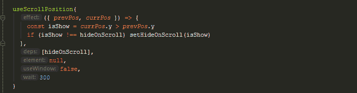

# 用 React 钩子跟踪滚动位置

> 原文：<https://dev.to/n8tb1t/tracking-scroll-position-with-react-hooks-3bbj>

好消息，各位！

今天我们将学习，如何使用`hooks` — `React`不太老的新功能，使用`JavaScript`滚动事件监听器来跟踪浏览器滚动位置。

我为什么需要它？

跟踪视口/元素滚动位置可能非常有用，而且在很大程度上，这是用很酷的动态特性丰富 web 项目的唯一方法，比如:

*   滚动时隐藏/显示的动态导航栏。
*   滚动改变时保持在相同精确位置的粘性元素。
*   在页面滚动过程中的某一点上变得可见的动态弹出窗口和用户消息。
*   等等。

点击查看一些例子[。](https://github.com/n8tb1t/use-scroll-position)

现场编辑用`CodeSandBox` :
[https://codesandbox.io/embed/8nfin?initialpath=/sidebar](https://codesandbox.io/embed/8nfin?initialpath=/sidebar)

> 首先，我不得不注意到，大多数时候滚动监听器都在做非常昂贵的工作，比如查询`DOM`元素、读取高度/宽度等等。

在`React`上下文中，它会导致许多不必要的重新渲染，并且作为副作用，会对应用程序的整体性能产生重大影响！

在本文中，我将通过实现一个考虑到性能的`useScrollPosition` `React`钩子来尝试解决上述问题！

所以，我们走吧！

钩子的最终版本应该是这样的:

```
import { useRef, useLayoutEffect } from 'react'

const isBrowser = typeof window !== `undefined`

function getScrollPosition({ element, useWindow }) {
  if (!isBrowser) return { x: 0, y: 0 }

  const target = element ? element.current : document.body
  const position = target.getBoundingClientRect()

  return useWindow
    ? { x: window.scrollX, y: window.scrollY }
    : { x: position.left, y: position.top }
}

export function useScrollPosition(effect, deps, element, useWindow, wait) {
  const position = useRef(getScrollPosition({ useWindow }))

  let throttleTimeout = null

  const callBack = () => {
    const currPos = getScrollPosition({ element, useWindow })
    effect({ prevPos: position.current, currPos })
    position.current = currPos
    throttleTimeout = null
  }

  useLayoutEffect(() => {
    const handleScroll = () => {
      if (wait) {
        if (throttleTimeout === null) {
          throttleTimeout = setTimeout(callBack, wait)
        }
      } else {
        callBack()
      }
    }

    window.addEventListener('scroll', handleScroll)

    return () => window.removeEventListener('scroll', handleScroll)
  }, deps)
} 
```

<svg width="20px" height="20px" viewBox="0 0 24 24" class="highlight-action crayons-icon highlight-action--fullscreen-on"><title>Enter fullscreen mode</title></svg> <svg width="20px" height="20px" viewBox="0 0 24 24" class="highlight-action crayons-icon highlight-action--fullscreen-off"><title>Exit fullscreen mode</title></svg>

让我们把它分解开来，看看到底发生了什么。

> 为了支持服务器端渲染(SSR)并防止不必要的错误，我们需要检查`DOM`是否准备好，以及`window`上下文是否存在。最简单的方法是检查`window`是否是`defined`。

```
const isBrowser = typeof window !== `undefined` 
```

<svg width="20px" height="20px" viewBox="0 0 24 24" class="highlight-action crayons-icon highlight-action--fullscreen-on"><title>Enter fullscreen mode</title></svg> <svg width="20px" height="20px" viewBox="0 0 24 24" class="highlight-action crayons-icon highlight-action--fullscreen-off"><title>Exit fullscreen mode</title></svg>

现在我需要一个简单的函数来获取当前的滚动位置:

```
function getScrollPosition({ element, useWindow }) {
  if (!isBrowser) return { x: 0, y: 0 }

  const target = element ? element.current : document.body
  const position = target.getBoundingClientRect()

  return useWindow
    ? { x: window.scrollX, y: window.scrollY }
    : { x: position.left, y: position.top }
} 
```

<svg width="20px" height="20px" viewBox="0 0 24 24" class="highlight-action crayons-icon highlight-action--fullscreen-on"><title>Enter fullscreen mode</title></svg> <svg width="20px" height="20px" viewBox="0 0 24 24" class="highlight-action crayons-icon highlight-action--fullscreen-off"><title>Exit fullscreen mode</title></svg>

这里我们检查它是否在`browser`内部运行，否则，只返回`{ x: 0, y: 0 }`默认值。

下一部分很简单，我们检查用户是否请求了整个页面的滚动位置或页面中的任何特定元素。

`const target = element ? element.current : document.body`

元素通过引用传递到函数中，引用是用`useRef`钩子创建的，所以我们通过使用`element.current`值来访问它。

有很多方法可以用来获取当前的滚动位置。
但是现代的和最适合移动的是`window.scroll`和`target.getBoundingClientRect()`。它们在性能上略有不同，每一个都有其用途，所以我们将通过引入`useWindow`参数开关，让用户决定他想要使用哪个实现。

> 不过请注意，IE(11 或更低版本)不支持`Window.scroll[X|Y]`。IE9 及以下版本应该(在大多数情况下)不再被支持，因为使用它们意味着浏览器或操作系统没有安全更新。但是，如果你想支持这个浏览器，就用`Window.page[X|Y]Offset`代替吧。

`getBoundingClientRect()`是一个强大的方法，可以获得元素边界框相对于视口的大小和位置。

据[can use](https://caniuse.com/#feat=getboundingclientrect)报道，它被所有现代浏览器`98.66%`支持，包括 IE9+。

现在，当我们有了 helper 函数，让我们看看钩子本身。

```
export function useScrollPosition(effect, deps, element, useWindow, wait) {
  const position = useRef(getScrollPosition({ useWindow }))

  let throttleTimeout = null

  const callBack = () => {
    const currPos = getScrollPosition({ element, useWindow })
    effect({ prevPos: position.current, currPos })
    position.current = currPos
    throttleTimeout = null
  }

  useLayoutEffect(() => {
    const handleScroll = () => {
      if (wait) {
        if (throttleTimeout === null) {
          throttleTimeout = setTimeout(callBack, wait)
        }
      } else {
        callBack()
      }
    }

    window.addEventListener('scroll', handleScroll)

    return () => window.removeEventListener('scroll', handleScroll)
  }, deps)
} 
```

<svg width="20px" height="20px" viewBox="0 0 24 24" class="highlight-action crayons-icon highlight-action--fullscreen-on"><title>Enter fullscreen mode</title></svg> <svg width="20px" height="20px" viewBox="0 0 24 24" class="highlight-action crayons-icon highlight-action--fullscreen-off"><title>Exit fullscreen mode</title></svg>

为了存储当前位置坐标，我们引入有状态的`position`变量。

`const position = useRef(getScrollPosition({ useWindow }))`

> 注意，我使用的是`useRef()`而不是`useState()`。根据`React-Hooks` [参考指南](https://reactjs.org/docs/hooks-reference.html#useref)，`useRef()`比 ref 属性更有用。它便于保存任何可变值，就像在类中使用实例字段一样。

这正是我们所需要的，一个不会在每次状态改变时触发`re-render`的有状态值。

因为我们的钩子与`DOM`紧密绑定，所以我们需要在`Effect`钩子中实现它。默认情况下，效果在每次完成渲染后运行，但您可以选择仅在某些值发生变化时触发它。

React 目前支持两种`Effect`钩子:`useEffect`和`useLayoutEffect`。

在我们的例子中，最好的选择是`useLayoutEffect`，它在 React 执行完所有 DOM 突变后立即同步运行。如果您需要进行 DOM 测量(比如获取元素的滚动位置或其他样式)，然后进行 DOM 突变或通过更新状态触发同步重新呈现，这可能会很有用。

就调度而言，这与`componentDidMount`和`componentDidUpdate`的工作方式相同。您的代码在`DOM`更新后立即运行，但在浏览器有机会“绘制”这些更改之前(用户实际上看不到更新，直到浏览器重新绘制)。

如果你看一下钩子的函数，你会注意到`deps`参数。
我们将使用它将一组自定义依赖项传递到我们的钩子中，迫使它在状态改变时重新呈现，并防止任何不必要的呈现。

```
const [hideOnScroll, setHideOnScroll] = useState(true)

useScrollPosition(({ prevPos, currPos }) => {
  const isShow = currPos.y > prevPos.y
  if (isShow !== hideOnScroll) setHideOnScroll(isShow)
}, [hideOnScroll]) 
```

<svg width="20px" height="20px" viewBox="0 0 24 24" class="highlight-action crayons-icon highlight-action--fullscreen-on"><title>Enter fullscreen mode</title></svg> <svg width="20px" height="20px" viewBox="0 0 24 24" class="highlight-action crayons-icon highlight-action--fullscreen-off"><title>Exit fullscreen mode</title></svg>

例如，这里我们开始用`useScrollPosition`钩子跟踪滚动位置，它将在每次位置改变时分别返回`prevPos`和`currPos`，并在`hideOnScroll`改变时重新呈现自己，我们需要这样做，因为`hideOnScroll`是一个有状态变量，它将在触发`useScrollPosition`清理例程(`componentWillUnmount`的改变时触发组件重新呈现。

```
useLayoutEffect(() => {
window.addEventListener('scroll', handleScroll)

return () => window.removeEventListener('scroll', handleScroll)
}, deps) 
```

<svg width="20px" height="20px" viewBox="0 0 24 24" class="highlight-action crayons-icon highlight-action--fullscreen-on"><title>Enter fullscreen mode</title></svg> <svg width="20px" height="20px" viewBox="0 0 24 24" class="highlight-action crayons-icon highlight-action--fullscreen-off"><title>Exit fullscreen mode</title></svg>

因此，这里我们有一个`effect`，它在`componentDidMount`上启动事件监听器，在`componentWillUnmount`上删除它，并且只有当任何一个`deps`状态被改变时才重新启动它自己。

最后，让我们看看我们的`handler`，它会在每次滚动位置改变时运行。

> 请注意，跟踪当前的滚动位置可能是非常繁重的任务，会给应用程序带来不必要的负担，大大降低用户体验！

这意味着我们需要找到一种方法来尽可能好地优化这个例程！
根据[这篇](https://developer.mozilla.org/en-US/docs/Web/API/Document/scroll_event#Scroll_optimization_with_window.requestAnimationFrame) `MDN`文章，我们可以使用`requestAnimationFrame`来优化我们的功能，事实上这种模式经常被使用/复制，尽管它在实践中几乎没有意义，并且它在 [stackoverflow](https://stackoverflow.com/questions/41740082/scroll-events-requestanimationframe-vs-requestidlecallback-vs-passive-event-lis/44779316#44779316) 上被彻底解释和讨论，所以我不会深入讨论它，尽管主要结论是好的旧`setTimeout()`是医生下令节流`scroll event`的。

```
export function useScrollPosition(effect, deps, element, useWindow, wait) {

  let throttleTimeout = null

  const callBack = () => {
    ...
    throttleTimeout = null
  }

  useLayoutEffect(() => {
    const handleScroll = () => {
      if (wait) {
        if (throttleTimeout === null) {
          throttleTimeout = setTimeout(callBack, wait)
        }
      } else {
        callBack()
      }
    }

    ...
  }, deps)
} 
```

<svg width="20px" height="20px" viewBox="0 0 24 24" class="highlight-action crayons-icon highlight-action--fullscreen-on"><title>Enter fullscreen mode</title></svg> <svg width="20px" height="20px" viewBox="0 0 24 24" class="highlight-action crayons-icon highlight-action--fullscreen-off"><title>Exit fullscreen mode</title></svg>

这里，`wait`参数是`ms`中的一个时间段，我们希望通过它来调节我们的功能。这意味着，`scroll event`将更新位置值，且仅在等待期结束后才调用`callback`。

我制作了一个生产就绪模块，因此您可以安装它并立即使用我们刚刚学习的内容！

##  [ n8tb1t ](https://github.com/n8tb1t) / [使用-滚动-位置](https://github.com/n8tb1t/use-scroll-position)

### 使用滚动位置 ReactJS 钩子正确完成

<article class="markdown-body entry-content container-lg" itemprop="text">

# `use-scroll-position`

[](https://www.npmjs.com/package/@n8tb1t/use-scroll-position)[](https://www.npmjs.com/package/@n8tb1t/use-scroll-position)[](https://github.com/n8tb1t/use-scroll-position/blob/master/LICENSE)

[](https://github.com/n8tb1t/use-scroll-position/raw/master/examples/screenshot.png)

`use-scroll-position`是一个 React [钩子](https://reactjs.org/docs/hooks-reference.html)，返回浏览器视窗 X 和 Y 的滚动位置。这是高度优化和使用特殊技术，以避免不必要的重新渲染！

> 它使用默认的 react hooks 渲染生命周期，这允许您完全控制其行为并防止不必要的渲染。

## 重要更新通知

从 v1.0.44 开始，项目已经转移到 typescript。

此外，一些错误已经得到修复，感谢我们的贡献者，我们增加了一个选项**跟踪一些自定义容器**中指定元素的滚动位置。

> 只需传递`element`引用和`boundingElement` -(父容器)引用并跟踪它们对应的位置！(`boundingElement`应该是可滚动的溢出隐藏或什么)

## 演示

*   [隐藏滚动条](https://n8tb1t.github.io/use-scroll-position/navbar/navbar)
*   [隐藏/显示滚动条上的侧边栏](https://n8tb1t.github.io/use-scroll-position/navbar/sidebar)
*   [显示视口滚动位置](https://n8tb1t.github.io/use-scroll-position/navbar/position)

[](https://codesandbox.io/s/use-scroll-position-8nfin?fontsize=14)

## 安装

```
yarn add @n8tb1t/use-scroll-position 
```

## 使用

```
useScrollPosition(effect,deps, element, useWindow, wait)
```

<svg width="20px" height="20px" viewBox="0 0 24 24" class="highlight-action crayons-icon highlight-action--fullscreen-on"><title>Enter fullscreen mode</title></svg> <svg width="20px" height="20px" viewBox="0 0 24 24" class="highlight-action crayons-icon highlight-action--fullscreen-off"><title>Exit fullscreen mode</title></svg>

| 争论 | 描述 |
| --- | --- |
| `effect` | 影响 |

…</article>

[View on GitHub](https://github.com/n8tb1t/use-scroll-position)