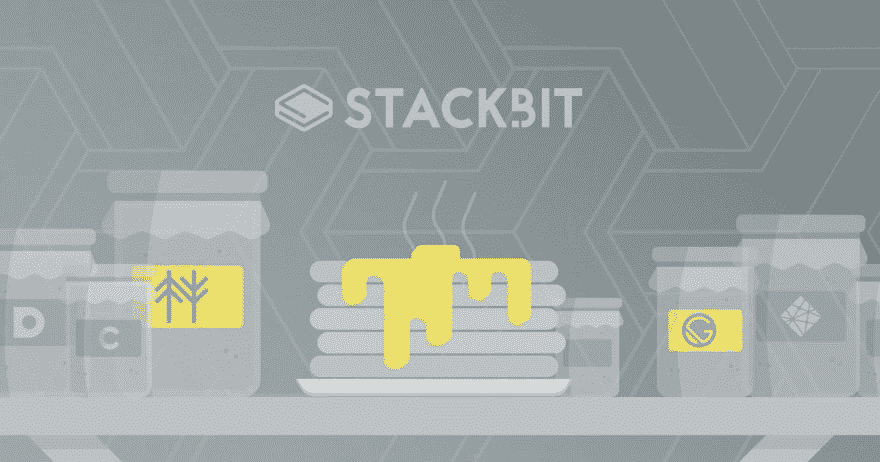

# Stackbit 简介:在几分钟内构建一个定制的 JAMstack

> 原文：<https://dev.to/couellet/intro-to-stackbit-build-a-custom-jamstack-in-minutes-4ip1>

你和孩子一起乘过长途飞机吗？

这太可怕了——尤其是如果它们是你自己的。

我妻子和我有两个孩子(都不到 3 岁)，所以当我们去某个地方时，我们会尽量让这个过程不那么痛苦。幸运的是，像谷歌航班这样的旅行规划网站简化了一切。我们面前摆着所有的选择，我们挑选最合适的时间/航空公司/酒店，只需点击几下鼠标，就能打造完美的往返旅程。

简单。

如果构建 JAMstack 站点像构建假期一样简单就好了，对吗？多亏了 Stackbit，现在是了。

如果这是您第一次听说 Stackbit，不要担心，这是一个很新的东西。事实上，目前它仍处于测试阶段。但是我们预测您很快会听到更多关于 Stackbit 的内容，所以我们认为尽早熟悉它是很重要的。这就是为什么本文将涵盖:

*   什么是堆栈位
*   为什么创建 Stackbit
*   unibit——他们的“元”静态站点生成器——和定制主题

在这篇文章结束时，您应该准备好在几分钟内构建自己的 JAMstack 站点。

→点击阅读全文