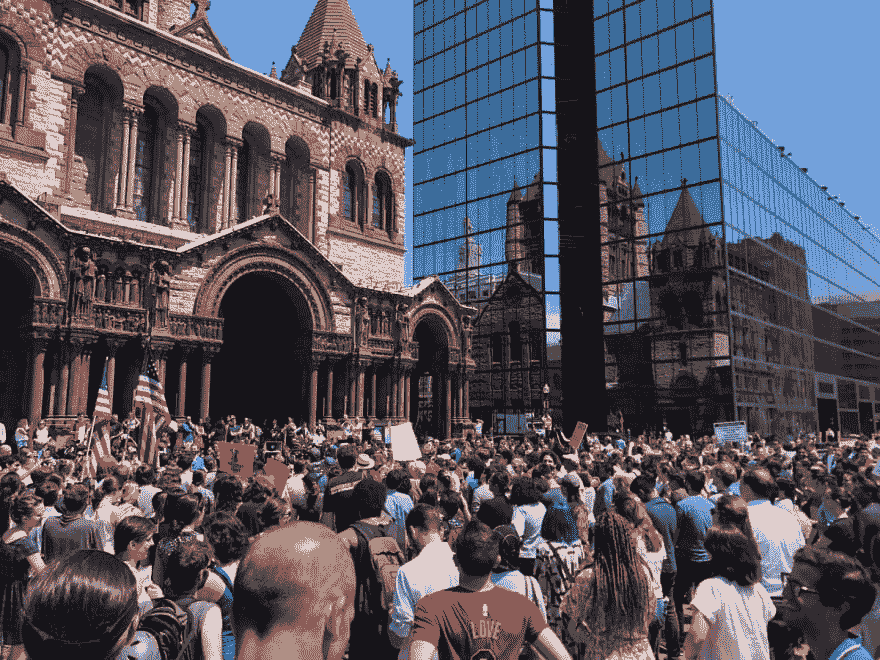
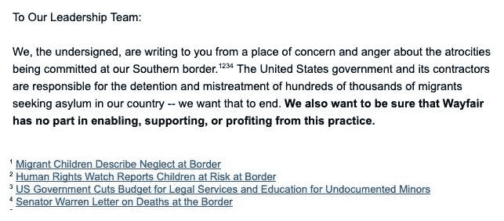
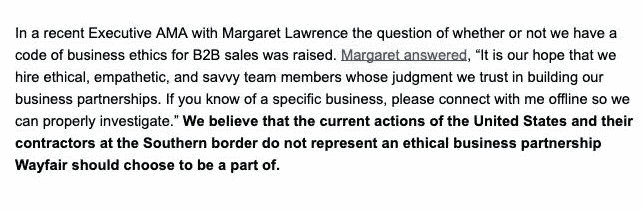
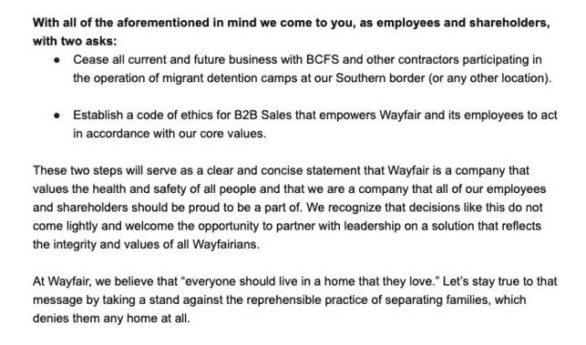

# How a walkout happens in tech

> 原文：[https://dev.to/vcarl/how-a-walkout-happens-in-tech-26g2](https://dev.to/vcarl/how-a-walkout-happens-in-tech-26g2)

At 1:30pm on Wednesday, June 26th, hundreds of Wayfair employees walked out of the office after failing to reach an agreement with Wayfair's executives about furnishing an ICE detention center.

What I wanted to know is, how does a walkout happen? What is the sequence events that begins with somebody sharing an opinion and ends with hundreds of people risking their livelihood?

Largely pieced together from [an interview done with Vice](https://www.vice.com/en_us/article/a3x84z/wayfair-is-profiting-from-immigration-detention-so-im-walking-out), I've put together a rough timeline. I'm filling in gaps to the best of my ability, but I haven't been able to make direct contact with anyone involved in organizing the walkout.

# The sequence of events

## Early 2019

A worker at Wayfair sees a sale to BCFS, a contractor for ICE with a reputation for sub-standard facilities, and an unknown number of people raise concerns to management. No action was taken.

## June 19th

A second sale to BCFS is spotted and disseminated, reportedly to a group of around 24 coworkers throughout the company. This group meets the next day to draft a letter to management with 2 specific requests.

## June 21st

A digital copy of the letter is circulated internally, with a link to an external form used to digitally sign it. After about 4 hours, the organizers deliver it to management with 547 signatures.

## June 24th

[Management responds, negatively](https://twitter.com/FizFashizzle/status/1143530739541139457). They "appreciate your passion and commitment," and are "proud to have such an engaged team," but decline to actually do anything in response.

## June 25th

Tuesday morning, the management response [was tweeted](https://twitter.com/FizFashizzle/status/1143530739541139457). Later that day, it became a national issue with [AOC](https://twitter.com/AOC/status/1143590995122171905) and [Bernie Sanders](https://twitter.com/BernieSanders/status/1143610481854300161) tweeting in support of it. After news of the walkout breaks, management shifts their position to [donating $100k](https://www.cnn.com/2019/06/26/business/wayfair-donation-migrant-facility/index.html) to the Red Cross—not to [RAICES](https://www.raicestexas.org), an immigrant rights group, as proposed by the organizers.

## June 26th

Workers walk out.

> wayfairwalkout@wayfairwalkoutIt was awesome to see the turnout today. Thank you to everyone who showed up to the [#WayfairWalkout](https://twitter.com/hashtag/WayfairWalkout)22:44 PM - 26 Jun 2019  410  2725

It's hard to get a count, and it's hard to know how many in the crowd are Wayfair employeers vs friends of the walkout showing solidarity, but this looks like a big turnout to me. Direct actions like this are risky, so Tech Workers Coalition [set up a hotline](https://mobile.twitter.com/techworkersco/status/1144039406292127744) in case any workers face retaliation.

# Analyzing it

I'd bet that the genesis of the walkout could be traced back to shortly after the first complaints were dismissed. All the ingredients were there; like-minded folks throughout the company came together with a shared complaint, and management took no action in response. Organized actions begin with a few people talking, and if they didn't already know each other, that's likely when they started collaborating.

Two questions I have for the organizers about the early stages:

*   Did you already know a group of coworkers who were opposed to this type of sale? How did you reach out to them about this sale?
*   How did you know to look for BCFS?

[The letter](https://twitter.com/sun_daiz/status/1143548274240102401) to management is so well composed and thoroughly cited that I have to assume it wasn't written from scratch in 1 day. That, more than anything, makes me think that significant effort was put into planning this walkout in the months between sales to BCFS.

I feel this letter, as the primary contact between a large group of employees and the company's owners, is one of the most important tools. Later on, I break down the letter and offer my analysis of what they've written. I have a tiny bit of experience here—I helped draft [a letter](https://github.com/palantir/blueprint/pull/3535/files?short_path=2f4c358#diff-2f4c3585a94a03c11192c3ae940fcb70) attempting to [convince Palantir employees to resist ICE](https://www.theguardian.com/us-news/2019/may/13/tech-workers-palantir-immigration-protest-github) contract renewal from the inside.

Almost certainly, the meeting on the 20th was where the walkout was concretely decided upon—a contingency in case an agreement couldn't be reached.

Three questions I have about their first meeting and writing the letter:

*   How much planning happened in advance of this meeting?
*   What were your guiding principles when writing the letter?
*   When in the course of this did you plan the walkout?

* * *

# Tearing apart the letter to management

The full letter these workers submitted to management was [posted on Twitter](https://twitter.com/sun_daiz/status/1143548274240102401). This is a great artifact of a successful action. I'd like to break down how it was written, and why, to learn how to write something similar.

The most important thing when writing, I've found, is to have a clear idea of who I'm speaking to and what I want them to take away from it. The audience here is obvious: management, specific individuals that the authors probably know, at least by reputation. What should they take away from it? From their previous behavior, it's clear that they don't agree that it's wrong to accept money from BCFS. It's hard to change somebody's mind, especially when they have a financial interest in staying the course. Let's look at each paragraph and guess at how Wayfair's leadership might receive it.

## Paragraph 1

The opening paragraph is straight and to the point without using (excessively) inflammatory language. It clearly communicates the emotions involved without letting them bleed into the words used. It offers citations for its strongest claims—some might dispute the use of the term "atrocities," and it preempts them by offering examples. This introduction sets the stage for the rest of the letter, explaining for whom it speaks and what issues they're speaking about.

However, I think some parts of this might be poorly received by a leader within Wayfair. If I were asked to edit this, I might have changed it to,

> We, the **547** undersigned, are writing to you from a place of concern and anger about **Wayfair's role in** the atrocities being committed at our Southern border. The United States government and its contractors are responsible for the detention and mistreatment of hundreds of thousands of migrants seeking asylum in our country ~~-- we want that to end~~. We ~~also~~ want to be sure that Wayfair has no part in enabling, supporting, or profiting from this practice.

Immediately sharing the number of people that have signed the letter helps sell the the weight rest of its contents, assuming it's a high number—in this case, 547 seems high to me. I'd also emphasize the focus on what Wayfair controls—Wayfair has no leverage to end the atrocities, so it distracts from the main request.

## Paragraph 2

Emphasizing that this isn't the first occurrence ups the ante significantly. The footnote explains that BCFS's first purchase of Wayfair's products were used at a camp that was later found to be substandard. This increases the veracity of the claims: BCFS isn't assumed to be a bad actor by association with detention, there is evidence of their own bad behavior.

However, I feel the lede has been buried in a footnote. Comparatively, the UN statement on child rights violations feels abstract; a statement by an international governing body condemning child detention is much less immediate than information that their customer has previously put children at risk.

## Paragraph 3

Solidly bringing it back to Wayfair's own ideals, a VP of B2B sales is quoted directly. Using an executive's own words in support of their cause is powerful—Wayfair can't dispute the message, it's from one of their own. This paragraph is short, punchy, and neatly measures their complaints against the business' aspirations.

## Paragraph 4

Finally, the asks. They're limited in scope and accomplishable. It's a combination of rectifying a wrong and making an organizational change to prevent the wrong from reoccurring. They're directly related to a recent event within the company, and were presented in a timely manner.

* * *

## Management's response

This letter is fantastically written, and the asks are reasonable. And yet:

> We believe all of our stakeholders, employees, customers, investors, and suppliers included, are best served by our commitment to fulfill all orders. [Management's response](https://twitter.com/FizFashizzle/status/1143530739541139457), delivered the next day, is a flat no. ([Mirror](img/wayfair-response.jpg), in case the tweet is removed)

Thus the walkout. It offers a good reminder: It's not enough to complain if your company is doing something that you and your colleagues feel is wrong. If complaints aren't met with change, it must escalate to action.