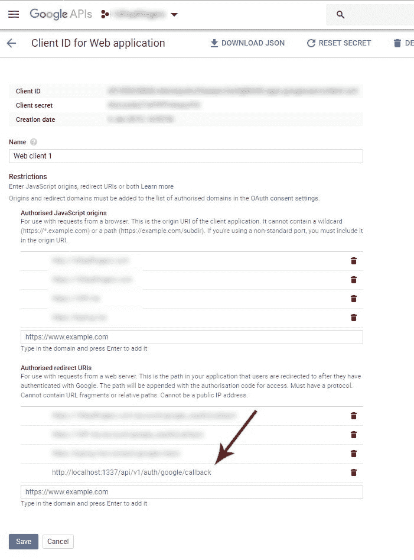

# SailsJS -使用 PassportJS 登录 Google OAuth 2.0

> 原文：<https://dev.to/christianstrang/sailsjs-use-passportjs-to-login-with-google-oauth-2-0-3daf>

对于本教程，我假设您使用步骤 1 (Web 应用程序)创建了 sails.js 应用程序。如果你想用脸书登陆，看看我的另一篇帖子: [SailsJS -用护照登陆脸书](https://dev.to/christianstrang/sailsjs-use-passport-to-login-with-facebook-6nk)

### 1。安装 Passport 和 Passport 的谷歌策略

```
$ npm install passport
$ npm install passport-google-oauth2 
```

<svg width="20px" height="20px" viewBox="0 0 24 24" class="highlight-action crayons-icon highlight-action--fullscreen-on"><title>Enter fullscreen mode</title></svg> <svg width="20px" height="20px" viewBox="0 0 24 24" class="highlight-action crayons-icon highlight-action--fullscreen-off"><title>Exit fullscreen mode</title></svg>

### 2。添加 Passport 中间件

我们需要在 **config/http.js**
中将 passport 添加到我们的中间件执行堆栈中

```
module.exports.http = {

  middleware: {

    passportInit: require('passport').initialize(),
    passportSession: require('passport').session(),

    order: [
      'cookieParser',
      'session',
      'passportInit',
      'passportSession',
      'bodyParser',
      'compress',
      'poweredBy',
      'router',
      'www',
      'favicon',
    ],
  },
}; 
```

<svg width="20px" height="20px" viewBox="0 0 24 24" class="highlight-action crayons-icon highlight-action--fullscreen-on"><title>Enter fullscreen mode</title></svg> <svg width="20px" height="20px" viewBox="0 0 24 24" class="highlight-action crayons-icon highlight-action--fullscreen-off"><title>Exit fullscreen mode</title></svg>

### 3。添加 Passport-Google 战略

在文件夹 **config** 中创建一个新文件夹 **passport** ，并在里面创建一个名为 config/passport/**Google strategy . js**的文件。

```
'use strict';

var passport = require('passport'),
  GoogleStrategy = require('passport-google-oauth20').Strategy;

//var verifyHandler = function(req, token, tokenSecret, profile, done) {
var verifyHandler = function (accessToken, refreshToken, profile, cb, done) {

  var data = {
    id: cb.id,
    name: cb.displayName,
    email: cb.emails[0].value,
    emailVerified: cb.emails[0].verified
  };

  return done(null, data);
};

passport.use(new GoogleStrategy({
  clientID: YOUR_CLIENT_ID,
  clientSecret: YOUR_CLIENT_SECRET,
  callbackURL: '/api/v1/auth/google/callback',
  passReqToCallback: true
}, verifyHandler)); 
```

<svg width="20px" height="20px" viewBox="0 0 24 24" class="highlight-action crayons-icon highlight-action--fullscreen-on"><title>Enter fullscreen mode</title></svg> <svg width="20px" height="20px" viewBox="0 0 24 24" class="highlight-action crayons-icon highlight-action--fullscreen-off"><title>Exit fullscreen mode</title></svg>

不要忘记在底部更改您的凭据(clientID 和 clientSecret)。您的 google 回调 url 可以是 localhost，但请记住在您的 Google 开发人员控制台中添加回调 URL 作为授权的重定向 uri:

[](https://res.cloudinary.com/practicaldev/image/fetch/s--48lcqe_z--/c_limit%2Cf_auto%2Cfl_progressive%2Cq_auto%2Cw_880/https://thepracticaldev.s3.amazonaws.com/i/zv28grxa3tyvbqwk4hwk.jpeg)

### 4。创建一个 Passport 控制器来处理 Google 身份验证

在您的控制台运行`sails generate controller passport`这将在您的 **api/controllers** 文件夹中创建一个文件 **PassportController.js** ，添加以下代码:

```
/**
 * PassportController
 *
 * @description :: Server-side actions for handling incoming requests.
 * @help        :: See https://sailsjs.com/docs/concepts/actions
 */

var passport = require('passport');

module.exports = {

  googleAuth: function(req, res) {
    passport.authenticate('google', { scope: ['email', 'profile'] })(req, res);
  },

  googleCallback: function(req, res, next) {
    passport.authenticate('google', function(err, user) {
      if(err) {
        // redirect to login page
        console.log('google callback error: '+err);
      } else {
        console.log('google credentials');
        console.log(user);
        res.json(user);
      }
    })(req, res, next);
  },

}; 
```

<svg width="20px" height="20px" viewBox="0 0 24 24" class="highlight-action crayons-icon highlight-action--fullscreen-on"><title>Enter fullscreen mode</title></svg> <svg width="20px" height="20px" viewBox="0 0 24 24" class="highlight-action crayons-icon highlight-action--fullscreen-off"><title>Exit fullscreen mode</title></svg>

### 5。将路由添加到 config/routes.js 文件中

```
'GET /api/v1/auth/google':                {controller: 'PassportController', action: 'googleAuth'},
'GET /api/v1/auth/google/callback':       {controller: 'PassportController', action: 'googleCallback'}, 
```

<svg width="20px" height="20px" viewBox="0 0 24 24" class="highlight-action crayons-icon highlight-action--fullscreen-on"><title>Enter fullscreen mode</title></svg> <svg width="20px" height="20px" viewBox="0 0 24 24" class="highlight-action crayons-icon highlight-action--fullscreen-off"><title>Exit fullscreen mode</title></svg>

这两个路由将处理 facebook 的请求和回调。

### 6。通过谷歌登录

如果你访问[http://localhost:1337/API/v1/auth/google](http://localhost:1337/api/v1/auth/google)，你现在应该被重定向到 Google，并得到一个提示，允许你的应用程序访问你的 Google 凭据。之后，您将被重定向到您的回调 url，并能够访问用户凭据。有了这些信息，您可以检查数据库中是否已经存在用户，或者创建一个新用户。

### 搞定

这是一个循序渐进的过程，而不是一个真正的教程，如果你对某个具体步骤有任何疑问，或者有任何错误/遗漏，请在评论中告诉我。

**更新:**更改了 GoogleStrategy 中的 callbackURL，使其对于具有不同域的试运行/生产环境更加灵活。