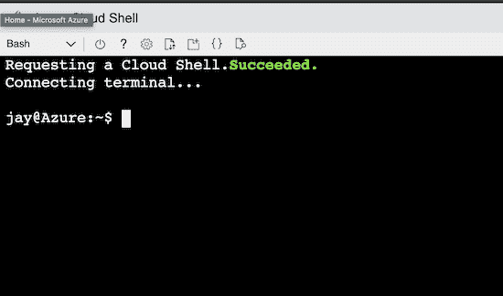

# Azure 云外壳系统管理员提示第四部分-查看和修改你的虚拟机。

> 原文：<https://dev.to/azure/azure-cloud-shell-tips-for-sysadmins-part-iv-view-and-modify-your-vm-lmj>

作为 Azure 的支持者，我花时间做的事情之一就是学习初学者使用微软 Azure 的最简单的方法。今天我想和你分享一些利用 Azure 内置工具的方法。

[](https://res.cloudinary.com/practicaldev/image/fetch/s--6tCHgFI1--/c_limit%2Cf_auto%2Cfl_progressive%2Cq_auto%2Cw_880/https://thepracticaldev.s3.amazonaws.com/i/lp775ze0xum9udzuo67n.png)

在我的上一篇博文[使用 Azure CLI](https://dev.to/azure/azure-cloud-shell-tips-for-sysadmins-part-iii-using-azure-cli-for-server-details-9dd) 中，我带你深入了解了 Azure 中可用的工具。

今天我将使用云外壳来查看和修改我上次创建的虚拟机。

### 为什么来自云壳？

简单来说，因为在 Azure 里它永远在你身边。无论你在世界的哪个角落，只要登录你的 Azure 云外壳，你就能使用你的 Azure 解决方案。您可以执行远程作业，使用 Ansible 等工具实现服务自动化，或者修改您的 Kubernetes 集群。这一切都有可能从浏览器中的 Azure 云外壳开始。

[](https://res.cloudinary.com/practicaldev/image/fetch/s--KH4xhz3S--/c_limit%2Cf_auto%2Cfl_progressive%2Cq_auto%2Cw_880/https://thepracticaldev.s3.amazonaws.com/i/8tfe4fscvxsd4uedtrvn.png)

Azure CLI 工具将再次成为本教程的焦点。我将通过命令向您展示如何获取正在运行的虚拟机的信息，并执行命令从云 Shell 修改它

### 要求。

你不需要太多就可以开始。如果你还没有微软 Azure 账户，你可以注册 200 美元的信用点数和 12 个月的免费服务。

*   [蔚蓝色的云壳](https://docs.microsoft.com/azure/cloud-shell/quickstart?WT.mc_id=devto-blog-jagord)
*   使用 Azure CLI 运行 Azure 虚拟机，如[中所述](https://dev.to/azure/azure-cloud-shell-tips-for-sysadmins-part-iii-using-azure-cli-for-server-details-9dd)

### 查询 Azure 资源管理器

首先，打开一个云壳，这可以通过访问门户中搜索栏右侧的云壳徽标来完成，或者通过访问[https://shell.azure.com](https://shell.azure.com)直接导航。

现在我忘记了我的资源组的名称。该死。我想我将从通过 CLI 查询我当前正在使用的资源组开始:

```
jay@Azure:~$ az group list --output table
Name                        Location    Status
--------------------------  ----------  ---------
cloud-shell-storage-eastus  eastus      Succeeded
DefaultResourceGroup-EUS    eastus      Succeeded
devtoapp                    eastus      Succeeded
jaydestro-blog              centralus   Succeeded
NetworkWatcherRG            eastus2     Succeeded 
```

Enter fullscreen mode Exit fullscreen mode

看到我是如何将 **`--output table`** 部分添加到命令中的了吗？我这样做是为了让输出更易于阅读。没有添加我喜欢的格式(json，jsonc，table，tsv，yaml，none)的`--output`命令，默认输出是 JSON。虽然在声明我的基础设施可能是什么或者可能是文档数据库时，使用 JSON 很好，但是在尝试处理资源时，它并不容易阅读。

我使用 Azure CLI 应用程序查询了 Azure 资源管理器。我现在意识到 **devtoapp** 是我的 VM 正在其中运行的资源组。现在，我将获得有关虚拟机的信息。`-d`标志特别声明提供关于被查询资源的更多细节。

```
jay@Azure:~$ az vm list -g devtoapp -d --output table
Name        ResourceGroup    PowerState    PublicIps      Fqdns         Location    Zones
----------  ---------------  ------------  -------------  ------------------------------------  ----------  -------
devtoappvm  devtoapp         VM running    13.90.240.117  devtoappvm.eastus.cloudapp.azure.com  eastus 
```

Enter fullscreen mode Exit fullscreen mode

现在我们有了基本的东西，名字是`devtoappvm`，有一个公共 IP 地址。什么样的 CPU？多少内存？我必须通过 ssh 进入服务器才能得到这个吗？当然不是！

为了检查我的虚拟机大小，我可以运行一个快速命令，并对我正在寻找的输出进行 grep:

```
jay@Azure:~$ az vm show -g devtoapp -n devtoappvm |grep vmSize
    "vmSize": "Standard_DS1_v2" 
```

Enter fullscreen mode Exit fullscreen mode

关于[通用虚拟机大小](https://docs.microsoft.com/en-us/azure/virtual-machines/linux/sizes-general/?WT.mc_id=devto-blog-jagord)的文档表明这是一台相当低端的机器。只给我 1 个 vCPU 和 3.5 GB 的内存。在下一部分中，我们将修改为一种新的虚拟机类型，这样我就可以为我的服务器提供更多动力。

**警告的话！**

不要在生产服务器上执行这些命令，除非您已经做好了可能停机的准备。这些命令是指导性的。生产系统可能没有适当的冗余来处理停机。在本演示教程中，我使用的是一个没有实际用途的服务器，所以向您展示如何执行这些命令没有任何风险。但如果我在生产中这样做，我会采取以下预防措施:

*   与我的团队合作，确保发出维护通知
*   确保我们正在使用的系统有正确的备份，测试它们是否正常工作
*   验证应用程序中是否有冗余，这是单点故障吗？如果是这样，是时候看看[设计可靠的 Azure 应用程序](https://docs.microsoft.com/en-us/azure/architecture/reliability/WT.mc_id=devto-blog-jagord)了

### 修改虚拟机

是时候升级虚拟机大小了，将我的`Standard_DS1_v2`升级到一个`Standard_DS3_v2`，这将为我提供 4 个 vCPU 和 14GB 的 RAM。这足以让我为我的应用程序构建和处理数据。

[](https://res.cloudinary.com/practicaldev/image/fetch/s--6mm4GTL4--/c_limit%2Cf_auto%2Cfl_progressive%2Cq_auto%2Cw_880/https://thepracticaldev.s3.amazonaws.com/i/927wcz918auelk2tw4ge.png)T3】

```
jay@Azure:~$ az vm resize --resource-group devtoapp --name devtoappvm --size Standard_DS3_v2
 - Running .. 
```

Enter fullscreen mode Exit fullscreen mode

在此过程中，虚拟机将重新启动，然后将包含数据和操作系统的磁盘映射到新的虚拟机。在 Azure Resource Manager 使用新配置修改虚拟机的过程中，请做好几分钟停机的准备。

当这个操作完成后，我将得到一些 JSON 输出，作为输出声明服务器上的所有信息。这为我提供了我的服务器成功升级的详细信息:

```
{
  "additionalCapabilities": null,
  "availabilitySet": null,
  "diagnosticsProfile": null,
  "hardwareProfile": {
    "vmSize": "Standard_DS3_v2"
  }, 
```

Enter fullscreen mode Exit fullscreen mode

我现在可以通过 ssh 登录并开始使用这个新的、更大的虚拟机了！

```
azureuser@devtoappvm:~$ free -m
              total        used        free      shared  buff/cache   available
Mem:          14002         581       12358           0        1062       13112
Swap:             0           0           0
azureuser@devtoappvm:~$ 
```

Enter fullscreen mode Exit fullscreen mode

是时候安装我的新应用了，但是有一个问题...

```
azureuser@devtoappvm:~$ df -h
Filesystem      Size  Used Avail Use% Mounted on
udev            6.9G     0  6.9G   0% /dev
tmpfs           1.4G  680K  1.4G   1% /run
/dev/sda1        29G  2.6G   27G   9% /
tmpfs           6.9G     0  6.9G   0% /dev/shm
tmpfs           5.0M     0  5.0M   0% /run/lock
tmpfs           6.9G     0  6.9G   0% /sys/fs/cgroup
/dev/sda15      105M  3.6M  101M   4% /boot/efi
/dev/sdb1        28G   45M   26G   1% /mnt
tmpfs           1.4G     0  1.4G   0% /run/user/1000 
```

Enter fullscreen mode Exit fullscreen mode

我需要比 27GB 更多的磁盘空间。怎么办？

### 接下来是什么？

在第五部分，我将向你展示如何从 Azure Cloud Shell 中添加一个新的磁盘，格式化并挂载它以供你的 Linux 服务器使用！

在那之前，继续学习，继续尝试新的东西，当然，在 Twitter 上联系我自己，地址是 [@jaydestro](https://twitter.com/jaydestro) 。