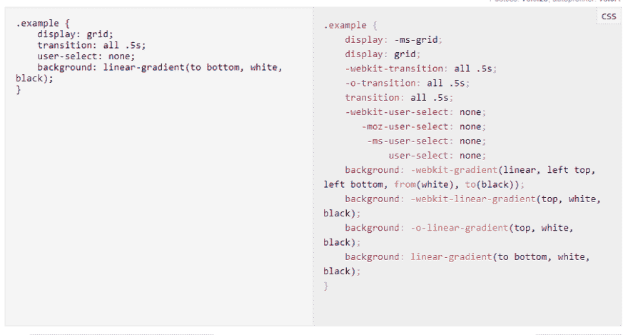

# 使用 Webpack 4 创建浏览器兼容的应用程序

> 原文：<https://dev.to/lambdatest/using-webpack-4-to-create-browser-compatible-apps-2amm>

欢呼吧！周末到了。我知道每个人都想冲向大门，感受那种自由。但是请耐心听我说几分钟。

2018 年 2 月 25 日 Webpack 4 发布，有意思的是他们将其命名为‘Legato’。连奏意味着不间断地弹奏所有的音符。Webpack 已经一次又一次地证明了自己，这也是它成为 JavaScript 开发生态系统不可或缺的一部分的原因。像 React 和 Angular 这样的 JavaScript 巨头已经像 Babel 一样将 Webpack 集成到框架中。如果你正在构建跨浏览器兼容的网络应用，它是你车库中最重要和最有用的工具之一。

## 那么，有什么新鲜事？

经常被 JavaScript 社区批评为“定制地狱”的 Webpack 尝试了一种新的方法。在早期版本中，你必须非常努力才能跟上学习曲线。新方法的定制较少，您可以在几个基本设置后启动并运行您的项目。

***哎，你知道吗？ [HTML](https://www.lambdatest.com/free-online-tools/html-to-markdown-converter?utm_source=devto&utm_medium=organic&utm_campaign=jul26_sd&utm_term=sd&utm_content=free_tools) 是互联网内容的标准标注方式，以便在网络浏览器中正确显示。可以通过使用级联样式表和 JavaScript 等脚本语言来“增强”它。***

## 更快的构建时间、更小的包大小和跨浏览器兼容性

Webpack 最大的优点是扩展的支持和生态系统。Webpack 对于加快构建速度以调整网站或 web 应用程序的性能至关重要。为了做到这一点，它反过来需要丑八怪和巴伯尔的支持。UglifyJS2 支持在 Babel 将 ES6 语法转换成 ES5 之前对其进行精简，这是 Webpack 所支持的。Babel 确保不会因为 JS 的版本或语法而出现差异。这对于希望构建浏览器兼容的 web 应用程序并担心 EcmaScript 6 的不兼容问题的 web 编码人员来说尤其有用。Webpack 连同像 UglifyJS、BabelJS 和 [Browserlists](https://www.lambdatest.com/list-of-browsers?utm_source=devto&utm_medium=organic&utm_campaign=jul26_sd&utm_term=sd&utm_content=webpage) 这样的工具，可以用来将 ES6 代码转换成兼容的 JS 代码。

在 json 包中引入 sideEffects: false，使得移除包中未使用的代码变得更加容易。还添加了对任何本地 WebAssembly 模块的导入和导出的支持。

除此之外，大量的社区构建插件也可以用来扩展 Webpack 的功能。例如，您可以使用 Autoprefixer Polyfill 插件来解析项目的 CSS 文件，并自动将浏览器特定的前缀添加到代码中，以使其更加兼容跨浏览器。LambdaTest 为您提供了在 3000 多个浏览器和操作系统的在线浏览器群上执行跨浏览器和响应测试的功能。它还支持[硒](https://www.lambdatest.com/selenium?utm_source=devto&utm_medium=organic&utm_campaign=sep15_sd&utm_term=sd&utm_content=webpage)、[柏测试](https://www.lambdatest.com/cypress-testing?utm_source=devto&utm_medium=organic&utm_campaign=sep15_sd&utm_term=sd&utm_content=webpage)、[剧作家](https://www.lambdatest.com/playwright-testing?utm_source=devto&utm_medium=organic&utm_campaign=sep15_sd&utm_term=sd&utm_content=webpage)、[端到端测试](https://www.lambdatest.com/learning-hub/end-to-end-testing?utm_source=devto&utm_medium=organic&utm_campaign=sep15_sd&utm_term=sd&utm_content=learning_hub)。

***你听说过吗？[二维码生成器](https://www.lambdatest.com/free-online-tools/qr-code-generator?utm_source=devto&utm_medium=organic&utm_campaign=jul26_sd&utm_term=sd&utm_content=free_tools)使在二维码上存储数据变得容易，比如文本或网站地址。您可以通过输入文本或网址轻松创建二维码，并下载高分辨率 PNG 或矢量图形(SVG、EPS)格式的图像。***

## 完善默认值

正如我之前提到的，Webpack 最大的问题是你必须定制所有的东西。当我说每件事的时候，我指的是尽可能字面上的意思。很高兴看到 Webpack 4 改进了很多。它假设。/src/作为 entro 属性，并将输出退出到。/dist。这就是众所周知的#0CJS(零配置 JavaScript)。这将节省您的宝贵时间，实现更快的部署。

## 更好构建的专用模式

Webpack 现在提供了两种出色的模式，这两种模式提供了不同的技能集，能够为我们提供用户特定的捆绑包。让我们进一步探索，看看这到底是怎么回事。

生产

该模式在自身内部灌输开箱即用的优化和功能。几乎就像一个网络海盗的宝箱。树摇动、缩小、无副作用的模块修剪所有这些有用的特性为 Webpack 4 的用户友好性提供了一个很好的例子。树抖动有效地减小了包的大小，移除了未使用的代码。如果用 ESModule 语法导入 JSON，这个特性就很容易了。

发展

对于那些想要更快开发生态系统体验的人。Webpack 增加了现有的映射方案，以便于阅读源代码。包输出和 eval-source 映射中的路径名增加了构建时间。

## 弃用

大幅削减是为了使网络包更轻。不再支持 Node.js，因为源代码发现自己升级到了更高的 ecmascript 版本。CommonChunksPlugin 也被删除，为 optimization.splitsChunks 让路。其他删除的功能包括 module.loaders、loaderContext.options、Compilation.notCacheable 标志、NoErrorsPlugin、Dependency.isEqualResource 和 NewWatchingPlugin。

## 告别 CSS 前缀跨浏览器不兼容

不仅如此，Autoprefixer 还是另一个 CSS 前缀处理程序。有了这个包，忘记你所知道的 CSS 前缀吧。它通过检查 Caniuse 上不同浏览器及其版本的兼容性来处理前缀。这项惊人的任务完成得非常快。除此之外，它甚至删除了过时的前缀，从而使速度提高了 10%(或多或少)。

如果你想支持特定的浏览器，你可以很容易地做到这一点。使用浏览器列表，您可以利用。通过交叉引用您提供的列表，所有特定的 CSS 问题都将得到解决。在这种情况下，你不必使用 Autofixer。

## 让我们来看看比赛

当我们谈到竞争时，Webpack 忙得不可开交。包裹就像一个新来的小孩，温文尔雅。随着包裹出来，有这样一个炒作。我的意思是每个人都在谈论它。对于初学者来说，它不需要配置，而且工作正常！每个人都被这种有前途的产品迷住了，它还提供了更小的包装尺寸。

Parcel 推动 Webpack 进一步创新和改进。此外，parcel 的学习曲线甚至没有接近 Webpack，这也大大增加了它的受欢迎程度。包裹是好的，但是它在某些方面缺乏。例如，你不能通过 import 使用 CSS 和 SASS 变量，这确实会引起一些问题，但是有一个简单的解决方案，通过从 JavaScript 导出 CSS 文件，你可以确保它处理依赖关系。

还有其他的，比如 Browserify 和 Rollup，缺乏构建时优化，比如树抖动，或者在其他一些方面缺乏优化。

***看看这个:[什么是回归测试](https://www.lambdatest.com/blog/regression-testing-what-is-and-how-to-do-it/?utm_source=devto&utm_medium=organic&utm_campaign=jul26_sd&utm_term=sd&utm_content=blog)，它的重要性和类型，以及如何执行它。***

## 结论

很明显，Webpack 不会有任何发展。我们还没有看到竞争带来了什么新功能。在 React & Angular 这样的重量级人物的支持下，Webpack 在这个奇妙的 JavaScript 星球上获得了更多的支持。恐怕时间到了，我向你道别。

下次见！

周末快乐！