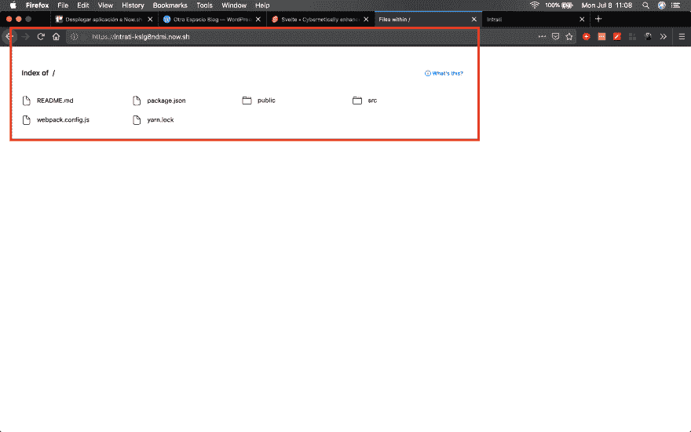
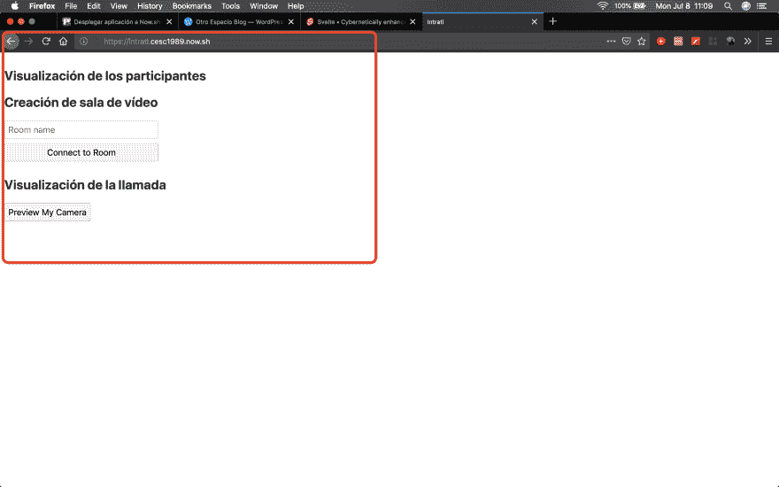
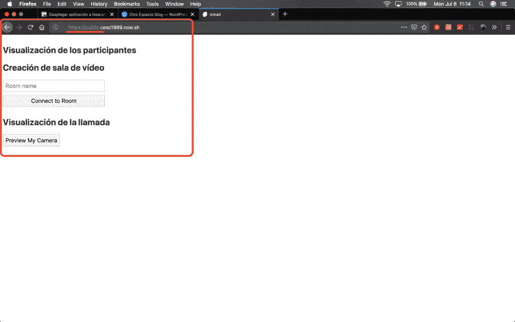

# 立即部署快速应用程序

> [https://dev . to/cesca quintero/部署-应用-立即-18n1](https://dev.to/cescquintero/despliegue-de-aplicacion-svelte-en-now-18n1)

[fast](https://svelte.dev/)是一个新的 JavaScript 框架，用于创建 SPA 应用程序，它不同于 React 或 view，后者在编译应用程序时而不是在运行时执行工作。

使用 quick 编写代码时，您可以看到代码语法在创建组件时如何变得更加简洁和简短。参见教程。

最近，我和一位同事在一个小型项目中着手建立一个叫做‘t1’的视频应用程序，在浏览器中以‘T2’的方式调用。在‘T3’中。为此，我们同意使用 Twilio 和 fast 视频 API 作为 JS 框架，因为它承诺提供响应性应用程序的真实体验。

## 将申请提升到现在

为了开始这个项目，我们使用了[一个使用 Webpack](https://github.com/sveltejs/template-webpack) 进行配置的快捷模板。

在该模板的“T0”自述文件中表示，要进行应用程序部署，如果使用[像 Now](https://zeit.co/now) 这样的服务，则只需运行一个命令即可。事实上，这并没有他们所说的那么简单，虽然也不是太困难。

首先，必须将 Now 作为全局软件包安装，注册并登录终端:

```
$ npm i -g now
...
$ now login 
```

Enter fullscreen mode Exit fullscreen mode

在 Now 的文档中，它们表示要进行部署，必须运行命令`now`，并且在实际运行时，它会完成工作，但不会在此结束。

事实证明，需要设置一些额外的小部件，因为在没有额外说明的情况下执行此命令时，所做的只是将文件托管在服务中。

## 真的上升到现在

我发现真正的 Now 部署可以通过两种方式实现:

1.  设置文件`now.json`
2.  发送文件夹`public/`

### 设定档案`now.json`

最终配置如下:

```
{  "name":  "intrati",  "version":  2,  "builds":  [{  "src":  "public/**",  "use":  "@now/static"  }],  "routes":  [{  "src":  "/(.*)",  "dest":  "public/$1"  }]  } 
```

Enter fullscreen mode Exit fullscreen mode

所有这些我都在现在的文献中找到了，意思是:

*   *build*部分表示将使用在`public/`文件夹中生成的静态内容进行显示
*   *roads*区段表示每个档案都会产生可存取的路径，否则会产生 400 错误

如果不使用此设置，而只执行命令`now`来提升服务，则映射的 URL 仅显示托管文件，如下图所示:

[](https://res.cloudinary.com/practicaldev/image/fetch/s--589ErmrB--/c_limit%2Cf_auto%2Cfl_progressive%2Cq_auto%2Cw_880/https://otroespacioblog.files.wordpress.com/2019/07/01-svelte-to-now-bad-deployment.png)

这是因为 Now 希望有一个文件“`index.html`”，而且在 JS 应用程序(现在)中，该文件不在根目录中，而是在“`public/`”文件夹中，这是我们将得到的结果。

使用上面的设置可以避免这种不需要的行为:

[](https://res.cloudinary.com/practicaldev/image/fetch/s--dG6_1BdW--/c_limit%2Cf_auto%2Cfl_progressive%2Cq_auto%2Cw_880/https://otroespacioblog.files.wordpress.com/2019/07/02-svelte-to-now-good-deployment.png)

### 发送公共文件夹

另一种较为简单但可能不太理想的方法是指定要部署到的文件夹:

```
$ now deploy ./public 
```

Enter fullscreen mode Exit fullscreen mode

它的工作方式将类似于上面描述的正确方式，只是 URL 将具有子域名`public`，这实际上是一个较小的数字。

[](https://res.cloudinary.com/practicaldev/image/fetch/s---ygTpewF--/c_limit%2Cf_auto%2Cfl_progressive%2Cq_auto%2Cw_880/https://otroespacioblog.files.wordpress.com/2019/07/03-svelte-to-now-public-folder.png)

这就是我成功完成 Now 应用程序升级的两种方式。

也就是说，我认为现在是一个很好的服务。在其免费层中，它提供了许多理想的功能，例如具有 HTTPS 的 SSL 证书，这是调用的视频应用程序所必需的。

如果你还需要更多，这个图层每月只需要 1 美元。

* * *

*本文首先在本人博客、[另一博客空间](https://otroespacioblog.wordpress.com/)上发表。我在这里写的是我在编程时学到的一切，也写的是非技术主题。*