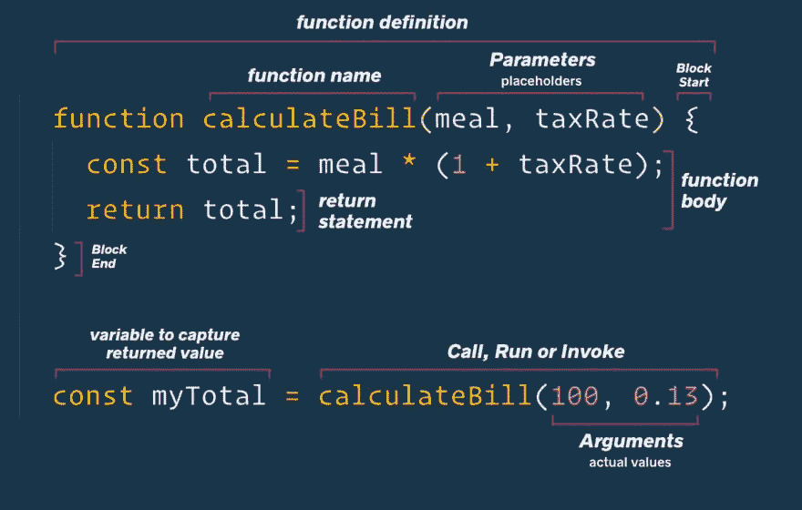

# 我的文档阅读过程

> 原文：<https://dev.to/terabytetiger/my-documentation-reading-process-3fnn>

# [T1】简介](#intro)

在过去的一两个星期里，我和某人一起使用了一点 jQuery，去年夏天参加一个在线课程时我几乎没用过它，从那以后就再也没用过了。在研究为什么他们的代码不能工作的过程中，我意识到技术文档是非常可怕的——尤其是当你对语言/框架不是很熟悉的时候。

在这里，我想介绍一下我阅读技术文档和处理代码的过程，以帮助代码工作！

## 有问题的文档

我在这里提到的具体文档是 jQuery 的 [`attr()`函数](https://api.jquery.com/attr/)

## 功能关键字

如果你对一个函数的某些部分的具体用词有点不清楚，我不怪你——有很多部分！如果你不确定我在用什么词，需要复习，或者只是喜欢可爱的信息图表，看看韦斯·博斯的这条推文:

> 韦斯博斯[@韦斯博斯](https://dev.to/wesbos)我这里还缺什么吗？我在教授函数时，试图将所有抛出的单词可视化下午 17:07-2019 年 3 月 13 日[](https://twitter.com/intent/tweet?in_reply_to=1105878111609147394)[](https://twitter.com/intent/retweet?tweet_id=1105878111609147394)[](https://twitter.com/intent/like?tweet_id=1105878111609147394)

# 解决问题

## 入门

最初发给我的代码是这样的(缩小到重要的部分):

```
$(document).ready(function () {
  var topic = ["baseball", "hockey", "women's soccer", "basketball"];
  function makeButtons() {
    $("#addButton").empty();
    for (var i = 0; i < topic.length; i++) {
      var buttons = $("<button>");
      $(buttons).addClass("sport")
      $(buttons).attr("data-sport") // A
      $(buttons).text(topic[i]);
      $("#addButton").prepend(buttons)
    }
  }
  makeButtons();

  $("button").on("click", function() {
    var sport = $(this).attr("data-sport") // B
    // ...
  }
} 
```

<svg width="20px" height="20px" viewBox="0 0 24 24" class="highlight-action crayons-icon highlight-action--fullscreen-on"><title>Enter fullscreen mode</title></svg> <svg width="20px" height="20px" viewBox="0 0 24 24" class="highlight-action crayons-icon highlight-action--fullscreen-off"><title>Exit fullscreen mode</title></svg>

通过我对“A”和“B”的评论，有两行特别引起了我的注意。它们之所以引人注目，是因为它们使用了相同的函数(`attr()`)和参数(`"data-sport"`)，但是 A 似乎想要在按钮上创建属性，而 B 似乎想要从按钮上读取值。

## 打开单据

我做的第一件事是搜索“给按钮 jQuery 添加一个值”,最后找到了关于 [`val()`函数](https://api.jquery.com/val/)的文档。在阅读了 [w3schools 关于`val()`](https://www.w3schools.com/jquery/html_val.asp) 的文章后，我意识到这不是我想要的功能。

列表中的几个搜索结果是`attr()`的文档，这向我表明它可能是*的正确函数，至少是*的 a 行

**我没有从`attr()`文档开始的原因有两个:**

1.  我想确保手头的任务使用了最好的功能。
2.  此时，我不确定哪一行代码需要更新，但我怀疑是 A，因为它似乎想要设置值，但没有传递值来存储。

## 第一次通过`attr()`

我第一次尝试如何工作并不是最有收获的。我跳到第一个文本块(`.attr(attributeName)`)，浏览了一下它是如何工作的，并将第一行改为:

```
console.log($(buttons).attr("data-sport")) // undefined x4 
```

<svg width="20px" height="20px" viewBox="0 0 24 24" class="highlight-action crayons-icon highlight-action--fullscreen-on"><title>Enter fullscreen mode</title></svg> <svg width="20px" height="20px" viewBox="0 0 24 24" class="highlight-action crayons-icon highlight-action--fullscreen-off"><title>Exit fullscreen mode</title></svg>

返回`undefined`并不意外，我开始搜索“添加属性 jQuery”。这些结果继续将我引回`attr()`，这让我意识到我一定遗漏了一些关于函数如何工作的东西。

特别是，[在](https://www.tutorialrepublic.com/faq/how-to-add-attribute-to-an-html-element-in-jquery.php)[tutorialrepublic.com](https://www.tutorialrepublic.com/)上的这篇文章让我意识到关于`attr()`功能的事情比我第一眼看到的要多。

## 函数重载

在`attr()`函数中发生的事情被称为“重载”,它允许函数根据提供的参数的数量或类型做出不同的行为。

Javascript 中重载的一个例子:

```
function add(num1, num2, num3){
  let total
  if (num3){
      total = num1 + num2 + num3
  } else {
      total = num1 + num2
  }
  return total
}

add(1,2)     // 3
add(1,2,3)   // 6
add(1,2,3,4) // 6 -- 👇
/** The function doesn't know what to do with the fourth argument,
    so it ignores it!*/ 
```

<svg width="20px" height="20px" viewBox="0 0 24 24" class="highlight-action crayons-icon highlight-action--fullscreen-on"><title>Enter fullscreen mode</title></svg> <svg width="20px" height="20px" viewBox="0 0 24 24" class="highlight-action crayons-icon highlight-action--fullscreen-off"><title>Exit fullscreen mode</title></svg>

这里发生的事情是，根据传入的数字的数量，函数将根据是否提供了第三个数字来确定是否需要将第三个数字添加到总数中。

## 回`attr()`

现在我意识到发生了什么，我回到医生那里。也就是 [`.attr(attributeName,value)`](https://api.jquery.com/attr/#attr-attributeName-value) 函数，它允许你传递一个值给指定的属性。

我将 A 行更新为:

```
$(buttons).attr("data-sport", topic[i]) 
```

<svg width="20px" height="20px" viewBox="0 0 24 24" class="highlight-action crayons-icon highlight-action--fullscreen-on"><title>Enter fullscreen mode</title></svg> <svg width="20px" height="20px" viewBox="0 0 24 24" class="highlight-action crayons-icon highlight-action--fullscreen-off"><title>Exit fullscreen mode</title></svg>

和...**瞧！**检查员现在正在显示带有`data-sport`属性的按钮！

# 关闭

希望回顾一下我是如何做到这一点的，这将有助于您在下次需要使用技术文档来找出不太正确的地方时更有信心。

❓ *在技术文档的世界里，你有什么建议吗？* ❓