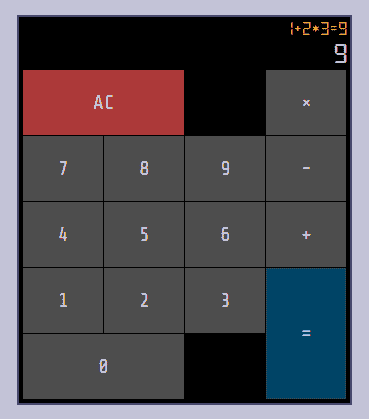

# 我以为乘法会很容易

> 原文：<https://dev.to/dwayne/i-thought-multiplication-was-going-to-be-easy-2d7h>

在我的计算器上做了加法和减法之后，我决定继续做乘法。

由于良好的[关注点分离](https://dev.to/dwayne/separating-application-logic-from-the-ui-in-elm-8nj)，它只需要对[代码](https://github.com/dwayne/elm-calculator/commit/848c4e35d9cb0d5ea0140b283beff5b3e77cdd1e)做很小的改动。然而，这不会是它的结束。

在使用计算器一段时间后，我偶然发现了这个表达`1+2*3`。

[](https://res.cloudinary.com/practicaldev/image/fetch/s--hXfazuqD--/c_limit%2Cf_auto%2Cfl_progressive%2Cq_auto%2Cw_880/https://thepracticaldev.s3.amazonaws.com/i/5n8nbg1fqu6htn2xv52f.png)

但是我的计算器给出了 T1，因为它给出了 T2。我忘记了我的[表达式求值器](https://github.com/dwayne/elm-calculator/blob/848c4e35d9cb0d5ea0140b283beff5b3e77cdd1e/src/Calculator.elm#L130)没有处理运算符优先级。

## 增加测试的好机会

我知道改进我的表达式求值器需要进行大量的代码修改，我也知道我不想不断地通过 UI 输入表达式来检查我是否正确地实现了求值器。

所以我加了[一个失败测试](https://github.com/dwayne/elm-calculator/blob/848c4e35d9cb0d5ea0140b283beff5b3e77cdd1e/tests/Test/Calculator.elm#L192)。

```
operatorPrecedenceSuite : Test
operatorPrecedenceSuite =
  describe "operator precedence" <|
    [ test "multiplication is done before addition" <|
        \_ ->
          let
            calculator =
              Calculator.new
                |> Calculator.process (Digit 1)
                |> Calculator.process (Operator Plus)
                |> Calculator.process (Digit 2)
                |> Calculator.process (Operator Times)
                |> Calculator.process (Digit 3)
                |> Calculator.process Equal
          in
            calculator
              |> Calculator.toDisplay
              |> Expect.equal { expr = "1+2*3=7", output = "7" }
] 
```

Enter fullscreen mode Exit fullscreen mode

## 调车场算法

我刚刚实现了足够的[调车场算法](https://en.wikipedia.org/wiki/Shunting-yard_algorithm)来使加法、减法和乘法正确工作。计划在不久的将来增加部门。

[](https://res.cloudinary.com/practicaldev/image/fetch/s--U5MROZyi--/c_limit%2Cf_auto%2Cfl_progressive%2Cq_auto%2Cw_880/https://thepracticaldev.s3.amazonaws.com/i/dmed429o82gvpz9s86r4.png)

如果您对实现细节感兴趣，这里有[代码](https://github.com/dwayne/elm-calculator/blob/0c1f708e1983b1afb75f023fd7ff190fea6587fd/src/Expr.elm#L15)。

考试通过了，我兴高采烈。

## Elm 很好地处理了复杂性

最初，表达式计算器隐藏在`Calculator`模块中。但是评估器的复杂性让我想确保它是正确的，而不必通过`Calculator`的公共 API。

为了处理这种复杂性，我将评估器分解到它自己的模块中， [Expr](https://github.com/dwayne/elm-calculator/blob/0c1f708e1983b1afb75f023fd7ff190fea6587fd/src/Expr.elm) ，使用下面的公共 API:

```
module Expr exposing (Expr(..), eval, toString) 
```

Enter fullscreen mode Exit fullscreen mode

这使我能够广泛地测试它。举个例子，这是我添加的一个测试:

```
test "1+2*3" <|
  \_ ->
    Expr.eval (Add (Const 1) (Mul (Const 2) (Const 3)))
      |> Expect.equal 7 
```

Enter fullscreen mode Exit fullscreen mode

你可以点击查看全套测试[。](https://github.com/dwayne/elm-calculator/blob/0c1f708e1983b1afb75f023fd7ff190fea6587fd/tests/Test/Expr.elm)

## 事情很简单

即使我最终写了很多额外的代码，我仍然觉得 Elm 很好地处理了复杂性。我仍然了解我的代码是如何工作的，我知道当我需要添加一个新特性时，我需要在哪里进行更改，类型和测试使我对我的实现非常有信心。

尽管在计算器中加入乘法并不容易。Elm 把它变得简单了。