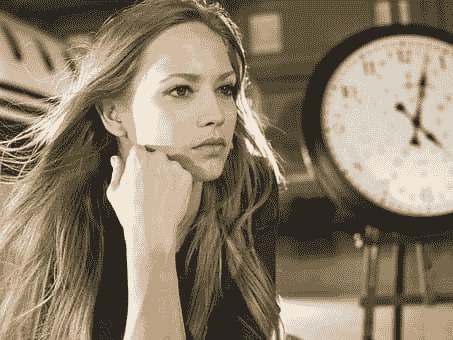
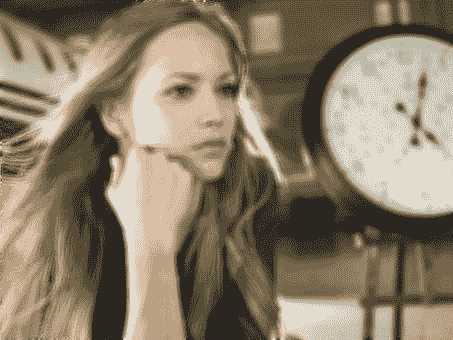

# 使用 python 的图像效果

> 原文：<https://dev.to/petercour/image-effects-with-python-3i2i>

PIL 模块可用于改变图像。你可以加载一个图像，调整到任何大小。您可以应用效果(如图像模糊)等。

那么这是怎么做到的呢？

首先你需要改变一个形象。假设这张图片

[](https://res.cloudinary.com/practicaldev/image/fetch/s--hPgHoij6--/c_limit%2Cf_auto%2Cfl_progressive%2Cq_auto%2Cw_880/https://thepracticaldev.s3.amazonaws.com/i/jecsegig8anp0jttjf5a.png)

另存为 image.png

### 调整图像大小

调整图像大小非常容易。加载图像，获得宽度和高度。然后应用缩略图法。最后，您可以更改图像格式(jpg)

```
#!/usr/bin/python3
import PIL.Image
im = PIL.Image.open('image.png')
w, h = im.size
im.thumbnail((w//2, h//2))
im.save('image_resize.png', 'jpeg') 
```

运行它，你会看到图像改变了

[](https://res.cloudinary.com/practicaldev/image/fetch/s--TWnpw1ni--/c_limit%2Cf_auto%2Cfl_progressive%2Cq_auto%2Cw_880/https://thepracticaldev.s3.amazonaws.com/i/l96hg1ydabvc5ygwj4q8.png)

### 模糊图像

使用下面的代码来模糊图像。这种效果是通过对图像应用滤镜(矩阵)来实现的。在使用 im.filter()方法应用它的情况下:

```
#!/usr/bin/python3
import PIL.Image, PIL.ImageFilter
im = PIL.Image.open('image.png')
im2 = im.filter(PIL.ImageFilter.BLUR)
im2.save('image-blur.png', 'jpeg') 
```

运行以查看应用的模糊效果

[](https://res.cloudinary.com/practicaldev/image/fetch/s--jAKZNpFe--/c_limit%2Cf_auto%2Cfl_progressive%2Cq_auto%2Cw_880/https://thepracticaldev.s3.amazonaws.com/i/s7gpsl5wfjlf3qs4w0tv.png)

资源:

*   [PIL 图像效果(Python 图像库)](https://pillow.readthedocs.io/en/stable/reference/ImageFilter.html)
*   [Python 初学者教程](https://pythonbasics.org)
*   [学习 tkinter](https://pythonbasics.org/tkinter-image/)