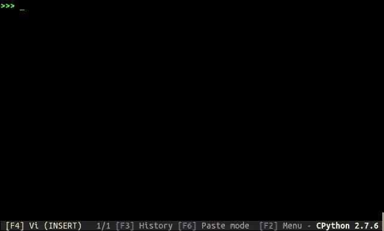

# 使用 python 的终端进度条

> 原文：<https://dev.to/petercour/terminal-progress-bar-with-python-4l23>

模块 tqdm 允许你创建一个进度条。这可以让你制作漂亮的进度条:

[](https://res.cloudinary.com/practicaldev/image/fetch/s--10F75P5R--/c_limit%2Cf_auto%2Cfl_progressive%2Cq_66%2Cw_880/https://raw.githubusercontent.com/tqdm/tqdm/mastimg/tqdm.gif)

### 为什么叫 tqdm？

开发商觉得这是个好名字。是西班牙语“我好爱你”的缩写(te quiero demasiado)。

拜托了。

[](https://res.cloudinary.com/practicaldev/image/fetch/s--6k_kCqcF--/c_limit%2Cf_auto%2Cfl_progressive%2Cq_66%2Cw_880/https://media.tenor.cimg/9048c0768b80d55ff7fea876a4380521/tenor.gif)

萨尔莱特。

### 创建进度表

立即让你的循环显示一个智能的进度表——只要用 tqdm(iterable)包装任何 iterable，就大功告成了！

```
from tqdm import tqdm
    for i in tqdm(range(10000)):
        ... 
```

创造

```
76%|████████████████████████████         | 7568/10000 [00:33<00:10,      229.00it/s] 
```

### 演示

以下代码创建了几个[线程](https://pythonspot.com/threading/)。

你看，它既可以用在当前线程上，也可以用在几个线程上。

```
#!/usr/bin/python3
import time
import tqdm

def work1():
    time.sleep(1)
def work2():
    time.sleep(1)
def work3():
    time.sleep(1)
def work4():
    time.sleep(1)
def work5():
    time.sleep(1)
def work6():
    time.sleep(1)

def worker():
    work_set = [work1, work2, work3, work4, work5, work6]
    return work_set

def main():
    a = worker()
    for i in tqdm.tqdm(range(6)):
        b = a[i]()

if __name__ == '__main__':
    main() 
```

然后:

```
100%|████████████████████████████████████| 6/6 [00:06<00:00,  1.00s/it] 
```

资源:

*   [tqdm 模块](https://tqdm.github.io/)
*   [Python 教程](https://pythonbasics.org)
*   [w3 Python 教程](https://www.w3schools.com/python/)
*   [关于 Python 的文章](https://pythonprogramminglanguage.com/)