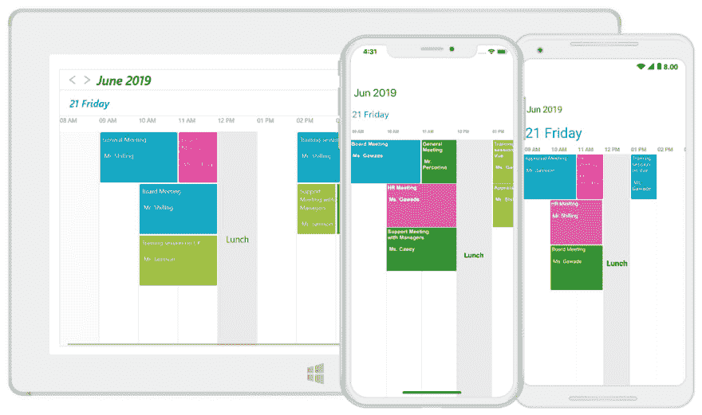
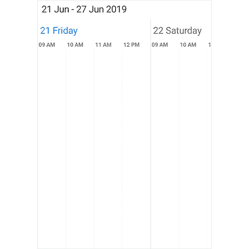
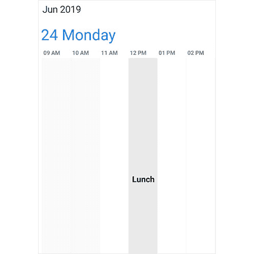
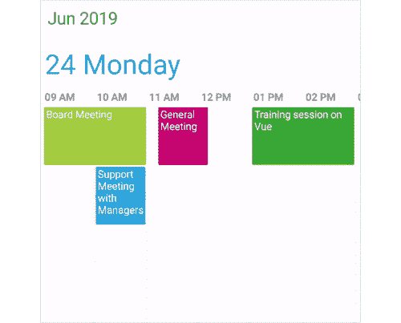
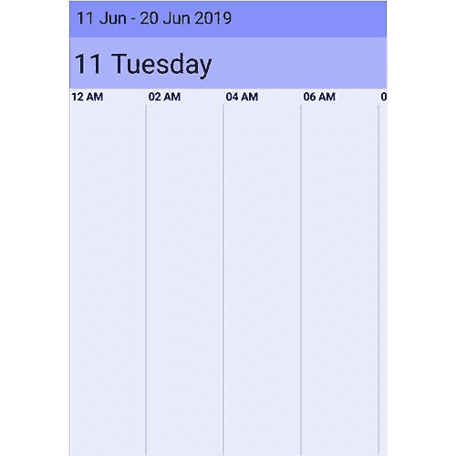

# 如何在 Xamarin 中使用时间轴视图？表单调度程序

> 原文：<https://dev.to/syncfusion/how-to-use-timeline-view-in-xamarin-forms-scheduler-1i6e>

[Xamarin。Forms Scheduler](https://www.syncfusion.com/xamarin-ui-controls/xamarin-scheduler) 控件的 timeline 视图在水平时间轴上显示日期和所需的天数。该功能可从 [2019 volume 2 beta release](https://www.syncfusion.com/forums/145548/essential-studio-2019-volume-2-beta-release-v17-2-0-28-is-available-for-download) 获得。它允许用户精确地安排和管理事件。其丰富的功能集包括事件重新安排、视图定制、特殊时间区域支持、导航、日期限制和其他功能。

<figure>

在这篇博客中，我将介绍 Scheduler 中时间轴视图的主要特性。如果您是 Scheduler 控件的新手，那么我们建议您在继续下一步之前通读其[入门文档](https://help.syncfusion.com/xamarin/sfdataform/getting-started)。【T2

<figcaption>Timeline View in Xamarin Forms Scheduler</figcaption>

</figure>

## 工作时间定制

时间线视图允许用户更改开始和结束时间，以便他们可以自定义自己的工作时间。您还可以通过设置一个 **double** 值来显示大范围的持续时间。这将被转换为分钟，如下面的代码片段所示。

```
<schedule:SfSchedule x:Name="schedule" ScheduleView="TimelineView">
    <schedule:SfSchedule.TimelineViewSettings>
        <!--Setting visible hours properties. -->
        <schedule:TimelineViewSettings
            StartHour="7.5"
            EndHour="18.5">
            <schedule:TimelineViewSettings.LabelSettings>
                <schedule:TimelineLabelSettings TimeFormat="hh:mm" />
             </schedule:TimelineViewSettings.LabelSettings>
        </schedule:TimelineViewSettings>
    </schedule:SfSchedule.TimelineViewSettings>
</schedule:SfSchedule> 
```

<figure>

[](https://res.cloudinary.com/practicaldev/image/fetch/s--Q2Tlo5e1--/c_limit%2Cf_auto%2Cfl_progressive%2Cq_auto%2Cw_880/https://blog.syncfusion.com/wp-content/uploads/2019/06/Customized-working-hours.png)

<figcaption>Customized working hours</figcaption>

</figure>

## 支持限制时隙

时间线视图允许您根据应用程序特定的使用情形，限制空闲和休息时间的特定区域的突出显示。您还可以在选定的时间区域内限制用户交互、选择和事件创建。您可以使用 Scheduler 的 **SpecialTimeRegions** 属性在时间轴视图中添加单个或多个特殊时间区域，如以下代码所示。

```
<schedule:SfSchedule x:Name="schedule" ScheduleView="TimelineView">
    <!--Setting special time region properties.-->
    <schedule:SfSchedule.SpecialTimeRegions>
        <schedule:TimeRegionSettings
            StartHour="13"
            EndHour="14"
            Text="Lunch"
            CanEdit="False"
            Color="Black"
            TextColor="White"/>
    </schedule:SfSchedule.SpecialTimeRegions>
</schedule:SfSchedule> 
```

<figure>

[](https://res.cloudinary.com/practicaldev/image/fetch/s--R0-09dW1--/c_limit%2Cf_auto%2Cfl_progressive%2Cq_auto%2Cw_880/https://blog.syncfusion.com/wp-content/uploads/2019/06/Limiting-time-slots.png)

<figcaption>Limiting time slots</figcaption>

</figure>

## 非工作日

“时间线”视图允许您跳过一周中有选择的几天来删除非工作日。

```
public ObservableCollection NonWorkingDays = new ObservableCollection();
this.NonWorkingDays.Add(DayOfWeek.Sunday);
this.NonWorkingDays.Add(DayOfWeek.Saturday); 
```

```
<syncfusion:SfSchedule
            x:Name="schedule"
            ScheduleView="TimelineView">
       <syncfusion:SfSchedule.TimelineViewSettings>
           <syncfusion:TimelineViewSettings
               NonWorkingsDays="{Binding NonWorkingDays}">
           </syncfusion:TimelineViewSettings>
       </syncfusion:SfSchedule.TimelineViewSettings>
</syncfusion:SfSchedule> 
```

## 安排和管理事件

时间线视图允许您计划和管理各种事件，如全天事件、跨时段事件和重复事件。每个视图根据事件在各自日期内的持续时间显示事件在时间段内的情况。默认情况下，全天事件将在时间段的顶部呈现，然后是跨度事件，接着是重复事件和正常事件。

<figure>

您可以在时间线视图中快速重新安排任何事件，方法是将它从一个时间段拖到另一个时间段。还可以限制某些约会的重新安排，并防止在某个时间取消约会。[](https://res.cloudinary.com/practicaldev/image/fetch/s--APXKDA-A--/c_limit%2Cf_auto%2Cfl_progressive%2Cq_66%2Cw_880/https://blog.syncfusion.com/wp-content/uploads/2019/06/Schedule-and-manage-events.gif)

<figcaption>Schedule and manage events</figcaption>

</figure>

在时间轴视图中，您可以使用 **AppointmentHeight** 属性，根据内容以所需的高度显示事件，从而大大增强内容的可读性。

```
<schedule:SfSchedule x:Name="schedule" ScheduleView="TimelineView">
    <schedule:SfSchedule.TimelineViewSettings>
        <!--Setting appointment height property.-->
        <schedule:TimelineViewSettings
            AppointmentHeight="100" />
    </schedule:SfSchedule.TimelineViewSettings>
</schedule:SfSchedule> 
```

如果您需要将大量事件添加到同一个时间段，每个事件的高度将自动调整，而不考虑**约会高度**使所有事件可见。

## 个性化时间线视图

时间轴视图非常灵活，可以定制其外观和格式，以提供统一一致的外观。您还可以根据应用程序的大小和要求，扩展或压缩时间间隔及其高度。

```
<schedule:SfSchedule x:Name="schedule"
     ScheduleView="TimelineView"
     TimeInterval="180"  
     TimeIntervalHeight="150">
     <schedule:SfSchedule.TimelineViewSettings>
         <schedule:TimelineViewSettings
            Color="#fcf3c9"
            BorderColor="#fceb9f"
            BorderWidth="5" >
                   <schedule:TimelineViewSettings.LabelSettings>
                        <schedule:TimelineLabelSettings
                              TimeLabelColor="#8282ff"
                              TimeLabelSize="15" />
                    </schedule:TimelineViewSettings.LabelSettings>
                </schedule:TimelineViewSettings>

    </schedule:SfSchedule.TimelineViewSettings>
</schedule:SfSchedule> 
```

<figure>

[](https://res.cloudinary.com/practicaldev/image/fetch/s--a_flBWip--/c_limit%2Cf_auto%2Cfl_progressive%2Cq_auto%2Cw_880/https://blog.syncfusion.com/wp-content/uploads/2019/06/Personalized-Timeline-View.png)

<figcaption>Personalized Timeline View</figcaption>

</figure>

## 结论

在这篇博客文章中，我们快速概述了时间轴视图的主要功能，这些功能可从 [2019 volume 2 beta release](https://www.syncfusion.com/forums/145548/essential-studio-2019-volume-2-beta-release-v17-2-0-28-is-available-for-download) 获得。您可以在[文档](https://help.syncfusion.com/xamarin/sfschedule/overview)中探索该控件的其他特性，在那里您可以找到每个特性的详细解释以及代码示例。您也可以在[的 GitHub 资源库](https://github.com/syncfusion/xamarin-demos/tree/master/Forms/Schedule)中查看我们的项目样本。请随意试用这个示例，并在评论部分分享您的反馈或问题。您也可以通过我们的[支持论坛](https://www.syncfusion.com/forums)、 [Direct-Trac](https://www.syncfusion.com/support/directtrac/) 或[反馈门户](https://www.syncfusion.com/feedback/)联系我们。我们很乐意帮助你。

文章[介绍 Xamarin 中的时间线视图。表单调度器](https://blog.syncfusion.com/post/timeline-view-in-xamarin-forms-scheduler.aspx)最早出现在 [Syncfusion 博客](https://blog.syncfusion.com)上。