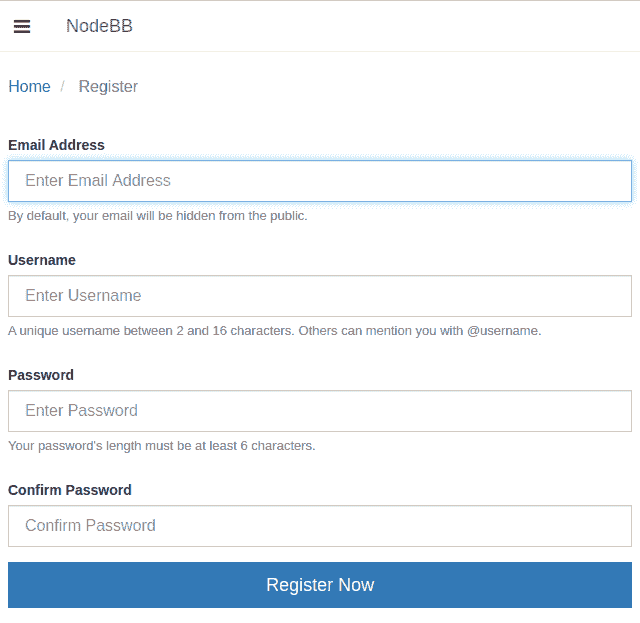
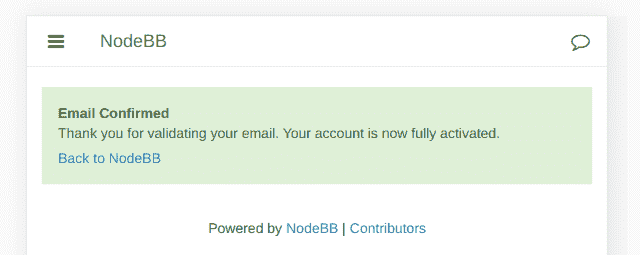
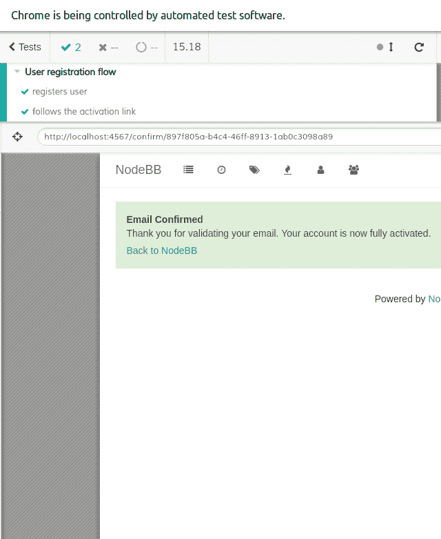
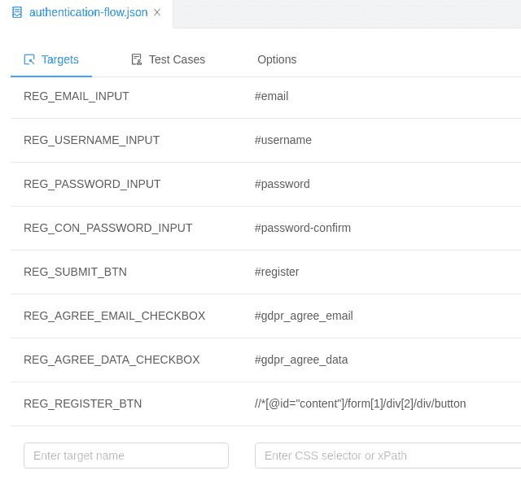
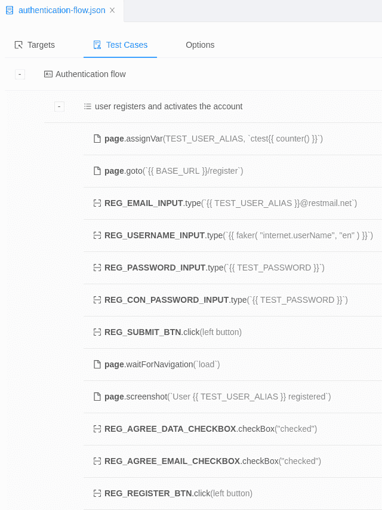
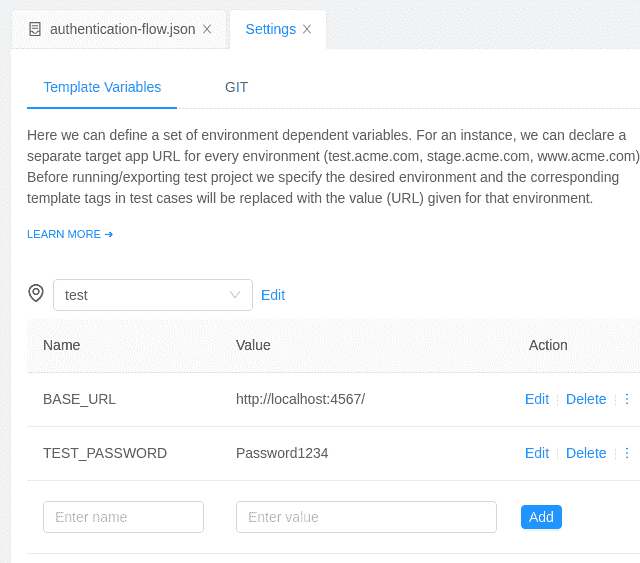
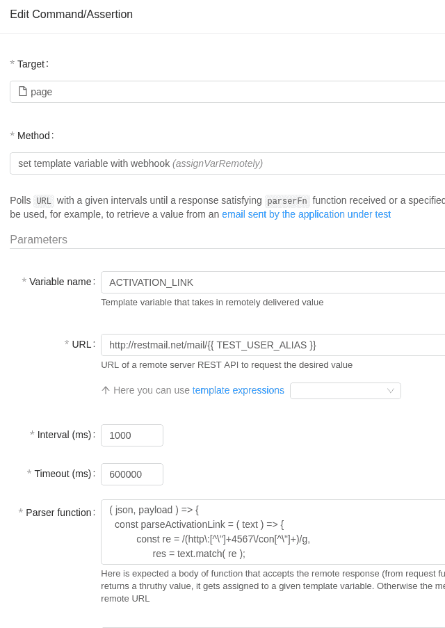
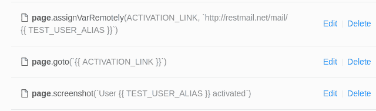
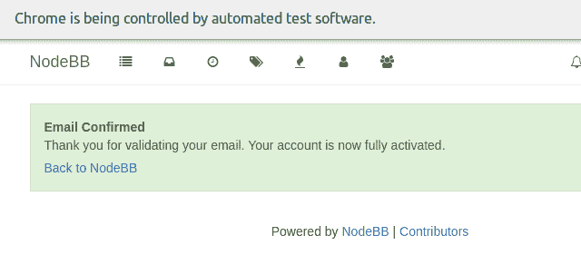
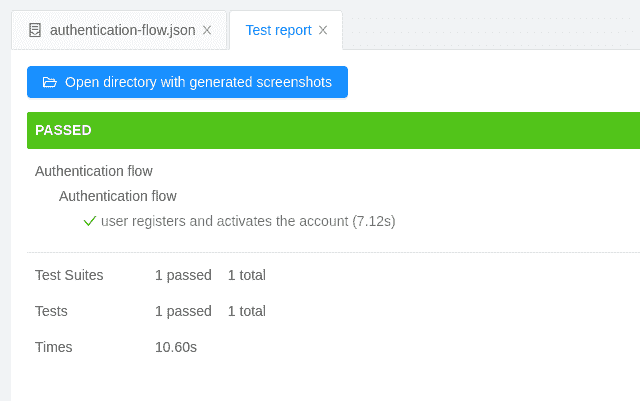

# 通过电子邮件激活测试注册流程

> 原文：<https://dev.to/dsheiko/testing-signup-flow-with-activation-by-email-h2m>

功能测试并不是什么新鲜事。我们都或多或少地用不同的工具和方法做这件事。然而，当涉及流程时，交易电子邮件(注册确认、密码重置、购买通知等)仍可能带来问题。例如，我们指示测试工具导航到注册页面，填写表单并按提交按钮。web 应用程序发送带有激活链接的电子邮件。因此，我们需要测试工具来读取电子邮件，解析它并导航链接。第一个挑战是连接测试工具和邮件服务器。如果您的邮件服务器公开了 REST API，这没什么大不了的。否则你需要考虑一个专门的服务，比如 [Sendgrid](https://sendgrid.com/) 、 [Mailgun](https://www.mailgun.com/) 、 [Email Yak](http://www.emailyak.com/) 、[邮戳](http://www.postmarkapp.com/)。

## 邮件服务器 API

说实话，这也可以用[Restmail.net](http://restmail.net/)来实现。它是免费的，不需要注册，允许动态创建收件箱，公开了一个 REST API 来读取收到的邮件。然而，所有发送的消息都是公开的。REST API 非常简单:

```
 GET /mail/<user>
    DELETE /mail/<user> 
```

所以你可以发送一封电子邮件给，比如说，`joe1@restmail.net`并通过`GET /mail/joe1`接收邮件内容。自然你可以事后用`DELETE /mail/joe1`删除

## 轮询收件箱

但是我们如何在测试案例中使用它呢？我们需要一个功能，轮询收件箱更新的邮件服务器 API。此函数应查找测试会话期间发送的电子邮件消息，解析操作链接并将其返回给测试方法。我建议如下实现:

```
 function pollForValue({ url, interval, timeout, parserFn, parserPayload = {}, requestFn = null }) {
        const request = requestFn ? requestFn : async ( url ) => {
          const rsp = await fetch( url );
          if ( rsp.status < 200 || rsp.status >= 300  ) {
            return {};
          }
          return await rsp.json();
        };

        return new Promise(( resolve, reject ) => {
          const startTime = Date.now();
          pollForValue.attempts = 0;

          async function attempt() {
            if ( Date.now() - startTime > timeout ) {
              return reject( new Error( `Polling: Exceeded timeout of ${ timeout }ms` ) );
            }
            const value = parserFn( await request( url ), parserPayload );
            pollForValue.attempts ++;
            if ( !value ) {
              return setTimeout( attempt, interval );
            }
            resolve( value );
          }
          attempt();

        });
     } 
```

当您调用该函数时，它会轮询给定的 URL，直到收到消息或超时。它返回解析的值(例如激活链接)并接受具有以下属性的选项对象:

*   `url`–REST API 资源。这里[http://restmail.net/mail/](http://restmail.net/mail/<user)
*   `interval`–轮询请求之间的间隔，单位为毫秒
*   `timeout`–函数循环的最大允许时间跨度，单位为毫秒
*   `parserFn`–接收 REST API 响应并解析其所需值的回调。pollForValue 函数将轮询所提供的 URL，直到 parserFn 返回一个真值(或超时)
*   `requestFn`–(可选)替换默认窗口的回调。fetch
*   `parserPayload` -(可选)parserFn 回调的额外负载

## 测试应用

所以我们有邮件服务器 API 和轮询功能。接下来，我们将在不同的测试工具中尝试它。为此，我们需要一个真实世界的例子。想象一下，我们正在测试用 NodeBB 构建的 ACME 论坛应用程序。我们的目标是填写注册表单([http://localhost:4567/register](http://localhost:4567/register))并提交它:

[](https://res.cloudinary.com/practicaldev/image/fetch/s--p3xaP-RX--/c_limit%2Cf_auto%2Cfl_progressive%2Cq_auto%2Cw_880/http://dsheiko.com/download/000000292/example-app-1.png)

这将我们带到下一页，我们在 GDPR 复选框打勾。

[](https://res.cloudinary.com/practicaldev/image/fetch/s--p3xaP-RX--/c_limit%2Cf_auto%2Cfl_progressive%2Cq_auto%2Cw_880/http://dsheiko.com/download/000000292/example-app-1.png)

提交表单时，应用程序会发送确认电子邮件。这里我们用`pollForValue`函数。我们称之为轮询 REST API，直到电子邮件消息到达。该函数将使用以下解析逻辑从 NodeBB 默认电子邮件模板获取激活链接:

```
 function parseActivationLink( text ) {
        const re = /(http\:[^\"]+4567\/con[^\"]+)/g,
              res = text.match( re );
        return res ? res[ 0 ].replace( "=\r\n", "" ) : null;
    } 
```

因此，我们获得了激活 URL，我们按照它来完成注册。

## 用 Selenium WebDriver 测试

Selenium WebDriver 可能是最流行的测试工具。我要说，这不是最轻松的，但这绝对是你听说过的。所以我们为 Node.js 设置了[开发环境，并编写了我们的测试用例。直到我们让 ACME 论坛发送激活电子邮件，一切都是确定的:](https://www.npmjs.com/package/selenium-webdriver) 

```
 const { Builder, By, Key, until } = require( "selenium-webdriver" );

    (async function main() {
      const driver = await new Builder().forBrowser("chrome").build(),
            USER = "ctest1";
      try {
        await driver.get( "http://localhost:4567/register" );

        await driver.findElement( By.id("email" ) )
          .sendKeys( `${ USER }@restmail.net`, Key.RETURN );
        await driver.findElement( By.id("username" ) )
          .sendKeys( USER , Key.RETURN );
        await driver.findElement( By.id("password" ) )
          .sendKeys( `Password1234`, Key.RETURN );
        await driver.findElement( By.id("password-confirm" ) )
          .sendKeys( `Password1234`, Key.RETURN );

        await driver.findElement( By.id("gdpr_agree_email" ) )
          .click();

        await driver.findElement( By.id("gdpr_agree_data" ) )
          .click();

        await driver.findElement( By.css("#content form button" ) )
          .click();

        //…  

      } catch ( e ) {
        console.log( e );
      } finally {
        await driver.quit();
      }
    })(); 
```

我们用测试值填充第一个表单，其中电子邮件应在 restmail.net 域中。当我们完成最后一个字段时，表单会自动提交。然后，我们勾选复选框，并点击提交按钮。现在让我们进行投票。所以我们在脚本的开头放了一个模块来简化 HTTP(S)请求:

```
 const fetch = require( "node-fetch" ); 
```

接下来我们放置我们的`pollForValue`和`parseActivationLink`函数。现在我们可以用
来扩展测试步骤

```
 const activationLink = await pollForValue({ url: `http://restmail.net/mail/${ USER }`, 
          interval: 1000, 
          timeout: 600000,  
          parserFn: ( messages ) => {
              if ( !messages ) {
                return null;
              }
               const sentAt = new Date( Date.now() - 1000 ),
                     unseen = messages.find( msg => new Date( msg.receivedAt ) > new Date( sentAt ) );                
              return parseActivationLink( messages[0].html );
          }
        });

        console.log( "Activation link:", activationLink );

        await driver.get( activationLink ); 
```

因此，在提交第二个表单后，我们对新发送的电子邮件进行脚本轮询。当它被接收时，我们解析激活链接的消息体。答对了。我们得到链接，并让司机导航到它。

[](https://res.cloudinary.com/practicaldev/image/fetch/s--_XnK5QrN--/c_limit%2Cf_auto%2Cfl_progressive%2Cq_auto%2Cw_880/http://dsheiko.com/download/000000292/selenium-res.png)

## 用柏树测试

最近一个名为 [Cypress](https://www.cypress.io/) 的工具正在蓄势待发。我个人很喜欢它用于测试调试。如果不轮询邮件消息，测试脚本可能如下所示:

```
 const USER = "ctest1";
    describe("User registration flow", () => {
        it( "registers user", ( done ) => {
          cy.visit( "http://localhost:4567/register" );

          cy.get( "#email" ).type( `${ USER }@restmail.net` );
          cy.get( "#username" ).type( USER );
          cy.get( "#password" ).type( "Password1234" );
          cy.get( "#password-confirm" ).type( "Password1234" );
          cy.get( "#register" ).click();
          cy.wait( 1000 );
          cy.get("#gdpr_agree_email").click();
          cy.get("#gdpr_agree_data").click();
          cy.get("#content form button.btn-primary").click();

          //...
          done();

        })
      }) 
```

类似于我们对 Selenium 所做的，我们用`pollForValue`和`parseActivationLink`函数扩展了脚本。但是这次我们没有使用节点获取，而是使用了内置的 cy.request 函数。这就是 pollForValue 的`requestFn`期权发挥作用的地方:

```
 pollForValue({ url: `http://restmail.net/mail/${ USER }`, 
                interval: 1000, 
                timeout: 600000,  
                parserFn: ( messages ) => {
                    if ( !messages ) {
                        return null;
                      }
                       const sentAt = new Date( Date.now() - 1000 ),
                             unseen = messages.find( msg => new Date( msg.receivedAt ) > new Date( sentAt ) );                
                      return parseActivationLink( messages[0].html );
                },
                requestFn: ( url ) => {
                    return new Promise(( resolve ) => {
                        cy.request( url )
                            .then( (response) => {
                                resolve( response.body );
                            } );
                    });
                }
          }).then(( link ) => { 
            activationLink = link;
            console.log( "Activation link:", activationLink );
            done(); 
          }); 
```

所以就剩下声明`activationLink`
了

```
 let activationLink; 
```

并访问激活链接

```
 it( "follows the activation link", () => {
       cy.visit( activationLink );
    }) 
```

[](https://res.cloudinary.com/practicaldev/image/fetch/s--RALCGIYY--/c_limit%2Cf_auto%2Cfl_progressive%2Cq_auto%2Cw_880/http://dsheiko.com/download/000000292/cypress-res.png)

## 测试用木偶戏

我们刚刚研究了如何使用基于脚本的测试工具来完成这个任务。现在让我们来看一个没有代码的例子——[木偶戏](https://puppetry.app)。有了这个工具，我们不需要编写脚本，而是使用 GUI 来完成我们的测试规范。或者我们[记录用户行为](https://docs.puppetry.app/suite#record-suite)。不管怎样，我们最终得到了一个测试套件，它包含了一个目标元素的表格:

[](https://res.cloudinary.com/practicaldev/image/fetch/s--RbyWFZDi--/c_limit%2Cf_auto%2Cfl_progressive%2Cq_auto%2Cw_880/http://dsheiko.com/download/000000292/puppetry-1.png)

测试用例:

[](https://res.cloudinary.com/practicaldev/image/fetch/s--6tRILkfc--/c_limit%2Cf_auto%2Cfl_progressive%2Cq_auto%2Cw_880/http://dsheiko.com/download/000000292/puppetry-2.png)

在这个例子中，我使用了模板变量。首先，我定义了一个新的变量`TEST_USER_ALIAS`，它可以在`ctest1`、`ctest2`等等的每一次测试中解析。然后，我在电子邮件字段中输入时引用了该变量。此外，我应用模板表达式`{{ faker( "internet.userName", "en" ) }}`来生成类似真实世界的用户名。我还提到了一些与环境相关的变量。除此之外，我不认为你阅读测试步骤会有困难。

[](https://res.cloudinary.com/practicaldev/image/fetch/s--nBRNU8zt--/c_limit%2Cf_auto%2Cfl_progressive%2Cq_auto%2Cw_880/http://dsheiko.com/download/000000292/puppetry-vars.png)

现在我们扩展邮件服务器轮询的测试。因此，我们添加了与之前描述的功能`pollForValue`相对应的命令:

[](https://res.cloudinary.com/practicaldev/image/fetch/s--aKXdGT1O--/c_limit%2Cf_auto%2Cfl_progressive%2Cq_auto%2Cw_880/http://dsheiko.com/download/000000292/puppetry-3.png)

我们在选项中提供了检索和解析功能，类似于我们在 Selenium 和 Cypress 中使用的功能。这将解析成新的模板变量`ACTIVATION_LINK`，我们用它来访问页面:

[](https://res.cloudinary.com/practicaldev/image/fetch/s--_mEUw_1h--/c_limit%2Cf_auto%2Cfl_progressive%2Cq_auto%2Cw_880/http://dsheiko.com/download/000000292/puppetry-4.png)

就在那里。我们得到了结果:

[](https://res.cloudinary.com/practicaldev/image/fetch/s--wao-xj9u--/c_limit%2Cf_auto%2Cfl_progressive%2Cq_auto%2Cw_880/http://dsheiko.com/download/000000292/puppetry-res1.png)

[](https://res.cloudinary.com/practicaldev/image/fetch/s--CJtqFW4b--/c_limit%2Cf_auto%2Cfl_progressive%2Cq_auto%2Cw_880/http://dsheiko.com/download/000000292/puppetry-res2.png)

## 重述

简而言之，测试涉及交易电子邮件的用户流并没有看上去那么复杂。您只需要一个 API 来访问邮件服务器和轮询方法(例如本文中的函数)。您可以使用不同的测试工具来实现，很可能是您目前正在使用的工具。