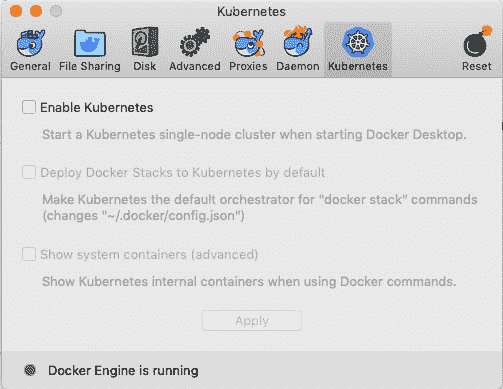
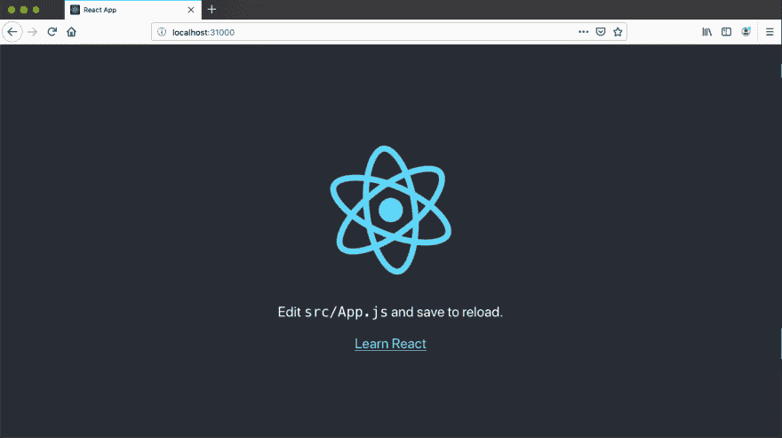

# 通过 5 个简单的步骤将 React 应用程序部署到 Kubernetes

> 原文：<https://dev.to/rieckpil/deploy-a-react-application-to-kubernetes-in-5-easy-steps-516j>

Kubernetes 目前是在云中部署应用程序的事实上的标准。每个主要的云提供商都提供专门的 Kubernetes 服务(例如 GKE 的 Google Cloud，EKS 的 AWS 等)。)在 Kubernetes 集群中部署应用程序。

选择 Kubernetes 部署 React 应用程序有很多原因:

*   跨云提供商的统一和标准化部署模式
*   部署多个容器时的抗停机能力(水平扩展)
*   通过自动扩展处理高峰流量
*   零停机部署、金丝雀部署等。
*   简单的 A/B 测试

在这篇文章中，我将通过五个简单的步骤演示如何将 React 应用程序部署到 Kubernetes 集群。要理解这篇文章，你只需要基本的 Docker 知识。

由于我们都希望在学习一个新主题时得到快速反馈，所以我将在这个例子中使用一个本地 Kubernetes 集群。如果您的机器上安装了支持 Kubernetes 的 Docker 引擎，您可以在几分钟内启动这个本地 Kubernetes 集群。这从版本 **18.06.0** 开始对 [Windows](https://docs.docker.com/docker-for-windows/kubernetes/) / [Mac](https://docs.docker.com/docker-for-mac/kubernetes/) 的 Docker 桌面可用。

我们开始吧...

### 步骤 1:创建 React 应用程序

我从一个全新的 React 应用程序开始，这个应用程序是用来自[脸书](https://github.com/facebook/create-react-app) :
的`create-react-app`创建的

```
➜ node -v
v10.16.0
➜ npm -v
6.9.0
➜ npx create-react-app react-app-kubernetes
npx: installed 91 in 5.787s

Creating a new React app in /Users/rieckpil/Desktop/react-app-kubernetes.

Installing packages. This might take a couple of minutes.
Installing react, react-dom, and react-scripts...

...

Happy hacking! 
```

Enter fullscreen mode Exit fullscreen mode

这将创建开始开发新的 React 应用程序所需的所有配置和文件。

确保您能够使用`npm start`在本地机器上的 [http://localhost:3000](http://localhost:3000) 启动并访问 React 应用程序。在接下来的部分中，我们需要 React 应用程序的优化生产版本，它是用:
创建的

```
➜ npm run-script build
> react-app-kubernetes@0.1.0 build /Users/rieckpil/Desktop/junk/react-app-kubernetes
> react-scripts build

Creating an optimized production build...
Compiled successfully.

File sizes after gzip:

  36.44 KB  build/static/js/2.b41502e9.chunk.js
  762 B     build/static/js/runtime~main.a8a9905a.js
  602 B     build/static/js/main.28647029.chunk.js
  517 B     build/static/css/main.2cce8147.chunk.css

... 
```

Enter fullscreen mode Exit fullscreen mode

如果您有一个现有的 React 应用程序，您可以跳过这一节，继续下一节。只需确保您的应用程序在`build/`时有产品版本。

### 第二步:将 React 应用程序文档化

为了将 React 应用程序部署到 Kubernetes，我们需要将其打包到一个容器中。Kubernetes 支持几种容器引擎，但 Docker 是目前被采用最多的一种。

要创建 Docker 容器，我们需要在 React 应用程序文件夹的根级别创建一个`Dockerfile`。该文件定义了所使用的操作系统、其配置方式以及该容器中运行的其他应用程序。

对于这个例子，我使用 [nginx](https://www.nginx.com/) 来提供 React 应用程序的内容，最简单的`Dockerfile`如下所示:

```
FROM nginx:1.17
COPY build/ /usr/share/nginx/html 
```

Enter fullscreen mode Exit fullscreen mode

我们的 Docker 容器从官方的`nginx:1.17` Docker 映像继承了一切，只是将 React 产品版本复制到容器中。

为了加速 Docker 容器的创建，请确保向项目中添加了一个`.dockerignore`,以避免将`node_modules`发送到 Docker 上下文:

```
node_modules 
```

Enter fullscreen mode Exit fullscreen mode

一旦 React 产品构建就绪，启动 Docker 引擎并执行以下命令来创建 Docker 映像:

```
➜ docker build -t my-react-app .
Step 1/2 : FROM nginx:1.17
1.17: Pulling from library/nginx
fc7181108d40: Pull complete d2e987ca2267: Pull complete 0b760b431b11: Pull complete Digest: sha256:96fb261b66270b900ea5a2c17a26abbfabe95506e73c3a3c65869a6dbe83223a
Status: Downloaded newer image for nginx:1.17
 ---> f68d6e55e065
Step 2/2 : COPY build/ /usr/share/nginx/html
 ---> 35d48f28a918
Successfully built 35d48f28a918
Successfully tagged my-react-app:latest 
```

Enter fullscreen mode Exit fullscreen mode

对于一个更适合生产的 Docker 容器，请确保根据您的需要定制 nginx 配置。

### 步骤 3:连接到您的 Kubernetes 集群

要启动本地 Kubernetes 集群，请打开 Docker 桌面偏好设置并切换到 Kubernetes 选项卡:

[](https://res.cloudinary.com/practicaldev/image/fetch/s--KBN5dWbH--/c_limit%2Cf_auto%2Cfl_progressive%2Cq_auto%2Cw_880/https://thepracticaldev.s3.amazonaws.com/i/jaof9knje650wpielfd1.png)

您可以在这里启用 Kubernetes 支持。如果您第一次启用它，集群创建**可能需要一些时间**，因为会在后台下载几个 Docker 映像。

一旦您的本地 Kubernetes 集群运行，通过`kubectl`连接到它(如果缺少，在这里下载[):](https://kubernetes.io/docs/tasks/tools/install-kubectl/) 

```
➜ kubectl config use-context docker-for-desktop
Switched to context "docker-for-desktop".
➜ kubectl get nodes
NAME                 STATUS    ROLES     AGE       VERSION
docker-for-desktop   Ready     master    3d        v1.10.11
➜ kubectl cluster-info
Kubernetes master is running at https://localhost:6443
KubeDNS is running at https://localhost:6443/api/v1/namespaces/kube-system/services/kube-dns:dns/proxy

To further debug and diagnose cluster problems, use 'kubectl cluster-info dump'. 
```

Enter fullscreen mode Exit fullscreen mode

有了 Docker Desktop 的 Kubernetes 支持，您将获得一个本地单节点集群*和*,这对于评估和学习非常有用。

如果您想将 React 应用程序部署到云中的 Kubernetes 集群，请从这里开始:

*   谷歌 Kubernetes 引擎(GKE) [快速入门](https://cloud.google.com/kubernetes-engine/docs/quickstart)
*   azure kuberates engine(AK)[快速启动](https://azure.microsoft.com/de-de/services/kubernetes-service/)
*   AWS Kubernetes 发动机(EKS) [快速入门](https://aws.amazon.com/de/eks/)
*   用于 Kubernetes 的 Oracle 容器引擎(OKE) [快速入门](https://docs.cloud.oracle.com/en-us/iaas/Content/ContEng/Tasks/contengcreatingclusterusingoke.htm)

### 步骤 4:将 Docker 图像上传到您的容器注册中心

为了能够在 Kubernetes 集群中提取 Docker 图像，我们需要将图像上传到一个 **Docker 注册中心**。对于云部署，您通常会从云提供商那里获得一个专用的注册表来上传您的映像。当我们将应用程序部署到本地集群时，我们需要一个本地 Docker 注册中心。

您可以使用以下语句创建一个本地 Docker 注册表:

```
➜ docker run -d -p 5000:5000 --restart=always --name registry registry:2 
```

Enter fullscreen mode Exit fullscreen mode

为了上传我们之前创建的 React Docker 映像，我们必须用注册中心的主机名和端口
来*标记*该映像

```
➜ docker tag my-react-app localhost:5000/my-react-app 
```

Enter fullscreen mode Exit fullscreen mode

现在终于可以将图像推送到我们的 Docker 注册表:

```
➜ docker push localhost:5000/my-react-app
The push refers to repository [localhost:5000/my-react-app]
9d9745936581: Pushed
d2f0b6dea592: Pushed
197c666de9dd: Pushed
cf5b3c6798f7: Pushed
latest: digest: sha256:66c94bdba6b06d1964a764cd14dc97d8adf202b02ab6e6fbd10b23ad4a8554a1 size: 1158 
```

Enter fullscreen mode Exit fullscreen mode

现在我们准备将应用程序部署到 Kubernetes 集群。

### 步骤 5:部署 React 应用程序

通常，每个 Kubernetes 对象(`service`、`pod`、`deployment`等)。)被描述在一个`.yaml`文件中，但是`.json`也是可能的。

为了将 React 应用程序部署到 Kubernetes，我们需要一个所谓的`deployment`。这个 Kubernetes 实体确保我们的应用程序将拥有我们定义的一样多的副本(并行 pods)。此外，我们可以定义想要使用的 Docker 映像、使用的端口以及应用程序的其他元数据:

```
kind: Deployment
apiVersion: apps/v1
metadata:
  name: my-react-app
spec:
  replicas: 2
  selector:
    matchLabels:
      app: my-react-app
  template:
    metadata:
      labels:
        app: my-react-app
    spec:
      containers:
        - name: my-react-app
          image: localhost:5000/my-react-app
          imagePullPolicy: Always
          ports:
            - containerPort: 80
      restartPolicy: Always 
```

Enter fullscreen mode Exit fullscreen mode

只有这个`deployment`我们将无法从外部访问我们的应用程序。为了公开应用程序，Kubernetes 提供了一个所谓的`service`。使用`service`,我们可以定义向集群/外部公开哪些端口。

有几种不同类型的 Kuberntes `service`，我为您的示例选择了最简单的一种:`NodePort`。这种类型将在我们的 Kubernetes 集群中的每个节点上公开一个定义的端口(对于本地 Kubernetes 集群，我们只有一个节点)，并将其映射到应用程序的端口:

```
kind: Service
apiVersion: v1
metadata:
  name: my-react-app
spec:
  type: NodePort
  ports:
    - port: 80
      targetPort: 80
      protocol: TCP
      nodePort: 31000
  selector:
    app: my-react-app 
```

Enter fullscreen mode Exit fullscreen mode

可以用`---`将`service`和`deployment`添加到一个单独的`.yaml`文件中进行分隔。在我们的例子中，我创建了一个`deployment.yaml`文件来存储这两者:

```
kind: Deployment
apiVersion: apps/v1
# more ...
---
kind: Service
apiVersion: v1
# more ... 
```

Enter fullscreen mode Exit fullscreen mode

您现在可以使用这个文件通过:
将您的应用程序部署到 Kubernetes

```
➜ kubectl apply -f deployment.yaml
deployment.apps "my-react-app" created
service "my-react-app" created 
```

Enter fullscreen mode Exit fullscreen mode

并且可以使用
检查一切都在运行

```
➜ kubectl get pods
NAME                            READY     STATUS    RESTARTS   AGE
my-react-app-6c8b5c4759-fgb2q   1/1       Running   0          7m
my-react-app-6c8b5c4759-jrzzj   1/1       Running   0          7m
➜ kubectl get deployment
NAME           DESIRED   CURRENT   UP-TO-DATE   AVAILABLE   AGE
my-react-app   2         2         2            2           7m
➜ kubectl get service
NAME           TYPE        CLUSTER-IP      EXTERNAL-IP   PORT(S)        AGE
kubernetes     ClusterIP   10.96.0.1       <none>        443/TCP        3d
my-react-app   NodePort    10.99.224.141   <none>        80:31000/TCP   7m 
```

Enter fullscreen mode Exit fullscreen mode

一旦一切都启动并运行，在您的机器上访问 [http://localhost:31000](http://localhost:31000) ,您应该看到您的 React 应用程序，现在由 Kubernetes 集群提供:

[](https://res.cloudinary.com/practicaldev/image/fetch/s--kYyFTgqP--/c_limit%2Cf_auto%2Cfl_progressive%2Cq_auto%2Cw_880/https://thepracticaldev.s3.amazonaws.com/i/p5h2kvp8m8u13lergvge.png)

要从 Kubernetes 集群中删除 React 应用程序，只需运行

```
➜ kubectl delete service,deployment my-react-app
service "my-react-app" deleted
deployment.extensions "my-react-app" deleted 
```

Enter fullscreen mode Exit fullscreen mode

你可以在 [GitHub](https://github.com/rieckpil/blog-tutorials/tree/master/react-app-kubernetes) 上找到这个例子的完整代码库。

更多 React 相关文章，请访问我的[博客](https://rieckpil.de):

*   [用 React 预览 PDF 文件](https://rieckpil.de/howto-pdf-preview-with-react/)
*   [使用 Keycloak 和 React 进行微配置文件 JWT 验证](https://rieckpil.de/howto-microprofile-jwt-authentication-with-keycloak-and-react/)
*   [用 React 和 Spring Boot 上传和下载文件](https://rieckpil.de/howto-up-and-download-files-with-react-and-spring-boot/)

享受将 React 应用部署到 Kubernetes 的乐趣，
Phil