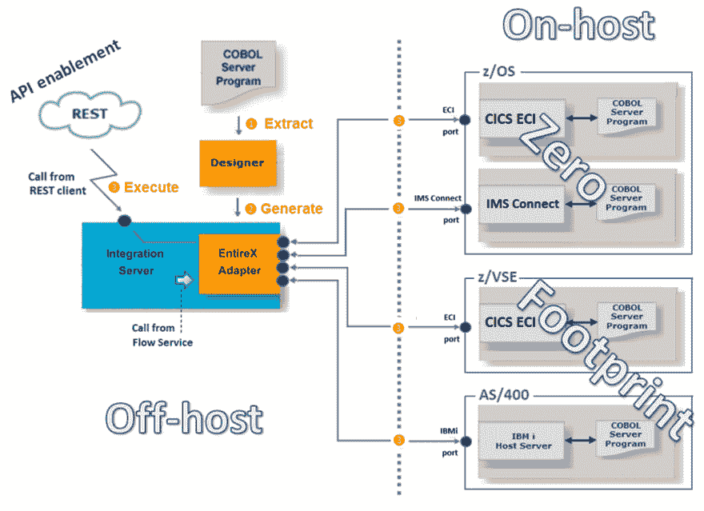
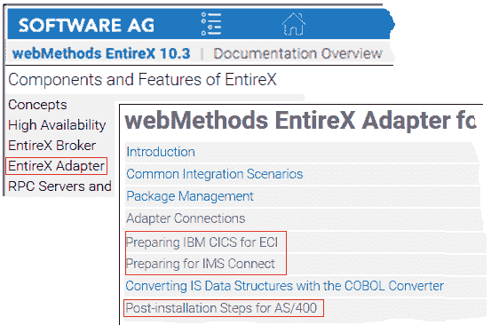
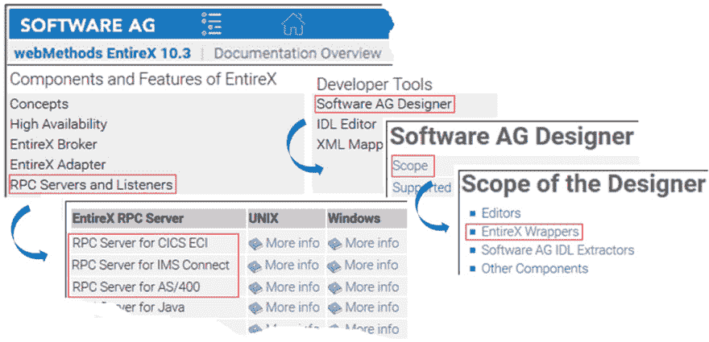

# API 支持 COBOL——零后端占用

> 原文：<https://dev.to/techcommunity/api-enable-your-cobol-with-zero-backend-footprint-2aac>

# webMethods EntireX

有了 EntireX，COBOL 程序的 API 启用变得很容易。了解作为 IT 专业人员，EntireX 如何帮助您拯救这些 COBOL 宝藏，而无需在大型机上安装任何 EntireX 组件。请继续阅读，了解 EntireX 10.3 可能的零占用场景概述。

Adabas & Natural 产品管理总监 Jürgen Lind 和软件公司 EntireX 开发部高级软件专家 Bernhard Fricke

## 场景

假设您正在 IBM z/OS、z/VSE 或 AS/400 等后端系统上运行业务关键型 COBOL 应用程序。与此同时，世界其他地方都在谈论数字经济、API 支持和 API 管理，而最有趣的界面是当今的架构选择。

有了 EntireX，你可以很容易地融合 COBOL 和 REST 驱动的 API 经济。

然而，如何在不增加对大型机或后端系统的影响的情况下做到这一点呢？如何避免额外的组织成本？

如何节省后端系统的安装和配置时间？

答案是零后端占用集成。阅读 EntireX 如何帮助 IT 专业人员利用 COBOL 资源，而无需在后端系统上进行任何额外的安装。

## 零足迹 API 启用

下图(图 1)概述了 EntireX 支持的各种主机系统的零占用场景。如您所见，后端主机系统上没有安装任何东西——所有处理都是在主机外完成的。运行时涉及的组件是 webMethods 集成服务器，其中安装了 EntireX 适配器。

**图 1:** 从 REST 客户端调用 COBOL，后端足迹为零

当遵循以下三个阶段时，用 EntireX 开发这个场景是很容易的:1 提取 COBOL 服务器的服务器接口；2 生成 IS 服务、IS 连接和可选的 REST 资源；3 Test 是 COBOL 的服务或 REST 客户端(图 1)。

## 为您的后端系统零占用空间做准备

要使用零足迹，您需要准备您的后端系统。确保以下部件已安装好:

*   对于 CICS : CICS 和 CICS ECI 端口
*   对于 IMS:IMS MPP 在线系统和 IMS Connect
*   对于 AS/400 : IBM i 主机集成服务器

有关如何准备零占用后端系统的详细信息，请参考 EntireX 文档中的 EntireX > EntireX 适配器的组件和功能:

**图 2:** EntireX 文档 EntireX 适配器

## 使用任意 RPC 客户端实现零占用

从 webMethods Integration Server 之外的环境中零占用地访问 COBOL 的典型架构包括:RPC 客户机、EntireX 代理和 RPC 服务器。要开发场景，请使用以下步骤:1 提取 COBOL 服务器；2 使用完整的包装器(如 Java、C#、DCOM 等)生成 RPC 客户端。；3 要进行测试，请使用适当的 EntireX RPC 服务器:CICS ECI、IMS Connect 或 AS/400(图 3。).

**T4】**

**图 3:** 从任意的 RPC 客户端调用 COBOL，零后端占用

有关零占用场景中使用的 RPC 服务器的详细信息，请参考 EntireX 文档中的 EntireX > RPC 服务器和侦听器的组件和功能；对于 EntireX 包装器，请分别参见开发人员工具>软件 AG 设计器>范围。

图 4 EntireX 文档:RPC 服务器、RPC 监听器和 EntireX 包装器

## 所以综上…

如果你的后端由不同的组织单位或第三方公司管理，那么 EntireX 是适合你的产品。它允许您在后端调用 COBOL 而不占用任何内存。这意味着在执行 COBOL 程序的系统上没有安装任何完整的组件。**配置完成后，**零占地面积**也意味着无需进一步维护。**

最重要的是，由于大多数处理都是在主机外完成的，EntireX 的零占用有助于将后端成本保持在最低水平。

借助 EntireX，AS/400、z/VSE 和 z/OS(包括 CICS 和 IMS)可以实现零后端占用空间。

## 术语表

**CICS **–IBM 的大型机事务容器

**DFHCOMMAREA **–CICS 程序使用的经典参数区，数据长度限制为 32K 字节

**CICS ECI **–通过 TCP/IP 从 CICS 外部调用 DFHCOMMAREA CICS 程序；

**IMS **–另一个 IBM 大型机事务系统，包括一个分层数据库

**IMS Connect **–主机上的应用程序支持通过 TCP/IP 连接到 IMS

* *AS/400 ** - IBM 中档计算机系统；也称为 iSeries，System i

**IBMi **–AS/400 的操作系统；也称为 OS/400、I5/OS

* *主机上**–后端系统，如 z/OS

**脱离主机处理**–非后端系统(如 Windows 或 UNIX)上的工作负载

## 相关文章

1.  **[大型机集成变得简单](http://techcommunity.softwareag.com/techniques-blog/-/blogs/webmethods-entirex)。** *技法，【2016 年 4 月(第二期)。*
2.  **[如何从 COBOL 大型机出站](http://techcommunity.softwareag.com/web/guest/techniques-blog/-/blogs/how-to-call-webmethods-integration-server-from-cobol-mainframe-outbound)调用 webMethods Integration Server。** *技法，【2016 年 10 月(第四期)。*
3.  **[如何从 webMethods Integration Server](http://techcommunity.softwareag.com/techniques-blog/-/blogs/webmethods-entir-2) 调用 COBOL。** *技法，【2017 年 4 月(第二期)。*
4.  **" [如何从 web methods Integration Server-the modern way](http://techcommunity.softwareag.com/techniques-blog/-/blogs/how-to-shape-a-call-to-cobol-from-webmethods-integration-server-the-modern-way)构建对 COBOL 的调用。** *技法*，2018 年 1 月(第一期)。
5.  **[如何从集成服务器](http://techcommunity.softwareag.com/web/guest/techniques-blog/-/blogs/how-to-call-cobol-on-ibm-i-as-400-from-integration-server)调用 IBM 上的 COBOL[I](http://techcommunity.softwareag.com/web/guest/techniques-blog/-/blogs/how-to-call-cobol-on-ibm-i-as-400-from-integration-server)T5【AS/400】。** *技法，【2018 年 7 月(第三期)。*
6.  **“[将您的大型机资产发布为 REST 资源](http://techcommunity.softwareag.com/techniques-blog/-/blogs/publish-your-mainframe-assets-as-rest-resources)”。** *技法，【2018 年 10 月(第四期)。*
7.  **"[EntireX for CICS Socket Listener-以最小的主机占用空间集成](http://techcommunity.softwareag.com/techniques-blog/-/blogs/entirex-for-cics-socket-listener-integration-with-minimal-mainframe-footprint)。** *技法，【2019 年 4 月(第二期)。*