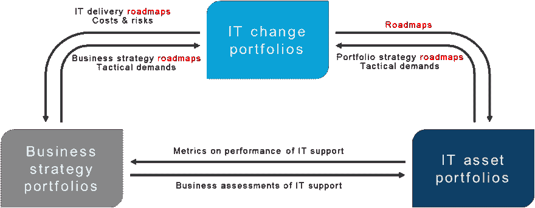

# 获得正确的路线图

> 原文：<https://dev.to/techcommunity/getting-it-road-mapping-right-2lol>

# IT 战略规划需要 IT 路线图

***“你所需要的只是计划、路线图，以及勇往直前到达目的地的勇气”。*T3】**

**——夜莺伯爵**

实现目标的三要素当然适用于 IT。好的一面是，在 IT 中，有工具可用于支持规划和路线图。如果工具足够好，让你对自己的计划和路线图充满信心，鼓起勇气坚持下去就很容易了。

IT 路线图在这个双赢的三人组中扮演什么角色？与高速公路路线图一样，IT 路线图是一张图片，显示了从当前位置到预期目的地的一系列站点。像高速公路路线图一样，它可以包括许多其他定性信息，如相关参与者、依赖系统和成本。然而，对于 IT 路线图来说，一个特别的方面是必不可少的:时间。时间是单个路线图和所有其他相互依赖的路线图以及其他规划系统(如人力资源技能规划)之间的共同关联因素。

也许一个更好的路线图类比是一个乐谱。路线图是 IT 规划者和架构师用来保持企业所有移动部分同步并了解它们在运行中所处位置的工具。就像一个有很多不同乐器的管弦乐队，每个乐器都演奏自己的音乐，没有乐谱显示每个乐器的时间和我们在乐曲中的位置，混乱随之而来。

路线图启动了组织。当人们有路可走、有期限可赶时，他们就开始采取行动。因此，路线图不仅是沟通和协调的手段，也是衡量目标进展的手段。

这个系列将涵盖道路测绘的几个方面。在这一集中，我们将了解为什么战略性 IT 规划和投资组合管理需要 IT 路线图。

## IT 路线图是战略性 IT 规划的固有内容

战略性 IT 规划包括所有与决定如何部署和管理 IT 相关的活动。Forrester 定义了路线图的六个关键要素:

*   反映组织对交付成果的预期的时间框架。
*   优先和可识别的结果。
*   为优先顺序提供清晰度的战略主题。
*   反映利益相关方需求的具体路线图内容。
*   明确可能影响成果交付的依赖关系。
*   时间框架内透明的投资支出。 1

战略性 IT 规划在日益复杂和极度动态的世界中提供了结构和治理。IT 规划的当前趋势是转向项目组合管理。IT 规划考虑了大量的组织方面。投资组合有助于将不同的方面分离和分组到主题中，以便能够在更抽象的层次上观察和管理它们，并避免迷失在细节中。每个主题可以有几个投资组合，作为对各种条件的替代反应。这为 IT 组织应对变化的能力提供了准备和敏捷性。

投资组合是相互依赖的。当投资组合中计划或发生变化时，需要通知其他依赖投资组合。路线图表达了 IT 组合中的变化，并有助于协调相互关联的组合之间的变化，并且在具有相互依赖的操作单元的大型组织中是不可或缺的。

 

_ **图 1:** 路线图协调相互关联的投资组合之间的变化。_

路线图在单个实体的层面上协调，而投资组合将路线图提升到一个更大的画面并实现场景。在许多情况下，公司会想要权衡所有的选择——这意味着对不同的选择(战略、需求、能力、不同的应用或技术)采用定性标准。投资组合很好地支持了定性评估。一旦做出决定，路线图将告诉如何处理该决定。与财务投资组合不同，在财务投资组合中，交易是明确的，并在决策时执行，在业务-IT 环境中，需要几周和/或几个月来处理已确定的变更。

路线图有助于 IT 组织仔细校准分散的 IT 组织中的不同 IT 项目和计划。这有助于避免可能导致项目超支并最终导致更高成本的冲突。在整合 IT 环境时，路线图是必不可少的，这是当今许多 IT 组织都关心的问题，无论是 M&A、应用程序和技术激增的结果，还是在及时淘汰未使用的系统方面的疏忽。在整合计划中，路线图确保了关闭应用程序、转向新技术和引入新的业务 IT 支持的准确时间。

最重要的是，路线图有助于 IT 与业务保持一致。路线图:

*   在业务和 IT 之间提供一种通用语言，以便能够在日益复杂的组织结构中沟通计划的突然变化
*   展示各种项目的活动和时间安排，以确保 IT 项目不会对业务项目交付产生负面影响
*   提高 IT 计划的透明度，以确保业务项目计划不是建立在对 IT 能够交付什么的错误假设上
*   展示实现业务战略的进展

并让你知道以下几点:

*   变化速度
*   决策点
*   事件排序
*   属国
*   未来风险

请继续关注我们下一集不同用途的不同类型的路线图。

* * *

1Forrester Research 的 Margo Visitacion 于 2018 年 12 月 20 日发表的《使用英国电信路线图推动战略投资组合管理》